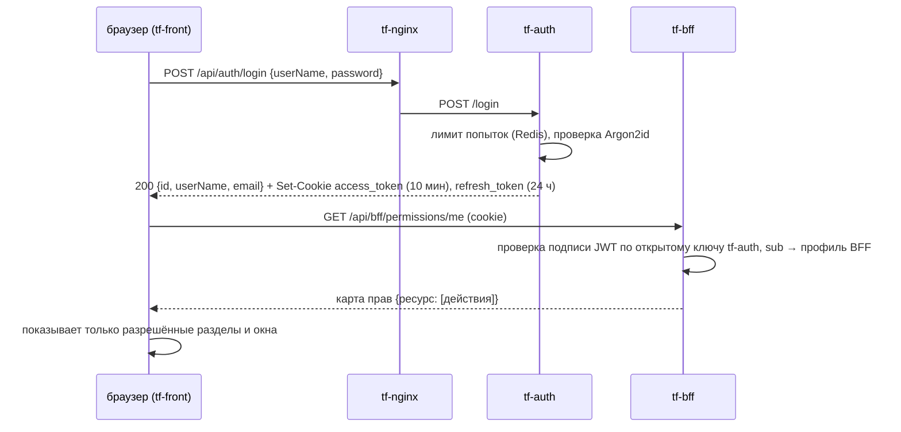

# 1. Методы авторизации

Документ для экспертов и администраторов: как войти в систему, как устроены вход, сессия и права, как
завести учётную запись эксперту и как устроен доступ между сервисами и к инфраструктуре.
Состояние — на 29.09.2026.

**Где код.** tf-auth — [think-auth@prod](https://github.com/Think-Faster/think-auth/tree/prod), права — [think-bff@prod](https://github.com/Think-Faster/think-bff/tree/prod),
интерфейс — [think-front@prod](https://github.com/Think-Faster/think-front/tree/prod), инфраструктура — [think-infra@dev](https://github.com/Think-Faster/think-infra/tree/dev),
концепт прав и аудита — [Think-Faster: docs/common/права-и-аудит.md](https://github.com/Think-Faster/Think-Faster/blob/main/docs/common/права-и-аудит.md).
Подробные разделы сервисов — [SYSTEM.md, Часть III](../system/SYSTEM.md).

## 1.1. Куда входить

| Стенд | Адрес | Назначение |
|---|---|---|
| prod | https://thinkfaster.ru | демонстрационный стенд для экспертизы |
| dev | https://greefob.ru | стенд разработки, поток событий от эмулятора |

Браузеры: актуальные Google Chrome и Яндекс.Браузер (ТЗ §11). Соединение — только HTTPS: nginx
принимает TLS 1.2 и 1.3 ([web-server/nginx/nginx.conf.template](https://github.com/Think-Faster/think-infra/blob/dev/web-server/nginx/nginx.conf.template),
`ssl_protocols TLSv1.2 TLSv1.3`). Запросы по HTTP перенаправляются на HTTPS.

**Учётные данные экспертов** в документе не публикуются: их выдаёт команда отдельно. Как их заводит
администратор, описано в разделе 1.5.

## 1.2. Вход пользователя



| Шаг | Метод | Где в коде |
|---|---|---|
| Форма входа | `POST /api/auth/login` `{userName, password}` | фронт: [app/src/features/auth/LoginForm.tsx](https://github.com/Think-Faster/think-front/blob/prod/app/src/features/auth/LoginForm.tsx); tf-auth: [AuthService/WebAPI/Controllers/AuthController.cs](https://github.com/Think-Faster/think-auth/blob/prod/AuthService/WebAPI/Controllers/AuthController.cs) |
| Проверка пароля | Argon2id (соль 16 байт, память 64 МБ, 3 итерации) | [AuthService.Cryptography/Services/Argon2PasswordHasher.cs](https://github.com/Think-Faster/think-auth/blob/prod/AuthService/AuthService.Cryptography/Services/Argon2PasswordHasher.cs) |
| Лимит попыток | 5 неудач за 60 с по паре «IP + логин» → `429` + `Retry-After` | [WebAPI/Services/RateLimit/RedisRateLimitService.cs](https://github.com/Think-Faster/think-auth/blob/prod/AuthService/WebAPI/Services/RateLimit/RedisRateLimitService.cs) |
| Выдача токенов | JWT RS256, `kid: main-key`, `iss=auth-service`, `aud=api` | [AuthService.Cryptography/Services/TokenService.cs](https://github.com/Think-Faster/think-auth/blob/prod/AuthService/AuthService.Cryptography/Services/TokenService.cs) |
| Cookie | `access_token` и `refresh_token`: HttpOnly, Secure, `Path=/`; SameSite — Lax и Strict | [AuthService.Cryptography/Services/AuthCookies.cs](https://github.com/Think-Faster/think-auth/blob/prod/AuthService/AuthService.Cryptography/Services/AuthCookies.cs) |
| Продление сессии | `POST /api/auth/refresh`; BFF продлевает сам, когда видит просроченный access | tf-auth `AuthController.cs`; BFF [TokenAuthenticationMiddleware.cs](https://github.com/Think-Faster/think-bff/blob/prod/BFF/src/BFF.WebApi/Middleware/TokenAuthenticationMiddleware.cs) |
| Текущий пользователь | `GET /api/auth/me` | [WebAPI/Controllers/UserController.cs](https://github.com/Think-Faster/think-auth/blob/prod/AuthService/WebAPI/Controllers/UserController.cs) |
| Выход | `POST /api/auth/logout` — удаляет cookie (ветка `TF-Auth-Logout`, в `prod` с 29.09) | `AuthController.cs` |
| Журнал | `login.success`, `login.failure`, `account.locked`, `token.refreshed`, `user.created`, `access.denied` → поток Redis `audit` | [WebAPI/Services/Audit/AuditWriter.cs](https://github.com/Think-Faster/think-auth/blob/prod/AuthService/WebAPI/Services/Audit/AuditWriter.cs) |

Токен доступа живёт 10 минут, токен обновления — 24 часа. Токены на сервере не хранятся. Пароли,
токены и cookie в журнал не пишутся.

### Состав токена доступа

```json
{ "sub": "<uuid пользователя>", "typ": "access", "token_type": "access", "kind": "user",
  "login": "ivanov", "jti": "<uuid>", "exp": 1790630965, "iss": "auth-service", "aud": "api" }
```

Ролей и прав в токене нет **сознательно**. tf-auth отвечает на вопрос «кто это», а BFF — на вопрос
«что ему можно»: права берутся из базы BFF с кешем. Если человека перевели в другую группу, это
начинает действовать без перевыпуска токенов.

## 1.3. Права: RBAC в BFF

Права выдаются **группам** на **ресурсы**. Пользователь получает объединение прав всех групп, в которые
он входит, включая вложенные.

| Понятие | Что это | Где |
|---|---|---|
| Ресурс | область данных: `objects`, `sensors`, `predictions`, `tasks`, `incidents`, `readings`, `schedule`, `assigned_objects`, `engineers`, `presence`, `users`, `groups`, `permissions`, `model_settings`, `notifications` | [BFF/scripts/001_seed_initial_data.sql](https://github.com/Think-Faster/think-bff/blob/prod/BFF/scripts/001_seed_initial_data.sql) |
| Действие | битовая маска: `Create=1, Read=2, Update=4, Delete=8, Export=16, Import=32, Manage=64`; `Manage` покрывает всё | [BFF.Models/Enums/PermissionFlags.cs](https://github.com/Think-Faster/think-bff/blob/prod/BFF/src/BFF.Models/Enums/PermissionFlags.cs) |
| Грант | «группа или пользователь × ресурс × маска» | таблица `access_grants` |
| Группа | может содержать людей и другие группы; дерево хранится замыканием `group_closure` | [GroupsController.cs](https://github.com/Think-Faster/think-bff/blob/prod/BFF/src/BFF.WebApi/Controllers/GroupsController.cs) |
| Проверка | атрибут `[RequirePermission(ресурс, действие)]` на каждой ручке, политика строится на лету | [BFF.WebApi/Authorization/](https://github.com/Think-Faster/think-bff/tree/prod/BFF/src/BFF.WebApi/Authorization) |
| Кеш прав | 300 с, сбрасывается сменой `rbac_version` (опрос раз в 5 с) | [PermissionCache.cs](https://github.com/Think-Faster/think-bff/blob/prod/BFF/src/BFF.Application/Services/PermissionCache.cs) |
| Интерфейс | окно показывается, только если есть хотя бы одно из требуемых прав | [app/src/core/registry/windowRegistry.ts](https://github.com/Think-Faster/think-front/blob/prod/app/src/core/registry/windowRegistry.ts) |

Роли и что можно выдать — документ [2. Архитектура](02-architecture.md), раздел 2.5.

Ошибки доступа, которые увидит пользователь:

| Код | Когда |
|---|---|
| `401 unauthenticated` / `invalid_token` / `token_refresh_failed` | нет сессии, токен повреждён, продлить не удалось → экран входа |
| `403 user_not_provisioned` | учётка в tf-auth есть, профиля в BFF нет |
| `403 user_inactive` | профиль отключён |
| `403` (право) | нет права на ресурс или действие |

## 1.4. Проверка токенов другими сервисами

Все сервисы проверяют токен сами, без обращения к tf-auth за каждым запросом: открытый ключ скачивается
с `http://tf-auth:8080/.well-known/jwks` и кешируется. Ответ — **PEM** открытого ключа, не JSON JWKS.

| Сервис | Что проверяет | Код |
|---|---|---|
| tf-bff | подпись, `iss`, `aud`, срок (сдвиг 30 с), `sub` → профиль | [JwtValidator.cs](https://github.com/Think-Faster/think-bff/blob/prod/BFF/src/BFF.Infrastructure/Auth/JwtValidator.cs) |
| tf-funnel | RS256, `aud=api`, `iss ∈ {auth-service, tf-auth}`, `typ=access`; право шины `telemetry.push` | [docs/backend/funnel/kit.go](https://github.com/Think-Faster/Think-Faster/blob/main/docs/backend/funnel/kit.go) |
| tf-model, tf-audit | то же (общий пакет tfkit); техучётка — `kind: service`, `scope` или `sub` из списка | [docs/backend/tfkit/tfkit.py](https://github.com/Think-Faster/Think-Faster/blob/main/docs/backend/tfkit/tfkit.py) |

**Техучётки.** Концепт предусматривает для сервисов токены с `kind: service` и списком разрешённых
действий `scope` ([права-и-аудит.md §2–3](https://github.com/Think-Faster/Think-Faster/blob/main/docs/common/права-и-аудит.md)). В tf-auth их **пока нет**: все токены
`kind: user`, без `scope`. Как это обходится:
- tf-funnel принимает `sub` учётки шины из списка `TF_FUNNEL_SERVICE_SUBS` (Vault `app/tf-funnel`);
- tf-model (`/forecast`, `/history`) и tf-audit (`/events`) обхода нет, эти ручки пока недоступны.

План — [SYSTEM.md, Часть VIII, № 4](../system/SYSTEM.md).

## 1.5. Как завести учётку эксперту

Нужны два шага: учётка в tf-auth («кто это») и профиль с группой в BFF («что ему можно»).

1. **Учётка.** Администратор с признаком `SuperUser` в tf-auth открывает окно «Пользователи и группы» →
   «Новый пользователь». Фронт вызывает `POST /api/auth/create` `{userName, email, password}` и
   получает `id`.
2. **Профиль.** В том же окне создаётся профиль BFF (`POST /api/bff/users`) с `authUserId` = `id` из
   шага 1.
3. **Права.** Профиль добавляется в группу (`POST /api/bff/groups/{id}/members`). Для экспертов
   рекомендуется отдельная группа `experts` с правом `Read` на все ресурсы, кроме `users` и
   `permissions`. Так эксперт видит всё, но ничего не меняет.
4. Проверка: вход под новой учёткой, `GET /api/bff/permissions/me` возвращает карту прав.

Первый администратор создаётся при развёртывании: сидинг BFF заводит группу `admins`, а признак
`SuperUser` в tf-auth выставляется SQL-запросом ([SYSTEM.md, tf-auth §9](../system/SYSTEM.md)).

## 1.6. Проверка API вручную

Все ручки работают с cookie так же, как браузер. Пример для терминала (пароль спрашивается и не
остаётся в истории команд):

```bash
read -rs -p "Пароль: " P; echo; curl -s -c jar.txt -H 'Content-Type: application/json' -d "{\"userName\":\"<логин>\",\"password\":\"$P\"}" https://thinkfaster.ru/api/auth/login; unset P
```

```bash
curl -s -b jar.txt https://thinkfaster.ru/api/bff/permissions/me
```

```bash
curl -s -b jar.txt "https://thinkfaster.ru/api/bff/predictions?page=1&pageSize=10"
```

```bash
curl -s -b jar.txt https://thinkfaster.ru/api/ml/status
```

Без входа: `https://thinkfaster.ru/api/funnel/health`, `https://thinkfaster.ru/api/ml/health`,
`https://thinkfaster.ru/api/auth/health`. После проверки удалите `jar.txt`: в нём действующая сессия.

## 1.7. Корпоративный каталог (LDAP / AD)

ТЗ §11 требует поддержки интеграции с LDAP/AD.
- **Есть:** контроллер домена Samba AD (realm `TF.GREEFOB.RU`, LDAP 389, Kerberos 88) —
  [think-infra: samba/](https://github.com/Think-Faster/think-infra/tree/dev/samba). Он собирается и настраивается,
  но в выкатку стендов не входит.
- **Нет:** входа через каталог в tf-auth. Схема перехода описана в концепте
  ([права-и-аудит.md §5.1, вариант В](https://github.com/Think-Faster/Think-Faster/blob/main/docs/common/права-и-аудит.md)):
  учётка отделяется от способа входа (`password` | `ldap`), а группа BFF получает поле `external_ref` на
  группу AD. Это одна миграция в tf-auth и сопоставление групп в BFF.

## 1.8. Доступ к инфраструктуре (администраторы)

| Что | Как | Документ |
|---|---|---|
| Серверы стендов | SSH по ключу | [SYSTEM.md, 4.7](../system/SYSTEM.md) |
| Секреты (Vault) | личный токен `tf-admin`; веб-интерфейс `https://vault.greefob.ru` (dev) или SSH-туннель | [SYSTEM.md, 2.3, 4.6](../system/SYSTEM.md) |
| Сервисы → Vault | AppRole `tf-svc-<сервис>`: `role_id` + `secret_id` из GitHub Environment | [hashicorp/services.conf](https://github.com/Think-Faster/think-infra/blob/dev/hashicorp/services.conf) |
| PostgreSQL | dev — адрес dev-сервера, порт 5432 (выдаёт администратор стенда); prod — SSH-туннель на `127.0.0.1:15432`; пользователи схем `*_user` / `*_admin` | [SYSTEM.md, 2.5, 4.7](../system/SYSTEM.md) |
| RabbitMQ UI | SSH-туннель на `15672`, пользователь `admin` | [rabbitmq/README.md](https://github.com/Think-Faster/think-infra/blob/dev/rabbitmq/README.md) |
| Выкатка из GitHub | пары AppRole в Environments `dev`/`prod` репозиториев | [06. Деплой](06-deploy.md) |

## 1.9. Известные ограничения

| Что | Риск | Статус |
|---|---|---|
| `POST /api/auth/register` открыт всем | создание учёток посторонними (данных без профиля в BFF они не увидят) | закрыть на prod — [SYSTEM.md VIII-5](../system/SYSTEM.md) |
| Лимит попыток и IP в журнале берутся от адреса nginx или из подменяемого `X-Forwarded-For` | блокировка чужого логина, недостоверный IP | [SYSTEM.md VII-3, VIII-6](../system/SYSTEM.md) |
| Нет техучёток и `scope` | шине и межсервисным вызовам нечем получить долгий токен | [SYSTEM.md VII-1](../system/SYSTEM.md) |
| Один ключ подписи без ротации с перекрытием | смена ключа разлогинивает всех | [SYSTEM.md VII-6](../system/SYSTEM.md) |
