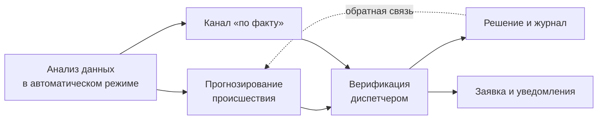
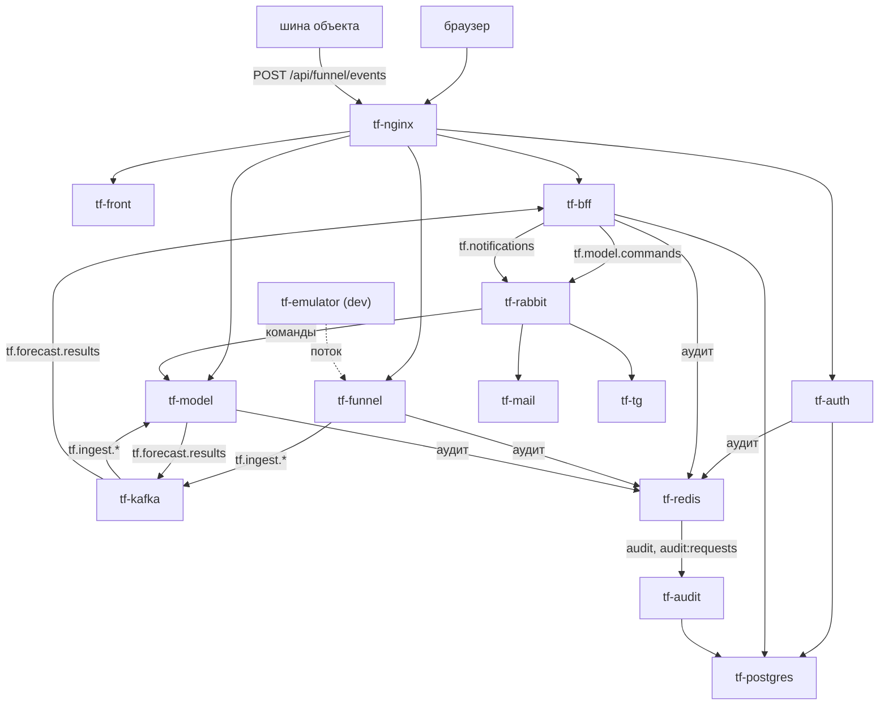

# 2. Архитектура, стек, базы данных и роли

Состояние — на 29.09.2026. Подробные разделы по каждому сервису —
[SYSTEM.md, Часть III](../system/SYSTEM.md). Инфраструктура — [SYSTEM.md, Часть II](../system/SYSTEM.md).

## 2.1. Репозитории и ветки

| Репозиторий | Ветки: рабочая / выпуск | Что внутри |
|---|---|---|
| [GroznyiBombila/Think-Faster](https://github.com/GroznyiBombila/Think-Faster) | `main` | модель и исследование (`ML/`), сервисы tf-model, tf-funnel, tf-audit, общий пакет `tfkit` (`docs/backend/`), ТЗ и проектные документы (`docs/`) |
| [Think-Faster/think-infra](https://github.com/Think-Faster/think-infra) | `dev` / `prod` | Vault, PostgreSQL, Kafka, RabbitMQ, Redis, nginx, tf-mail, tf-tg, Samba AD, выкатка стендов |
| [Think-Faster/think-auth](https://github.com/Think-Faster/think-auth) | `dev` / `prod` | tf-auth: учётки, вход, JWT |
| [Think-Faster/think-bff](https://github.com/Think-Faster/think-bff) | `dev` / `prod` | tf-bff: права, объекты, прогнозы, заявки, рассылка |
| [Think-Faster/think-front](https://github.com/Think-Faster/think-front) | `dev` / `prod` | tf-front: интерфейс |
| Think-Faster/think-test (закрытый) | `main` | эмулятор потока событий (попадает на dev архивом из релиза `dev-assets` Think-Faster) |

Порядок веток: фича → `dev` (выкатка на dev-стенд) → `prod` (выкатка на prod). Выпуски think-infra
помечены тегами `devX.Y.Z` / `prodX.Y.Z`.

## 2.2. Функциональная архитектура

| Блок (схема IDEF-1) | Сервис | Что делает | ТЗ |
|---|---|---|---|
| Анализ данных | tf-funnel | приём событий шины, проверка, раскладка по топикам, молчание каналов, архив | §6, §7 |
| Прогнозирование | tf-model | раз в час: прогноз шести типов на 24 ч по каждому объекту, канал «по факту», рекомендации | §4, §6, §9 |
| Верификация | tf-bff + tf-front | очередь прогнозов, карточки, карта, заявки, решения диспетчера | §10, §12 |
| Решение и журнал | tf-bff, tf-audit | решения с причиной, журнал действий и запросов | §11, §12 |
| Уведомления | tf-bff → tf-mail, tf-tg | письмо и Telegram дежурным | §10 |
| Настройка | tf-front → tf-bff → tf-model | доли тревог, версии модели, игнорируемые периоды | §18 |

Роли и сценарии простым языком — [08. Анамнез](08-overview.md).
Исходные схемы IDEF-0/IDEF-1 — [Think-Faster: docs/common/](https://github.com/GroznyiBombila/Think-Faster/tree/main/docs/common).

## 2.3. Компонентная архитектура

Все сервисы — docker-контейнеры в одной сети `think-fast-net` на одном Linux-сервере стенда. Наружу
открыт только nginx (80/443). Секреты сервисы получают из Vault при старте. Потоки данных и
контракты — [SYSTEM.md, 1.4 и 1.7](../system/SYSTEM.md).

## 2.4. Стек

| Компонент | Язык и платформа | Основные библиотеки | Сборка |
|---|---|---|---|
| tf-front | TypeScript, React 19, Create React App | react-router-dom 7, zustand 5, axios 1; карта и графики — собственная отрисовка, внешних картографических библиотек нет | [deploy/Dockerfile](https://github.com/Think-Faster/think-front/blob/prod/deploy/Dockerfile): node 22 → nginx 1.29 |
| tf-bff | C#, .NET 8, ASP.NET Core | EF Core + Npgsql, FluentValidation, Serilog, RabbitMQ.Client 7, Confluent.Kafka, StackExchange.Redis | [deploy/Dockerfile](https://github.com/Think-Faster/think-bff/blob/prod/BFF/deploy/Dockerfile): sdk 8 → aspnet 8 alpine |
| tf-auth | C#, .NET 8, ASP.NET Core | EF Core + Npgsql, Argon2id, System.IdentityModel.Tokens.Jwt, StackExchange.Redis | [AuthService/Dockerfile](https://github.com/Think-Faster/think-auth/blob/prod/AuthService/Dockerfile) |
| tf-funnel | Go 1.27 | franz-go (Kafka), golang-jwt v5, go-redis v9, coder/websocket, klauspost/compress (zstd) | [docs/backend/funnel/Dockerfile](https://github.com/GroznyiBombila/Think-Faster/blob/main/docs/backend/funnel/Dockerfile): golang → distroless |
| tf-model | Python 3.12 | CatBoost, XGBoost, LightGBM (исследование), PyTorch 2.5 (TCN), DuckDB, Polars, FastAPI, confluent-kafka, pika, redis | [ML/service/Dockerfile](https://github.com/GroznyiBombila/Think-Faster/blob/main/ML/service/Dockerfile) |
| tf-audit | Python 3.12 | psycopg 3, redis, FastAPI, PyJWT, cryptography | [docs/backend/audit/Dockerfile](https://github.com/GroznyiBombila/Think-Faster/blob/main/docs/backend/audit/Dockerfile) |
| tf-mail, tf-tg | Python 3.12 | pika, redis, email-validator; Telegram — стандартный `urllib` | [mailing/Dockerfile](https://github.com/Think-Faster/think-infra/blob/dev/mailing/Dockerfile), [telegram/Dockerfile](https://github.com/Think-Faster/think-infra/blob/dev/telegram/Dockerfile) |
| tf-emulator | Python, Django | — | собирается workflow `deploy-emulator-dev.yml` |
| Инфраструктура | Linux, Docker Compose | nginx 1.29 + certbot, Vault 1.20 (raft), PostgreSQL 16, Kafka 4.0 (KRaft), RabbitMQ 4.1, Redis 7, Samba AD | [think-infra](https://github.com/Think-Faster/think-infra/tree/dev) |
| CI/CD | GitHub Actions | self-hosted runner prod, appleboy/ssh-action, Docker Hub (образ воронки) | workflow в каждом репозитории |
| Исследование | Python 3.12, CUDA 12.4 | pandas, DuckDB, Parquet, scikit-learn, Open-Meteo (погода) | [ML/requirements.txt](https://github.com/GroznyiBombila/Think-Faster/blob/main/ML/requirements.txt) |

Полный перечень библиотек с версиями — в файлах зависимостей: [ML/service/requirements.txt](https://github.com/GroznyiBombila/Think-Faster/blob/main/ML/service/requirements.txt),
[docs/backend/funnel/go.mod](https://github.com/GroznyiBombila/Think-Faster/blob/main/docs/backend/funnel/go.mod), `*.csproj` BFF и tf-auth,
[app/package.json](https://github.com/Think-Faster/think-front/blob/prod/app/package.json), [mailing/requirements.txt](https://github.com/Think-Faster/think-infra/blob/dev/mailing/requirements.txt).
Сводный перечень есть и в [Think-Faster: docs/документация.md, приложение В](https://github.com/GroznyiBombila/Think-Faster/blob/main/docs/документация.md).

## 2.5. Базы и хранилища данных

### PostgreSQL 16 — `tf-postgres`, база `tf`

Одна база, по схеме на сервис. У каждой схемы две роли: `<схема>_admin` — владелец, выполняет миграции
(DDL); `<схема>_user` — приложение, только данные. Схемы создаёт инфраструктура
([postgree/db/schemas.conf](https://github.com/Think-Faster/think-infra/blob/dev/postgree/db/schemas.conf)).

| Схема | Владелец | Таблицы | Назначение |
|---|---|---|---|
| `auth` | tf-auth | `Users` (id, логин, e-mail, хэш Argon2id, `SuperUser`), `__EFMigrationsHistory` | **база пользователей**: кто есть кто и пароли. Ролей и прав нет |
| `bff` | tf-bff | 30 таблиц, см. ниже | профили, группы, права, объекты, прогнозы, заявки, настройки |
| `audit` | tf-audit | `events`, `requests` — секции по месяцам; изменение и удаление запрещены триггерами | журнал действий и журнал запросов. **На стендах ещё не заведена** |

Таблицы `bff` ([BFF.Context/Configurations/](https://github.com/Think-Faster/think-bff/tree/prod/BFF/src/BFF.Context/Configurations)):

| Домен | Таблицы |
|---|---|
| Права (RBAC) | `users` (профиль, ссылка `auth_user_id` на учётку), `groups`, `group_members`, `group_closure` (дерево групп), `resources`, `access_grants`, `rbac_version` |
| Люди | `schedule_entries` (график), `user_activity` (присутствие), `assigned_objects`, `brigades`, `engineer_profiles`, `engineer_permits` (допуски со сроками) |
| Топология | `objects` (дерево: район → коллектор → объект), `pickets`, `sensors`, `sensor_links`, `map_layers` |
| Прогнозы | `predictions`, `prediction_factors`, `prediction_evidence`, `prediction_decisions`, `fact_alerts` |
| Заявки | `tasks`, `task_predictions`, `task_assignments`, `task_reports`, `task_returns`, `incidents` |
| Настройки модели | `model_versions`, `coefficients`, `retrain_jobs`, `ignored_ranges`, `work_schedule` |

Описание сущностей — [Think-Faster: docs/backend/домены-и-сущности.md](https://github.com/GroznyiBombila/Think-Faster/blob/main/docs/backend/домены-и-сущности.md).

### Прочие хранилища

| Хранилище | Кто | Что лежит | Срок |
|---|---|---|---|
| DuckDB `hot.duckdb` (том `tf-ml-work`) | tf-model | горячий журнал событий, справочники, молчание каналов | 100 суток + вся история охраны |
| DuckDB `forecasts.duckdb`, `history.parquet` | tf-model | журнал прогнозов со статусами, история оценок для порога | 100 / 90 суток |
| JSON-файлы на томе модели | tf-model | состояние правил, увиденные команды, рабочие доли (`operating.json`), график работ, игнорируемые периоды — с версиями | бессрочно |
| Файлы `JSONL` + `zstd` (том `tf-funnel-data`) | tf-funnel | архив принятых событий для окна «Логи» | 14 дней на prod |
| Kafka | все | `tf.ingest.readings/journal/reference`, `tf.forecast.results`, `tf.dlq` | 7–30 дней |
| RabbitMQ | tf-bff, tf-model, tf-mail, tf-tg | `tf.model.commands`, `tf.notify.email`, `tf.notify.telegram`, `tf.dlq` | до 24 ч |
| Redis | все | потоки аудита, лимиты входа, антиспам, дедуп уведомлений | см. [SYSTEM.md 2.8](../system/SYSTEM.md) |
| Vault (raft) | инфраструктура | пароли, ключ подписи JWT, секреты интеграций | бессрочно, снапшоты 14 дней |
| Исследовательская витрина (DuckDB/Parquet, вне git) | аналитик | 313 млн строк журналов 2019–2026 и признаки «объект × час» | — |

Требование ТЗ §13 о разделении на оперативный контур, архив и витрины выполнено так:
- оперативный контур — горячий журнал модели и Kafka;
- архив — файлы журналов и архив воронки;
- витрины — таблица признаков.

Отдельных схем `ops/archive/marts` в PostgreSQL нет (решение — [03. Решения](03-decisions.md), Р-9).

## 2.6. Роли: разграничение и что можно выдать

### Где что хранится

| Уровень | Где | Что определяет |
|---|---|---|
| Учётка | tf-auth, `auth.Users` | кто вошёл. Единственный признак — `SuperUser`: он нужен только для создания учёток (`POST /api/auth/create`) |
| Роль | tf-bff: группа + гранты | что человек может: набор «ресурс × действия» |
| Интерфейс | tf-front | какие окна видны: окно показывается, если есть хотя бы одно из его прав |

Роль в системе — это **группа с грантами**. Группы вкладываются друг в друга, и вложенная группа получает
права родителя. Пользователь может состоять в нескольких группах, права объединяются.

### Какие роли заведены

Сидинг BFF ([001_seed_initial_data.sql](https://github.com/Think-Faster/think-bff/blob/prod/BFF/scripts/001_seed_initial_data.sql)) заводит одну системную группу — `admins`, с
`Manage` на все 15 ресурсов. Рабочие роли стенда заводятся данными стенда
([Think-Faster: docs/backend/seed/groups.csv, grants.csv](https://github.com/GroznyiBombila/Think-Faster/tree/main/docs/backend/seed)):

| Роль (группа) | Вложенные группы | Права (C — создать, R — читать, U — изменить, D — удалить, E — экспорт) |
|---|---|---|
| **Администратор** `admins` | — | всё (`Manage`) на все ресурсы: пользователи, группы, права, настройки модели |
| **Главный диспетчер** `chief_dispatchers` | входит в `dispatchers` и получает их права | прогнозы RUE, настройки модели RU, график CRUD, закрепления CRUD, инженеры CRUD, группы RU, пользователи R |
| **Диспетчер** `dispatchers` | смены А–Г, `chief_dispatchers` | объекты, датчики, показания R; прогнозы RU; заявки и происшествия CRU; график, закрепления, инженеры, присутствие R |
| **Инженер** `engineers` | линейный персонал, инженеры участков, мобильная бригада, энергетики, связь и автоматика | объекты, датчики, прогнозы, происшествия, график, закрепления, инженеры, присутствие R; заявки RU |
| Участки `site_1…site_4` | — | прав нет; группируют людей участка для области видимости (задел) |

### Что можно выдать

Любой группе можно выдать любое сочетание из 15 ресурсов × 7 действий (`Create, Read, Update, Delete,
Export, Import, Manage`). Выдаёт пользователь с `permissions:manage`: окно «Конфигурация доступа» или
`POST /api/bff/permissions/grants`. Новые ресурсы регистрируются без выката кода
(`POST /api/bff/resources`) и сразу появляются в списке.

| Ресурс | Что открывает |
|---|---|
| `objects`, `sensors` | карта, объекты и датчики, топология |
| `readings` | окно «Логи»: история и живые показания (иначе — только объекты своих заявок) |
| `predictions` | журнал и карточки прогнозов, события «по факту»; `U` — решения (взять, отклонить, заглушить) |
| `tasks`, `incidents` | заявки и происшествия |
| `schedule`, `assigned_objects`, `engineers`, `presence` | люди: график, закрепления, бригады и допуски, кто на месте |
| `users`, `groups`, `permissions` | администрирование доступа |
| `model_settings` | настройки модели: доли тревог, версии, игнорируемые периоды, график работ |
| `notifications` | ручная рассылка писем |

### Отличия от концепта и ТЗ

Концепт ([права-и-аудит.md §3–4](https://github.com/GroznyiBombila/Think-Faster/blob/main/docs/common/права-и-аудит.md)) предлагал четыре роли:
техник, диспетчер района, центральный диспетчер, администратор. Кроме того, у каждой группы там была
**область видимости** — узел дерева объектов. Реализация:
- **роли** — сделаны группами (инженер ≈ техник, диспетчер, главный диспетчер ≈ центральный, администратор);
- **область видимости** в грантах **не реализована**: инженер видит все объекты ресурса. Исключение —
  окно «Логи»: без `readings:read` там видны только объекты заявок инженера
  (`GET /readings/scope`, [ReadingsController.cs](https://github.com/Think-Faster/think-bff/blob/prod/BFF/src/BFF.WebApi/Controllers/ReadingsController.cs));
- **роль аналитика** из сценариев ТЗ §12 отдельно не выделена: его работа — исследование и пакет модели
  вне интерфейса.
