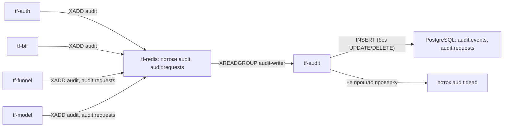

# 4. Используемые методы

Методы работы с данными, журналы аудита, контроль состояния, расширение приёма данных и управление
системой. Состояние — на 29.09.2026, код — ветки `prod` (think-bff, think-auth, think-front), `main`
(Think-Faster), `dev` (think-infra). Решения, которые привели к этим методам, — [03. Решения](03-decisions.md).

## 4.1. Приём и первичная обработка потока

Метод реализован в tf-funnel: [Think-Faster: docs/backend/funnel/](https://github.com/Think-Faster/Think-Faster/tree/main/docs/backend/funnel).

| Шаг | Метод | Код |
|---|---|---|
| Приём | `POST /api/funnel/events`: пакет до 10 000 событий, JWT шины | [http.go](https://github.com/Think-Faster/Think-Faster/blob/main/docs/backend/funnel/http.go) |
| Проверка события | обязательны канал, дата, время, значение; значение — строка ≤ 255; число нормализуется | [parse.go](https://github.com/Think-Faster/Think-Faster/blob/main/docs/backend/funnel/parse.go) |
| Раскладка | не тревожное число → `tf.ingest.readings`; тревога или текст → `tf.ingest.journal`; ключ Kafka — номер канала (порядок по каналу) | [funnel.go](https://github.com/Think-Faster/Think-Faster/blob/main/docs/backend/funnel/funnel.go) |
| Подтверждение | пакет засчитывается после `acks=all`, иначе `503` + `Retry-After: 5` | там же |
| Молчание каналов | канал, который слышали ≥ 3 раз, «молчит», если тишина > max(`TF_FUNNEL_SILENT_MIN`, 4 × сглаженный интервал); переходы → `channel.status` в `tf.ingest.reference` | [channels.go](https://github.com/Think-Faster/Think-Faster/blob/main/docs/backend/funnel/channels.go) |
| Архив | JSONL по часу приёма, закрытые часы сжимаются zstd, срок `TF_FUNNEL_ARCHIVE_DAYS` | [archive.go](https://github.com/Think-Faster/Think-Faster/blob/main/docs/backend/funnel/archive.go) |
| История и живой поток | `GET /api/funnel/log`, `WSS /api/funnel/stream`; права — по BFF `GET /readings/scope` | [stream.go](https://github.com/Think-Faster/Think-Faster/blob/main/docs/backend/funnel/stream.go) |

Формат пакета и сообщений Kafka — [SYSTEM.md, tf-funnel §4](../system/SYSTEM.md).

## 4.2. Методы модели

Подробно, с числами и разделами журнала исследования, — [Think-Faster: docs/документация.md §4–§5](https://github.com/Think-Faster/Think-Faster/blob/main/docs/документация.md)
и [ML/SPEC.md](https://github.com/Think-Faster/Think-Faster/blob/main/ML/SPEC.md). Кратко:

| Метод | Суть | Код |
|---|---|---|
| Чистка | дубли «канал + время + значение», служебные даты охраны, каналы вне справочника, разделение чисел и состояний, исключение 2021 года | [ML/pipeline/events.py](https://github.com/Think-Faster/Think-Faster/blob/main/ML/pipeline/events.py) |
| Разметка | эпизод — сработки одного типа на объекте с паузой ≤ 1 ч; шум (массовый дым, «Затоплен» после питания, газ в окне ППР) размечается отдельно; проникновение — дверь + движение под охраной | [labels.py](https://github.com/Think-Faster/Think-Faster/blob/main/ML/pipeline/labels.py) |
| Признаки | 306 признаков «объект × час»: счётчики за 1 ч – 7 сут, газ и температура, история эпизодов, выезды, календарь, состав объекта; без заглядывания в будущее (проверка `check.py`) | [features.py](https://github.com/Think-Faster/Think-Faster/blob/main/ML/pipeline/features.py) |
| Модели | своя модель на тип, 5 зёрен: CatBoost, XGBoost; у отказа оборудования — смесь CatBoost 0,75 + TCN 0,25 | [ML/service/core.py](https://github.com/Think-Faster/Think-Faster/blob/main/ML/service/core.py), [pipeline/seqmodel.py](https://github.com/Think-Faster/Think-Faster/blob/main/ML/pipeline/seqmodel.py) |
| Порог | скользящая доля часов под тревогой по типу: квантиль оценок парка за 90 суток | [ML/settings/operating.md](https://github.com/Think-Faster/Think-Faster/blob/main/ML/settings/operating.md) |
| Правила после модели | склейка повторов 6 ч; правило отклонения у газа и подтопления; молчание в окне графика работ | [ML/service/core.py](https://github.com/Think-Faster/Think-Faster/blob/main/ML/service/core.py) |
| Канал «по факту» | объявление эпизода на 10-й минуте по пришедшим событиям с отсевом шума; аварии и «слепота» объекта | [ML/INTEGRATION.md §13.11](https://github.com/Think-Faster/Think-Faster/blob/main/ML/INTEGRATION.md) |
| Уверенность | изотоническая калибровка оценки на проверке 2025; снижается за молчащие семейства датчиков | [документация.md §4.11](https://github.com/Think-Faster/Think-Faster/blob/main/docs/документация.md) |
| Основания и свидетели | 3 главных признака (`reasons`), до 5 последних событий каналов типа (`evidence`) | формат — [SYSTEM.md, tf-model §4.2](../system/SYSTEM.md) |
| Рекомендации | словарь из 70 правил, режимы «прогноз» (за 24 ч) и «по факту» (за 4 ч), кого посылать | [analytics.md §61](https://github.com/Think-Faster/Think-Faster/blob/main/ML/results/analytics.md) |
| Такт | раз в час: граница часа МСК + 120 с, признаки всего парка ≈ 3 с | [ML/service/clock.py](https://github.com/Think-Faster/Think-Faster/blob/main/ML/service/clock.py) |

## 4.3. Журнал аудита администратора

**Назначение.** Требование ТЗ §11 «журналирование всех действий пользователей». Администратор
видит, кто входил, кому отказано, что изменено и кем.

**Как пишется.**



| Сервис | События | Код |
|---|---|---|
| tf-auth | `login.success`, `login.failure`, `account.locked`, `token.refreshed`, `user.created`, `access.denied` | [AuditWriter.cs](https://github.com/Think-Faster/think-auth/blob/prod/AuthService/WebAPI/Services/Audit/AuditWriter.cs) |
| tf-bff | изменения по белому списку маршрутов (заявки, решения, права, группы, пользователи) и `access.denied` на каждый `403` | [AuditMiddleware.cs](https://github.com/Think-Faster/think-bff/blob/prod/BFF/src/BFF.WebApi/Audit/AuditMiddleware.cs) |
| tf-funnel | `token.refused`, `access.denied`, `telemetry.rejected`; журнал запросов | [kit.go](https://github.com/Think-Faster/Think-Faster/blob/main/docs/backend/funnel/kit.go) |
| tf-model | решения и настройки (раздел 4.4), `token.refused`, `access.denied`; журнал запросов | [ML/service/core.py](https://github.com/Think-Faster/Think-Faster/blob/main/ML/service/core.py) |
| tf-audit | запись в базу, вырезание запрещённых полей (`password`, `token`, `cookie`, `authorization`, `text`, `body`) | [audit.py](https://github.com/Think-Faster/Think-Faster/blob/main/docs/backend/audit/audit.py), [schema.sql](https://github.com/Think-Faster/Think-Faster/blob/main/docs/backend/audit/schema.sql) |

Формат события — [SYSTEM.md, tf-audit §4.1](../system/SYSTEM.md): кто (`actor_kind`, `actor_id`,
`actor_login`), что (`event_type`, `outcome`), над чем (`object_type`, `object_id`), сквозной
`request_id` от nginx, подробности без секретов.

**Как читать.**

| Способ | Кто | Как |
|---|---|---|
| SQL | администратор БД | `select occurred_at, service, event_type, outcome, actor_login, object_type, object_id, details from audit.events where occurred_at > now() - interval '1 day' order by occurred_at desc;` |
| API | техучётка с правом `audit.read` | `GET http://tf-audit:8000/events?event_type=access.&since=…` — фильтры по типу (или префиксу), сервису, объекту, исполнителю, `request_id`, исходу, периоду |
| Поток Redis (до базы) | администратор инфраструктуры | `docker exec tf-redis sh -c 'REDISCLI_AUTH="$TF_REDIS_PASSWORD" redis-cli XREVRANGE audit + - COUNT 20'` |
| Сводка dev | разработчик | workflow `Dev status` в Think-Faster: число событий, типы, читает ли их tf-audit ([dev-status.yml](https://github.com/Think-Faster/Think-Faster/blob/main/.github/workflows/dev-status.yml)) |
| Прослеживание цепочки | администратор | по `request_id` одной строки найти все события этого запроса во всех сервисах |

**Защита.** Правка и удаление строк запрещены триггерами базы для всех, включая владельца. Журнал
запросов хранится 90 дней, очистка — `audit.drop_old_requests()`. Журнал действий хранится бессрочно.

**Состояние.** События пишутся в поток Redis. Схема `audit` на стендах **ещё не заведена**
([SYSTEM.md VIII-3](../system/SYSTEM.md)), поэтому tf-audit не запущен и события копятся в потоке
(до ~1 млн записей). Ручку `/events` сейчас нечем вызвать: нужна техучётка. Экрана журнала в интерфейсе
нет, чтение — SQL или API.

## 4.4. Журнал главного диспетчера по модели: отклонённые и заглушённые прогнозы

**Назначение.** Главный диспетчер видит, какие прогнозы отклонены или заглушены, кем и почему, и
какие из них всё-таки переросли в происшествие. Замысел —
[домены-и-сущности.md §10.1](https://github.com/Think-Faster/Think-Faster/blob/main/docs/backend/домены-и-сущности.md), [документация.md §6.6](https://github.com/Think-Faster/Think-Faster/blob/main/docs/документация.md).

**Статусы прогноза в BFF** ([PredictionStatus.cs](https://github.com/Think-Faster/think-bff/blob/prod/BFF/src/BFF.Models/Enums/PredictionStatus.cs)):
`New`, `InReview`, `Taken`, `Rejected`, `Muted`, `Closed`.

**Откуда берётся журнал.**

| Источник | Метод | Что даёт |
|---|---|---|
| BFF: список прогнозов | `GET /api/bff/predictions?status=Rejected` (или `Muted`), `objectId`, страницы | текущее состояние: какие прогнозы отклонены или заглушены сейчас |
| BFF: карточка | `GET /api/bff/predictions/{id}` | прогноз с факторами, свидетелями и историей решений диспетчера (`prediction_decisions`: кто, когда, решение, причина, срок заглушения) |
| BFF: решение | `POST /api/bff/predictions/{id}/decisions` — `take`, `reject` (с причиной), `mute` (до срока), `reopen` | пишет решение и передаёт его модели командой `decision.*` ([ModelDecisionRelay.cs](https://github.com/Think-Faster/think-bff/blob/prod/BFF/src/BFF.WebApi/Notifications/ModelDecisionRelay.cs)) |
| Модель: история по часам | `GET /api/ml/history?object_id=&type=&from=&to=` | оценка, порог и статус по каждому часу: `ALARM`, `MUTED`, `REJECTED`, причина, ссылка на строку графика; до 100 суток. Сейчас доступна только техучётке |
| Модель: состояние | `GET /api/ml/status` → `last_tick` | сколько тревог, заглушённых и отклонённых было в последнем такте |
| Аудит модели | события `forecast.rejected`, `forecast.muted`, `forecast.reopened`, **`forecast.recurred`** | `forecast.recurred` — «отклонили, а оно случилось»: по паре объект-тип под отклонением пришло подтверждение происшествия (`decision.confirmed`) |

Пример запроса к журналу действий: какие отклонения переросли в происшествие за месяц.

```sql
select occurred_at, actor_login, object_id, details
from audit.events
where service = 'ml' and event_type = 'forecast.recurred'
  and occurred_at > now() - interval '30 days'
order by occurred_at desc;
```

**Правила учёта** ([документация.md §6.6](https://github.com/Think-Faster/Think-Faster/blob/main/docs/документация.md)):
- исход «случилось» определяется по подтверждённым происшествиям, а не по журналу датчиков;
- молчание по графику работ идёт отдельной строкой без дежурного диспетчера;
- диспетчеров сравнивают только внутри одной версии модели.

**В интерфейсе.**
- «Журнал прогнозов» — список со статусами и фильтром.
- «Карточка прогноза» — решения по прогнозу.
- «История объектов» — прогнозы, заявки, происшествия и факты по объекту.

Отдельного экрана «отклонили — а оно случилось» со сводом по диспетчерам **пока нет**: данные для него
пишутся (решения в BFF, `forecast.recurred` в аудите модели), экран — в плане
([SYSTEM.md VIII-24](../system/SYSTEM.md)).

## 4.5. Контроль состояния (healthcheck)

| Уровень | Что проверяется | Как | Где |
|---|---|---|---|
| Контейнер | процесс жив и отвечает | Docker `HEALTHCHECK` → статус `healthy`/`unhealthy` | tf-auth (`/health`), tf-funnel (`-health`), tf-model (`/health`), tf-audit (файл жизни ≤ 120 с), tf-mail/tf-tg (файл жизни ≤ 60 с, пока есть соединение с брокером), Postgres, Redis, Kafka, RabbitMQ (аларм памяти и диска), Vault (распечатан) |
| Сервис | готовность и зависимости | HTTP-ручки | `GET /api/bff/health/ready` → `{database, jwks}`; `/api/funnel/health` → `ok`, `last_accepted`, `source_silent`; `/api/ml/health` → `ok`, `last_hour`; `/api/auth/health` |
| Поток данных | идут ли события | воронка | `source_silent` — шина молчит; `/api/funnel/status` — молчащие каналы, отказы, `unavailable` (Kafka) |
| Датчики | молчит ли канал | воронка → Kafka | `channel.status silent/ok` → модель: у типа `silent`, уверенность снижена |
| Свежесть модели | не устарели ли данные | модель | `stale_hours` у типа, если событий семейств нет дольше порога (1 ч; подтопление 3 ч; проникновение 12 ч) |
| Очереди | нет ли застрявших сообщений | RabbitMQ, Kafka | `tf.dlq`, лаг групп — [SYSTEM.md 5.3](../system/SYSTEM.md) |
| Стенд целиком | всё ли поднято | workflow `Dev status`, ручной обход | [dev-status.yml](https://github.com/Think-Faster/Think-Faster/blob/main/.github/workflows/dev-status.yml), [SYSTEM.md 5.1](../system/SYSTEM.md) |

**Возможности.** Docker перезапускает упавший контейнер (`restart: unless-stopped`). Выкатка
инфраструктуры ждёт `healthy` (`compose up --wait`). nginx отвечает `502`, пока сервис не поднялся, и
сам не падает. tf-mail и tf-tg при неверном пароле или токене остаются `unhealthy` и не перезапускаются
по кругу.

**Ограничения.** Метрик и алертов нет; `/health` tf-auth и tf-funnel не проверяет зависимости;
healthcheck tf-bff в compose закомментирован ([SYSTEM.md VII-20](../system/SYSTEM.md)).

## 4.6. Встраивание параллельного потока данных в воронку

Когда нужно: вторая шина (другой район, другая система мониторинга), догрузка истории из CSV/XLSX
(ТЗ §7) или перенос с эмулятора на настоящую шину без остановки.

| Вариант | Как | Что менять | Ограничения |
|---|---|---|---|
| **А. Второй источник в ту же ручку** (рекомендуется) | вторая шина шлёт `POST /api/funnel/events` со своим токеном | `sub` учётки → `TF_FUNNEL_SERVICE_SUBS`; IP → `FUNNEL_EVENTS_ALLOW` (список через запятую); кода не менять | номера каналов должны быть уникальны между источниками (иначе нужен префикс диапазона); лимит nginx 20 запросов/с на адрес; воронка одна — её пропускной способности должно хватить обоим |
| **Б. Импорт истории** | скрипт режет CSV/XLSX на пакеты ≤ 10 000 событий и шлёт в ту же ручку; на `503` — повтор через `Retry-After` | внешний скрипт | модель отбрасывает дубли по ключу «канал + время + значение»; старые события не попадут в прошлые такты — только в историю и признаки следующих |
| **В. Забор с второго источника (pull)** | воронка сама читает второй источник, как эмулятор | код: список источников и курсор на каждый (`pull.go`) — около дня работы | сейчас pull поддерживает один адрес `TF_FUNNEL_PULL`; курсор хранится в памяти |
| **Г. Вторая воронка** | контейнер `tf-funnel-2` со своим томом и маршрутом `/api/funnel2/` | nginx-маршрут, контейнер, том; тот же пользователь Kafka и топики | окно «Логи» первой воронки не видит архив второй; молчание каналов считается раздельно; фронту нужен выбор источника |

Общие правила:
- ключ Kafka — номер канала, поэтому порядок событий по каналу сохраняется при любом числе источников;
- подтверждение пакета — только после `acks=all`;
- `ид_события` желательно передавать всегда: без него потребители, кроме модели, дубли не отличат.

Контракт пакета — [SYSTEM.md, tf-funnel §4.1](../system/SYSTEM.md), подключение шины —
[SYSTEM.md 9.3](../system/SYSTEM.md).

## 4.7. Управление группами и правами

Реализовано в BFF: [GroupsController.cs](https://github.com/Think-Faster/think-bff/blob/prod/BFF/src/BFF.WebApi/Controllers/GroupsController.cs),
[PermissionsController.cs](https://github.com/Think-Faster/think-bff/blob/prod/BFF/src/BFF.WebApi/Controllers/PermissionsController.cs),
[UsersController.cs](https://github.com/Think-Faster/think-bff/blob/prod/BFF/src/BFF.WebApi/Controllers/UsersController.cs). Интерфейс — окна «Пользователи и группы» и
«Конфигурация доступа». Описание для фронта —
[FRONTEND_INTEGRATION_GROUPS_USERS_PERMISSIONS.md](https://github.com/Think-Faster/think-bff/blob/prod/BFF/docs/FRONTEND_INTEGRATION_GROUPS_USERS_PERMISSIONS.md).

| Операция | Метод | Право |
|---|---|---|
| Список, карточка группы | `GET /api/bff/groups`, `GET /api/bff/groups/{id}` | `groups:read` |
| Создать, изменить, удалить группу | `POST`, `PUT`, `DELETE /api/bff/groups[/{id}]` | `groups:create/update/delete` |
| Добавить участника: человека или группу | `POST /api/bff/groups/{id}/members`, пачкой — `/members/batch` | `groups:update` |
| Исключить участника | `DELETE /api/bff/groups/{id}/members/{user\|group}/{memberId}` | `groups:update` |
| Выдать, изменить, отозвать право | `GET/POST /api/bff/permissions/grants`, `DELETE …/grants/{id}` | `permissions:read/manage` |
| Зарегистрировать ресурс | `POST /api/bff/resources` | `permissions:manage` |
| Мои права, проверка права | `GET /api/bff/permissions/me`, `GET /permissions/check?resource=&permission=` | любой вошедший |

Свойства:
- **Вложенность.** Группа может входить в группу; дерево хранится замыканием `group_closure`, права
  наследуются вниз.
- **Защита от циклов.** Вложение группы в своего потомка отклоняется (`cycle_detected`), пачка
  проверяется целиком.
- **Идемпотентность.** Повторное добавление участника не ошибка.
- **Системная группа** `admins` защищена от удаления и смены кода (`system_group_protected`).
- **Мгновенное применение.** Любая правка увеличивает `rbac_version`, кеш прав у всех сбрасывается не
  позже чем через 5 с.
- **Аудит.** Изменения групп и прав попадают в журнал действий BFF.

## 4.8. Настройка модели

Источник правды для настроек — **сама модель**: её состояние на томе с версиями. BFF проверяет право
`model_settings:manage` и передаёт команду в `tf.model.commands`
([ModelSettingsRelay.cs](https://github.com/Think-Faster/think-bff/blob/prod/BFF/src/BFF.WebApi/Notifications/ModelSettingsRelay.cs)). Модель применяет её со следующего
часа и пишет в аудит. Итог виден в `GET /api/ml/status`. Команды — [SYSTEM.md, tf-model §4.3](../system/SYSTEM.md).

| Настройка | Интерфейс → BFF | Команда модели | Действие | Переобучение |
|---|---|---|---|---|
| Доли тревог и правило отклонения | «Настройки модели» → `POST /api/bff/model-commands/operating` | `settings.operating` | доля часов под тревогой (`share`) и `reject_k` по каждому типу; ползунок показывает «≈ N тревог в сутки» (`GET /api/ml/estimate`) | нет |
| **Ротация (смена) версии модели** | `POST /api/bff/model-commands/switch` `{type, versionId, reason}` | `model.switch` | тип считается другой версией со следующего часа, порог — по ретропрогону версии; сейчас 4 версии у отказа оборудования: тихая (по умолчанию), перевзвод, разрыв в 2 года, липкая | нет |
| **Игнорирование окна с испорченными данными** | `POST /api/bff/model-commands/gaps` `{version, reason, rows: [{a, b, comment}]}` | `settings.gaps` | часы окна не идут в признаки и порог; модель ставит флаг «нужно переобучение» | да, если затронуты данные обучения: пометка для следующего переобучения |
| График плановых работ | «Настройки модели» → `/api/bff/work-schedule` (хранится в BFF) | `settings.works` — **BFF пока не передаёт** | в окне работ прогноз типа уходит в `MUTED`; модель использует свою копию графика из пакета (`works_2026.csv`) | нет |
| Переобучение | `/api/bff/retrain-jobs` (заявка хранится в BFF) | `retrain.request` — **BFF пока не передаёт** | переобучение по стратегии; в модели выключено (`TF_MODEL_RETRAIN=off`), версии оборудования заморожены | — |

**Версии настроек.** Каждая правка — новая версия с автором, временем и причиной. Устаревший снимок
модель не применяет (сравнивается `version`). По истории версий видно, почему поток тревог в прошлом
месяце был другим.

**Игнорируемые периоды.** Закрывают случаи, когда данные испорчены: параллельная работа двух систем
мониторинга (как в 2021 году), потеря данных, сбой шлюза. Эти часы не портят порог и признаки, а при
переобучении не попадают в обучение ([домены-и-сущности.md §10.4](https://github.com/Think-Faster/Think-Faster/blob/main/docs/backend/домены-и-сущности.md)).
Задаются по парку; для периодов по объекту и каналу в BFF есть таблица `ignored_ranges` (`scope` ∈
`ALL`, `OBJECT`, `SENSOR`), но в модель сейчас уходят только периоды по парку.

**Что доделать:** передача `settings.works` и `retrain.request` из BFF, отказ от старых таблиц BFF,
которые дублируют состояние модели (`coefficients`, `model-versions`, `ignored-ranges`) —
[SYSTEM.md, Часть VIII](../system/SYSTEM.md).
