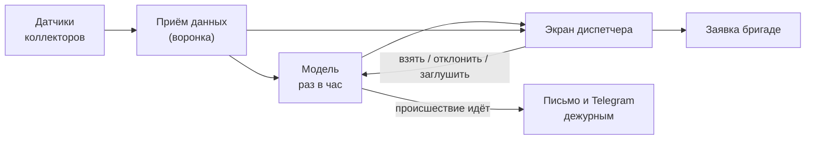

# 8. Анамнез проекта: простым языком

Документ для тех, кто будет пользоваться системой и управлять ею, без технической подготовки: что это,
как появилось, что где находится на экране, кто что может и почему часть таблиц может быть пустой.
Технические подробности — в документах [1–6](01-auth.md) и в [SYSTEM.md](../system/SYSTEM.md).

## 8.1. Зачем это

АО «Москоллектор» обслуживает 825 км инженерных коллекторов Москвы. В коллекторах стоят тысячи датчиков:
дым, газ, температура, затопление, двери, движение, насосы, питание. Датчики шлют события в диспетчерскую.
Проблемы нынешнего подхода (ТЗ §2):
- диспетчеры узнают о беде, когда датчик уже сработал;
- большая часть тревог — ложные;
- обслуживание идёт по календарю, а не по реальному состоянию оборудования.

**Think Faster** читает поток событий и **за сутки вперёд** подсказывает, где вероятен пожар,
загазованность, подтопление, отказ оборудования, отказ датчика или проникновение. К подсказке прилагается
объяснение: какие датчики и признаки её вызвали и что стоит сделать. Если происшествие уже идёт, а
прогноза не было, система объявляет его **«по факту»** в первые 10 минут.

Система **не заменяет** диспетчера: решает всегда человек. Она ничем не управляет и ничего не пишет в
системы заказчика — только читает (ТЗ §5, §13).

## 8.2. Как проект появился

| Дата | Что произошло |
|---|---|
| 15.09 | старт: разбор ТЗ, датасет — 8 журналов за 2019–2026, 313 млн записей ([Status.md](https://github.com/GroznyiBombila/Think-Faster/blob/main/Status.md)) |
| 16–18.09 | план и стек, вопросы организаторам, встреча по структуре бэкенда: сервисы, токены, роли ([tasks/plan.md](https://github.com/GroznyiBombila/Think-Faster/blob/main/tasks/plan.md)) |
| 19–25.09 | исследование модели: 65 заходов, записаны и выигрышные, и отброшенные варианты ([ML/results/analytics.md](https://github.com/GroznyiBombila/Think-Faster/blob/main/ML/results/analytics.md)) |
| 20–27.09 | сервисы: вход, права и заявки (BFF), интерфейс, воронка, модель, аудит |
| 26–27.09 | инфраструктура dev-стенда: секреты в Vault, почта и Telegram, веб-интерфейс Vault, воронка |
| 28–29.09 | prod-стенд `thinkfaster.ru`: выкатка инфраструктуры и сервисов, выдача доступов, почта через Resend |

Что решали по дороге и от чего отказались — [03. Решения](03-decisions.md).

## 8.3. Как это работает — одна картинка

1. **Приём.** События датчиков приходят в систему.
   - На prod их должна присылать шина объекта. На 29.09 она не подключена.
   - На dev события присылает эмулятор, который «проигрывает» реальные сутки из архива.
2. **Модель.** Раз в час считает для каждого из 78 объектов шесть типов риска на 24 часа вперёд.
3. **Экран.** Где риск выше порога, у диспетчера появляется карточка с объяснением и рекомендацией.
4. **Решение.** Диспетчер берёт прогноз в работу (создаётся заявка), отклоняет его с причиной или
   глушит до срока. Решение возвращается в модель: так она меньше беспокоит понапрасну.
5. **По факту.** Если происшествие уже идёт, дежурным приходит письмо и сообщение в Telegram, а в
   системе создаётся заявка.

## 8.4. Что где на экране

Интерфейс — рабочая область из окон, как на рабочем столе. Каждый видит **только те окна, на которые у
него есть права**: лишнего на экране нет (ТЗ §16). Раскладка окон запоминается.

| Окно | Что показывает | Что в нём делают |
|---|---|---|
| **Карта** | объекты коллекторов, пикеты, где сейчас тревоги, факты и работающие бригады | смотрят обстановку; клик по объекту — подробности |
| **Журнал прогнозов** | очередь прогнозов «объект × тип»: оценка, сколько часов горит, статус | выбирают, что разбирать |
| **Карточка прогноза** | почему модель так считает: признаки-основания, датчики-свидетели, рекомендация, история решений | **взять**, **отклонить** с причиной, **заглушить** до срока |
| **Журнал данных** | события «по факту»: что уже происходит | реагируют на идущие происшествия |
| **Дневник диспетчера** | заявки: новые, в работе, выполненные | ведут заявки |
| **Карточка заявки** | заявка целиком: основания, исполнитель, отчёты, возвраты | берут, назначают инженера, закрывают |
| **Создать заявку** | форма заявки | заводят заявку вручную или из прогноза |
| **Происшествия** | подтверждённые происшествия | подтверждают, что случилось |
| **История объектов** | всё по одному объекту: прогнозы, заявки, происшествия, факты | разбирают объект целиком |
| **Логи** | показания датчиков объекта: история и живой поток | проверяют, что показывает датчик прямо сейчас |
| **Объекты и датчики** | справочник объектов, датчиков, пикетов | ведут справочник |
| **Люди** | график смен, закреплённые объекты, бригады, допуски инженеров, кто на месте | планируют людей |
| **Пользователи и группы** | учётки и группы | заводят людей и группы |
| **Конфигурация доступа** | какие права у каких групп | выдают и снимают права |
| **Настройки модели** | сколько тревог в сутки допустимо по каждому типу, версия модели, периоды испорченных данных | главный диспетчер настраивает поведение модели |

Для инженера отдельный раздел **«Мои заявки»**, рассчитанный на телефон: свои заявки, карточка, отчёт
о работе, запрос к диспетчеру, показания датчика. На узком экране он открывается сразу после входа.

## 8.5. Роли: кто что видит и может

| Роль | Кто это | Видит | Может | Не может |
|---|---|---|---|---|
| **Диспетчер** | дежурный смены | карта, прогнозы, факты, заявки, происшествия, логи, люди (просмотр) | брать и отклонять прогнозы, глушить, создавать и вести заявки, подтверждать происшествия | менять настройки модели, права, людей |
| **Главный диспетчер** | руководитель смен, центральная диспетчерская | всё, что видит диспетчер, + настройки модели, группы, пользователи (просмотр) | всё, что диспетчер, + доли тревог, версия модели, игнорируемые периоды, график работ, закрепления, бригады и допуски, состав групп | выдавать права, заводить учётки |
| **Инженер** | линейный персонал, мобильная бригада, энергетики, связь | свои заявки («Мои заявки»), объекты, прогнозы и происшествия (просмотр), показания по объектам своих заявок | начинать работу, сдавать отчёт, возвращать заявку диспетчеру с вопросом | решать по прогнозам, создавать заявки |
| **Администратор** | ответственный за доступ | всё | заводить пользователей и группы, выдавать права, менять любые настройки | — (заявки по регламенту не ведёт) |

Как это устроено внутри, какие ещё права можно собрать в роль — [02. Архитектура 2.6](02-architecture.md).
Как завести человека — [01. Авторизация 1.5](01-auth.md).

## 8.6. Почему таблицы могут быть пустыми

Часть окон на стенде пустая или почти пустая — это ожидаемо, а не ошибка:

| Где пусто | Почему | Когда заполнится |
|---|---|---|
| Прогнозы, факты, логи на **prod** | шина объекта к prod не подключена, событий нет | после подключения шины ([04. Методы 4.6](04-methods.md)) |
| Прогнозов мало даже при потоке | модель держит ограниченную долю тревог: 0,5–6 % объекто-часов по типу, в сумме около 5 ложных сигналов в сутки на 78 объектов | так и задумано: меньше, но честнее |
| Первые часы после запуска | прогноз считается раз в час, на границе часа + 2 мин | через час после старта |
| Происшествия | подтверждённых инцидентов нет ни в данных, ни в работе стенда; их подтверждает диспетчер | по мере работы диспетчеров |
| Заявки, решения, «История объектов» | появляются только из действий людей и фактов | в ходе работы смен |
| Журнал аудита | события пишутся, но хранилище журнала на стендах ещё не заведено ([04 4.3](04-methods.md)) | после заведения схемы `audit` |
| «Отклонили — а оно случилось» | нужны и отклонения, и подтверждённые после них происшествия; отдельного экрана пока нет | по мере накопления решений |
| Люди, бригады, график | на dev — демонстрационные данные; на prod — заводятся заказчиком | после заведения сотрудников |
| Логи у инженера | инженер видит только объекты своих заявок в работе | когда у него есть заявка |

На **dev** (`greefob.ru`) поток идёт от эмулятора: там можно посмотреть систему «в движении».

## 8.7. Как управлять — кто что делает каждый день

| Кто | Что делает | Где |
|---|---|---|
| Диспетчер | разбирает очередь прогнозов и факты, ведёт заявки | окна «Журнал прогнозов», «Журнал данных», «Дневник диспетчера» |
| Главный диспетчер | следит, не слишком ли много или мало тревог, и при необходимости двигает доли; заносит плановые работы, чтобы модель не шумела во время них; помечает периоды испорченных данных; выбирает версию модели | «Настройки модели», «Люди» |
| Администратор | заводит людей, раздаёт права через группы | «Пользователи и группы», «Конфигурация доступа» |
| Администратор инфраструктуры | после перезагрузки сервера распечатывает хранилище секретов; следит за бэкапами, диском, сертификатом | [SYSTEM.md, Часть V](../system/SYSTEM.md) |

**Главное правило настройки:** модель не переобучают при каждом изменении условий. Её поведение меняется
таблицами главного диспетчера, и изменение действует со следующего часа. Каждая правка сохраняется с
автором и причиной, так что всегда видно, почему поток тревог стал другим ([04 4.8](04-methods.md)).

## 8.8. Словарь

| Слово | Что значит |
|---|---|
| Объект | часть коллектора со своим набором датчиков; единица прогноза |
| Прогноз | «на объекте X в ближайшие 24 ч вероятно происшествие типа Y» |
| Тревога | прогноз, оценка которого выше порога |
| По факту | происшествие уже идёт, объявлено по событиям датчиков |
| Отклонить | диспетчер считает прогноз ложным и указывает причину |
| Заглушить | не показывать тревогу по паре «объект + тип» до указанного срока |
| Доля тревог | какую часть времени система имеет право держать объекты под тревогой; главная настройка |
| Версия модели | вариант поведения модели для типа; у отказа оборудования их четыре |
| Игнорируемый период | время, когда данные испорчены; модель его не учитывает |
| Плановые работы | окно, в котором прогноз по затронутым типам не показывается |
| Шина | система объекта, которая присылает события датчиков |
| Эмулятор | программа, проигрывающая реальные сутки из архива вместо шины |
