# Think Faster — системная документация

Версия документа: **2026-09-29**. Собран из разделов сервисов и частей инфраструктуры скриптом
`docs/system/build.py` (think-infra, ветка `TF-Infra-Docs@1d7ee3f`).

| Часть | Источник | Версия |
|---|---|---|
| I–II, IV–IX, приложения | think-infra | `TF-Infra-Docs@1d7ee3f` |
| Часть III — tf-auth | think-auth | `TF-Auth-Docs@6947f44` |
| Часть III — tf-bff | think-bff | `dev@3dc8875` |
| Часть III — tf-front | think-front | `TF-Front-Docs@46e013e` |
| Часть III — tf-funnel | Think-Faster | `main@7cfe8f2` |
| Часть III — tf-model | Think-Faster | `main@7cfe8f2` |
| Часть III — tf-audit | Think-Faster | `main@7cfe8f2` |
| Часть III — tf-emulator | Think-Faster | `main@7cfe8f2` |

**Как читать.**
- Часть I — что это за система и как её части связаны между собой. Начинать с неё.
- Часть II — инфраструктура: Vault, база, брокеры, nginx, уведомления, выкатка.
- Часть III — по разделу на сервис, все в одном шаблоне из 14 пунктов (назначение, схема, интерфейсы,
  контракты, данные, безопасность, конфигурация, сборка, эксплуатация, ошибки, ограничения, доработки,
  интеграция, открытые вопросы).
- Части IV–V — руководства по запуску и эксплуатации. Команды готовы к копированию.
- Часть VI — ошибки и разборы реальных случаев.
- Часть VII — несоответствия между сервисами и риски, найденные при сведении разделов.
- Часть VIII — сводный план доработок. Часть IX — чек-листы изменений.

**Обозначения.** `§N` внутри раздела сервиса — пункт этого раздела; «tf-model §4.3» — пункт 4.3 раздела
tf-model. «VII-5» — строка 5 таблицы Части VII. Ссылки вида `файл:строка` в разделах сервисов указывают на
файлы в репозитории соответствующего сервиса.

**Секретов в документе нет**: только имена ключей и пути Vault. Значения — в Vault стенда.

## Содержание

- [Часть I. Обзор системы](#часть-i-обзор-системы)
    - [1.1. Что делает система](#11-что-делает-система)
    - [1.2. Состав](#12-состав)
    - [1.3. Общая схема](#13-общая-схема)
    - [1.4. Потоки данных](#14-потоки-данных)
    - [1.5. Стенды](#15-стенды)
    - [1.6. Публичные маршруты (tf-nginx)](#16-публичные-маршруты-tf-nginx)
    - [1.7. Реестр контрактов](#17-реестр-контрактов)
- [Часть II. Инфраструктура (think-infra)](#часть-ii-инфраструктура-think-infra)
    - [2.1. Репозиторий](#21-репозиторий)
    - [2.2. Принципы](#22-принципы)
    - [2.3. Vault](#23-vault)
    - [2.4. Каталог секретов](#24-каталог-секретов)
    - [2.5. PostgreSQL](#25-postgresql)
    - [2.6. Kafka](#26-kafka)
    - [2.7. RabbitMQ](#27-rabbitmq)
    - [2.8. Redis](#28-redis)
    - [2.9. Веб-сервер (tf-nginx)](#29-веб-сервер-tf-nginx)
    - [2.10. Уведомления: tf-mail и tf-tg](#210-уведомления-tf-mail-и-tf-tg)
    - [2.11. Выкатка](#211-выкатка)
    - [2.12. Бэкапы и восстановление](#212-бэкапы-и-восстановление)
- [Часть III. Сервисы](#часть-iii-сервисы)
    - [tf-auth — сервис аутентификации](#tf-auth--сервис-аутентификации)
    - [tf-bff](#tf-bff)
    - [tf-front — веб-интерфейс Think Faster](#tf-front--веб-интерфейс-think-faster)
    - [tf-funnel — воронка показаний](#tf-funnel--воронка-показаний)
    - [tf-model — сервис модели](#tf-model--сервис-модели)
    - [tf-audit — сервис аудита](#tf-audit--сервис-аудита)
    - [tf-emulator — эмулятор потока показаний](#tf-emulator--эмулятор-потока-показаний)
- [Часть IV. Руководство по запуску](#часть-iv-руководство-по-запуску)
    - [4.1. Новый стенд](#41-новый-стенд)
    - [4.2. Порядок запуска сервисов](#42-порядок-запуска-сервисов)
    - [4.3. Выкатка инфраструктуры вручную](#43-выкатка-инфраструктуры-вручную)
    - [4.4. Выкатка приложений](#44-выкатка-приложений)
    - [4.5. После перезагрузки сервера](#45-после-перезагрузки-сервера)
    - [4.6. Выдача кредов](#46-выдача-кредов)
    - [4.7. Доступ к базе данных](#47-доступ-к-базе-данных)
- [Часть V. Руководство по эксплуатации](#часть-v-руководство-по-эксплуатации)
    - [5.1. Здоровье сервисов](#51-здоровье-сервисов)
    - [5.2. Логи](#52-логи)
    - [5.3. Что наблюдать (мониторинга и метрик нет)](#53-что-наблюдать-мониторинга-и-метрик-нет)
    - [5.4. Типовые операции](#54-типовые-операции)
    - [5.5. Ресурсы](#55-ресурсы)
    - [5.6. Правила безопасности эксплуатации](#56-правила-безопасности-эксплуатации)
- [Часть VI. Ошибки, проблемы, кейсы](#часть-vi-ошибки-проблемы-кейсы)
    - [6.1. Сводная таблица](#61-сводная-таблица)
    - [6.2. Разборы случаев](#62-разборы-случаев)
- [Часть VII. Сквозной анализ: несоответствия и риски](#часть-vii-сквозной-анализ-несоответствия-и-риски)
    - [Что совместимо (проверено сверкой)](#что-совместимо-проверено-сверкой)
- [Часть VIII. Возможности доработки (сводный план)](#часть-viii-возможности-доработки-сводный-план)
    - [Первая очередь: безопасность и блокеры](#первая-очередь-безопасность-и-блокеры)
    - [Вторая очередь: надёжность и эксплуатация](#вторая-очередь-надёжность-и-эксплуатация)
    - [Третья очередь: развитие](#третья-очередь-развитие)
- [Часть IX. Интеграция и изменения](#часть-ix-интеграция-и-изменения)
    - [9.1. Новый сервис](#91-новый-сервис)
    - [9.2. Изменения по видам](#92-изменения-по-видам)
    - [9.3. Интеграция внешней шины (prod)](#93-интеграция-внешней-шины-prod)
    - [9.4. Уведомления из нового сервиса](#94-уведомления-из-нового-сервиса)
- [Приложения](#приложения)
    - [A. Словарь](#a-словарь)
    - [B. Скрипты для Vault](#b-скрипты-для-vault)
    - [C. Настройки стендов (`stands/<стенд>.env`)](#c-настройки-стендов-standsстендenv)
    - [D. Открытые вопросы (сводно)](#d-открытые-вопросы-сводно)
    - [E. Как обновлять документ](#e-как-обновлять-документ)

# Часть I. Обзор системы

## 1.1. Что делает система

Think Faster прогнозирует происшествия на объектах (пожар, загазованность, подтопление, отказ оборудования,
отказ датчика, проникновение) по потоку событий датчиков и помогает диспетчерам и инженерам на них реагировать.

- **Вход** — события датчиков объектов. На prod их присылает внешняя **шина** объекта, на dev их заменяет
  **эмулятор**.
- **Обработка** — воронка проверяет события и раскладывает их по топикам Kafka. Модель раз в час считает
  прогноз на 24 часа по каждому объекту и публикует прогнозы и события «по факту».
- **Реакция** — BFF создаёт по прогнозам и фактам записи и заявки, рассылает уведомления дежурным (почта,
  Telegram) и отдаёт всё это фронту: карта, журналы, заявки, живые показания.
- **Управление** — диспетчер принимает, отклоняет и глушит прогнозы, главный диспетчер меняет настройки
  модели. Эти решения уходят обратно в модель командами.
- **Контроль** — все сервисы пишут журнал действий и запросов, сервис аудита переносит его в базу.

## 1.2. Состав

| Компонент | Контейнер | Репозиторий | Технологии | Роль | Порт в сети | Публичный путь |
|---|---|---|---|---|---|---|
| Фронт | `tf-front` | think-front | React 19, TS, nginx | SPA для диспетчеров и инженеров | 80 | `/` |
| BFF | `tf-bff` | think-bff | .NET 8, EF Core | доменная логика, RBAC, заявки, прогнозы, рассылка | 8080 | `/api/bff/` (префикс срезается) |
| Аутентификация | `tf-auth` | think-auth | .NET 8 | учётки, вход, JWT RS256 в cookie | 8080 | `/api/auth/` (префикс срезается) |
| Воронка | `tf-funnel` | Think-Faster | Go 1.27 | приём пакетов шины, Kafka, архив, «Логи», WebSocket | 8000 | `/api/funnel/` (путь как есть) |
| Модель | `tf-model` | Think-Faster | Python 3.12, DuckDB, CatBoost/XGBoost/PyTorch | прогноз раз в час, факты, команды | 8000 | `/api/ml/` (путь как есть) |
| Аудит | `tf-audit` | Think-Faster | Python 3.12, FastAPI | потоки Redis → PostgreSQL `audit.*` | 8000 | нет |
| Эмулятор | `tf-emulator` | think-test (архив в Think-Faster) | Python, Django | подмена шины на dev | 8000 | нет |
| Почта | `tf-mail` | think-infra (`mailing/`) | Python 3.12 | очередь `tf.notify.email` → SMTP | нет | нет |
| Telegram | `tf-tg` | think-infra (`telegram/`) | Python 3.12 | очередь `tf.notify.telegram` → Bot API | нет | нет |
| Веб-сервер | `tf-nginx`, `tf-certbot` | think-infra (`web-server/`) | nginx 1.29, certbot | TLS, маршрутизация, лимиты, Vault UI | 80, 443 наружу | все |
| Секреты | `vault` | think-infra (`hashicorp/`) | Vault 1.20, raft | все пароли и ключи | 8200 (localhost + сеть) | `https://vault.greefob.ru` (только dev) |
| База | `tf-postgres` | think-infra (`postgree/`) | PostgreSQL 16 | схемы `auth`, `bff` (+ `audit`) | 5432 | нет |
| Шина событий | `tf-kafka` | think-infra (`kafka/`) | Kafka 4.0 KRaft | `tf.ingest.*`, `tf.forecast.results`, `tf.dlq` | 9092 | нет |
| Брокер задач | `tf-rabbit` | think-infra (`rabbitmq/`) | RabbitMQ 4.1 | уведомления, команды модели | 5672 | нет |
| Кэш и потоки | `tf-redis` | think-infra (`redis/`) | Redis 7 | аудит, лимиты входа, антиспам, дедуп уведомлений | 6379 | нет |

Все контейнеры работают в одной docker-сети **`think-fast-net`** на одном сервере стенда. Наружу опубликованы
только 80/443 (`tf-nginx`) и, на dev, 5432 PostgreSQL.

## 1.3. Общая схема

Основной поток сверху вниз. Vault (секреты всем сервисам при старте) и проверка токенов через tf-auth на схеме не показаны, они есть в таблице ниже. Подробные потоки — раздел 1.4.

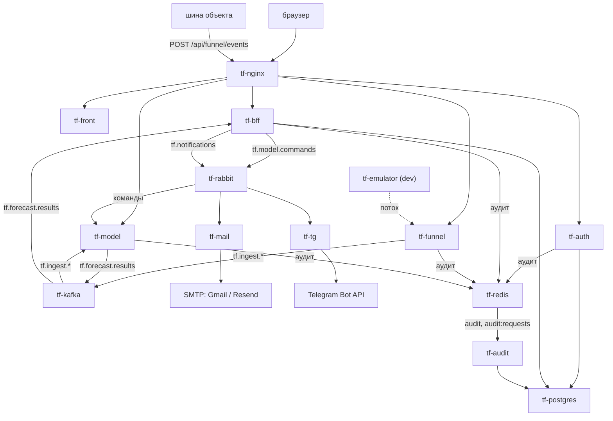

| Кто | С кем | Как |
|---|---|---|
| tf-front (браузер) | tf-auth, tf-bff, tf-funnel | HTTPS через nginx, cookie `access_token`, WebSocket `/api/funnel/stream` |
| tf-bff, tf-funnel, tf-model, tf-audit | tf-auth | `GET /.well-known/jwks` (PEM), tf-bff — ещё `POST /refresh` |
| tf-funnel | tf-bff | `GET /readings/scope` (права на показания) |
| tf-funnel → tf-model | tf-kafka | `tf.ingest.readings`, `tf.ingest.journal`, `tf.ingest.reference` |
| tf-model → tf-bff | tf-kafka | `tf.forecast.results` |
| tf-bff → tf-model | tf-rabbit | `tf.model.commands` |
| tf-bff → tf-mail, tf-tg | tf-rabbit | `tf.notifications` (`email`, `telegram`) |
| tf-auth, tf-bff, tf-funnel, tf-model → tf-audit | tf-redis | потоки `audit`, `audit:requests` |
| tf-auth, tf-bff, tf-audit | tf-postgres | схемы `auth`, `bff`, `audit` |
| tf-mail, tf-tg | tf-redis | `notify:sent:*` (защита от повторной отправки) |
| все сервисы | vault | секреты при старте (три способа — раздел 1.4) |

## 1.4. Потоки данных

### От датчика до письма дежурному

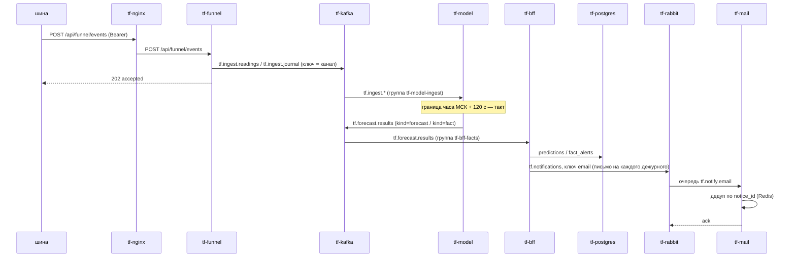

### Пользователь

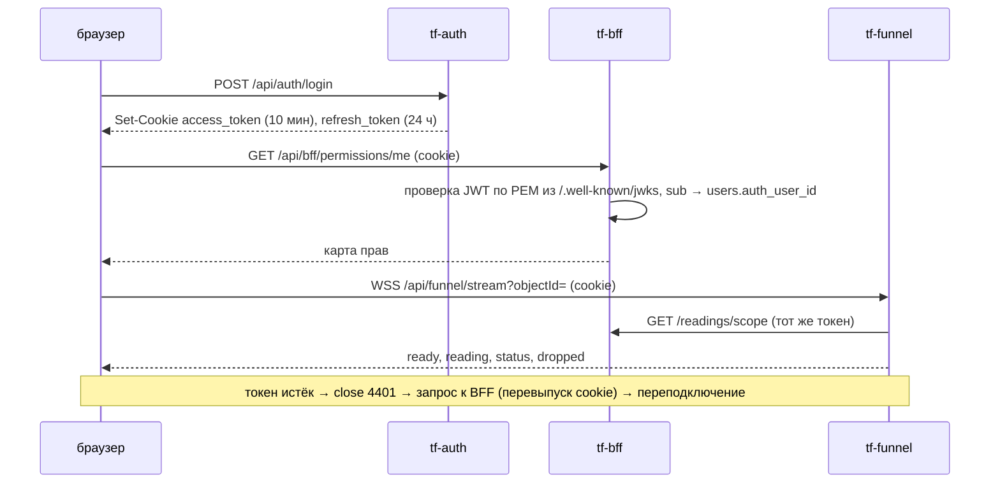

### Решение диспетчера → модель

`tf-bff` публикует конверт `{schema, command_id, kind, issued_at, issued_by, request_id, payload}` в exchange
`tf.model.commands` с ключом `kind` (`decision.take|reject|mute|reopen|confirmed`, `settings.*`, `model.switch`,
`retrain.request`). `tf-model` применяет команду под замком такта и подтверждает её только после записи
на том. Формат — раздел tf-model §4.3.

### Аудит

Сервисы пишут `XADD audit` (журнал действий) и `XADD audit:requests` (строка на HTTP-запрос) в `tf-redis`
и сразу продолжают работу. `tf-audit` читает потоки группой `audit-writer`, вырезает запрещённые поля и
пишет в `audit.events` / `audit.requests`. Всё, что не проходит проверку, уходит в поток `audit:dead`.
Формат события — tf-audit §4.1.

### Секреты

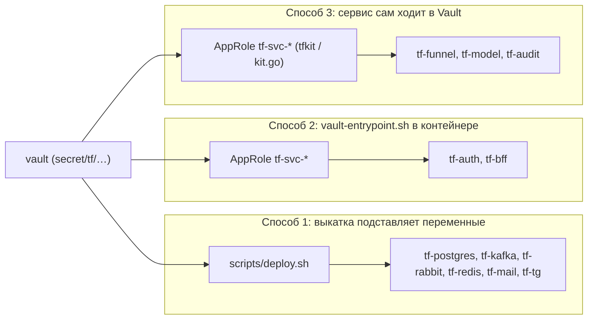

## 1.5. Стенды

| | dev | prod |
|---|---|---|
| Домен | `greefob.ru` | `thinkfaster.ru`, `www.thinkfaster.ru` |
| Сервер | `176.123.167.161`, пользователь `user1` | `45.87.41.186` (`predictor-home`), пользователь `grisha` |
| Каталог выкатки инфраструктуры (`TF_INFRA_DIR`) | `/home/user1/tf/think-prod` | `/srv/thinkfaster/tf.infra` |
| Клон think-infra на сервере | `~/tf/infra-src` | `/srv/thinkfaster/tf/think-infra` |
| Код приложений | по workflow сервисов | `/srv/thinkfaster/services/<репозиторий>` |
| Docker | обычный `docker` (есть признаки snap: не видит хостовый `/tmp`) | обёртка `sudo -n /usr/local/bin/tf-docker`, compose только внутри `/srv/thinkfaster`, `sudo` сбрасывает окружение |
| PostgreSQL на хосте | `0.0.0.0:5432` (открыт наружу) | `127.0.0.1:15432`, доступ по SSH-туннелю |
| nginx слушает | все адреса | только `45.87.41.186` (`WEB_BIND`) |
| Vault UI | `https://vault.greefob.ru` | выключен (`VAULT_DOMAIN` закомментирован), только SSH-туннель |
| Раннер GitHub для think-infra | **нет**: выкатка вручную | есть (`self-hosted, prod`): `deploy-<сервис>.yml`, `deploy-apps-prod.yml` |
| Источник событий | `tf-emulator` (`TF_FUNNEL_PULL`) | внешняя шина (на 29.09 не подключена) |
| Почта | Gmail SMTP 587 | Resend `smtp.resend.com:2587` (провайдер режет 25/465/587), `MAIL_FROM=noreply@thinkfaster.ru` |
| Ресурсы | слабая VM: сборка образов на ней кладёт стенд | «сильная машина», ~3,5 ГБ свободной памяти по оценке workflow модели |

Ветки и версии: фича → `dev` → `prod` (→ `master`). Выпуски — аннотированные теги `devX.Y.Z` / `prodX.Y.Z`
на одном коммите (последние — `dev1.1.0` / `prod1.1.0`, 27.09). Коммиты, которые не должны запускать
выкатку, помечаются `[skip ci]`.

## 1.6. Публичные маршруты (tf-nginx)

| Путь | Куда | Префикс | Ограничения |
|---|---|---|---|
| `/.well-known/acme-challenge/` (порт 80) | файлы certbot | — | для всех имён, включая `VAULT_DOMAIN` |
| всё остальное на порту 80 | `301` на HTTPS | — | — |
| `/api/auth/` | `tf-auth:8080` | срезается (`/api/auth/login` → `/login`) | — |
| `/api/bff/` | `tf-bff:8080` | срезается | — |
| `= /api/funnel/events` | `tf-funnel:8000` | как есть | тело ≤ 8 МБ, приём тела ≤ 30 с, 20 запросов/с с адреса (всплеск 40), ответ ≤ 60 с, allowlist `FUNNEL_EVENTS_ALLOW` |
| `= /api/funnel/stream` | `tf-funnel:8000` | как есть | WebSocket, `proxy_read_timeout`/`send_timeout` 120 с, без буферизации |
| `= /api/funnel/log` | `tf-funnel:8000` | как есть | 5 запросов/с (всплеск 10) |
| `/api/funnel/` | `tf-funnel:8000` | как есть | — |
| `/api/ml/` | `tf-model:8000` | как есть | `proxy_read_timeout` 60 с |
| `/` | `tf-front:80` | — | — |
| `https://<VAULT_DOMAIN>` | `vault:8200` | — | вход по токену; 30 попыток входа/мин на `/v1/auth/*/login`; allowlist `VAULT_ALLOW` |

Во все маршруты приложений nginx передаёт `Host`, `X-Real-IP`, `X-Forwarded-For` (дописывает свой адрес к
присланному клиентом), `X-Forwarded-Proto` и сквозной `X-Request-ID`. Адреса апстримов берутся из
переменных и разрешаются при каждом запросе (`resolver 127.0.0.11`). Поэтому nginx стартует, даже если
сервиса нет, а на запросы к такому сервису отвечает `502`.

## 1.7. Реестр контрактов

| Контракт | Владелец | Потребители | Где описан |
|---|---|---|---|
| Пакет шины `POST /events` | tf-funnel | шина, эмулятор | tf-funnel §4.1 |
| `tf.ingest.readings` / `journal` / `reference` | tf-funnel | tf-model, tf-bff (ACL) | tf-funnel §4.2, tf-model §4.1 |
| `tf.forecast.results` (`forecast`, `fact`) | tf-model | tf-bff | tf-model §4.2, tf-bff §4 |
| `tf.model.commands` | tf-bff (издатель) / tf-model (формат) | tf-model | tf-model §4.3, tf-bff §4 |
| `tf.notifications` email/telegram | think-infra (`docs/notify-tz/tf-bff.md`) | tf-mail, tf-tg | Часть II §2.10, tf-bff §4 |
| JWT, cookie, `/.well-known/jwks` (PEM) | tf-auth | tf-bff, tf-funnel, tf-model, tf-audit, фронт | tf-auth §4 |
| `GET /readings/scope` | tf-bff | tf-funnel, фронт | tf-bff §3–4, tf-funnel §4.3 |
| WebSocket `/stream`, `/log` | tf-funnel | фронт | tf-funnel §4.3, tf-front §4 |
| Событие аудита §6.4, строка запроса §6.1 | tf-audit (контракт «права-и-аудит», в репозиториях не найден) | все, кто пишет аудит | tf-audit §4 |
| API BFF (`/api/bff/*`), формат ошибок | tf-bff | фронт | tf-bff §3–4 |
| Топология RabbitMQ, топики и ACL Kafka, пути Vault, маршруты nginx | think-infra | все | Часть II |


# Часть II. Инфраструктура (think-infra)

Источник: репозиторий think-infra, ветка `dev`. Подробности по каждому компоненту — в README его папки;
здесь — как всё устроено вместе, политики и то, чего нет в README.

## 2.1. Репозиторий

| Папка / файл | Что | Выкатка |
|---|---|---|
| `hashicorp/` | Vault: compose, `vault.hcl`, `services.conf` (роли сервисов), `scripts/setup.sh`, `scripts/backup.sh` | вручную (`deploy.sh hashicorp`), никогда из CI |
| `postgree/` | PostgreSQL 16, `db/schemas.conf`, контейнер `create-schema`, `backup.sh` | `deploy-postgree.yml` |
| `kafka/` | Kafka 4.0 KRaft, `topics.conf`, `acls.conf`, init-контейнер | `deploy-kafka.yml` |
| `rabbitmq/` | RabbitMQ 4.1, `definitions.json`, `users.conf`, init-контейнер | `deploy-rabbitmq.yml` |
| `redis/` | Redis 7 с паролем и AOF | `deploy-redis.yml` |
| `web-server/` | nginx + certbot, шаблоны `nginx.conf.template`, `vault.conf.template` | `deploy-web-server.yml` |
| `mailing/` | `tf-mail` | `deploy-mailing.yml` |
| `telegram/` | `tf-tg` | `deploy-telegram.yml` |
| `samba/` | файловый обмен, в выкатку не входит | — |
| `secrets.conf` | **единственный** список секретов: папка, путь Vault, ключ, генератор | — |
| `stands/dev.env`, `stands/prod.env` | несекретные настройки стенда | — |
| `scripts/deploy.sh` | выкатка одного сервиса на стенд | вызывается workflow или вручную |
| `scripts/secrets.sh` | управление секретами (`status/init/set/get/rotate/env/import/relocate`) | вручную на сервере |
| `scripts/bootstrap-stand.sh` | новый стенд одной командой | вручную |
| `scripts/lib/vault.sh` | общие функции, `SHARED_SECRETS` | — |
| `.github/workflows/deploy-*.yml`, `deploy.yml` | выкатка по пушу в `dev`/`prod` | раннер стенда |
| `.github/workflows/deploy-apps-prod.yml` | prod: инфраструктура + tf-auth, tf-bff, tf-audit с раннера prod | вручную / пуш файла |
| `docs/vault-tz/`, `docs/notify-tz/`, `docs/funnel-tz/` | ТЗ для репозиториев сервисов | — |
| `docs/vault-entrypoint.sh` | скрипт входа в Vault для контейнеров (tf-auth, tf-bff) | копируется в репозитории сервисов |
| `QUICK_START.md` | пошаговая инструкция без предварительных знаний | — |

## 2.2. Принципы

1. **Секреты — только в Vault своего стенда.** В git, в `stands/*.env`, в файлах на сервере и в GitHub их
   нет. Исключение — доступ к Vault: пары AppRole в GitHub Environments. `deploy.sh` отказывается
   работать, если в файле стенда есть ключ из `secrets.conf`.
2. **Один источник правды на тип настройки.** Секреты перечислены в `secrets.conf`, несекретные настройки
   стенда — в `stands/<стенд>.env`, роли сервисов — в `hashicorp/services.conf`, топики — в
   `kafka/topics.conf`, ACL — в `kafka/acls.conf`, топология RabbitMQ — в `definitions.json` и `users.conf`,
   схемы БД — в `postgree/db/schemas.conf`.
3. **Выкатка идемпотентна.** Повторный запуск ничего не ломает: init-контейнеры переприменяют топологию,
   права и пароли, `create-schema` приводит схемы к нужному виду.
4. **Минимум наружу.** Опубликованы только 80/443 nginx и, на dev, 5432. Всё остальное доступно только
   внутри `think-fast-net`.
5. **Каждой учётке — свой путь в Vault** (`kafka/bff`, `rabbit/model`, …). Права в Vault выдаются на путь
   целиком, поэтому сервис не видит пароли admin и чужих учёток.
6. **Тома не удаляются.** В `tf-vault-data`, `postgres_data`, `tf-kafka-data`, `tf-rabbit-data`,
   `tf-redis-data`, `tf-funnel-data`, `tf-ml-work` лежат данные. `down -v`, `volume rm` и `prune --volumes`
   запрещены.

## 2.3. Vault

### Развёртывание

- Контейнер `vault`, образ `hashicorp/vault:1.20.0`, хранилище raft в томе `tf-vault-data`, `ui = true`, без TLS.
- Порт `127.0.0.1:8200` на хосте и `http://vault:8200` в `think-fast-net`. Наружу — только через nginx
  (`VAULT_DOMAIN`, раздел 2.9) или по SSH-туннелю.
- **После каждого старта контейнера Vault запечатан.** Пока его не распечатают, сервисы, которым нужны
  секреты, ждут (vault-entrypoint — до 10 мин, tfkit/kit.go — `TF_VAULT_WAIT=900` с), а nginx на их маршрутах
  отдаёт `502`.
- Инициализация: 3 ключа распечатывания, порог 2 (`operator init -key-shares=3 -key-threshold=2`).
  Ключи показываются **один раз**. Восстановить их нельзя, можно только перевыпустить (rekey) двумя
  действующими.
- Хранилище секретов — KV v2 на `secret/`, все пути под `secret/tf/`.

### Политики и роли

| Политика | Права | Кто пользуется |
|---|---|---|
| `tf-deploy` | `read` на `secret/data/tf/*` | AppRole `tf-deploy` — CI и ручная выкатка инфраструктуры (`deploy.sh`) |
| `tf-admin` | `create/read/update/patch` на `secret/data/tf/*`, `read/list` на metadata, `list` на `secret/metadata/` | личные токены администраторов (`secrets.sh`, UI) |
| `tf-backup` | `read` на `sys/storage/raft/snapshot` | токен cron-бэкапа |
| `tf-svc-<сервис>` | `read` своих путей из `services.conf` | AppRole сервиса |
| `root` | всё | только временно: `setup.sh`, выдача кредов |

| AppRole | Пути (`services.conf`) | Токен | `secret_id` |
|---|---|---|---|
| `tf-deploy` | все `secret/tf/*` (чтение) | 15 мин, max 30 | бессрочный, без лимита использований |
| `tf-svc-tf-bff` | `postgres/bff kafka/bff rabbit/bff redis app/tf-bff` | 5 мин, max 15 | бессрочный |
| `tf-svc-tf-auth` | `postgres/auth redis app/tf-auth` | 5 мин | бессрочный |
| `tf-svc-tf-funnel` | `kafka/funnel redis app/tf-funnel` | 5 мин | бессрочный |
| `tf-svc-tf-model` | `kafka/model rabbit/model redis app/tf-model` | 5 мин | бессрочный |
| `tf-svc-tf-audit` | `postgres/audit redis app/tf-audit` | 5 мин | бессрочный |

`role_id` роли постоянный. `setup.sh apply` перезаписывает политики и параметры ролей, `role_id` при этом
не меняется. `secret_id` можно выдавать сколько угодно раз: новые добавляются к старым. `--rotate` отзывает
**все** прежние `secret_id` роли, и сервисы с ними перестанут входить в Vault.

### Токены

| Токен | Как выдаётся | Срок | Замечания |
|---|---|---|---|
| Root | `Initial Root Token` при инициализации или `operator generate-root` двумя ключами | бессрочный | держать только на время работы и сразу отзывать; в GitHub и файлах не хранить |
| Личный (tf-admin) | `setup.sh admin-token <имя>` под root | период 720 ч, продлевается при каждом использовании | **сейчас выдаётся дочерним к root**: отзыв root отзывает и его (раздел 6.2, кейс 3). До правки выдавать вручную с `-orphan` |
| Бэкап (tf-backup) | `setup.sh backup-token` | период 768 ч, `-orphan` | лежит в `$TF_INFRA_DIR/hashicorp/.backup-token` (600) |
| Токен сервиса | AppRole-вход при старте | 5 мин | контейнер отзывает его сразу после чтения |
| Токен CI | AppRole `tf-deploy` | 15 мин | `deploy.sh` отзывает его в конце выкатки |

### Как секрет попадает в контейнер

| Способ | Сервисы | Механизм |
|---|---|---|
| Выкатка подставляет переменные | `tf-postgres`, `tf-kafka`, `tf-rabbit`, `tf-redis`, `tf-nginx` (нет секретов), `tf-mail`, `tf-tg` | `deploy.sh` входит в Vault (пара CI или `VAULT_TOKEN`), читает ключи папки из `secrets.conf` плюс `SHARED_SECRETS` и передаёт их в `docker compose --env-file` (файл 600, удаляется после выкатки). Генерируемые значения — только `A-Za-z0-9_-`; `manual` — любые, кроме `'` и перевода строки |
| `vault-entrypoint.sh` | `tf-auth`, `tf-bff` | ENTRYPOINT контейнера: AppRole-вход, чтение `VAULT_SECRET_PATHS`, подстановка в `VAULT_EXPAND`, файлы из `VAULT_FILES`, отзыв токена, `exec` приложения |
| Сам по AppRole | `tf-funnel` (kit.go), `tf-model`, `tf-audit` (tfkit.py) | вход при старте, чтение нужных путей, секреты в памяти процесса |

`SHARED_SECRETS` (`scripts/lib/vault.sh`) — ключи чужих папок, которые получает сервис этого репозитория:
`mailing` → `TF_RABBIT_EMAIL_PASSWORD TF_REDIS_PASSWORD`, `telegram` → `TF_RABBIT_TELEGRAM_PASSWORD TF_REDIS_PASSWORD`.

### Веб-интерфейс

На dev — `https://vault.greefob.ru`: nginx снимает TLS и проксирует на `vault:8200`. Сам Vault при этом не
меняется и не перезапускается, а токены и роли остаются прежними. Вход — Method **Token**, личный токен
tf-admin. Секреты лежат в `secret/` → `tf/`. На prod интерфейс выключен: чтобы включить, нужна A-запись
`vault.thinkfaster.ru` и `VAULT_DOMAIN` в `stands/prod.env`. Без поддомена интерфейс открывается по туннелю:
`ssh -L 8200:127.0.0.1:8200 <пользователь>@<сервер>`, затем `http://localhost:8200`.

## 2.4. Каталог секретов

| Путь `secret/tf/…` | Ключ | Генератор | Потребитель |
|---|---|---|---|
| `postgres` | `POSTGRES_PASSWORD` | hex | суперпользователь `tf` (только инфраструктура, бэкап) |
| `postgres/auth` | `TF_PG_AUTH_ADMIN_PASSWORD`, `TF_PG_AUTH_USER_PASSWORD` | hex | миграции / приложение tf-auth |
| `postgres/bff` | `TF_PG_BFF_ADMIN_PASSWORD`, `TF_PG_BFF_USER_PASSWORD` | hex | миграции / приложение tf-bff |
| `postgres/audit` | `TF_PG_AUDIT_USER_PASSWORD` (+ `…_ADMIN_…`) | — | tf-audit. **Не заведён** (раздел 2.5) |
| `kafka` | `KAFKA_CLUSTER_ID` | cluster-id, **не ротируется** | брокер |
| `kafka` | `TF_KAFKA_ADMIN_PASSWORD` | hex | обслуживание |
| `kafka/funnel`, `kafka/model`, `kafka/bff` | `TF_KAFKA_<СЕРВИС>_PASSWORD` | hex | учётки SASL |
| `rabbit` | `TF_RABBIT_ADMIN_PASSWORD` | hex | admin (применяется только при первом старте тома) |
| `rabbit/bff`, `rabbit/model`, `rabbit/email`, `rabbit/telegram` | `TF_RABBIT_<…>_PASSWORD` | hex | `tf-bff`, `tf-model`, `tf-notify-email`, `tf-notify-telegram` |
| `redis` | `TF_REDIS_PASSWORD` | hex | все клиенты Redis |
| `app/tf-auth` | `TF_AUTH_JWT_PRIVATE_KEY_B64` | rsa-b64 | ключ подписи JWT; ротация разлогинивает всех |
| `app/tf-funnel` | `TF_FUNNEL_SERVICE_SUBS` | manual | `sub` техучётки шины |
| `app/tf-model`, `app/tf-audit` | `TF_MODEL_SERVICE_SUBS`, `TF_AUDIT_SERVICE_SUBS` | — (нет в `secrets.conf`) | заводятся руками при необходимости |
| `app/tf-mail` | `TF_MAIL_SMTP_HOST`, `_PORT`, `_USER`, `_PASSWORD` | manual | tf-mail (dev: Gmail; prod: Resend) |
| `app/tf-tg` | `TF_TG_BOT_TOKEN` | manual | tf-tg (свой бот на каждый стенд) |

Секреты `manual` не создаются ни `bootstrap`, ни `secrets.sh init`: их вводят руками (`secrets.sh set <КЛЮЧ>`
или UI). `secrets.sh status` показывает их как `MISSING (manual)` и не завершается из-за них ошибкой.

## 2.5. PostgreSQL

- Контейнер `tf-postgres` (`postgres:16`), база `tf`, суперпользователь `tf`. Сети: `think-fast-net` и
  `postgree_app-network`. Вторую до сих пор объявляет compose tf-auth, и она существует, пока выкатан `postgree`.
- Схемы — из `postgree/db/schemas.conf` (сейчас `auth`, `bff`). Для каждой схемы есть роли `<схема>_admin`
  (владелец, DDL, миграции) и `<схема>_user` (DML, без DDL), `search_path` указывает на схему.
- Контейнер `create-schema` запускается при каждой выкатке `postgree`. Он создаёт роли, выставляет пароли
  из Vault, передаёт владение объектами `<схема>_admin`, выдаёт права и проверяет, что `_user` видит все
  таблицы.
- **Схема `audit`:** роль `tf-svc-tf-audit` есть, а строки `audit` в `schemas.conf` и паролей в `secrets.conf`
  нет. Их убрали сознательно (коммит 13d1fdb): без паролей в `secrets.conf` выкатка `postgree` остановилась бы.
  Заводится отдельным шагом администратора (Часть VIII, № 3).
- Доступ людей: dev — `176.123.167.161:5432`; prod — только SSH-туннель на `127.0.0.1:15432` (pgAdmin: вкладка
  SSH Tunnel, Identity file). Пароли — `scripts/secrets.sh get <КЛЮЧ>` под личным токеном.
- Бэкап: cron в 04:00, `pg_dump -Fc` в том `postgres_backups`, хранятся 7 дней. Бэкап лежит на том же
  сервере, копии вне сервера нет.

## 2.6. Kafka

Один брокер KRaft (`apache/kafka:4.0.0`), `SASL_PLAINTEXT`/`PLAIN`, replication factor 1, порт на хост не
опубликован.

| Топик | Партиции | Хранение | Кто пишет | Кто читает |
|---|---|---|---|---|
| `tf.ingest.readings` | 6 | 7 дней | tf-funnel | tf-model; tf-bff — ACL есть, не использует |
| `tf.ingest.journal` | 3 | 30 дней | tf-funnel | tf-model; tf-bff — ACL есть, не использует |
| `tf.ingest.reference` | 3 | compact, вечно | tf-funnel (`channel.status`) | tf-model; tf-bff — ACL есть, не использует |
| `tf.forecast.results` | 3 | 7 дней | tf-model | tf-bff (группа `tf-bff-facts`) |
| `tf.dlq` | 1 | 14 дней | tf-funnel, tf-model, tf-bff (ACL) | — |

Для всех топиков: `lz4`, сообщение не больше 1 МБ. ACL — `kafka/acls.conf`. Группы потребителей должны
начинаться с имени сервиса (`tf-model-ingest`, `tf-bff-facts`). Выход за права даёт
`TopicAuthorizationException` / `GroupAuthorizationException`.

## 2.7. RabbitMQ

vhost `tf`, все очереди quorum и durable. TTL, DLX и лимиты задаются политиками, поэтому их можно менять
без пересоздания очередей.

| Exchange | Тип | Ключ | Очередь | TTL | Лимит | Издатель → потребитель |
|---|---|---|---|---|---|---|
| `tf.model.commands` | topic | `#` | `tf.model.commands` | 1 ч | 10 000 | tf-bff → tf-model |
| `tf.notifications` | direct | `email` | `tf.notify.email` | 24 ч | 10 000 | tf-bff → tf-mail |
| `tf.notifications` | direct | `telegram` | `tf.notify.telegram` | 24 ч | 10 000 | tf-bff → tf-tg |
| `tf.dlx` | fanout | — | `tf.dlq` | — | 100 000 | отказы всех очередей |

Сообщение попадает в `tf.dlq` в четырёх случаях: `reject`/`nack` без повтора, 5 возвратов в очередь
(`delivery-limit`), истёк TTL, переполнение очереди (`drop-head`). Причина — в заголовке `x-death`.

| Пользователь | configure | write | read |
|---|---|---|---|
| `tf-bff` | — | `tf.model.commands`, `tf.notifications` | — |
| `tf-model` | — | — | `tf.model.commands` |
| `tf-notify-email` (tf-mail) | — | — | `tf.notify.email` |
| `tf-notify-telegram` (tf-tg) | — | — | `tf.notify.telegram` |
| `admin` | всё | всё | всё (только обслуживание) |

Прав `configure` нет ни у одного сервиса: объявлять exchange и очереди можно только пассивно
(`passive=true`). Management UI открывается только по SSH-туннелю (rabbitmq/README.md).

Kafka `tf.dlq` и RabbitMQ `tf.dlq` называются одинаково, но это **разные** сущности.

## 2.8. Redis

Redis 7 с паролем (`TF_REDIS_PASSWORD`) и AOF, том `tf-redis-data`. Кто что хранит:

| Ключ / поток | Владелец | Назначение | Срок |
|---|---|---|---|
| поток `audit` | пишут tf-auth, tf-bff, tf-funnel, tf-model, tf-audit | журнал действий | `MAXLEN ~1 000 000` |
| поток `audit:requests` | пишут tf-funnel, tf-model, tf-audit | журнал запросов | `MAXLEN ~1 000 000` |
| поток `audit:dead` | tf-audit | отвергнутые события | `MAXLEN ~100 000` |
| группа `audit-writer` | tf-audit | позиция чтения | — |
| `auth:login-rate:{ip}:{логин}` | tf-auth | неудачные входы | TTL 60 с |
| `email:ratelimit:{email}` | tf-bff | антиспам ручной рассылки | TTL 60 с |
| `notify:sent:{notice_id}:{email\|telegram}` | tf-mail, tf-tg | кому уже ушло уведомление | 24 ч |

Redis — единственный буфер аудита: если он потеряет данные, события пропадут. Когда Redis недоступен,
сервисы ведут себя по-разному. tf-auth: вход отвечает `500`. tf-bff: лимит антиспама пропускает всё,
аудит уходит в лог. tf-funnel и tf-model: аудит копится в спул-файле. tf-mail и tf-tg: дедуп переходит
в память процесса.

## 2.9. Веб-сервер (tf-nginx)

- Сертификат Let's Encrypt на `DOMAIN`, `DOMAIN_ALIASES` и `VAULT_DOMAIN`. Лежит в `web-server/certbot/`
  каталога выкатки. `tf-certbot` дважды в сутки делает `renew` через webroot, nginx перечитывает конфиг
  раз в 6 ч.
- Выкатка web-server: проверяет, каких имён нет в сертификате, и дозапрашивает их (webroot, если nginx
  работает, иначе standalone). Открывает `certbot/www` на чтение: без этого проверка Let's Encrypt падала
  с 403 (раздел 6.2, кейс 6). Генерирует `nginx.conf` и `tf.d/*.conf` из шаблонов через `envsubst` в
  контейнере nginx, поднимает контейнер, выполняет `nginx -t` и `reload`.
- Маршруты и лимиты — таблица в разделе 1.6.
- `tf.d/vault.conf` генерируется, только если задан `VAULT_DOMAIN`.
- Настройки: `DOMAIN`, `DOMAIN_ALIASES`, `LETSENCRYPT_EMAIL`, `WEB_BIND`, `*_HOST`/`*_PORT` (`ML_HOST`/`ML_PORT`
  по умолчанию `tf-model:8000`), `FUNNEL_EVENTS_ALLOW`, `VAULT_DOMAIN`, `VAULT_ALLOW`.
- **Проверка конфига до выкатки** (сайт не трогается) — раздел 4.3.

## 2.10. Уведомления: tf-mail и tf-tg

Оба сервиса — потребители очередей RabbitMQ без HTTP API и без портов. Устроены одинаково, общий модуль
`app/broker.py` лежит копией в обеих папках (менять оба файла).

- **Контракт** (издатель — tf-bff): exchange `tf.notifications`, ключ `email` или `telegram`, JSON
  `{schema: 1, notice_id (uuid), subject (≤255), text (≤20000), to: {emails | chat_ids}, ticket_id?, kind?, request_id?}`.
  Полное ТЗ для издателя — `docs/notify-tz/tf-bff.md`. Реализация tf-bff сверена с ним: поля совпадают,
  BFF шлёт одно письмо на адресата и один Telegram на всех.
- **Ответ брокеру:**
  - `ack` — ушло хотя бы кому-то (отказы по адресам — в лог числом);
  - `reject` → `tf.dlq` — сообщение не разобрать (не JSON, нет `notice_id`, нет адресатов, хотя бы один адрес
    с ошибкой, Telegram длиннее 4096) или не ушло никому по постоянной причине;
  - `nack` с повтором через 5/15/30/60 с — временная ошибка; на 5-й попытке — `reject`.
- **Дедуп:** кому уже ушло, помнится по `notice_id` сутки в Redis (или в памяти, если Redis недоступен).
- **Старт:** tf-mail входит на SMTP без отправки, tf-tg вызывает `getMe`. Если логин, пароль или токен не
  подошли, очередь **не читается**, контейнер остаётся `unhealthy` и **не перезапускается по кругу**
  (Gmail блокирует вход после серии неудач). Выкатка в этом случае падает со строкой в логе.
- **Здоровье:** файл `/tmp/tf-alive` обновляется, пока есть соединение с брокером; `HEALTHCHECK` проверяет
  его свежесть (60 с).
- **Лог:** события `notify.sent` / `notify.failed` в JSON с `notice_id`, `ticket_id`, темой, числом адресатов
  и причиной. Адресов и текста в логе нет. В поток Redis `audit` сервисы **не пишут** (Часть VII, № 10).
- **Почта на prod:** хостинг молча режет исходящие 25/465/587 (с хоста и из docker). Используется Resend:
  `smtp.resend.com:2587`, логин `resend`, пароль — API-ключ, отправитель `MAIL_FROM=noreply@thinkfaster.ru`
  (домен подтверждён в Resend через DKIM и SPF в DNS reg.ru). На dev — Gmail `587` с паролем приложения.
- **Telegram:** `docker exec tf-tg python chats.py` показывает, кто писал боту за сутки (оттуда берут `chat_id`).
- Подробно — `mailing/README.md`, `telegram/README.md`.

## 2.11. Выкатка

### Три механизма

| Что | Как | dev | prod |
|---|---|---|---|
| Инфраструктура think-infra | `scripts/deploy.sh <сервис>`: настройки стенда, вход в Vault, секреты в env-файл, `git archive` папки в `$TF_INFRA_DIR/<сервис>`, `docker compose up`, проверка | вручную (раннера нет) | `deploy-<сервис>.yml` на раннере `self-hosted, prod` (пара CI в Environment `prod`) или вручную |
| tf-auth, tf-bff, tf-audit на prod | `deploy-apps-prod.yml` (think-infra): код из `/srv/thinkfaster/services/<репо>`, пары `TF_<СЕРВИС>_VAULT_*` из Environment `prod`, шаги по списку, упавший не прерывает остальные | — | вручную, `steps` на выбор |
| Приложения из своих репозиториев | workflow репозиториев: tf-auth, tf-bff, tf-front — SSH/scp и сборка на сервере; tf-funnel — образ в Docker Hub; tf-model, tf-audit, tf-emulator — сборка в CI, `docker save` → scp → `docker load` | по пушу | вручную |

Не держите два пути выкатки одного сервиса с разными параметрами. Из `deploy-apps-prod.yml` шаги `funnel` и
`model` уже убраны (коммит e4c4d0f): их выкатывает только Think-Faster.

### Особенности prod

- Docker вызывается через `sudo -n /usr/local/bin/tf-docker`. `sudo` сбрасывает окружение, поэтому
  `VAULT_ROLE_ID`/`VAULT_SECRET_ID` до compose не доходят, пока в sudoers нет
  `Defaults!/usr/local/bin/tf-docker env_keep += "VAULT_ROLE_ID VAULT_SECRET_ID"`. До этого их передают
  временным `--env-file` (tf-auth §8).
- `docker compose` разрешён только внутри `/srv/thinkfaster`.
- В GitHub Environment `prod` репозиториев лежат только пары AppRole. Root-токену (`VAULT_TOKEN`) там не
  место: без него `deploy-apps-prod.yml` пропускает шаги `apply` и `secrets`, это нормально.

### Ветки, версии, `[skip ci]`

Фича → PR в `dev` → `dev` → `prod`. Выпуск: `Merge branch 'dev' into prod [skip ci]`, `dev` перематывается на
тот же коммит, на него ставятся аннотированные теги `devX.Y.Z` / `prodX.Y.Z` с описанием. `[skip ci]` в
последнем коммите пуша отключает все workflow этого пуша. Им пользуются, когда выкатка идёт вручную
(на dev нет раннера) или когда меняется только документация.

## 2.12. Бэкапы и восстановление

| Что | Когда | Куда | Хранение | Восстановление |
|---|---|---|---|---|
| Vault (снапшот raft) | cron 03:00 | `$TF_INFRA_DIR/hashicorp/backups/` | 14 последних | `docker cp` снапшота в контейнер → `operator raft snapshot restore -force`. После восстановления действуют ключи и токены **того** Vault |
| PostgreSQL (`pg_dump -Fc`) | cron 04:00 | том `postgres_backups` | 7 дней | `pg_restore` в контейнере `tf-postgres` |
| Kafka, RabbitMQ, Redis | — | тома | — | бэкапа нет: данные транзитные |
| Архив воронки, том модели | — | тома `tf-funnel-data`, `tf-ml-work` | архив — `TF_FUNNEL_ARCHIVE_DAYS` | бэкапа нет |

Все бэкапы лежат **на том же сервере**. Снапшоты Vault без ключей распечатывания бесполезны: они
зашифрованы. Копирование вне сервера не настроено (Часть VIII).


# Часть III. Сервисы

Разделы написаны агентами репозиториев сервисов по общему шаблону и включены без изменения содержания.
Изменены только уровни заголовков, относительные ссылки на файлы превращены в текст (в документе они не
открываются), а строка версии перенесена в таблицу на титуле. Замечания, найденные при сведении разделов,
вынесены в Часть VII, а не правились внутри разделов.

tf-mail и tf-tg описаны в Части II (раздел 2.10): это сервисы репозитория think-infra.


## tf-auth — сервис аутентификации

> Источник: репозиторий **think-auth**, `TF-Auth-Docs@6947f44`. Раздел написан агентом репозитория.

Ссылки `файл:строка` — от корня репозитория think-auth. Код .NET лежит в `AuthService/`, поэтому
в ссылках этот префикс опущен у путей вида `WebAPI/…`, `AuthService.Cryptography/…`, `AuthService.Context/…`,
`AuthContext.Models/…`. Ссылки на `deploy/docker-compose.yml` даны с учётом строки `name: think-auth`
(строка 1). Она добавлена в ветке `TF-Auth-Docs` вместе с этим файлом, в `prod@b7154da` её ещё нет.

### 1. Назначение

tf-auth хранит учётные записи пользователей Think Faster, проверяет логин и пароль и выпускает пару
JWT (access и refresh, RS256). Токены отдаются браузеру в HttpOnly-cookie. Другие сервисы проверяют
access-токен сами по открытому ключу из `GET /.well-known/jwks` и в tf-auth за каждым запросом не ходят.
Сервис ограничивает частоту неудачных попыток входа (Redis) и пишет события безопасности в поток Redis `audit`.
Снаружи он доступен только через `tf-nginx` по префиксу `/api/auth/`.

### 2. Схема взаимодействия

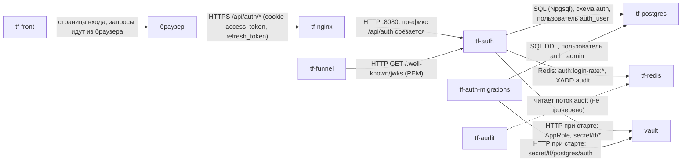

Вход пользователя:

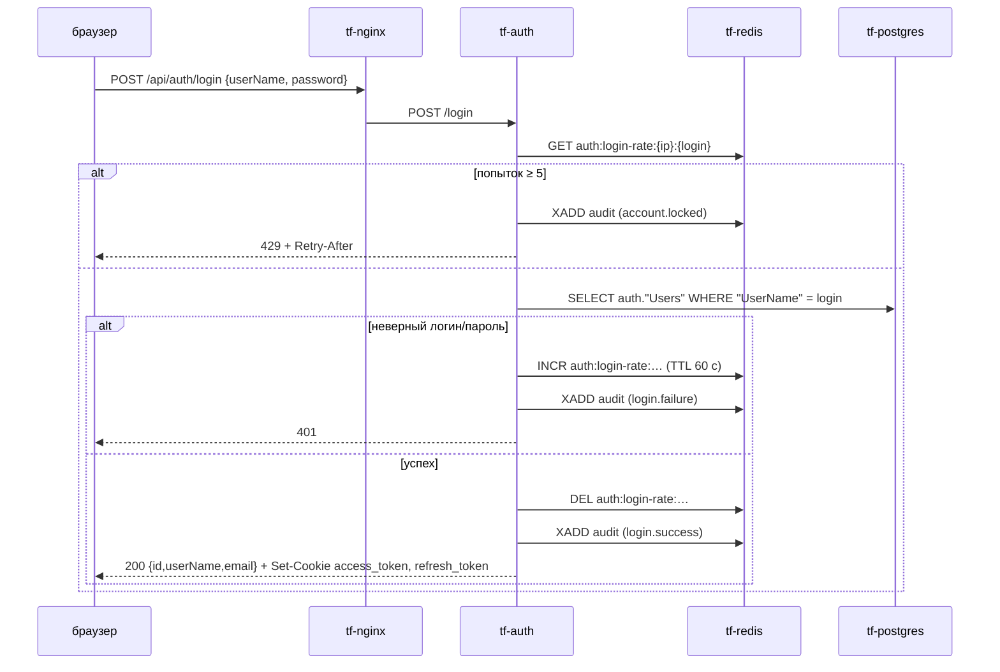

Проверка токена другим сервисом (так делает tf-funnel, по его ТЗ):

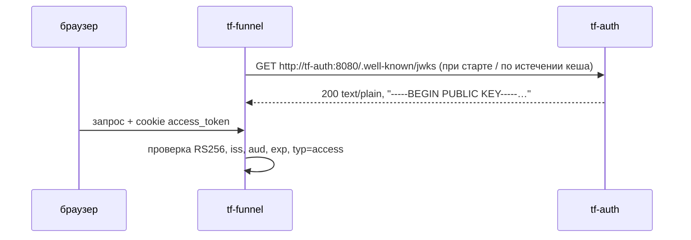

### 3. Интерфейсы

#### Входящие

У контроллеров нет общего префикса маршрута. Путь в сервисе = публичный путь без `/api/auth`:
nginx делает `rewrite ^/api/auth/(.*)$ /$1` (tf.infra `web-server/nginx/nginx.conf.template:90-98`).
Маршрут объявлен только в HTTPS-блоке (там же, `:58-60`).

| Протокол | Путь в сервисе → публичный путь | Кто вызывает | Авторизация | Что делает |
|---|---|---|---|---|
| HTTP POST | `/register` → `/api/auth/register` | браузер, **кто угодно** | нет (`WebAPI/Controllers/AuthController.cs:44-45`) | создаёт обычного пользователя и сразу выдаёт cookie |
| HTTP POST | `/login` → `/api/auth/login` | браузер | нет; ограничение попыток (`AuthController.cs:160`) | проверка пароля, выдача cookie |
| HTTP POST | `/refresh` → `/api/auth/refresh` | браузер | cookie `refresh_token` | перевыпуск обеих cookie (`AuthController.cs:263-293`) |
| HTTP GET | `/me` → `/api/auth/me` | браузер | cookie `access_token`, иначе неявный refresh по `refresh_token` | профиль текущего пользователя (`WebAPI/Controllers/UserController.cs:40-66`) |
| HTTP POST | `/create` → `/api/auth/create` | браузер (администратор) | cookie + `SuperUser = true` | создаёт пользователя (`UserController.cs:68-199`) |
| HTTP GET | `/users/{id:guid}` → `/api/auth/users/{id}` | браузер, любой вошедший | cookie | пользователь по id (`UserController.cs:204-245`) |
| HTTP GET | `/.well-known/jwks` → `/api/auth/.well-known/jwks` | tf-funnel (внутри сети: `http://tf-auth:8080/.well-known/jwks`) | нет | открытый ключ подписи в PEM (`WebAPI/Controllers/PublicKeyController.cs:17-23`) |
| HTTP GET | `/health` → `/api/auth/health` | healthcheck Docker | нет | всегда `Healthy`, зависимости не проверяет (`WebAPI/Program.cs:27,36`) |
| HTTP GET | `/api/health` → `/api/auth/api/health` | нет известных | нет | `{"status":"Healthy"}` (`WebAPI/Controllers/HealtController.cs:5-16`) |
| HTTP GET | `/swagger` | разработчик | нет | только при `ASPNETCORE_ENVIRONMENT=Development` (`Program.cs:39-43`); на dev и prod выключен |

Ручки выхода (logout) нет. Смены пароля, списка пользователей, удаления и блокировки тоже нет.

Авторизация читается **только из cookie** (`WebAPI/Services/AuthSession/AuthSessionService.cs:29,58`).
Заголовок `Authorization: Bearer` ручки tf-auth не принимают.

#### Исходящие

| Протокол | Куда | Зачем | Что при недоступности |
|---|---|---|---|
| HTTP | `vault` `http://vault:8200` (только при старте, `vault-entrypoint.sh`) | AppRole-вход, чтение `postgres/auth`, `redis`, `app/tf-auth` | ждёт до 10 мин (60 попыток × 10 с, `vault-entrypoint.sh:58-64`), затем выход с ошибкой и перезапуск по `restart: unless-stopped` |
| PostgreSQL | `tf-postgres:5432`, база `tf`, схема `auth` | пользователи | запрос падает с 500; сервис при этом стартует и `/health` отвечает `Healthy` |
| Redis | `tf-redis:6379` | ограничение попыток входа | `POST /login` → 500: проверка лимита стоит вне `try` (`AuthController.cs:160-164`); подключение ленивое (`AbortOnConnectFail = false`, `WebAPI/Services/RateLimit/AddRedisExtension.cs:25`) |
| Redis | поток `audit` | журнал действий | событие уходит в лог сервиса (`Audit stream unavailable …`), запрос не падает (`WebAPI/Services/Audit/AuditWriter.cs:59-67`) |

### 4. Контракты данных

Версионирования нет. Все JSON-ответы — camelCase (настройки ASP.NET Core по умолчанию).

#### Запросы

`POST /register`, `POST /create` (`WebAPI/Contracts/RegisterRequest.cs`):

```json
{ "userName": "ivanov", "email": "ivanov@example.com", "password": "<не короче 8 символов>" }
```

| Поле | Тип | Обяз. | Смысл / проверка |
|---|---|---|---|
| `userName` | string | да | логин, ≥ 3 символов; уникальность с учётом регистра |
| `email` | string | да | формат e-mail; уникальность с учётом регистра |
| `password` | string | да | ≥ 8 символов, других требований нет |

`POST /login` (`WebAPI/Contracts/LoginRequest.cs`): `{ "userName": "…", "password": "…" }`. `userName` должен быть не короче 3 символов,
перед поиском обрезаются пробелы (`AuthController.cs:148`), регистр учитывается.

Ошибки валидации отдаёт стандартный ответ `[ApiController]`: **400** `application/problem+json` с полем `errors`.

#### Ответы

Пользователь (`/register`, `/login`, `/refresh`, `/me`, `/create`, `/users/{id}`):

```json
{ "id": "3f0c…-uuid", "userName": "ivanov", "email": "ivanov@example.com" }
```

| Поле | Тип | Смысл |
|---|---|---|
| `id` | uuid | = `sub` в токенах |
| `userName` | string | логин |
| `email` | string | e-mail |

Признак `SuperUser` в ответах и токенах **не передаётся**.

Ошибка: `{ "message": "<текст по-русски>" }`. Для 429 добавляется поле `retryAfterSeconds` (int).

| Ручка | Коды |
|---|---|
| `/register` | 200 + cookie; 400; 409 логин или e-mail заняты; 500 |
| `/login` | 200 + cookie; 400; 401 неверный логин/пароль; 429 + заголовок `Retry-After`; 500 (в т. ч. Redis недоступен) |
| `/refresh` | 200 + новые cookie; 401 + cookie удаляются |
| `/me`, `/users/{id}` | 200 (может прийти с новыми cookie после неявного refresh); 401 + cookie удаляются; `/users/{id}`: 404 |
| `/create` | 200; 401 «Не авторизован.»; **401** «Недостаточно прав.» (не 403, `UserController.cs:106`); 409; 400 |
| `/.well-known/jwks` | 200 `text/plain; charset=utf-8` |

#### Токены (JWT)

Пример расшифрован из токена, выпущенного кодом сервиса. Access-токен:

```json
// header
{ "alg": "RS256", "kid": "main-key", "typ": "JWT" }
// payload
{
  "http://schemas.xmlsoap.org/ws/2005/05/identity/claims/nameidentifier": "<uuid пользователя>",
  "sub": "<uuid пользователя>",
  "typ": "access",
  "token_type": "access",
  "kind": "user",
  "jti": "<uuid>",
  "login": "ivanov",
  "exp": 1790630965,
  "iss": "auth-service",
  "aud": "api"
}
```

| Claim | Значение | Где задаётся |
|---|---|---|
| `alg` / `kid` | `RS256` / `main-key` (жёстко в коде) | `AuthService.Cryptography/Services/TokenService.cs:40-43,98-100` |
| `sub` | id пользователя (uuid) | `TokenService.cs:71-73` |
| `…/nameidentifier` | тот же id под длинным URI-именем, побочный эффект `ClaimTypes.NameIdentifier`. Потребителям читать `sub` | `TokenService.cs:67-69` |
| `typ` | `access` \| `refresh` (по контракту) | `TokenService.cs:15,75-77` |
| `token_type` | то же, прежнее имя, для совместимости | `TokenService.cs:16,79-81` |
| `kind` | всегда `user` | `TokenService.cs:17-19,83-85` |
| `login` | логин; есть, если у пользователя непустой `UserName` | `TokenService.cs:92-96` |
| `jti` | случайный uuid, нигде не хранится | `TokenService.cs:87-89` |
| `iss` | `Jwt:Issuer`, по умолчанию `auth-service` | `TokenService.cs:32-33` |
| `aud` | `Jwt:Audience`, по умолчанию `api` | `TokenService.cs:35-36` |
| `exp` | access: +10 мин; refresh: +24 ч | `TokenService.cs:47-56` |
| `iat`, `nbf` | **нет** | — |
| `scope` | **нет**, ни строкой, ни массивом | — |
| роли / `SuperUser` | **нет** | — |

Refresh-токен имеет тот же состав с `typ` = `token_type` = `refresh`. На сервере refresh нигде не хранится (нет ни таблицы, ни ключа Redis).
При каждом refresh перевыпускаются оба токена (`AuthSessionService.cs:110-114`). Старый refresh при этом не отзывается
и остаётся действительным до своего `exp`.

#### Cookie

| Cookie | HttpOnly | Secure | SameSite | Path | Domain | Max-Age |
|---|---|---|---|---|---|---|
| `access_token` | да | да | `Lax` | `/` | не задан (только текущий хост) | 10 мин |
| `refresh_token` | да | да | `Strict` | `/` | не задан | 24 ч |

Источник: `AuthService.Cryptography/Services/AuthCookies.cs:7-8,16-49`. На dev cookie ставятся для `greefob.ru`, на prod для `thinkfaster.ru`.

#### `GET /.well-known/jwks` — точный формат

Несмотря на имя пути, ответ — **не JSON JWKS**, а PEM открытого ключа (SubjectPublicKeyInfo),
`Content-Type: text/plain; charset=utf-8`, строки по 64 символа (`TokenService.cs:190-213`, `PublicKeyController.cs:22`):

```
-----BEGIN PUBLIC KEY-----
<base64 SPKI, по 64 символа в строке>
-----END PUBLIC KEY-----
```

`kid` в ответе нет, ключ всегда один. tf-funnel ждёт PEM (tf.infra `docs/funnel-tz/tf-funnel.md:98`, `kit.go:278`).
Форматы совпадают, переделывать tf-funnel под JSON не нужно.

### 5. Данные и состояние

**PostgreSQL**, база `tf`, схема `auth` (`AuthService.Context/AuthContext.cs:18`):

| Таблица | Назначение |
|---|---|
| `auth."Users"` | учётные записи: `Id` uuid PK, `UserName` text, `Email` text, `SuperUser` bool, `PasswordHash` text, `CreatedBy`/`UpdatedBy` uuid (всегда `00000000-…`), `CreatedAt`/`UpdatedAt` timestamptz (`AuthService.Context/Migrations/20260920070451_CreateUserTable.cs:17-35`) |
| `auth."__EFMigrationsHistory"` | история миграций EF Core (`WebAPI/Program.cs:70-72`) |

Уникальных индексов на `UserName` и `Email` **нет**: уникальность проверяется только в коде.

Хеш пароля — Argon2id, соль 16 байт, память 64 МБ, 3 итерации, параллелизм 4, хеш 32 байта. Формат строки `v1.<соль base64>.<хеш base64>`
(`AuthService.Cryptography/Services/Argon2PasswordHasher.cs:8-23`).

**Redis**:

| Ключ | Тип | Назначение |
|---|---|---|
| `auth:login-rate:{ip}:{логин в нижнем регистре}` | string (счётчик) | число неудачных входов; TTL 60 с ставится на первой неудаче (`WebAPI/Services/RateLimit/RedisRateLimitService.cs:7-8,95-103,134-142`) |
| `audit` | stream, поле `event` | журнал действий, `MAXLEN ~ 1 000 000` (`AuditWriter.cs:14-15,61-62`) |

`audit:requests` в коде не используется.

**Файлы**: закрытый ключ подписи `/run/secrets/jwt-private.pem` лежит в tmpfs (`deploy/docker-compose.yml:53,66-67`). Томов нет.

**Состояние.** Сервис stateless: всё состояние хранится в PostgreSQL и Redis. При перезапуске ничего не теряется, ключ заново читается из Vault.
Несколько экземпляров технически возможны, если у всех один ключ из Vault: лимит попыток общий в Redis. Мешает
фиксированный `container_name: tf-auth` (`deploy/docker-compose.yml:38`). Так не запускалось, **не проверено**.

### 6. Безопасность и политики

**Проверка вызывающего внутри tf-auth.** `access_token` из cookie проверяется так: RS256 тем же ключом, `iss`, `aud`, срок, `ClockSkew = 0`,
`typ`/`token_type` = `access` (`TokenService.cs:114-187`). Если access нет или он невалиден, сервис пробует `refresh_token`.
При этом он сверяет, что id в просроченном access совпадает с id в refresh (`AuthSessionService.cs:74-95`), и выдаёт новую пару.

**Права.** В системе одно право: `SuperUser` (`AuthContext.Models/Models/User.cs:18`). Оно нужно только для `POST /create`.
Других ролей нет. Другим сервисам права **не передаются**: их нет ни в токене, ни в ответах.
Назначить `SuperUser` через API нельзя, только SQL-запросом (раздел 9).

**Техучётки.** **Нет.** Ручки выпуска долгого токена нет, `kind` всегда `user`, `scope` в токене не бывает.
Метод `GenerateToken(subject, minutes, …)` умеет выпускать токен на любой срок (`AuthService.Cryptography/Interfaces/ITokenService.cs:9-13`),
но наружу не выведен.

**Аудит.** Каждое событие — JSON в snake_case (`AuditWriter.cs:41-57`):

```json
{
  "event_id": "<uuid>", "occurred_at": "2026-09-29T10:00:00+00:00", "service": "auth",
  "event_type": "login.success", "outcome": "success",
  "actor_kind": "user", "actor_id": "<uuid|null>", "actor_login": "ivanov",
  "request_id": "<X-Request-ID или TraceIdentifier>", "ip": "<первый адрес из X-Forwarded-For>",
  "object_type": "user", "object_id": "<= actor_id>", "area_id": null,
  "details": { "method": "password" }
}
```

| `event_type` | `outcome` | Когда | `details` | Код |
|---|---|---|---|---|
| `login.success` | success | успешный вход | `method: password` | `AuthController.cs:241-242` |
| `login.failure` | denied | неверный логин или пароль | `reason: unknown_login \| wrong_password` | `AuthController.cs:216-220` |
| `account.locked` | denied | превышен лимит попыток | `retry_after_seconds` | `AuthController.cs:174-175` |
| `token.refreshed` | success | явный `POST /refresh` (неявный refresh в `/me` **не пишется**) | — | `AuthController.cs:285` |
| `user.created` | success | `/register` или `/create` | `method: register \| create`; для create ещё `created_by`, `created_by_login` | `AuthController.cs:119-120`, `UserController.cs:175-181` |
| `access.denied` | denied | `/create` не от суперпользователя | `action: user.create`, `reason: not_superuser` | `UserController.cs:103-104` |

В `user.created` поля `actor_*` и `object_id` указывают на **созданного** пользователя, а создатель лежит в `details`.
В `login.failure` с неизвестным логином `actor_kind` = `user`, а `actor_login` — логин в том виде, в каком его ввели.

**Чувствительные данные.** Пароли и токены не логируются и в аудит не попадают (`AuthController.cs:215`).
В лог пишутся логин, e-mail, IP и id пользователя (например, `AuthController.cs:50-53,155-158`). Значения секретов не логирует ни сервис, ни `vault-entrypoint.sh`.

**Известные слабые места** (подробнее в разделе 11):
- `/register` открыт всем.
- IP для лимита попыток — адрес `tf-nginx`: `UseForwardedHeaders` не подключён, `Connection.RemoteIpAddress` (`AuthController.cs:150-153`).
- IP в аудите берётся из `X-Forwarded-For` клиента и может быть подделан. nginx дописывает к нему свой адрес (`$proxy_add_x_forwarded_for`), а не заменяет.

### 7. Конфигурация

| Переменная | По умолчанию | Обязательна | Секрет (путь Vault → ключ) | Смысл |
|---|---|---|---|---|
| `ConnectionStrings__DefaultConnection` | собирается в compose из `POSTGRES_*`, пользователь `auth_user` (`deploy/docker-compose.yml:75`) | да (`Program.cs:69`) | `postgres/auth` → `TF_PG_AUTH_USER_PASSWORD` (подставляется через `VAULT_EXPAND`) | строка подключения приложения |
| `Redis__ConnectionString` | `${REDIS_HOST}:${REDIS_PORT},password=…` (`deploy/docker-compose.yml:76`) | да, иначе падает при старте (`AddRedisExtension.cs:12-16`) | `redis` → `TF_REDIS_PASSWORD` | Redis |
| `Jwt__PrivateKeyPath` | `/run/secrets/jwt-private.pem` (`deploy/docker-compose.yml:67`) | да (`AuthService.Cryptography/Services/RsaKeyProvider.cs:12-14`) | файл из `app/tf-auth` → `TF_AUTH_JWT_PRIVATE_KEY_B64` (`VAULT_FILES`, base64 PEM) | закрытый ключ RS256. Если файла нет, сервис **сам генерирует** новый ключ (`RsaKeyProvider.cs:50-70`) |
| `Jwt__Issuer` | `auth-service` | нет | — | `iss` |
| `Jwt__Audience` | `api` | нет | — | `aud` |
| `ASPNETCORE_ENVIRONMENT` | `Production` (`AuthService/Dockerfile:40`) | нет | — | `Development` включает Swagger |
| `ASPNETCORE_HTTP_PORTS` | `8080` | нет | — | порт Kestrel |
| `POSTGRES_HOST` / `POSTGRES_PORT` / `POSTGRES_DB` | `tf-postgres` / `5432` / `tf` | нет | — | подстановка в compose из `deploy/.env` |
| `REDIS_HOST` / `REDIS_PORT` | `tf-redis` / `6379` | нет | — | то же |
| `VAULT_ADDR` | `http://vault:8200` (`deploy/docker-compose.yml:11`) | да на стендах | — | адрес Vault |
| `VAULT_ROLE_ID`, `VAULT_SECRET_ID` | — | да на стендах; без `VAULT_ROLE_ID` Vault не используется (`vault-entrypoint.sh:37-39`) | GitHub Environment `dev` / `prod` | AppRole сервиса |
| `VAULT_SECRET_PATHS` | `postgres/auth redis app/tf-auth` (`deploy/docker-compose.yml:60`) | да на стендах | — | какие пути читать |
| `VAULT_EXPAND` | `ConnectionStrings__DefaultConnection Redis__ConnectionString` (`:63`) | нет | — | куда подставить `${…}` |
| `VAULT_FILES` | `TF_AUTH_JWT_PRIVATE_KEY_B64:/run/secrets/jwt-private.pem` (`:66`) | нет | — | секреты-файлы |

Контейнер миграций `tf-auth-migrations` получает только `postgres/auth` и строку подключения под `auth_admin`
с `TF_PG_AUTH_ADMIN_PASSWORD` (`deploy/docker-compose.yml:29-33`).

`deploy/.env` на сервере содержит только настройки без секретов. Если его нет, он создаётся из `deploy/.env.example`
(`.github/workflows/deploy-dev.yml:79-82`, `.github/workflows/deploy-prod.yml:87`).

**Как сервис получает секреты.** Через `vault-entrypoint.sh` (ENTRYPOINT, `AuthService/Dockerfile:46`). Скрипт входит в Vault по AppRole
(политика `tf-svc-tf-auth`, tf.infra `hashicorp/services.conf:15`) и читает `secret/tf/postgres/auth`, `secret/tf/redis`, `secret/tf/app/tf-auth`.
Он подставляет пароли в строки подключения, пишет ключ файлом с правами 600, отзывает свой токен и через `exec` запускает `dotnet WebAPI.dll`.
Код приложения о Vault не знает.

### 8. Сборка и запуск

| | |
|---|---|
| Dockerfile приложения | `AuthService/Dockerfile`, контекст сборки — корень репозитория. Build на `dotnet/sdk:8.0`, runtime `dotnet/aspnet:8.0` + `curl`, `jq` |
| Dockerfile миграций | `migration/Dockerfile.migrations`: `dotnet/sdk:8.0` + `dotnet-ef 8.0.25`. При старте выполняет `dotnet ef database update` (проект собирается в момент запуска) |
| Публикация образа | нигде не публикуется, собирается на сервере (`docker compose build`) |
| Выкатка dev | `.github/workflows/deploy-dev.yml`: push в любую ветку, кроме `dev/prod/main/master`, сливает её в `dev` и по SSH выполняет на сервере `git reset --hard origin/dev`, затем `docker-compose down` → `build --no-cache` → `up -d`. Сервис недоступен всё время сборки |
| Выкатка prod | `.github/workflows/deploy-prod.yml`: push в `prod` или Run workflow. `git archive` → scp → `/srv/thinkfaster/services/think-auth` (прошлая версия переносится в `think-auth.old`) → `docker compose build` → `up -d` |
| Контейнеры | `tf-auth` (`restart: unless-stopped`), `tf-auth-migrations` (`restart: "no"`), compose-проект `think-auth` |
| Сети | `think-fast-net`, `postgree_app-network` (обе external, `deploy/docker-compose.yml:48-50,88-92`) |
| Порт | 8080 внутри сети, наружу не публикуется, доступ только через `tf-nginx` |
| Тома | нет; tmpfs `/run/secrets` |
| Лимиты памяти | не заданы |
| Healthcheck | `curl -f http://localhost:8080/health`, каждые 10 с, `start_period` 60 с (`deploy/docker-compose.yml:78-84`) |

**Порядок запуска.**
1. Распечатанный `vault`.
2. `tf-postgres`. Нужен миграциям; если он недоступен, миграции падают и `tf-auth` не стартует.
3. `tf-auth-migrations` завершается с кодом 0 (`depends_on: service_completed_successfully`, `deploy/docker-compose.yml:44-46`).
4. `tf-auth`.

`tf-redis` для старта не нужен, но без него не работает вход (500).
После `docker restart tf-auth` и перезагрузки сервера миграции **не** перезапускаются, контейнер снова читает секреты из Vault.

**Ручная выкатка на prod.** На prod `docker` — обёртка `sudo -n /usr/local/bin/tf-docker`, а `sudo` сбрасывает окружение (`env_reset`).
Поэтому экспортированные `VAULT_ROLE_ID`/`VAULT_SECRET_ID` до compose не доходят (раздел 10). Пока в sudoers нет
`env_keep` для этих переменных, доступ передаётся временным файлом:

```bash
cd /srv/thinkfaster/services/think-auth/deploy
[ -f .env ] || cp .env.example .env
read -rsp 'VAULT_ROLE_ID: ' R; echo; read -rsp 'VAULT_SECRET_ID: ' S; echo
(umask 077; printf 'VAULT_ROLE_ID=%s\nVAULT_SECRET_ID=%s\n' "$R" "$S" > .vault.env); unset R S
docker compose --env-file .env --env-file .vault.env build
docker compose --env-file .env --env-file .vault.env up tf-auth-migrations
docker compose --env-file .env --env-file .vault.env up -d
rm -f .vault.env; history -c
```

**Откат на prod** (выполнить при созданном `.vault.env`, как выше):

```bash
cd /srv/thinkfaster/services && mv think-auth think-auth.bad && mv think-auth.old think-auth
cd think-auth/deploy && docker compose --env-file .env --env-file .vault.env up -d --build
```

Откат на dev: `git revert` в ветке и push. Workflow сольёт её в `dev` и выкатит.

### 9. Эксплуатация

**Сервис здоров, если:**
- `docker ps` показывает `tf-auth … (healthy)`;
- `docker exec tf-auth curl -fsS http://localhost:8080/health` возвращает `Healthy`. Это проверка только процесса, БД и Redis она не проверяет;
- в логе старта есть строки `[vault-entrypoint] secret/tf/postgres/auth: загружено` (и так же для `redis`, `app/tf-auth`), `файл /run/secrets/jwt-private.pem: записан`,
  `секретов загружено: N, запуск приложения`, `Now listening on: http://[::]:8080`.

Метрик нет.

**Что смотреть в логах** (`docker logs tf-auth`):
- `Invalid login credentials …`, `Failed login attempt … Attempts: n/5` — подбор пароля;
- `Login rate limit exceeded …` — сработала блокировка;
- `Refresh отклонён: …` — проблемы с сессиями;
- `Audit stream unavailable` — Redis недоступен для аудита;
- `RedisConnectionException` — Redis недоступен для входа.

**Типовые операции:**

| Операция | Команда |
|---|---|
| Перезапуск (секреты читаются заново) | `docker restart tf-auth` |
| Повторить миграции | `docker start -a tf-auth-migrations`, затем проверить `docker inspect tf-auth-migrations --format '{{.State.ExitCode}}'`; должно быть `0` |
| Новая миграция (разработчику) | `dotnet ef migrations add <Имя> --project AuthService/AuthService.Context`. Строка подключения берётся из `ConnectionStrings__DefaultConnection` или заглушки (`AuthService.Context/DesignTimeAuthContextFactory.cs`) |
| Первый суперпользователь | `POST /register` изнутри контейнера, затем `docker exec -it tf-postgres psql -U <админ БД> -d tf -c "UPDATE auth.\"Users\" SET \"SuperUser\" = true WHERE \"UserName\" = '<логин>';"` |
| Снять блокировку входа | `docker exec -it tf-redis redis-cli --askpass --scan --pattern 'auth:login-rate:*'`, затем `DEL` нужного ключа. Ключ и так истекает через 60 с |
| Ротация ключа подписи | см. ниже |

**Ротация ключа подписи (`TF_AUTH_JWT_PRIVATE_KEY_B64`).**
Последствия: ключ один, `kid` фиксирован (`main-key`), двух ключей одновременно сервис держать не умеет. Поэтому после ротации **все** выданные
access- и refresh-токены сразу становятся недействительными: все пользователи выходят из системы и должны войти заново.
Сервисы, закешировавшие старый PEM (tf-funnel), отклоняют новые токены, пока не перечитают ключ.

Порядок:
1. Записать новый ключ в Vault. Для этого нужен админский токен; ключ генерируется в памяти и в историю shell не попадает:

   ```bash
   openssl genrsa 2048 2>/dev/null | base64 -w0 | docker exec -i -e VAULT_TOKEN="$VAULT_TOKEN" vault vault kv patch secret/tf/app/tf-auth TF_AUTH_JWT_PRIVATE_KEY_B64=-
   ```

   `kv patch`, а не `kv put`, чтобы не стереть другие ключи этого пути. Если путь создаётся впервые, нужен `kv put`.
2. `docker restart tf-auth`.
3. Перезапустить потребителей ключа (`tf-funnel`) или дождаться истечения их кеша.
4. Ключи dev и prod разные; копировать ключ между стендами нельзя.

**Очистка данных.** Штатных средств нет. Пользователей можно удалить только SQL-запросом; refresh-токены удалённого пользователя
перестают работать (`user_not_found`, `AuthSessionService.cs:101-108`).

### 10. Ошибки и проблемы

| Симптом | Причина | Как исправить |
|---|---|---|
| Контейнер перезапускается по кругу, в логе `ERROR: нет доступа к secret/tf/app/tf-auth (нет такого пути или его нет в политике сервиса)` | в Vault стенда нет ключа JWT. Так было после пересоздания инфраструктуры | завести `TF_AUTH_JWT_PRIVATE_KEY_B64` (раздел 9, ротация, шаг 1, через `kv put`), затем `docker restart tf-auth` |
| `Vault недоступен, запечатан или неверный VAULT_ROLE_ID/VAULT_SECRET_ID — попытка n/60` | Vault запечатан после перезагрузки или неверные AppRole-данные | распечатать Vault (`docker exec -it vault vault operator unseal`, 2 ключа); проверить секреты GitHub Environment |
| Выкатка на prod: `tf-docker: не удалось прочитать имя compose-проекта` | обёртка выполняет `docker compose config`; `sudo` отрезал `VAULT_*`, и `${VAULT_ROLE_ID:?…}` не разбирается | администратору: `Defaults!/usr/local/bin/tf-docker env_keep += "VAULT_ROLE_ID VAULT_SECRET_ID"` в sudoers; до этого — ручная выкатка с `--env-file` (раздел 8) |
| `required variable VAULT_ROLE_ID is missing a value` при любой команде `docker compose` | compose требует доступ к Vault даже для `logs`/`ps` | экспортировать `VAULT_*` или передать `--env-file`; логи смотреть через `docker logs tf-auth` |
| Нет кнопки Run workflow у «Deploy to prod Server» | `deploy-prod.yml` нет в ветке по умолчанию `main` | влить `prod` в `main`; до этого — Re-run прошлого запуска |
| `container name "/tf-auth" is already in use` | сменилось имя compose-проекта (`deploy` → `think-auth`) | один раз `docker rm -f tf-auth tf-auth-migrations`, затем выкатка |
| `network postgree_app-network declared as external, but could not be found` | сети старой инфраструктуры нет | убрать сеть из compose, если `tf-postgres` есть в `think-fast-net` (на prod **не проверено**) |
| `tf-auth-migrations` с кодом ≠ 0: `permission denied` / `must be owner of table` | таблицы `auth` созданы не `auth_admin` | администратору: передать владение схемой `auth` пользователю `auth_admin` |
| `POST /login` → 500, в логе `RedisConnectionException … SocketClosed` / `NOAUTH` | Redis недоступен или подключение без пароля | проверить `tf-redis` и `TF_REDIS_PASSWORD` в Vault |
| `POST /login` → 429 для всех пользователей с одним логином | после 5 неудач за минуту заблокирован логин; IP для всех один — адрес nginx | подождать `Retry-After` или удалить ключ `auth:login-rate:*` |
| `POST /create` → 401 «Недостаточно прав.» | у вызывающего `SuperUser = false`; суперпользователя в новой БД нет | назначить SQL-запросом (раздел 9) |
| `GET /me` → 401, cookie пропали | нет или просрочен `refresh_token`, либо ключ подписи сменился | войти заново |
| Контейнер `unhealthy` (исторически) | healthcheck ходил на `tf-auth:8081`, а сервис слушает 8080; в образе не было `curl` | исправлено: `localhost:${ASPNETCORE_HTTP_PORTS}` + `curl` в образе |

### 11. Ограничения и известные недоработки

- **Нет выхода.** Cookie HttpOnly, фронт удалить их не может; сессия живёт до 24 ч. Refresh-токены не хранятся и не отзываются: утёкший refresh действует до `exp`.
- **`/register` открыт всем**, кто может достучаться до `/api/auth/register`.
- **Лимит попыток привязан к адресу nginx**, а не клиента. Это фактически блокировка по логину: любой может заблокировать чужой логин 5 неверными попытками в минуту.
- **IP в аудите можно подделать** заголовком `X-Forwarded-For`.
- **Нет ролей, scope и техучёток.** Сервисы не узнают права пользователя. Шине нечем получить токен; tf-funnel обходит это списком `TF_FUNNEL_SERVICE_SUBS`
  (tf.infra `secrets.conf:59-61`).
- **Один ключ подписи, без ротации с перекрытием** (раздел 9).
- **`/.well-known/jwks` отдаёт PEM**, а не JWKS. Стандартные JWKS-клиенты работать с ним не будут.
- **Уникальность логина и e-mail только в коде**, без индексов. При одновременных регистрациях возможны дубли, после чего `/login` для такого логина падает с 500 (`SingleOrDefaultAsync`, `AuthController.cs:193-197`).
  Регистр учитывается: `Admin` и `admin` — разные пользователи, а ключ лимита у них общий.
- **`/create` на отказ в правах отвечает 401 вместо 403.**
- **Любой вошедший видит логин и e-mail любого пользователя** по id (`/users/{id}`).
- **Мёртвый код.** `RefreshTokenFilter` зарегистрирован глобально (`Program.cs:60,78`), но ждёт `HttpContext.Items["access_expired"]`, которое нигде не ставится.
  К тому же он и `TokenReader` работают с cookie `accessToken`/`refreshToken`, а не `access_token`/`refresh_token`.
- **Ключ читается с диска на каждый запрос.** `TokenService` — Scoped и в конструкторе вызывает `LoadOrCreate()` (`AuthService.Cryptography/Extension.cs:18`, `TokenService.cs:38`).
- **Память.** Argon2 берёт 64 МБ на каждую проверку пароля, лимита памяти у контейнера нет: всплеск входов может съесть память сервера.
- **`/health` не проверяет** PostgreSQL и Redis.
- **Выкатка на dev с простоем** (`down` → `build --no-cache` → `up`). Миграции собираются из исходников при каждом запуске контейнера миграций.
- **`CreatedBy`/`UpdatedBy`** всегда нулевой uuid.

### 12. Возможности доработки

| Доработка | Приоритет | Объём |
|---|---|---|
| `POST /logout`: удалить cookie; по желанию — отзыв refresh через Redis (`jti` в чёрном списке до `exp`) | высокий | 0,5 дня (без отзыва — 1 ч) |
| Закрыть или удалить `/register` (оставить `/create`) | высокий | 1 ч |
| `UseForwardedHeaders` с доверием только `tf-nginx`: правильный IP для лимита и аудита; в nginx `X-Forwarded-For $remote_addr` | высокий | 2–3 ч + согласование с инфраструктурой |
| Уникальные индексы `UserName`, `Email` (без учёта регистра) + миграция | высокий | 2–4 ч |
| Техучётки: `kind=service`, `scope` строкой через пробел (`telemetry.push`), выпуск долгого токена суперпользователем | высокий (нужен шине и tf-funnel) | 2–3 дня |
| Роли/права в токене или ручка прав по контракту прав | средний | 2–5 дней, зависит от контракта |
| Настоящий JWKS (`{"keys":[…]}`) по `/.well-known/jwks` и PEM отдельным путём, несколько ключей по `kid` для ротации с перекрытием | средний | 1–2 дня (+ tf-funnel) |
| `/create` → 403; `/users/{id}` — только себе или суперпользователю | средний | 2 ч |
| Bootstrap первого суперпользователя (`dotnet WebAPI.dll create-superuser`) | средний | 0,5 дня |
| Health-проверки PostgreSQL и Redis | средний | 2 ч |
| Кешировать ключ в `RsaKeyProvider` (Singleton), убрать `RefreshTokenFilter`/`TokenReader` | низкий | 2 ч |
| Лимит памяти контейнера, ограничение параллельных хешей Argon2 | низкий | 2–4 ч |
| Сборка образа в CI и публикация в реестр; выкатка без простоя | низкий | 1–2 дня |
| `iat` в токенах, смена пароля, список и блокировка пользователей | низкий | 1–3 дня |

### 13. Как интегрироваться и что менять

**Проверка пользователя в своём сервисе:**
1. Получить открытый ключ: `GET http://tf-auth:8080/.well-known/jwks` из сети `think-fast-net`. Ответ — PEM (раздел 4). Кешировать его, при ошибке проверки подписи один раз перечитать.
2. Брать токен из cookie `access_token` (браузер присылает её на все пути домена, `Path=/`).
3. Проверять `alg=RS256`, `iss=auth-service`, `aud=api`, `exp` (разрешить небольшой сдвиг часов: tf-auth выпускает без `nbf`/`iat`),
   `typ` (или `token_type`) = `access`. Id пользователя — `sub`, логин — `login`.
4. Refresh-токены не принимать. Обновлением сессии занимается браузер через `POST /api/auth/refresh` или `GET /api/auth/me`.

**Фронтенд:** все запросы на тот же домен с `credentials: 'include'`/same-origin. На 401 от любого сервиса вызвать `POST /api/auth/refresh`;
если и он ответил 401 — показать страницу входа.

**Служебный доступ (шина, сервис-сервис):** сейчас нет (раздел 6). Временная схема tf-funnel — `TF_FUNNEL_SERVICE_SUBS` в Vault.

**Что согласовать с инфраструктурой при изменениях:**
- новые пути Vault или ключи в `app/tf-auth` — администратор заводит их на обоих стендах (tf.infra `secrets.conf`, `hashicorp/services.conf`);
- изменения схемы `auth` — миграции выполняются под `auth_admin`, права `auth_user` без DDL;
- новые ключи или потоки Redis (`auth:*`, `audit`) — формат `audit` согласуется с tf-audit;
- новые публичные пути — всё под `/api/auth/` проксируется автоматически, отдельные `location` не нужны; другой префикс — правка `nginx.conf.template`;
- смена `iss`/`aud`, формата `/.well-known/jwks`, имени cookie или ключа подписи — затрагивает tf-funnel и всех, кто проверяет токены;
- сети `think-fast-net` / `postgree_app-network` и имя compose-проекта `think-auth` (обёртка `tf-docker` на prod).

### 14. Открытые вопросы

1. **Роли и права.** Код ссылается на контракт `docs/common/права-и-аудит.md` (`TokenService.cs:13`, `AuditWriter.cs:7`), но в репозитории think-auth и в tf.infra его нет.
   Какие роли и `scope` должны быть в токене и как их передавать?
2. **Техучётка шины.** Кто и как её создаёт, какой срок у токена, нужен ли `scope: "telemetry.push"`? До решения tf-funnel работает через `TF_FUNNEL_SERVICE_SUBS`.
3. **`/register`.** Должна ли регистрация быть открытой на prod?
4. **Потребитель `audit`.** Читает ли tf-audit поток `audit` из того же Redis, и устраивает ли его, что в `user.created` актор — созданный пользователь? **Не проверено.**
5. **Кто ещё проверяет токены**, кроме tf-funnel (tf-bff?), и как именно. **Не проверено.**
6. **Сеть `postgree_app-network` на prod** — существует ли после пересоздания инфраструктуры; нужна ли вообще, если `tf-postgres` есть в `think-fast-net`.
7. **`env_keep` для `tf-docker`** на prod — без него не работает выкатка из GitHub (раздел 10). Нужно решение администратора.
8. **Срок и число использований `secret_id`** AppRole на prod: при ограниченном TTL контейнер не поднимется после перезагрузки, когда `secret_id` истечёт. **Не знаю.**
9. **Сроки жизни токенов** (10 мин / 24 ч) и `SameSite=Strict` у refresh — утверждены ли продуктово? Если фронт окажется на другом site, Strict придётся ослабить (`AuthCookies.cs:41-44`).


## tf-bff

> Источник: репозиторий **think-bff**, `dev@3dc8875`. Раздел написан агентом репозитория.


### 1. Назначение

`tf-bff` — Backend For Frontend для SPA `think-front`. Единственная точка входа фронтенда в предметную
область: RBAC (пользователи/группы/права), топология объектов и датчиков, прогнозы и происшествия модели,
заявки и работы диспетчеров/инженеров, график/присутствие/инженерные допуски, админ-настройки модели
(версии, коэффициенты, дообучение), рассылка уведомлений (email/Telegram) и приём готовых прогнозов/фактов
от `tf-model` через Kafka. Сам ничего не вычисляет и не хранит сырые показания датчиков — это зона
`tf-funnel`/`tf-model`. Наружу виден только через `tf-nginx` (`/api/bff/...` → внутрь как `/...`,
docs/DECISIONS.md:134-141 (`../DECISIONS.md`)).

### 2. Схема взаимодействия

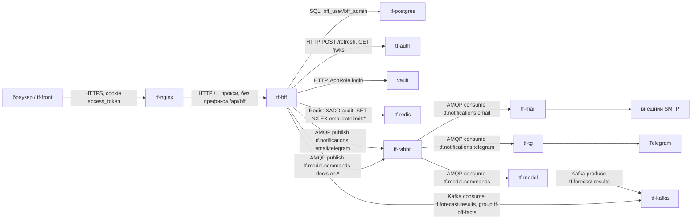

Два ключевых сценария:

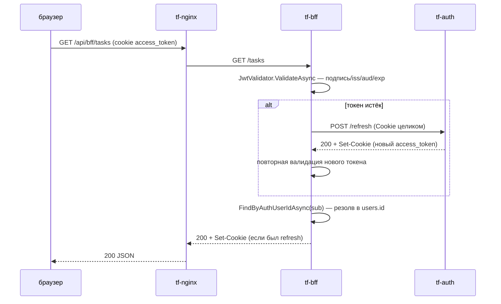

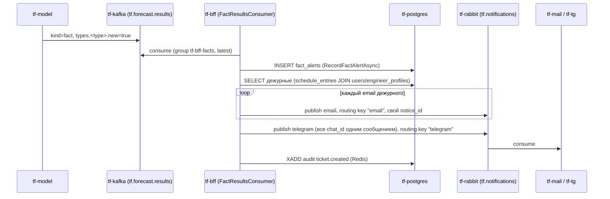

### 3. Интерфейсы

#### Входящие (через nginx, `/api/bff/...`)

Права указаны как `ресурс:флаг`; для GET `/permissions/me`, `/permissions/check`, `/resources` и
`GET /readings/scope` отдельного грант-права нет — доступен любому аутентифицированному, логика внутри
сервиса (см. §6).

| Метод | Путь | Право | Что делает |
|---|---|---|---|
| GET | `/health/live` | — (не аутентифицируется, `AUTH_SKIP_PATHS`) | процесс жив |
| GET | `/health/ready` | — | БД + JWKS доступны |
| GET | `/permissions/me` | любой вошедший | эффективные права текущего пользователя |
| GET | `/permissions/check?resource=&permission=` | любой вошедший | одна проверка права |
| GET | `/permissions/grants` | `permissions:read` | список грантов |
| POST | `/permissions/grants` | `permissions:manage` | выдать/обновить грант |
| DELETE | `/permissions/grants/{id}` | `permissions:manage` | отозвать грант |
| GET | `/resources` | любой вошедший | справочник кодов ресурсов |
| POST | `/resources` | `permissions:manage` | зарегистрировать новый код ресурса |
| GET | `/users` | `users:read` | список пользователей |
| GET | `/users/{id}` | `users:read` | профиль + группы 1-го уровня |
| POST | `/users` | `users:create` | создать профиль |
| PUT | `/users/{id}` | `users:update` | изменить профиль |
| DELETE | `/users/{id}?soft=` | `users:delete` | деактивировать/удалить |
| POST | `/users/{id}/groups` | `users:update` | добавить в группы |
| DELETE | `/users/{id}/groups/{groupId}` | `users:update` | исключить из группы |
| GET | `/users/{id}/schedule` | `schedule:read` | график пользователя |
| POST | `/users/{id}/schedule` | `schedule:update` | строка графика |
| DELETE | `/users/{id}/schedule/{entryId}` | `schedule:update` | удалить строку |
| GET | `/users/{id}/assigned-objects` | `assigned_objects:read` | закреплённые объекты |
| POST | `/users/{id}/assigned-objects` | `assigned_objects:update` | закрепить (upsert) |
| DELETE | `/users/{id}/assigned-objects/{objectId}` | `assigned_objects:update` | открепить |
| GET | `/users/{id}/engineer-profile` | `engineers:read` | профиль инженера |
| PUT | `/users/{id}/engineer-profile` | `engineers:update` | upsert профиля |
| GET | `/users/{id}/permits` | `engineers:read` | допуски, включая просроченные |
| POST | `/users/{id}/permits` | `engineers:update` | добавить допуск |
| DELETE | `/users/{id}/permits/{permitId}` | `engineers:update` | удалить допуск |
| GET | `/groups` | `groups:read` | список групп |
| GET | `/groups/{id}` | `groups:read` | группа |
| POST | `/groups` | `groups:create` | создать |
| PUT | `/groups/{id}` | `groups:update` | изменить |
| DELETE | `/groups/{id}` | `groups:delete` | удалить |
| POST | `/groups/{id}/members` | `groups:update` | добавить участника |
| POST | `/groups/{id}/members/batch` | `groups:update` | добавить пачкой |
| DELETE | `/groups/{id}/members/{memberType}/{memberId}` | `groups:update` | исключить участника |
| GET | `/presence?userIds=` | `presence:read` | кто онлайн (пишется автоматически на каждый запрос) |
| GET | `/objects` | `objects:read` | список объектов |
| GET | `/objects/{id}` | `objects:read` | объект |
| POST | `/objects` | `objects:create` | создать |
| PUT | `/objects/{id}` | `objects:update` | изменить |
| DELETE | `/objects/{id}` | `objects:delete` | удалить |
| GET/POST/PUT/DELETE | `/objects/{id}/pickets[/{picketId}]` | `objects:read`/`objects:update` | пикеты объекта |
| GET/POST | `/objects/{id}/layers` | `objects:read`/`objects:update` | слои карты |
| GET | `/sensors` | `sensors:read` | список датчиков |
| GET | `/sensors/types` | `sensors:read` | справочник подсистем/типов для формы |
| GET | `/sensors/{id}` | `sensors:read` | датчик |
| POST | `/sensors` | `sensors:create` | создать |
| PUT | `/sensors/{id}` | `sensors:update` | изменить |
| DELETE | `/sensors/{id}` | `sensors:delete` | удалить |
| GET/POST/DELETE | `/sensors/{id}/links[/{toSensorId}/{kind}]` | `sensors:read`/`sensors:update` | связи датчиков |
| GET | `/readings/scope?objectId=` | любой вошедший, решает сервис | кому что видно в окне «Логи» — см. §4 |
| GET | `/predictions` | `predictions:read` | список прогнозов |
| GET | `/predictions/{id}` | `predictions:read` | прогноз с факторами/свидетелями |
| POST | `/predictions` | `predictions:create` | создать вручную (нормально — Kafka-консьюмер, §4) |
| POST | `/predictions/{id}/decisions` | `predictions:update` | решение диспетчера — take/reject/mute/reopen |
| GET | `/fact-alerts` | `predictions:read` | список событий «по факту» |
| POST | `/fact-alerts` | `predictions:create` | создать вручную (нормально — Kafka-консьюмер) |
| GET | `/tasks?dispatcherId=&status=&assignedToMe=&page=&pageSize=` | `tasks:read` | список заявок |
| GET | `/tasks/assignees?role=engineers\|dispatchers` | `tasks:read` | кандидаты на назначение/возврат |
| GET | `/tasks/{id}` | `tasks:read` | заявка целиком |
| POST | `/tasks` | `tasks:create` | создать |
| PUT | `/tasks/{id}` | `tasks:update` | изменить |
| POST | `/tasks/{id}/take` | `tasks:update` | взять в работу (гонка → `409 task_already_taken`) |
| POST | `/tasks/{id}/predictions` | `tasks:update` | прикрепить прогноз-основание |
| DELETE | `/tasks/{id}/predictions/{predictionId}` | `tasks:update` | открепить |
| POST | `/tasks/{id}/assignments` | `tasks:update` | назначить инженера |
| POST | `/tasks/{id}/reports` | `tasks:update` | сдать отчёт |
| POST | `/tasks/{id}/returns` | `tasks:update` | вернуть заявку |
| POST | `/tasks/{id}/start` | `tasks:update` | `assigned` → `engineerWorking` |
| POST | `/tasks/{id}/close` | `tasks:update` | `completed` → `closed` |
| POST | `/tasks/{id}/cancel` | `tasks:update` | отмена из любого активного статуса |
| GET | `/incidents` | `incidents:read` | список происшествий |
| GET | `/incidents/{id}` | `incidents:read` | происшествие |
| POST | `/incidents` | `incidents:create` | создать |
| POST | `/incidents/{id}/confirm` | `incidents:update` | подтвердить |
| GET | `/brigades` | `engineers:read` | список бригад |
| POST | `/brigades` | `engineers:create` | создать бригаду |
| GET/POST | `/model-versions[/{id}/activate]` | `model_settings:read`/`manage` | версии модели |
| GET/POST | `/coefficients` | `model_settings:read`/`manage` | коэффициенты (версионируются, не редактируются) |
| GET/POST | `/retrain-jobs` | `model_settings:read`/`manage` | заявки на дообучение |
| GET/POST/DELETE | `/ignored-ranges[/{id}]` | `model_settings:read`/`manage` | игнорируемые диапазоны |
| GET/POST/PUT/DELETE | `/work-schedule[/{workId}]` | `model_settings:read`/`manage` | плановые работы |
| POST | `/notifications/email` | `notifications:create` | рассылка писем, см. §4 |

Источник — атрибуты `[HttpGet]`/`[HttpPost]`/`[HttpPut]`/`[HttpDelete]` и `[RequirePermission]` во всех
файлах `src/BFF.WebApi/Controllers/*.cs`.

#### Исходящие

| Протокол | Куда | Зачем | Что при недоступности |
|---|---|---|---|
| SQL (Npgsql) | `tf-postgres`, БД `tf`, схема `bff` | всё хранение состояния BFF | сервис не отвечает (`/health/ready` → 503 по `database`) |
| HTTP | `tf-auth`, `AUTH_REFRESH_PATH` | обновить access-token по истечении | `401 token_refresh_failed` пользователю |
| HTTP | `tf-auth`, `AUTH_JWKS_URL` | публичный ключ для проверки подписи, кэш `AUTH_JWKS_CACHE_MINUTES` | `503 auth_service_unavailable`, `/health/ready` → `jwks: false` |
| HTTP | Vault, `VAULT_ADDR` | AppRole-логин, чтение секретов при старте контейнера | контейнер не стартует (см. §7) |
| Redis (StackExchange.Redis) | `tf-redis` | поток `audit` (журнал действий), ключи `email:ratelimit:*` (антиспам) | аудит уходит в лог сервиса вместо Redis; лимитер пропускает (fail-open) — `src/BFF.WebApi/Audit/AuditWriter.cs:70`, `src/BFF.WebApi/Notifications/EmailRateLimiter.cs` |
| AMQP (RabbitMQ.Client 7.2.2) | `tf-rabbit`, exchange `tf.notifications` | публикация email/telegram-уведомлений | `PublishException` → вызывающий код помечает получателя `failed`, автоповтора нет |
| AMQP | `tf-rabbit`, exchange `tf.model.commands` | решения диспетчера обратно в модель | ошибка только в лог — решение уже в БД, диспетчеру не мешает |
| Kafka (Confluent.Kafka) | `tf-kafka`, топик `tf.forecast.results`, группа `tf-bff-facts` | приём прогнозов/фактов от модели | без `TF_KAFKA_BFF_PASSWORD` консьюмер не стартует, остальной BFF работает; сбой обработки — 4 попытки, потом пропуск с логом |

### 4. Контракты данных

#### Ошибки (все ручки)

```json
{ "code": "not_found", "message": "...", "details": null }
```

`code`/`message` всегда; `details` — объект с массивами сообщений по полю, только у `validation_failed`
(`400`). Источник — `src/BFF.WebApi/Middleware/ExceptionHandlingMiddleware.cs`.

| HTTP | code | Когда |
|---|---|---|
| 400 | `validation_failed` | не прошла FluentValidation |
| 400 | `bad_request` | `ArgumentException` в контроллере/сервисе |
| 401 | `unauthenticated` / `invalid_token` / `token_refresh_failed` | нет токена / подпись-формат не те / refresh не удался |
| 403 | `user_not_provisioned` / `user_inactive` | claim валиден, но профиля в BFF нет / деактивирован |
| 403 | (через `[RequirePermission]`) | нет права на ресурс |
| 404 | `not_found` (+ конкретный `ErrorCode` исключения) | |
| 409 | `task_already_taken`, `prediction_already_decided`, `invalid_status`, `duplicate_code` и т.п. | конфликт/гонка |
| 503 | `auth_service_unavailable` | не удалось получить ключ подписи от `tf-auth` |
| 500 | `internal_error` | необработанное исключение |

#### `POST /notifications/email` → RabbitMQ `tf.notifications`, routing key `email`

Контракт задан think-infra (`docs/notify-tz/tf-bff.md` — не в этом репозитории, **не проверено**, что
текущая реализация совпадает буква в букву; сверено с копией задания, полученной в чат, см.
`docs/DECISIONS.md`). Тело:

```json
{
  "schema": 1,
  "notice_id": "0b6f3c1e-2f0a-4c55-9a55-3f1d6c0e8a11",
  "subject": "...",
  "text": "...",
  "to": { "emails": ["a@example.com"] },
  "ticket_id": "...",
  "kind": "...",
  "request_id": "..."
}
```

| Поле | Тип | Обяз. | Смысл |
|---|---|---|---|
| `schema` | int | да | всегда `1` |
| `notice_id` | uuid | да | новый на каждое сообщение (BFF не переиспользует, `Guid.NewGuid()` на каждый вызов) |
| `subject` | string | да | обрезается BFF до 255 символов |
| `text` | string | да | только текст, обрезается до 20000; `\n` — перевод строки |
| `to.emails` | string[1] | да | у BFF всегда ровно один адрес — одно сообщение на получателя |
| `ticket_id` | string? | нет | id заявки/эпизода, для логов `tf-mail` |
| `kind` | string? | нет | `"fact"` для событий модели, не задаётся у ручной рассылки |
| `request_id` | string? | нет | `X-Request-ID`/`TraceIdentifier` запроса |

`routing key "telegram"` — то же тело, `to.chat_ids` вместо `to.emails` (`long` или `"@канал"`), одно
сообщение на все чаты дежурных разом (не по одному, в отличие от email). Источник —
`src/BFF.WebApi/Notifications/NoticePublisher.cs`, `FactNotifier.cs:65-85`.

`notice_id` не связан с идемпотентностью на стороне BFF — обнаружение дублей и правило «в течение суток
одному адресату второй раз не уйдёт» реализует `tf-mail` (**не проверено** — вне этого репозитория).

#### `tf.model.commands` (публикация)

```json
{
  "schema": 1,
  "command_id": "...",
  "kind": "decision.take|decision.reject|decision.mute|decision.reopen|decision.confirmed",
  "issued_at": "...",
  "issued_by": { "sub": "...", "login": "..." },
  "request_id": "...",
  "payload": { "...": "..." }
}
```

`routing key` = `kind`. `command_id` = id решения диспетчера или id происшествия — повторная публикация
с тем же `command_id` идемпотентна на стороне модели (**не проверено**, со слов ML/INTEGRATION.md §13.3).
Источник — `src/BFF.WebApi/Notifications/ModelCommandPublisher.cs`, `ModelDecisionRelay.cs`.

#### `tf.forecast.results` (потребление, топик Kafka)

Два вида сообщений, различаются полем `kind`:

- `kind: "forecast"` — прогноз объекта на час: `object_id`, `hour_end`, `horizon_hours`, `model_version`,
  `types.<тип>.{score,threshold,alarm,confidence,since_hours,reasons[],evidence[],recommendation,silent[]}`.
  BFF берёт только типы с `alarm: true`.
- `kind: "fact"` — событие по факту: `object_id`, `types.<тип>.{new,started_at,last_at,route[],work_id,
  note,temperature,...}`. `new: true` — объявление нового эпизода, `new: false` — обновление того же.

`clock: "replay"` — демонстрационное время; прогнозы из него принимаются, только если
`TF_FORECAST_REPLAY=true` (в проде не задаётся), факты из `replay` не принимаются никогда. Разбор —
`src/BFF.WebApi/Notifications/FactResultsConsumer.cs:176-402`.

### 5. Данные и состояние

PostgreSQL, схема задаётся `DB_SCHEMA` через `Search Path` в строке подключения (ни в одной EF-конфигурации
схема не захардкожена — `src/BFF.Context/BffDbContext.cs:61-63`). 30 таблиц:

| Домен | Таблицы |
|---|---|
| RBAC-ядро | `users`, `groups`, `group_members`, `group_closure`, `resources`, `access_grants`, `rbac_version` |
| Пользователи-доп | `schedule_entries`, `user_activity`, `assigned_objects`, `brigades`, `engineer_profiles`, `engineer_permits` |
| Топология | `objects`, `pickets`, `sensors`, `sensor_links`, `map_layers` |
| Прогнозы | `predictions`, `prediction_factors`, `prediction_evidence`, `prediction_decisions`, `fact_alerts` |
| Заявки | `tasks`, `task_predictions`, `task_assignments`, `task_reports`, `task_returns`, `incidents` |
| Админ-настройки модели | `model_versions`, `coefficients`, `retrain_jobs`, `ignored_ranges`, `work_schedule` |

Источник имён — `ToTable(...)` во всех файлах `src/BFF.Context/Configurations/*.cs`.

**Redis** (`tf-redis`, опционален — без `REDIS_HOST` соответствующая функция просто не работает,
остальной сервис не страдает):
- Stream `audit`, `XADD audit * event <json>`, максимум 1 000 000 записей (`MaxLength` в
  `AuditWriter.cs:34`) — читает `tf-audit` (**не проверено**, вне репозитория).
- Ключи `email:ratelimit:{email}` (email в нижнем регистре), `SET NX EX 60` — антиспам-лимит для
  `POST /notifications/email`; на рассылку «по факту» (`FactNotifier`) не действует.

**Kafka** — потребитель без сохранения оффсета вне брокера (`EnableAutoCommit: false`, коммит вручную
после обработки — `FactResultsConsumer.cs:59,98`); первый запуск группы `tf-bff-facts` стартует с конца
топика (`AutoOffsetReset.Latest`) — старые сообщения при первом подключении не разбираются.

**In-process кэши** (`IMemoryCache`, не Redis — не общие между репликами):
- Права пользователя: ключ `perm:{userId}:{rbacVersion}`, TTL `PERMISSIONS_CACHE_TTL_SECONDS` (300 с по
  умолчанию); версия RBAC кэшируется `RBAC_VERSION_POLL_SECONDS` (5 с) — `PermissionCache.cs`.
- JWKS/подписывающий ключ: `AUTH_JWKS_CACHE_MINUTES` (60 мин) — `JwtValidator.cs:96`.
- Присутствие: не пишет в БД чаще раза в `FlushIntervalSeconds` (30 с) на пользователя —
  `PresenceTracker.cs:27-48`, `PresenceOptions.cs`.

Сервис в остальном stateless. Несколько реплик технически можно запускать (RabbitMQ-соединение и
Kafka-консьюмер поднимаются в каждом процессе независимо, БД — общий источник истины), но **не
проверялось под нагрузкой/на реальной multi-replica среде**: каждая реплика держит свой `IMemoryCache`,
поэтому инвалидация прав по `rbac_version` у разных реплик рассинхронизирована в пределах
`RBAC_VERSION_POLL_SECONDS`. Docker Compose сейчас (`deploy/docker-compose.yml`) поднимает ровно один
контейнер, без `replicas`.

При перезапуске контейнера теряются только перечисленные in-process кэши (пересобираются из БД/Vault/
JWKS заново) — данных это не касается.

### 6. Безопасность и политики

Единственное место разбора токена — `TokenAuthenticationMiddleware`
(`src/BFF.WebApi/Middleware/TokenAuthenticationMiddleware.cs`). Источник токена — заголовок
`Authorization: Bearer ...` или cookie `AUTH_ACCESS_TOKEN_COOKIE` (по умолчанию `access_token`), в этом
порядке (`ExtractToken`, строки 195-207).

Проверка (`JwtValidator.cs`): подпись (RSA или ECDSA — автоопределение по PEM/JWKS, `ParseSigningKeys`),
`ValidateIssuer` = `AUTH_ISSUER`, `ValidateAudience` = `AUTH_AUDIENCE`, `ValidateLifetime`, `ClockSkew`
30 с. `MapInboundClaims = false` — иначе `JwtSecurityTokenHandler` переименовывает `sub` в legacy URI и
ломает резолв пользователя (см. `docs/DECISIONS.md`, инцидент). Обязательный claim — `AUTH_USER_ID_CLAIM`
(по умолчанию `sub`): по его значению ищется `users.auth_user_id`; нет такой строки → `403
user_not_provisioned`, `is_active = false` → `403 user_inactive`. Токен истёк → один прогон обновления
через `AUTH_SERVICE_URL` + `AUTH_REFRESH_PATH`, cookie-заголовок пересылается в `tf-auth` **как есть**
(`AuthServiceClient.cs`), параллельные обновления по одному и тому же набору cookie схлопываются
(`RefreshesInFlight`, `TokenAuthenticationMiddleware.cs:21,148`).

Своих учётных записей для межсервисного вызова у BFF нет: RabbitMQ/Kafka-клиенты BFF выступают только
инициатором (публикуют/потребляют), входящих вызовов от других сервисов к API BFF с отдельной
аутентификацией не предусмотрено — всё через тот же JWT конечного пользователя.

**RBAC**: битовая маска `PermissionFlags` (`Create=1, Read=2, Update=4, Delete=8, Export=16, Import=32,
Manage=64`, `src/BFF.Models/Enums/PermissionFlags.cs`), гранты — `access_grants` (принципал: пользователь
или группа), группы поддерживают вложенность через материализованное замыкание `group_closure`. Политики
авторизации не регистрируются заранее — `PermissionPolicyProvider` строит `perm:{resource}:{mask}` на
лету (`src/BFF.WebApi/Authorization/PermissionPolicyProvider.cs`). Ручки без `[RequirePermission]`
(`/permissions/me`, `/permissions/check`, `/resources` GET, `/readings/scope`) — под `[Authorize]`
(валидный токен обязателен), а конкретную область решает сам сервис (пример — `ReadingsScopeService`,
§13 доп.).

**Аудит**: `AuditMiddleware` пишет событие по белому списку маршрутов
(`src/BFF.WebApi/Audit/AuditMiddleware.cs:17-45`) — только эти POST/PUT/DELETE, плюс `access.denied` на
любой `403`. Из тела запроса в лог попадают только явно перечисленные поля (whitelist), не тело целиком.
Покрыты далеко не все мутирующие ручки — см. §11.

**Чувствительные данные**: пароли/токены Vault не логируются нигде в коде (grep по репозиторию не находит
таких мест); тело запроса в аудит идёт только по whitelist полей. Секреты в контейнер попадают через
`vault-entrypoint.sh`, не хранятся в `.env` на диске (кроме локальной разработки без `VAULT_ROLE_ID`) —
см. §7.

### 7. Конфигурация

| Переменная | По умолчанию | Обязательна | Секрет (Vault путь → ключ) | Смысл |
|---|---|---|---|---|
| `DB_HOST` | — | да | нет | хост Postgres, прод/dev: `tf-postgres` |
| `DB_PORT` | — | да | нет | порт Postgres |
| `DB_NAME` | — | да | нет | база, прод/dev: `tf` |
| `DB_USER` | — | да | нет | `bff_user` |
| `DB_PASSWORD` | — | да | `postgres/bff` → `TF_PG_BFF_USER_PASSWORD` | пароль `bff_user` |
| `DB_SCHEMA` | — | да | нет | схема, `bff` |
| `DB_MAX_POOL_SIZE` | 50 | нет | нет | пул соединений Npgsql |
| `AUTH_SERVICE_URL` | — | да | нет | базовый адрес `tf-auth` |
| `AUTH_REFRESH_PATH` | `/api/auth/refresh` | нет | нет | путь обновления токена (на проде — `/refresh`, см. `deploy-prod.yml`) |
| `AUTH_REFRESH_TIMEOUT_SECONDS` | 5 | нет | нет | таймаут запроса обновления |
| `AUTH_JWKS_URL` | — | да | нет | откуда брать ключ подписи |
| `AUTH_JWKS_CACHE_MINUTES` | 60 | нет | нет | TTL кэша ключа |
| `AUTH_ISSUER` | `""` | нет | нет | ожидаемый `iss` |
| `AUTH_AUDIENCE` | `""` | нет | нет | ожидаемый `aud` |
| `AUTH_ACCESS_TOKEN_COOKIE` | `access_token` | нет | нет | имя cookie |
| `AUTH_USER_ID_CLAIM` | `sub` | нет | нет | claim → `users.auth_user_id` |
| `PERMISSIONS_CACHE_TTL_SECONDS` | 300 | нет | нет | TTL кэша прав |
| `RBAC_VERSION_POLL_SECONDS` | 5 | нет | нет | как часто перечитывать версию RBAC |
| `CORS_ALLOWED_ORIGINS` | `""` (CORS выключен) | нет | нет | список через запятую |
| `LOG_LEVEL` | `Information` | нет | нет | уровень логирования Serilog |
| `REDIS_HOST` | не задан → функции выключены | нет | `redis` → `TF_REDIS_PASSWORD` | адрес Redis, `tf-redis:6379` |
| `RABBIT_HOST` | `tf-rabbit` | нет | `rabbit/bff` → `TF_RABBIT_BFF_PASSWORD` | адрес RabbitMQ |
| `RABBIT_PORT` | `5672` | нет | — | порт |
| `RABBIT_VHOST` | `tf` | нет | — | vhost |
| `RABBIT_USER` | `tf-bff` | нет | — | пользователь |
| `KAFKA_BOOTSTRAP` | `tf-kafka:9092` | нет | `kafka/bff` → `TF_KAFKA_BFF_PASSWORD` | адрес Kafka |
| `KAFKA_USER` | `tf-bff` | нет | — | SASL-пользователь |
| `KAFKA_FACTS_GROUP` | `tf-bff-facts` | нет | — | consumer group |
| `TF_FORECAST_REPLAY` | не задан (false) | нет | нет | принимать ли прогнозы из демонстрационного времени модели; **в проде не задавать** |
| `DB_MIGRATION_USER` / `DB_MIGRATION_PASSWORD` | — | да (контур миграций) | `postgres/bff` → `TF_PG_BFF_ADMIN_PASSWORD` | `bff_admin`, только контур миграций |
| `VAULT_ROLE_ID` / `VAULT_SECRET_ID` | — | да (кроме локальной разработки) | сами являются секретом (GitHub Environment) | AppRole сервиса |

`DB_HOST`/`DB_NAME`/`DB_USER`/`DB_PASSWORD`/`DB_SCHEMA`/`AUTH_SERVICE_URL`/`AUTH_JWKS_URL` — жёстко
обязательны, без них процесс падает при старте с понятным сообщением
(`src/BFF.WebApi/Extensions/ServiceCollectionExtensions.cs:11-24`). Остальные — либо у кода есть дефолт
(`RABBIT_*`/`KAFKA_*`), либо функция просто выключается (`REDIS_HOST`, `TF_KAFKA_BFF_PASSWORD`,
`TF_RABBIT_BFF_PASSWORD` пустой — тогда падает только конкретная публикация, не весь процесс).

**Как сервис получает секреты**: `vault-entrypoint.sh` (корень репозитория, копия из задания
инфраструктуры, `docs/VAULT_MIGRATION.md`) — при старте контейнера логинится в Vault по AppRole
(`VAULT_ROLE_ID`/`VAULT_SECRET_ID`), читает пути из `VAULT_SECRET_PATHS`
(`postgres/bff redis rabbit/bff kafka/bff` — `deploy/docker-compose.yml:23`), каждый ключ пути
экспортирует переменной окружения с тем же именем, подставляет `${TF_PG_BFF_USER_PASSWORD}` в
`DB_PASSWORD` (единственная переменная в `VAULT_EXPAND`), затем `exec` в основной процесс. Без
`VAULT_ROLE_ID` (локальная разработка) ничего не делает — сервис читает переменные окружения как есть.
Секреты никогда не пишутся на диск и не логируются.

### 8. Сборка и запуск

Образ — `deploy/Dockerfile`: многоступенчатая сборка, `mcr.microsoft.com/dotnet/sdk:8.0` →
`mcr.microsoft.com/dotnet/aspnet:8.0-alpine`. Публикуется не в реестр — собирается прямо на сервере при
выкатке. `EXPOSE 8080`, порт наружу не публикуется (`docker-compose.yml` без `ports:`) — единственный
вход снаружи сети — `tf-nginx`. Сеть — `think-fast-net` (внешняя, единая для Postgres/Vault/Redis/
RabbitMQ/Kafka/nginx). Лимиты (`deploy/docker-compose.yml:40-47`): 1 CPU / 512 MB (резерв 0.25 CPU / 128
MB). **Healthcheck в compose закомментирован** (`docker-compose.yml:34-39`) — Docker не перезапускает
контейнер сам по нездоровью, полагается на `restart: unless-stopped` (перезапуск только при падении
процесса).

**dev** — `.github/workflows/deploy-dev.yml`: любой push в ветку кроме `dev`/`prod`/`main`/`master`
мержит её в `dev` и деплоит через SSH — `git checkout`/`reset --hard` на сервере, миграции, затем
`docker compose build && up -d`.

**prod** — `.github/workflows/deploy-prod.yml`: push в `prod` (или ручной запуск). Код не клонируется на
сервере — `git archive` пакуется и копируется по SCP в `/srv/thinkfaster/services/think-bff` (переменная
`APP_DIR`). `.env`-файлы переносятся из предыдущей выкатки; если их ещё нет — создаются из
`.env.example` с подстановкой прод-значений (`AUTH_SERVICE_URL=http://tf-auth:8080`,
`AUTH_REFRESH_PATH=/refresh`, домен `thinkfaster.ru` в CORS). **Без секретов `PROD_IP`/`PROD_USER`/
`PROD_SSH_KEY` (repo secrets) или `VAULT_ROLE_ID`/`VAULT_SECRET_ID` (Environment `prod`) — деплой не
падает, а молча пропускается** (`::notice::`) — это стоит проверять отдельно, не только по зелёной
галочке в Actions.

Старая версия сохраняется как `$APP_DIR.old` перед подменой на новую — откат вручную: остановить
контейнеры, `rm -rf $APP_DIR && mv $APP_DIR.old $APP_DIR`, поднять заново (сама выкатка это не
автоматизирует).

**Порядок запуска**: перед `tf-bff` в обоих workflow сначала выполняется миграционный контур
(`deploy/migration/`, пользователь `bff_admin`) — `dotnet ef database update`, затем автоматически
`scripts/001_seed_initial_data.sql` (создаёт роль `admins`, коды ресурсов, при полностью пустой БД —
плейсхолдер первого администратора). Если миграции падают — `docker compose ... up
--abort-on-container-exit` возвращает ошибку, весь деплой останавливается (`set -e`), старый `tf-bff`
продолжает работать. Сам `tf-bff` при старте требует доступности Vault (или упадёт, если
`VAULT_ROLE_ID` задан, но Vault недоступен — до 10 минут ретраев логина, см.
`vault-entrypoint.sh`); Postgres, Redis, RabbitMQ, Kafka не проверяются на старте явно (кроме
БД — приложение не поднимется без connection string, но не делает preflight-пинг до первого запроса к
БД).

**Ручной запуск миграций/сидинга** — `deploy/migration/docker-compose.migrations.yml --profile
migrations up --abort-on-container-exit`, или точечно `scripts/seed-via-vault.sh` (логинится в Vault
сам, прогоняет `001_seed_initial_data.sql`).

### 9. Эксплуатация

`GET /health/live` — только жив ли процесс, БД не трогает (`HealthController.cs:29-31`).
`GET /health/ready` — 200/503, тело `{ status, database, jwks }`: `database` — простой пинг БД
(`IHealthService.IsDatabaseReadyAsync`), `jwks` — GET на `AUTH_JWKS_URL` с таймаутом 3 с.

Логи — Serilog, JSON построчно в stdout (`CompactJsonFormatter`), уровень — `LOG_LEVEL`. На что смотреть:
- `[vault-entrypoint] ...` — загрузка секретов при старте контейнера (успех/ошибка по каждому пути).
- `Consuming fact alerts from tf.forecast.results as tf-bff-facts` — Kafka-консьюмер поднялся;
  `TF_KAFKA_BFF_PASSWORD is not set — fact alerts ... are not consumed` — не поднялся (не ошибка, если
  так и задумано).
- Предупреждения `Audit stream unavailable`, `Email rate limiter unavailable`, `Failed to publish
  ...notice`, `Kafka: {Reason}` — деградация вспомогательной функции, не отказ всего сервиса.
- `Fact message dropped after 4 attempts` — конкретное сообщение из Kafka потеряно (не заявка/уведомление
  — исходное сообщение брокера).

Метрик (Prometheus и т.п.) нет — не реализовано (см. §11).

Типовые операции:
```bash
# миграции + сидинг вручную
docker compose -f deploy/migration/docker-compose.migrations.yml --profile migrations up --abort-on-container-exit

# пересидить вручную (после правки scripts/001_seed_initial_data.sql)
VAULT_ADDR=http://vault:8200 VAULT_TOKEN=<токен> DB_HOST=tf-postgres ./scripts/seed-via-vault.sh

# перезапуск приложения (безопасен — теряются только in-process кэши, §5)
docker compose -f deploy/docker-compose.yml restart tf-bff
```
Ротации ключей отдельной команды не требует — секреты перечитываются при каждом старте контейнера.
Очистки данных вручную (кроме обычного `DELETE`/деактивации через API) не предусмотрено.

### 10. Ошибки и проблемы

| Симптом | Причина | Как исправить |
|---|---|---|
| `401 invalid_token: Token has no 'sub' claim`, хотя `sub` есть в JWT | `JwtSecurityTokenHandler` переименовывает `sub` в legacy XML-URI по умолчанию | `MapInboundClaims = false` — уже исправлено, `JwtValidator.cs:39` |
| `503 auth_service_unavailable` / `IDX10805` при разборе JWKS | `AUTH_JWKS_URL` отдаёт голый PEM, а не JWKS-документ | `ParseSigningKeys` определяет формат по первому символу — уже исправлено, `JwtValidator.cs:106-117` |
| `password authentication failed for user "tf"` в контуре миграций | в `deploy/migration/.env` на сервере устарел `DB_MIGRATION_USER` (роль `tf` — суперпользователь инфраструктуры, BFF её не использует) | привести `DB_MIGRATION_USER=bff_admin` в `.env` на сервере |
| `bff-migrations` 10 минут ретраит логин в Vault, потом падает по таймауту | `DOCKER_NETWORK` в `.env` указывал не на ту сеть (сеть Postgres вместо сети Vault) | устранено структурно — сеть теперь зашита буквально (`think-fast-net`), переменной `DOCKER_NETWORK` больше нет |
| `permission denied for database tf` на `CREATE SCHEMA IF NOT EXISTS` | `bff_admin` владеет схемой, но не имеет `CREATE` на базу (инфраструктура заводит схему сама) | `DB_SKIP_SCHEMA_CREATE: "true"` зашито в `docker-compose.migrations.yml`, не зависит от `.env` |
| Деплой в prod «прошёл», но ничего не поменялось | `deploy-prod.yml` молча пропускает шаги без `PROD_IP`/`PROD_USER`/`PROD_SSH_KEY`/`VAULT_ROLE_ID`/`VAULT_SECRET_ID` | проверить `::notice::` в логе шага, завести секреты |

Источник — `docs/DECISIONS.md` (полная история решений и инцидентов, самый подробный источник фактов о
прошлых проблемах).

### 11. Ограничения и известные недоработки

- **Healthcheck в compose не подключён** (закомментирован, `docker-compose.yml:34-39`) — оркестратор не
  перезапускает контейнер по `/health/ready`, только по падению процесса.
- **Нет метрик** (Prometheus/что-либо ещё) — только логи.
- **In-process кэши не общие между репликами** — при масштабировании выше одного контейнера (сейчас не
  настроено) права/JWKS у разных реплик обновляются независимо, с разбросом до
  `RBAC_VERSION_POLL_SECONDS`/`AUTH_JWKS_CACHE_MINUTES`.
- **Аудит покрывает не все мутирующие ручки** — whitelist в `AuditMiddleware.cs:17-45` не включает,
  например: `PUT /users/{id}`, состав групп/графика/закреплений/допусков пользователя, весь CRUD
  объектов/датчиков/пикетов/слоёв, ручное создание прогнозов/fact-alerts, переходы `start`/`close`/
  `cancel` заявки, ручки админ-настроек модели (`retrain-jobs`, `work-schedule`), создание бригад и
  ресурсов.
- **Антиспам-лимит email — fail-open**: при недоступном Redis лимит не применяется, письма всё равно
  уходят (сознательное решение, `docs/DECISIONS.md`).
- **Нет автоповтора публикации в RabbitMQ** с тем же `notice_id`/`command_id` — при сбое публикации
  вызывающая сторона получает `failed`/запись в лог и должна повторить действие сама.
- **Kafka-консьюмер один поток на процесс**, без партиционирования/масштабирования потребления.
- **Нет multi-tenancy** — одна схема БД на окружение.

### 12. Возможности доработки

| Приоритет | Объём | Что |
|---|---|---|
| Высокий | часы | Включить healthcheck в `docker-compose.yml` (уже закомментирован, только раскомментировать и проверить) |
| Средний | часы | Расширить `AuditMiddleware.Rules` на непокрытые мутирующие ручки (§11) |
| Средний | дни | Метрики (Prometheus `/metrics` или аналог) — латентность ручек, размер очередей публикации, статус Kafka-консьюмера |
| Средний | дни | Автоповтор с backoff для публикации в RabbitMQ вместо разового `Failed` |
| Низкий/средний | дни | Общий (Redis-backed) кэш прав вместо `IMemoryCache`, если реплик станет больше одной |

### 13. Как интегрироваться и что менять

Чтобы новому сервису начать пользоваться API BFF: получить учётную запись в `tf-auth`, чтобы получить
`access_token`/`sub`; завести профиль в BFF (`users.auth_user_id` = этот `sub` — не автоматически, нужен
существующий администратор с правом `users:create`, либо ручной `INSERT`/`UPDATE` в БД, как при
бутстрапе первого администратора — `scripts/001_seed_initial_data.sql`); выдать грант на нужный ресурс
через `POST /permissions/grants` (`permissions:manage`). Отдельного механизма service-to-service (без
пользовательского токена) нет.

Что обязательно согласовать с инфраструктурой при изменениях:
- новый Vault-путь — добавить в `VAULT_SECRET_PATHS` (`deploy/docker-compose.yml`) и в политику AppRole
  на стороне think-infra;
- новый RabbitMQ exchange/routing key или Kafka-топик/группу — топологию создаёт инфраструктура
  (`ExchangeDeclare`/`QueueDeclare` со стороны BFF запрещены, вернут `ACCESS_REFUSED`);
- новую схему/таблицу БД — только через EF-миграцию, применяется `bff_admin`, никогда — при старте
  приложения;
- новый публичный маршрут — добавить `location` в `tf-nginx` (репозиторий инфраструктуры, не здесь).

### 14. Открытые вопросы

- Контракт `POST /notifications/email` → `tf.notifications` сверен с копией задания think-infra,
  полученной в чате этой сессии — не сверялся напрямую с файлом `docs/notify-tz/tf-bff.md` в репозитории
  think-infra.
- Путь Vault `rabbit/bff` для прод-AppRole — со слов инфраструктуры уже настроен; из этого репозитория
  не проверялось, действительно ли политика прод-AppRole даёт к нему доступ.
- Реальный список секретов в GitHub (repo `PROD_IP`/`PROD_USER`/`PROD_SSH_KEY`, Environment `prod`
  `VAULT_ROLE_ID`/`VAULT_SECRET_ID`) — не проверялось напрямую (нет доступа к GitHub API из этой сессии);
  судя по логу `git log`, prod уже получал минимум два успешных деплоя (`Merge pull request #4/#5`), то
  есть на момент их проведения секреты были на месте.
- Нет ответа, ожидает ли оркестратор документации отдельного раздела про Docker Hub/реестр образов —
  сейчас образ нигде не публикуется, собирается на сервере при каждой выкатке.


## tf-front — веб-интерфейс Think Faster

> Источник: репозиторий **think-front**, `TF-Front-Docs@46e013e`. Раздел написан агентом репозитория.

### 1. Назначение

`tf-front` — одностраничное веб-приложение (React 19 + TypeScript, Create React App, состояние — Zustand) для людей, работающих с системой: диспетчеров, главных, администраторов и инженеров. Диспетчерская часть («Рабочая область», `/`) — холст с окнами: карта объектов, журналы прогнозов и тревог по факту, заявки, живые показания датчиков, люди, права доступа, настройки модели. Инженерская часть («Мои заявки», `/engineer`) рассчитана на телефон: свои заявки, карточка, отчёт, запрос к диспетчеру. Своих данных и серверной логики у сервиса нет: контейнер — nginx, отдающий статическую сборку; все данные браузер берёт у `tf-auth`, `tf-bff` и `tf-funnel` через `tf-nginx` по относительному префиксу `/api` (`app/src/core/config/config.ts:12`).

### 2. Схема взаимодействия

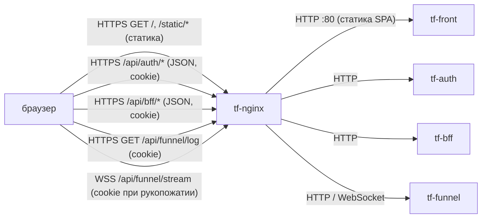

Маршрутизация `/api/*` на `tf-auth` / `tf-bff` / `tf-funnel` настраивается в `tf-nginx` (репозиторий инфраструктуры), в этом репозитории её нет — из кода фронта видно только, какие префиксы он ожидает (`app/src/core/api/endpoints.ts`). Сам `tf-front` ни к кому не обращается: все запросы делает браузер.

#### Сценарий: вход пользователя

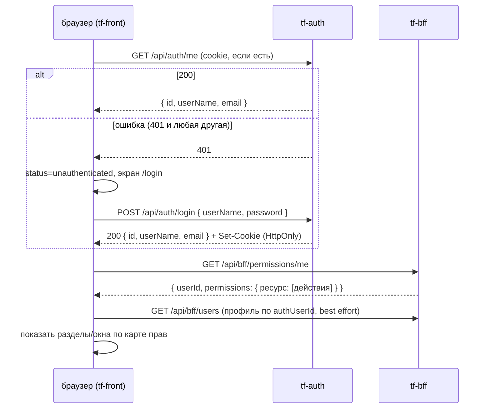

Код: `app/src/stores/auth/authStore.ts:26-42`, `app/src/app/App.tsx`, `app/src/stores/profile/profileStore.ts:22-23`.

#### Сценарий: живые показания (окно «Логи»)

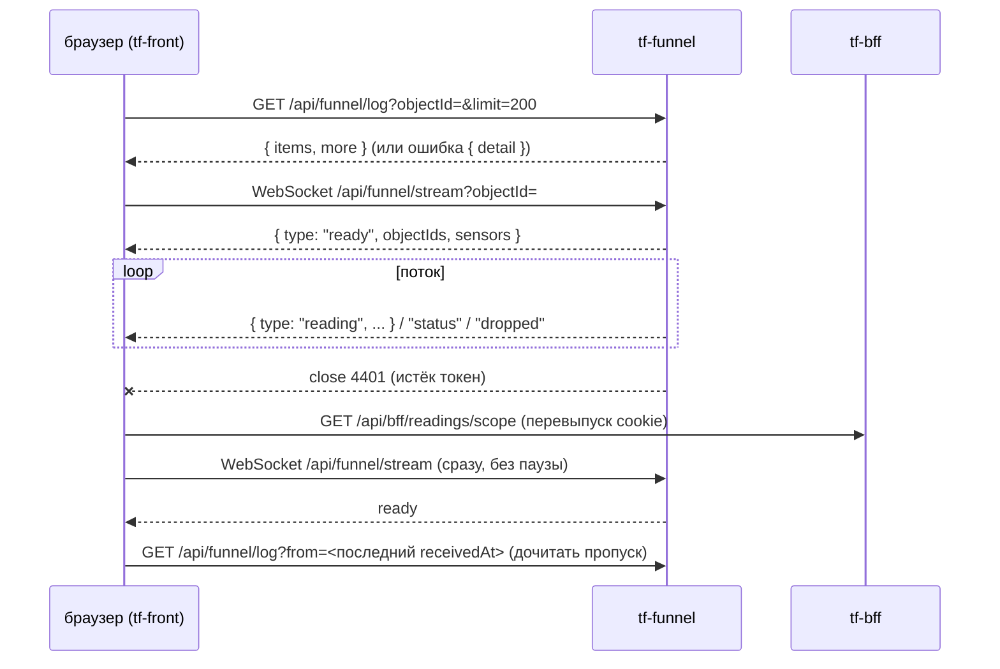

Код: `app/src/features/logs/hooks/useReadingsStream.ts:63-200`.

### 3. Интерфейсы

#### Входящие

| Протокол | Адрес/путь | Кто вызывает | Авторизация | Что делает |
|---|---|---|---|---|
| HTTP | `tf-front:80`, `/` и любые пути | `tf-nginx` (запросы браузера) | нет | Отдаёт `index.html` для любого неизвестного пути — SPA-роутинг (`nginx/default.conf:8-10`) |
| HTTP | `tf-front:80`, `/static/*`, `/favicon.*`, `/manifest.json` и т.п. | `tf-nginx` | нет | Статика сборки CRA |
| HTTP | `tf-front:80`, `/assets/*` | `tf-nginx` | нет | Отдаёт файл или 404 (`nginx/default.conf:12-14`). В сборке CRA папки `assets/` нет — блок фактически не используется |

Публичный путь: `/` (и все клиентские маршруты: `/login`, `/dashboard`, `/predictions/:id`, `/tasks/:id`, `/engineer`, `/engineer/tasks/:id[/report|/request|/sensors/:sensorId]` — `app/src/app/AppRoutes.tsx`). Под каким именно `location` в `tf-nginx` проксируется `tf-front` — не проверено (конфигурация в репозитории инфраструктуры).

#### Исходящие (из браузера)

Все пути — относительно `REACT_APP_API_BASE_URL` (по умолчанию `/api`), т.е. это публичные пути через `tf-nginx`.

| Протокол | Куда | Зачем | Что при недоступности |
|---|---|---|---|
| HTTPS | `/api/auth/*` → `tf-auth` | Вход, текущий пользователь, создание учётки | `GET /auth/me` упал → экран входа; ошибка логина → «Неверный логин или пароль» (кроме 429) (`app/src/features/auth/LoginForm.tsx:28-35`) |
| HTTPS | `/api/bff/*` → `tf-bff` | Все доменные данные и права | `permissions/me` упал → карта прав пустая, разделы скрыты, шторка пишет причину (`app/src/stores/permissions/permissionsStore.ts:41-42`, `app/src/widgets/workspace/WorkspaceSidebar.tsx:248-257`); окна показывают ошибку загрузки |
| HTTPS | `/api/funnel/log` → `tf-funnel` | История показаний | Окно «Логи» показывает текст ошибки (`detail`), поток не открывается |
| WSS | `/api/funnel/stream` → `tf-funnel` | Живые показания | Переподключение с паузами 1/3/10/30 с (`useReadingsStream.ts:14`) |

Любой ответ 401 на любой запрос через `apiClient` (auth, bff, funnel/log) переводит приложение в «не вошёл» и уводит на `/login` (`app/src/core/api/client.ts:17`, `app/src/stores/auth/authStore.ts:52-62`).

#### Карта экранов → запросы

Разделы верхнего уровня (`app/src/core/registry/sectionRegistry.ts`): «Рабочая область» (`/`, видна при наличии хотя бы одного доступного окна) и «Мои заявки» (`/engineer`, право `tasks:read`, на узком экране ≤767 px открывается сразу после входа — `app/src/app/routing/SectionRoute.tsx:7,39`).

Окна рабочей области (`app/src/core/registry/windowRegistry.ts:93-246`); окно видно, если есть **хотя бы одно** из прав в столбце «Права» (`manage` покрывает любое действие — `app/src/core/permissions/permissionService.ts:25`).

| Экран / окно | Права для видимости | Запросы |
|---|---|---|
| Вход (`/login`) | — | `POST /auth/login` |
| Старт приложения | — | `GET /auth/me`, `GET /bff/permissions/me`, `GET /bff/users` (поиск своего профиля) |
| Карта | `objects:read` | `GET /bff/objects`, `GET /bff/objects/{id}`, `GET /bff/objects/{id}/layers?level=` (кэш на сессию — `app/src/features/map/hooks/useMapLayers.ts:27`), `GET /bff/tasks?status=engineerWorking&pageSize=200` (при `tasks:read`), `GET /bff/fact-alerts?live=true&pageSize=200` каждые 60 с (при `predictions:read`, `app/src/features/map/hooks/useLiveFacts.ts:10`) |
| Журнал прогнозов | `predictions:read` | `GET /bff/predictions` (фильтры, страницы) |
| Карточка прогноза (`/predictions/:id`) | `predictions:read` | `GET /bff/predictions/{id}`, `POST /bff/predictions/{id}/decisions` |
| Дневник диспетчера | `tasks:read` | `GET /bff/tasks` |
| Карточка заявки (`/tasks/:id`) | `tasks:read` | `GET /bff/tasks/{id}`, `POST .../take`, `POST/DELETE .../predictions[/{predictionId}]`, `POST .../assignments`, `.../reports`, `.../returns`, `.../start`, `.../close`, `.../cancel`, `GET /bff/tasks/assignees?role=` |
| Создать заявку | `tasks:create` | `POST /bff/tasks`, `GET /bff/tasks/assignees` |
| История объектов | `objects:read` | `GET /bff/predictions`, `/bff/tasks`, `/bff/incidents`, `/bff/fact-alerts` по объекту |
| Журнал данных | `predictions:read` | `GET /bff/fact-alerts` |
| Логи | `readings:read` или `tasks:read` | `GET /bff/readings/scope`, `GET /bff/sensors`, `GET /bff/objects`, `GET /funnel/log`, WS `/funnel/stream` |
| Происшествия | `incidents:read` | `GET /bff/incidents`, `GET /bff/incidents/{id}`, `POST /bff/incidents/{id}/confirm` |
| Объекты и датчики | `objects:read` или `sensors:read` | `GET/POST /bff/objects`, `PUT /bff/objects/{id}`, `GET/POST /bff/sensors`, `PUT /bff/sensors/{id}`, `GET /bff/sensors/types`, `GET /bff/objects/{id}/pickets` |
| Люди | `schedule:read`, `assigned_objects:read`, `engineers:read` или `presence:read` | `GET/POST/DELETE /bff/users/{id}/schedule[/{entryId}]`, `GET/POST/DELETE /bff/users/{id}/assigned-objects[/{objectId}]`, `GET/PUT /bff/users/{id}/engineer-profile`, `GET /bff/presence`, `GET/POST /bff/brigades` |
| Пользователи и группы | `users:read` или `groups:read` | `GET/POST /bff/users`, `PUT /bff/users/{id}`, `POST /auth/create` (новая учётка), `GET/POST /bff/groups`, `GET /bff/groups/{id}`, `POST /bff/groups/{id}/members`, `DELETE /bff/groups/{id}/members/{user|group}/{memberId}` |
| Конфигурация доступа | `permissions:read` (правка — `permissions:manage`) | `GET /bff/resources`, `GET/POST /bff/permissions/grants`, `DELETE /bff/permissions/grants/{id}` |
| Настройки модели | `model_settings:read` | `GET/POST /bff/model-versions`, `POST /bff/model-versions/{id}/activate`, `GET/POST /bff/coefficients`, `GET/POST /bff/retrain-jobs`, `GET/POST/DELETE /bff/ignored-ranges[/{id}]`, `GET /bff/work-schedule` |
| Кнопка «письмо» в шторке | `notifications:create` (`app/src/features/notifications/MailButton.tsx:8`) | `POST /bff/notifications/email` |
| Мои заявки (`/engineer`) | `tasks:read` | `GET /bff/tasks?assignedToMe=true`, `GET /bff/objects/{id}` |
| Карточка заявки инженера (`/engineer/tasks/:id`) | `tasks:read` | `GET /bff/tasks/{id}`, `POST .../start`, `GET /bff/tasks/assignees?role=dispatchers`, `GET /bff/objects/{id}/layers?level=2|3` (при `objects:read`) |
| Отчёт (`.../report`) / запрос к диспетчеру (`.../request`) | `tasks:read` | отчёт — `POST /bff/tasks/{id}/reports`, запрос — `POST /bff/tasks/{id}/returns` (`app/src/features/engineer/EngineerTaskForms.tsx:56,110`) |
| Показания датчика инженера (`.../sensors/:sensorId`) | `tasks:read` | `GET /funnel/log?objectId=&limit=1000`, фильтр по датчику на клиенте (`app/src/features/engineer/hooks/useSensorReadings.ts:9`); живого потока нет |

Эндпоинт `PUT /bff/tasks/{id}` и `GET /bff/work-schedule/{workId}` объявлены в коде (`app/src/core/api/endpoints.ts`, `app/src/entities/task/taskRepository.ts:52`), но вызовов из экранов не найдено.

### 4. Контракты данных

Фронт — потребитель; ниже то, что он **ожидает** от бэкендов. Полные DTO BFF — в `app/src/entities/*/types.ts`; ссылки в коде на `docs/FRONTEND_INTEGRATION.md` и `docs/FRONTEND_INTEGRATION_DOMAIN_MODELS.md` ведут на документы BFF, в этом репозитории их нет.

#### tf-auth

`POST /api/auth/login` (`app/src/core/auth/types.ts`):

```json
{ "userName": "dispatcher1", "password": "<пароль>" }
```

Ответ `200` (и на `GET /api/auth/me`, и на `POST /api/auth/create`):

```json
{ "id": "0b6f…", "userName": "dispatcher1", "email": "d1@example.org" }
```

| Поле | Тип | Обяз. | Смысл |
|---|---|---|---|
| `id` | string | да | id учётки; в BFF это `authUserId` профиля |
| `userName` | string | да | логин |
| `email` | string | да | почта |

`POST /api/auth/create` принимает `{ userName, password, email }` — все обязательны. Контракт сделан «по аналогии», отдельно не задокументирован (`app/ARCHITECTURE.md`, раздел «Интеграция с BFF»). Логаута на бэкенде нет.

Коды: `401` — не вошёл / неверный логин; `429` — «Слишком много попыток входа» (`LoginForm.tsx:32`); прочие ошибки логина показываются как «Неверный логин или пароль».

#### tf-bff: общие форматы

Список — `PagedResult` (`app/src/core/api/types.ts`):

```json
{ "items": [], "total": 0, "page": 1, "pageSize": 50 }
```

Запрос страницы: `?page=` (с 1) и `?pageSize=` (по умолчанию 50 на стороне BFF). Массивные параметры отправляются как `objectId=1&objectId=2` (без `[]`, `app/src/entities/reading/readingRepository.ts:8-11`).

Ошибка BFF (`app/src/core/errors/bffError.ts`):

```json
{ "code": "permission_denied", "message": "...", "details": { "field": ["..."] } }
```

Коды, которые фронт различает: `unauthenticated`, `invalid_token`, `token_refresh_failed`, `auth_service_unavailable`, `user_not_provisioned`, `user_inactive`, `permission_denied`, `not_found`, `cycle_detected`, `duplicate_code`, `system_group_protected`, `validation_failed`, `bad_request`, `internal_error`, `task_already_taken`. `details` выводится пользователю как «поле: сообщения». `user_not_provisioned` / `user_inactive` на `GET /permissions/me` дают отдельный текст в шторке.

`GET /api/bff/permissions/me`:

```json
{ "userId": "…", "permissions": { "objects": ["read"], "tasks": ["read", "create"], "permissions": ["manage"] } }
```

Действия: `create | read | update | delete | export | import | manage` (`app/src/core/permissions/permissionService.ts`). Ресурсы, которые использует фронт: `objects`, `sensors`, `predictions`, `tasks`, `readings`, `incidents`, `schedule`, `assigned_objects`, `engineers`, `presence`, `users`, `groups`, `permissions`, `model_settings`, `notifications`.

`GET /api/bff/readings/scope?objectId=…`:

| Поле | Тип | Смысл |
|---|---|---|
| `all` | boolean | есть `readings:read` — виден любой объект |
| `objectIds` | number[] | объекты заявок пользователя в работе |
| `sensorIds` | number[] | датчики этих объектов |

`POST /api/bff/notifications/email` (`app/src/entities/notification/types.ts`): запрос `{ subject (≤255), text (≤20000, простой текст), userIds?, emails?, ticketId?, kind? }`, ответ `{ requested, sent, results: [{ email, userId?, status }] }`, `status` ∈ `sent | rateLimited | userNotFound | noEmailOnFile | invalidEmail | failed`. `sent` — «принято в обработку», не «доставлено».

#### tf-funnel

`GET /api/funnel/log?objectId=&from=&to=&limit=` → `{ "items": Reading[], "more": boolean }`, новые сверху. Ошибка — `{ "detail": "текст" }` (показывается как есть, `useReadingsStream.ts:41-52`). Без `objectId` — объекты заявок инженера (воронка сама спрашивает BFF).

`Reading` (`app/src/entities/reading/types.ts`):

```json
{ "sensorId": 101, "eventId": 5531, "date": "2026-09-28", "time": "14:03:12",
  "alarm": false, "value": "12.4", "receivedAt": "2026-09-28T11:03:13Z" }
```

| Поле | Тип | Смысл |
|---|---|---|
| `sensorId` | number | канал данных |
| `eventId` | number | номер события; пара `sensorId:eventId` — ключ дедупликации на клиенте |
| `date`, `time` | string | время на объекте, как в пакете (МСК) |
| `alarm` | boolean | флаг источника «тревожное сообщение» |
| `value` | string | число или текст состояния |
| `receivedAt` | string (ISO 8601) | когда воронка приняла пакет; по нему идёт `from` при дочитывании |

WebSocket `/api/funnel/stream?objectId=` — сообщения JSON:

| `type` | Поля | Что делает фронт |
|---|---|---|
| `ready` | `objectIds: number[]`, `sensors: number` | состояние «В эфире», сброс счётчика попыток; если были данные — дочитать пропуск через `/log?from=` |
| `reading` | поля `Reading` | добавить в список (дедуп, сортировка, в памяти не больше 500 живых) |
| `status` | `sensorId`, `status: "silent"\|"ok"`, `at`, `since` | отметить/снять «датчик молчит с `since`» |
| `dropped` | `count` | увеличить счётчик пропущенных сообщений, показать пользователю |

Коды закрытия: `4401` — истёк токен (см. §6); `1000` фронт шлёт сам при закрытии окна. Остальные коды — переподключение с паузой.

Версионирования API на стороне фронта нет.

### 5. Данные и состояние

- Сервер: stateless. Контейнер содержит только статику; томов нет (`deploy/docker-compose.yml`). Можно запускать несколько экземпляров; при перезапуске ничего не теряется.
- Браузер, `localStorage` (только настройки интерфейса):

| Ключ | Что хранит | Файл |
|---|---|---|
| `kontur_grid_v2` | раскладка сетки окон | `app/src/core/workspace/gridStorage.ts:3` |
| `kontur_free_v1` | раскладка свободного режима | `app/src/stores/workspace/freeStore.ts:12` |
| `kontur_instances_v1` | контекст экземпляров окон (объект/карточка у копии) | `app/src/stores/workspace/instanceStore.ts:3` |
| `kontur_layout_v1` | режим раскладки | `app/src/stores/workspace/layoutStore.ts:3` |
| `kontur_theme_v1` | тема (светлая/тёмная) | `app/src/stores/theme/themeStore.ts:3` |

- Токен в JS не хранится: авторизация — cookie, выставляемая бэкендом (по документации BFF — HttpOnly, `app/src/core/auth/clearAllCookies.ts:3`). Имя cookie — не знаю (в коде фронта не фигурирует).
- В памяти вкладки: текущий пользователь, карта прав, кэш слоёв карты (на сессию), до 500 живых показаний на окно «Логи».

### 6. Безопасность и политики

- **Как фронт авторизуется.** Все запросы `axios` идут с `withCredentials: true` (`app/src/core/api/client.ts:8`); cookie браузер прикладывает сам, в т.ч. к рукопожатию WebSocket (`app/src/entities/reading/readingRepository.ts:20-21`). Заголовок `Authorization` фронт не ставит. Алгоритм/iss/aud JWT фронт не проверяет и не знает — это дело `tf-auth`/`tf-bff`/`tf-funnel`.
- **Обновление токена (refresh).** Своей логики refresh у фронта нет. По комментарию в коде, cookie перевыпускает BFF на любом запросе (`useReadingsStream.ts:15-16`); код ошибки `token_refresh_failed` фронт знает, но специально не обрабатывает. Как именно BFF делает refresh — не проверено.
- **401.** Интерсептор `apiClient` на любой 401 вызывает `handleUnauthorized`: состояние → `unauthenticated`, переход на `/login` с запоминанием текущего пути; после входа — возврат на него (`authStore.ts:52-59`, `app/src/pages/LoginPage.tsx`). Повторных попыток запроса нет.
- **WebSocket 4401.** При закрытии с кодом 4401 фронт делает `GET /api/bff/readings/scope` (чтобы BFF перевыпустил cookie) и сразу переподключается; при следующих подряд 4401 — с обычными паузами. Если `scope` сам вернёт 401 — сработает общий обработчик и пользователь уйдёт на `/login` (`useReadingsStream.ts:153-170`).
- **Выход.** Серверной ручки нет. `logout()` стирает доступные JS cookie и уходит на `/login` (`authStore.ts:46-50`). HttpOnly-cookie JS стереть не может — она остаётся валидной до истечения срока, и следующий `GET /auth/me` снова впустит пользователя (см. §11).
- **Права.** Видимость разделов и окон — по карте `GET /bff/permissions/me`; `manage` — надправо. Пока права не загружены или запрос упал — карта пустая, разделы скрыты. Это только UI: реальную проверку делает BFF/воронка.
- **Аудит.** Фронт ничего не пишет в аудит.
- **Чувствительные данные.** Пароль уходит только в `POST /auth/login` и `POST /auth/create`, нигде не сохраняется. В `console` пишется только предупреждение о недоступности `permissions/me` с объектом ошибки (`permissionsStore.ts:41`). Секретов в сборке нет.

### 7. Конфигурация

Переменные читаются **при сборке** (CRA подставляет `process.env.REACT_APP_*` в бандл), в рантайме их поменять нельзя.

| Переменная | По умолчанию | Обязательна | Секрет | Смысл |
|---|---|---|---|---|
| `REACT_APP_APP_NAME` | `Thinkfaster` | нет | нет | заголовок вкладки |
| `REACT_APP_ENVIRONMENT` | `development` | нет | нет | имя окружения, выводится на экране входа (`LoginPage.tsx`) |
| `REACT_APP_API_BASE_URL` | `/api` | нет | нет | префикс API для HTTP и WebSocket (WS-адрес строится из него: `https`→`wss`) |
| `VITE_API_URL` (compose build arg) | `/api` | нет | нет | передаётся в `docker-compose.yml:10`, но `Dockerfile` его не объявляет и приложение (CRA) его не читает — **ни на что не влияет** |

Фактически в Docker-сборке ни одна `REACT_APP_*` не задаётся (`deploy/Dockerfile` без `ARG`/`ENV`), поэтому на dev и prod работают значения по умолчанию, включая `environment = development` на экране входа prod.

Секреты: сервис секретов не использует, в Vault не ходит. `deploy/.env` в `.gitignore`; на prod он переносится из прошлой выкатки (`.github/workflows/deploy-prod.yml`), что в нём — не знаю.

`deploy/entrypoint.sh` (генерация `config.js` с `window.__ENV__` и `envsubst` шаблона nginx) в образ **не копируется** и не используется; приложение `window.__ENV__` не читает.

### 8. Сборка и запуск

| Параметр | Значение |
|---|---|
| Dockerfile | `deploy/Dockerfile`: стадия `node:22-alpine` (`npm ci`, `npm run build`), стадия `nginx:1.29-alpine` с `build/` в `/usr/share/nginx/html` и `nginx/default.conf` |
| Где собирается | на сервере (`docker compose build`), в реестр не публикуется |
| Контейнер | `tf-front` |
| Сеть | `think-fast-net` (external) |
| Порт | 80 внутри, наружу не публикуется — доступ только через `tf-nginx` |
| Тома | нет |
| Лимиты памяти | не заданы |
| Healthcheck | не задан |
| Рестарт | `unless-stopped` |

#### dev (greefob.ru) — `.github/workflows/deploy-dev.yml`

Запуск: пуш в **любую** ветку, кроме `dev`, `prod`, `main`, `master`. Шаги: ветка сливается `--no-ff` в `dev` и пушится; по SSH (`secrets.DEV_IP`, `DEV_USER`, `DEV_SSH_KEY`, путь `DEV_PATH`) на сервере `git reset --hard origin/dev`, затем в `deploy/`: `docker-compose down` → `docker-compose build --no-cache` → `docker-compose up -d`. Контейнер лежит всё время сборки (минуты).

Локальный помощник `scripts/finish-feature.bat` делает то же слияние ветки в `dev` вручную.

#### prod (thinkfaster.ru) — `.github/workflows/deploy-prod.yml`

Запуск: пуш в `prod` или вручную (Run workflow). Если нет `PROD_IP` — выкатка пропускается с notice. Шаги: `git archive` → scp на сервер → распаковка в `/srv/thinkfaster/services/think-front.new`, перенос `deploy/.env` из прошлой версии, прошлая версия → `think-front.old`, новая → `think-front`; `docker compose build` → `docker compose up -d` (без `down`, простой — только на пересоздание контейнера). Требует существующей сети `think-fast-net`.

#### Порядок запуска

При старте ни от чего не зависит (nginx отдаёт статику). Для работы пользователя нужны `tf-nginx`, `tf-auth`, `tf-bff`, `tf-funnel`. Без `tf-auth` — только экран входа; без `tf-bff` — пустая шторка «Не удалось загрузить права»; без `tf-funnel` — окно «Логи» с ошибкой / вечным «переподключаюсь».

#### Ручная выкатка и откат

```bash
# prod, на сервере: пересобрать текущую версию
cd /srv/thinkfaster/services/think-front/deploy && docker compose build && docker compose up -d
```

```bash
# prod, откат на предыдущую выкатку (хранится одна)
cd /srv/thinkfaster/services && mv think-front think-front.bad && mv think-front.old think-front && cd think-front/deploy && docker compose build && docker compose up -d
```

```bash
# dev, на сервере в DEV_PATH: откат на нужный коммит (до следующего пуша)
git reset --hard <sha> && cd deploy && docker-compose build && docker-compose up -d
```

Локально: `cd app && npm ci && npm start` (порт 3000; без прокси `/api` на бэкенд окна покажут ошибки — прокси в `package.json` не настроен).

### 9. Эксплуатация

- **Здоров ли.** Отдельного health-эндпоинта нет. Признак — `GET /` отдаёт 200 и HTML с `<div id="root">`: `docker exec tf-front wget -qO- http://localhost/ | head`. `docker compose ps` — контейнер `Up`.
- **Логи.** Только access/error-логи nginx в stdout контейнера: `docker logs --tail=100 tf-front`. Ошибки приложения видны только в консоли браузера и во вкладке «Сеть» (запросы `/api/...`, WS `/api/funnel/stream`).
- **Метрики.** Нет.
- **Перезапуск.** `docker restart tf-front` (данных нет, безопасно).
- **Миграции, ротация ключей, очистка данных** — не применимо. Сброс раскладки у пользователя — очистить ключи `kontur_*` в `localStorage` его браузера.

### 10. Ошибки и проблемы

| Симптом | Причина | Как исправить |
|---|---|---|
| После «Выйти» и перезагрузки пользователь снова вошёл | Нет серверного логаута, HttpOnly-cookie не стирается из JS (`clearAllCookies.ts`) | Сделать `POST /auth/logout` с `Set-Cookie` истёкшим сроком; до тех пор — ждать истечения cookie |
| Шторка пустая, «Не удалось загрузить права» | `GET /bff/permissions/me` упал (BFF недоступен, 5xx) | Проверить `tf-bff`; в консоли браузера — предупреждение `GET /permissions/me недоступна` |
| Шторка: «Учётная запись ещё не заведена…» | BFF: 403 `user_not_provisioned` — учётка в `tf-auth` есть, профиля в BFF нет | Администратор создаёт пользователя в «Пользователи и группы» с этим `authUserId` |
| Шторка: «Учётная запись отключена» | 403 `user_inactive` | Включить пользователя (`isActive`) |
| Аватар без инициалов/профиля | Профиль ищется в первой странице `GET /bff/users`, нужно `users:read` (`profileStore.ts:22`) | Ограничение, см. §11 |
| «Логи»: «Нет связи — переподключаюсь» бесконечно | `tf-funnel` недоступен, `tf-nginx` не проксирует WebSocket (Upgrade) или отвергает Origin | Проверить `tf-funnel` и location `/api/funnel/stream` в `tf-nginx` |
| «Логи»: текст ошибки вместо показаний | `/funnel/log` вернул `{ detail }` (нет прав, нет заявок в работе) | По тексту; права — `readings:read` или назначение на заявку в работе |
| На экране входа prod написано `development` | `REACT_APP_ENVIRONMENT` не передаётся в сборку | Добавить `ARG`/`ENV` в Dockerfile и build arg в compose |
| dev недоступен несколько минут после пуша | `docker-compose down` до `build --no-cache` в `deploy-dev.yml` | Собирать до `down`, либо `up -d --build` |
| Любая рабочая ветка сразу попадает в `dev` | `deploy-dev.yml` срабатывает на пуш любой ветки и сливает её в `dev` | Осознанно пушить; при необходимости ограничить `branches` |
| История: пересборка с падениями пайплайна (sudo, путь, имя контейнера, сеть/порт) | Первые версии workflow и compose (коммиты `754dde5`…`6c7e01e`, 2026-09-19) | Исправлено: без sudo, `cd deploy`, контейнер `tf-front` в `think-fast-net`, порт наружу не публикуется |
| История: несохранённые правки в «Конфигурации доступа» пропадали | Нестабильная ссылка на массив грантов сбрасывала черновик (`app/ARCHITECTURE.md`, «Важный баг и его фикс») | Исправлено мемоизацией среза |
| История: окно «Конфигурация доступа» не видно пользователям с `permissions:read` | Видимость требовала `manage` | Исправлено (коммит `299e1e7`): видимость по `read` |

### 11. Ограничения и известные недоработки

- Нет серверного логаута — выход ненастоящий (см. §6, §10).
- Нет refresh на стороне фронта и повторов запросов: любой 401 сразу выкидывает на `/login`, несохранённый ввод в формах теряется.
- Переменные окружения запекаются при сборке; `VITE_API_URL` и `deploy/entrypoint.sh` — мёртвая конфигурация, вводящая в заблуждение.
- nginx внутри контейнера без настроек кэша (`Cache-Control` для `/static/*` с хешами и `no-cache` для `index.html`), без gzip в `default.conf`, без заголовков безопасности (CSP и т.п.) — если их не ставит `tf-nginx`.
- Нет healthcheck и лимитов памяти в compose.
- Профиль текущего пользователя ищется в первой странице списка пользователей — у большого списка или без `users:read` профиля не будет.
- Показания датчика у инженера — только история (`limit=1000` за объект, фильтр на клиенте), без живого потока; при большом числе датчиков нужный канал может не попасть в выборку.
- «Логи»: в памяти до 500 живых показаний на окно; некорректный JSON в сообщении WebSocket бросит исключение в обработчике (`JSON.parse` без `try`, `useReadingsStream.ts:120`).
- Нет автотестов (`app/README.md`).
- Нет React Query/общего кэша: окна перечитывают данные независимо; карта опрашивает `fact-alerts` раз в минуту на каждое окно «Карта».
- Удаление пользователей/групп и создание ресурсов в UI не реализованы (`app/ARCHITECTURE.md`, «Чего сознательно нет»).

### 12. Возможности доработки

| Доработка | Приоритет | Объём |
|---|---|---|
| Серверный логаут (`tf-auth`/`tf-bff`) + вызов с фронта | высокий | 0,5 дня фронт + бэкенд |
| Передавать `REACT_APP_*` в Docker-сборку, удалить `VITE_API_URL` и `entrypoint.sh` | высокий | 1–2 часа |
| Dev-выкатка без простоя (build до `down`) | средний | 1 час |
| Кэш-заголовки, gzip, security-заголовки в `nginx/default.conf`; убрать `/assets/` | средний | 2–4 часа |
| Healthcheck и `mem_limit` в compose | средний | 1 час |
| Ручка «мой профиль» в BFF вместо поиска по списку | средний | 0,5 дня (с BFF) |
| Живой поток для экрана показаний инженера, фильтр по датчику на стороне воронки | средний | 1 день |
| Защита `JSON.parse` в обработчике WebSocket | низкий | 0,5 часа |
| Автотесты на авторизацию, права, поток показаний | средний | 2–3 дня |
| Общий кэш запросов (React Query) | низкий | 2–3 дня |

### 13. Как интегрироваться и что менять

**Новому бэкенду, чтобы им пользовался фронт:**
- Быть доступным под тем же доменом за `tf-nginx`, под `/api/<сервис>/*` — фронт ходит только относительными путями (same-origin), поэтому **CORS не нужен и не ожидается**. Если когда-нибудь `REACT_APP_API_BASE_URL` станет другим origin — бэкенд должен отвечать `Access-Control-Allow-Origin` с точным origin (не `*`) и `Access-Control-Allow-Credentials: true`, cookie — `SameSite=None; Secure`.
- Принимать авторизацию по той же cookie, что выставляет `tf-auth` (заголовок `Authorization` фронт не шлёт).
- Отвечать `401` на истёкшую/нет сессии (фронт уведёт на вход); ошибки — в формате BFF `{ code, message, details }` или `{ detail }` как у воронки.
- Для WebSocket: `tf-nginx` должен проксировать `Upgrade`/`Connection`; сервис должен проверять cookie при рукопожатии и принимать `Origin` `https://greefob.ru` (dev) и `https://thinkfaster.ru` (prod). Проверяет ли `tf-funnel` Origin — не проверено. Код закрытия `4401` — договорённость «истёк токен, обнови cookie через BFF».
- Новые пути добавляются в `app/src/core/api/endpoints.ts`, сущность — в `app/src/entities/<имя>/`, окно — записью в `app/src/core/registry/windowRegistry.ts` (подробно — `app/ARCHITECTURE.md`).

**Согласовать с инфраструктурой:**
- Новые префиксы `/api/*` и WebSocket-маршруты в `tf-nginx`.
- Маршрут отдачи фронта (`/` → `tf-front:80`) и заголовки кэша/безопасности, если их ставит `tf-nginx`.
- Имя контейнера `tf-front` и сеть `think-fast-net` (на них завязан `tf-nginx`).
- Новые ресурсы/действия прав (строки вида `objects`, `readings`) — согласовать с BFF, иначе окно не появится.
- Сборочные переменные (`REACT_APP_*`), если начнут различаться между стендами.

### 14. Открытые вопросы

- Имя, срок жизни, `SameSite`/`Domain` auth-cookie и механизм её перевыпуска в BFF — в коде фронта не видно.
- Когда появится серверный логаут и кто его делает (`tf-auth` или `tf-bff`).
- Конфигурация `tf-nginx` для `/`, `/api/auth`, `/api/bff`, `/api/funnel` (включая WebSocket и таймауты простоя WS) — не проверено.
- Проверяет ли `tf-funnel` заголовок `Origin` при рукопожатии.
- Что лежит в `deploy/.env` на серверах и нужно ли оно вообще (из используемого — только `VITE_API_URL`, который ни на что не влияет).
- Должны ли различаться сборки dev и prod (имя окружения на экране входа, адрес API).
- Нужен ли отдельный health-эндпоинт/метрики для фронта в мониторинге.
- Правильно ли, что пуш любой ветки автоматически сливается в `dev`.


Ссылки `файл:строка` без каталога — относительно `docs/backend/funnel/`, workflow — `.github/workflows/`; пути think-infra и think-auth — в их репозиториях.

## tf-funnel — воронка показаний

> Источник: репозиторий **Think-Faster**, `main@7cfe8f2`. Раздел написан агентом репозитория.

### 1. Назначение

Воронка принимает от шины объектов пакеты событий датчиков (`POST /events`), проверяет каждое событие,
раскладывает принятые по топикам Kafka `tf.ingest.readings` (числа) и `tf.ingest.journal` (тревожные и
текстовые состояния) и отмечает замолчавшие и ожившие каналы в `tf.ingest.reference`
(`docs/backend/funnel/main.go:1-5`). Всё принятое она ещё и пишет в свой архив на томе и раздаёт окну
«Логи» фронта: история объекта (`GET /log`) и живой поток по WebSocket (`GET /stream`)
(`docs/backend/funnel/stream.go:1-12`). Воронка — единственная точка входа показаний в контур: её
читают модель (`tf-model`) и BFF. На dev шины нет — воронка сама забирает поток у эмулятора
`tf-emulator` (`TF_FUNNEL_PULL`, `docs/backend/funnel/pull.go:66-122`). Язык — Go 1.27, библиотеки
franz-go, golang-jwt v5, go-redis v9, coder/websocket, klauspost/compress (`docs/backend/funnel/go.mod`).

### 2. Схема взаимодействия

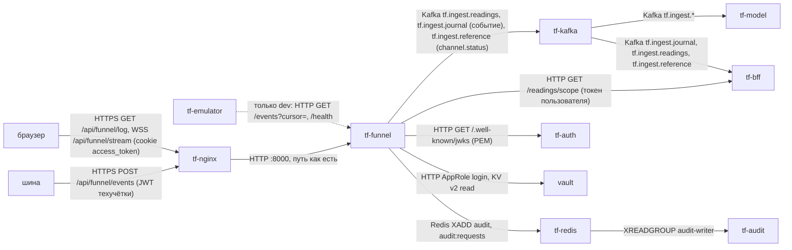

Приём пакета шины:

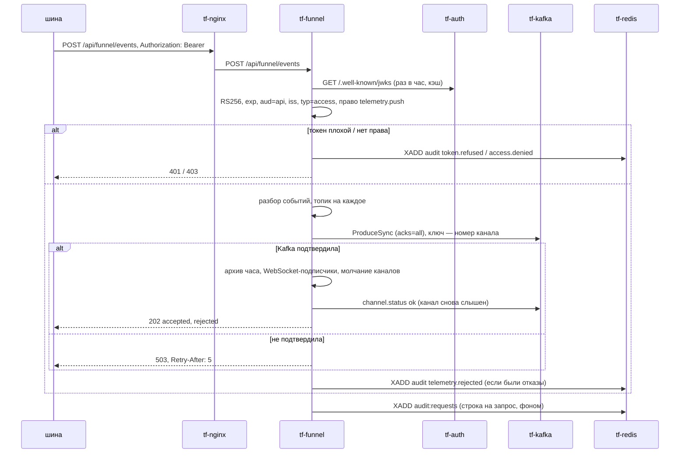

Окно «Логи» (живой поток):

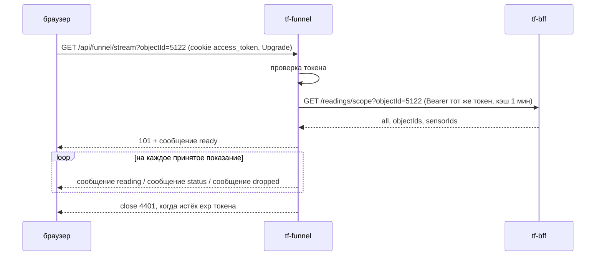

### 3. Интерфейсы

Каждая ручка доступна по двум путям: без префикса и с `/api/funnel` (`docs/backend/funnel/http.go:203-209`).
nginx передаёт путь без изменений (think-infra `docs/funnel-tz/tf-funnel.md` §4).

**Входящие**

| Протокол | Адрес/путь/топик/очередь | Кто вызывает | Авторизация | Что делает |
|---|---|---|---|---|
| HTTP POST | `/events`, публично `/api/funnel/events` | шина (prod), на dev не используется | Bearer JWT, право `telemetry.push` (`parse.go:19`, `http.go:155`) | принимает пакет, пишет в Kafka (`http.go:154-187`) |
| HTTP GET | `/log`, публично `/api/funnel/log` | браузер (окно «Логи») | JWT пользователя из cookie `access_token` или `Authorization`; права на объекты — у BFF | история показаний объекта из архива (`stream.go:224-271`) |
| WebSocket | `/stream`, публично `/api/funnel/stream` | браузер | как `/log` | живые показания и статусы каналов (`stream.go:275-351`) |
| HTTP GET | `/status`, публично `/api/funnel/status` | фронт, мониторинг | любой действующий JWT (`http.go:140`) | счётчики, молчащие каналы, число окон «Логи» (`http.go:139-152`) |
| HTTP GET | `/health`, публично `/api/funnel/health` | Docker, nginx, мониторинг | нет | признак жизни и счётчики (`http.go:134-137`) |

Ограничения nginx на публичных путях (think-infra `docs/funnel-tz/tf-funnel.md` §4): `POST /api/funnel/events` —
тело ≤ 8 МБ, 20 запросов/с с адреса (всплеск 40), ответ ждётся до 60 с, при заданном `FUNNEL_EVENTS_ALLOW` —
только с IP шины; `/api/funnel/log` — 5 запросов/с (всплеск 10); `/stream` — WebSocket, тишина до 120 с.
Порт 8000 на хост не публикуется.

**Исходящие**

| Протокол | Куда | Зачем | Что при недоступности |
|---|---|---|---|
| Kafka (SASL_PLAINTEXT/PLAIN, пользователь `tf-funnel`) | `tf-kafka:9092`, топики `tf.ingest.readings`, `tf.ingest.journal`, `tf.ingest.reference` | запись событий и `channel.status` (`funnel.go:69-89`, `funnel.go:294-316`) | пакет — 503 с `Retry-After: 5`, шина повторяет (`http.go:176-181`); `channel.status` теряется, в лог «статус N каналов не записан» (`funnel.go:310-315`); режим pull — курсор стоит (`pull.go:112-113`) |
| Redis | `tf-redis:6379`, потоки `audit`, `audit:requests` | события аудита и журнал запросов (`kit.go:432-447`) | событие дописывается в файл `TF_AUDIT_SPOOL` и досылается каждые 30 с (`kit.go:558-581`, `main.go:160-173`); без спула — только строка в лог |
| HTTP | `tf-bff:8080/readings/scope` | какие датчики видит пользователь (`scope.go:72-127`) | `/log`, `/stream` — 503 «BFF не отвечает — права на показания не проверить» |
| HTTP | `tf-auth:8080/.well-known/jwks` | открытый ключ RS256, кэш 1 ч (`kit.go:274-275`, `kit.go:306-333`) | ручки с токеном — 503 «аутентификация не отдала публичный ключ» |
| HTTP | `vault:8200` | AppRole-вход и чтение секретов при старте (`kit.go:113-202`) | 502/503/504 — ждёт `TF_VAULT_WAIT` с, затем выход; 403/404 — выход сразу |
| HTTP | `TF_FUNNEL_PULL` (dev: `tf-emulator:8000`) | забор потока `/events?cursor=&limit=5000` (`pull.go:68-122`) | пауза растёт 1→2→…→60 с, в лог «эмулятор недоступен» |

### 4. Контракты данных

#### 4.1 Пакет шины — `POST /events`

Тело: объект `{"events": [...]}`, голый список `[...]` или ответ эмулятора `{"события": [...]}`
(`parse.go:216-233`). Не больше 10 000 событий (`parse.go:20`), тело — до 64 МБ на стороне сервиса
(`http.go:14`), 8 МБ — на nginx.

```json
{"events": [
  {"ид_события": 90412331, "ид_канала_данных": 7001, "дата": "2026-09-29", "время": "14:03:11",
   "тревожное": false, "значение_датчика": "21.5"},
  {"ид_канала_данных": 7002, "дата": "2026-09-29", "время": "14:03:12",
   "тревожное": "true", "значение_датчика": "Пожар"}
]}
```

| поле | тип | обязательно | смысл и проверка (`parse.go:76-141`) |
|---|---|---|---|
| `ид_канала_данных` | целое > 0 или строка из цифр (дробное число усекается) | да | номер канала датчика; он же `sensorId` фронта и `sensors.id` в BFF |
| `дата` | строка `ГГГГ-ММ-ДД` (месяц и день — 1–2 цифры) | да | местное (московское) время события, без зоны |
| `время` | строка `ЧЧ:ММ:СС` (1–2 цифры) | да | то же |
| `значение_датчика` | строка или число | да | непустое, не длиннее 255 символов; число печатается как `str()` в Python: `12` → `"12"`, `1.50` → `"1.5"` (`parse.go:143-184`) |
| `тревожное` | bool или строка `true/t/1/false/f/0` | нет, по умолчанию `false` | тревожное событие |
| `ид_события` | целое или строка из цифр, `null` | нет | номер события у источника; передаётся дальше как есть |

Остальные поля (у эмулятора — `курсор`, `ид_объект`, `сбой` и т. п.) отбрасываются.

**Ответ**

```json
{"accepted": 1, "rejected": [{"index": 1, "reason": "нет даты или времени"}]}
```

`rejected` — не больше 100 элементов (`funnel.go:219-221`); `index` — номер события в пакете с нуля;
`reason` — одна из причин `Normalize`, без значения датчика.

| код | когда |
|---|---|
| 202 | принято хотя бы одно событие или пакет пустой (`http.go:182-186`) |
| 401 | нет `Authorization: Bearer`, подпись/`aud`/`iss`/тип не прошли, срок истёк; заголовок `WWW-Authenticate: Bearer` (`http.go:90-92`) |
| 403 | токен верный, нет права `telemetry.push` (`http.go:120-123`) |
| 413 | тело длиннее 64 МБ (`http.go:160-164`); на nginx — длиннее 8 МБ |
| 422 | тело не JSON; не список; больше 10 000 событий; не принято ни одно событие (тело — тот же `{accepted, rejected}`) |
| 503 | Kafka не подтвердила запись (`Retry-After: 5`, `{"detail":"Kafka не подтвердила N сообщений; повторите пакет"}`); нет ключа проверки токенов |
| 429 | от nginx при превышении частоты |

Ошибки, кроме 202/422 с `{accepted, rejected}`, — `{"detail": "<причина>"}` (`http.go:22-24`).

**Повторы и дубли.** Пакет записывается одной пачкой `ProduceSync` и засчитывается, только когда брокер
подтвердил все записи (`funnel.go:69-89`). Если часть записей подтверждена, а часть нет, шина получает 503,
повторяет пакет — и подтверждённая часть попадает в Kafka второй раз. Воронка дубли не отбрасывает;
модель отбрасывает их первичным ключом горячего журнала `(channel_id, ts, value)`
(`ML/service/storage.py:27-31`). Идемпотентность продюсера franz-go спасает только от повторов внутри
одной отправки. Версионирования формата нет.

#### 4.2 Сообщения Kafka

Сериализация — JSON без экранирования `<>&` (`parse.go:47-54`), сжатие lz4, `acks=all`
(`funnel.go:52-67`). Каждое событие попадает ровно в один из двух топиков событий (`parse.go:208-214`).

| топик | key | value |
|---|---|---|
| `tf.ingest.readings` | номер канала строкой: `"7001"` | событие, если `тревожное=false` и значение читается как конечное число (`parse.go:186-206`) |
| `tf.ingest.journal` | номер канала строкой | событие, если оно тревожное или значение не число («Норма», дата охраны и т. п.) |
| `tf.ingest.reference` (compact) | `channel-status:<канал>`, например `channel-status:7001` | переход канала в «молчит» или обратно (`funnel.go:303-305`) |

Value событий (порядок полей фиксирован, `parse.go:24-32`):

```json
{"ид_события":90412331,"ид_канала_данных":7001,"дата":"2026-09-29","время":"14:03:11","тревожное":false,"значение_датчика":"21.5"}
```

`ид_события` — `null`, если его не было в пакете. `значение_датчика` — всегда строка.

Value `channel.status`:

```json
{"kind":"channel.status","ид_канала_данных":7001,"status":"silent","at":"2026-09-29T15:10:00+03:00","since":"2026-09-29T14:03:11+03:00"}
```

| поле | смысл |
|---|---|
| `status` | `silent` — замолчал, `ok` — снова слышен |
| `at` | момент обнаружения (время воронки, МСК) |
| `since` | для `silent` — время последнего приёма события канала; для `ok` — равно `at` (`funnel.go:296-302`) |

Молчание: канал, который слышали не меньше 3 раз, молчит, если нового события нет дольше
`max(TF_FUNNEL_SILENT_MIN мин, 4 × сглаженный интервал канала)` (`channels.go:37-87`). Обход — раз в 30 с
(`main.go:160-173`). Молчание шины целиком видно только в `/health` и `/status` (`source_silent`), в Kafka не пишется.

#### 4.3 Окно «Логи»

Кто что видит, решает BFF: `GET {TF_BFF_URL}/readings/scope?objectId=…` с токеном пользователя, ответ
`{"all": bool, "objectIds": [..], "sensorIds": [..]}`, кэш 1 мин на пару «хэш токена + набор объектов»
(`scope.go:22-127`). BFF ответил 401 — 401; 403 — 403 и событие `access.denied`; иначе — 503.

`GET /log?objectId=5122[&objectId=…|objectId=1,2]&from=&to=&limit=` (`stream.go:224-271`):

| параметр | по умолчанию | формат |
|---|---|---|
| `objectId` | нет (для инженера — объекты его заявок; для остальных пусто → 403 «укажите objectId») | положительное целое, можно несколько |
| `to` | текущая секунда + 1 | ISO 8601 с поясом или секунды эпохи |
| `from` | `to` − 24 ч | то же; `from < to` |
| `limit` | 200 | 1…1000 |

Просматривается не больше `TF_FUNNEL_LOG_HOURS` (72) часов архива от `to` назад. Ответ, новые сверху:

```json
{"items": [
  {"sensorId": 7001, "eventId": 90412331, "date": "2026-09-29", "time": "14:03:11", "alarm": false,
   "value": "21.5", "receivedAt": "2026-09-29T14:03:12+03:00"}
], "more": true}
```

`more: true` — упёрлись в `limit` или в предел часов, раньше `from` ещё могут быть записи. Коды: 200; 401 (нет
токена / плохой токен); 403 (BFF отказал; нет видимых датчиков; нет `objectId`); 422 (плохой параметр);
500 «архив не читается»; 503 (архив или логи выключены, BFF или ключ недоступны).

`GET /stream?objectId=…` — WebSocket (`stream.go:7-12`, `stream.go:275-351`). Разрешённые `Origin` —
`TF_FUNNEL_WS_ORIGINS`, пусто — только свой хост. Сообщения — текстовые кадры, один JSON на кадр:

```json
{"type":"ready","objectIds":[5122],"sensors":14}
{"type":"reading","sensorId":7001,"eventId":90412331,"date":"2026-09-29","time":"14:03:11","alarm":false,"value":"21.5","receivedAt":"2026-09-29T14:03:12+03:00"}
{"type":"status","sensorId":7001,"status":"silent","at":"2026-09-29T15:10:00+03:00","since":"2026-09-29T14:03:11+03:00"}
{"type":"dropped","count":37}
```

| тип | когда |
|---|---|
| `ready` | подписка принята; `objectIds` — доступные объекты из запрошенных, `sensors` — число видимых каналов |
| `reading` | каждое принятое показание видимого канала (после подтверждения Kafka) |
| `status` | канал замолчал или ожил (как `channel.status`) |
| `dropped` | клиент не успевал: буфер 1024 сообщения переполнился, `count` показаний пропущено (`stream.go:43`, `stream.go:69-87`) |

Закрытие: `4401` — истёк `exp` токена (обновить токен любым запросом к BFF и переподключиться); `1001` —
воронка останавливается. Пинг сервера — раз в 30 с, запись кадра — таймаут 10 с (`stream.go:293-336`).

#### 4.4 `/health` и `/status`

```json
{"ok": true, "accepted": 120394, "last_accepted": "2026-09-29T14:03:12+03:00", "source_silent": false}
```

`/status` (`http.go:139-152`, `funnel.go:134-141`, `channels.go:108-146`):

```json
{"packets": 5210, "accepted": 120394, "rejected": 12, "unavailable": 0, "archive_errors": 0,
 "last_accepted": "2026-09-29T14:03:12+03:00",
 "channels": 8120, "silent": 3, "silent_channels": [{"channel": 7001, "since": "2026-09-29T14:03:11+03:00"}],
 "source_silent": false, "source_last": "2026-09-29T14:03:12+03:00", "log_viewers": 2}
```

`silent_channels` — не больше 200. Счётчики — с момента старта процесса.

### 5. Данные и состояние

| что | где | живёт |
|---|---|---|
| архив показаний | `TF_FUNNEL_ARCHIVE` (`/data/archive`, том `tf-funnel-data`): `<ГГГГ-ММ-ДД>/<ЧЧ>.jsonl` по часу приёма МСК; закрытые часы (через 5 мин после конца) сжимаются zstd в `<ЧЧ>.jsonl.zst` (`archive.go:3-6`, `archive.go:82-176`) | дни старше `TF_FUNNEL_ARCHIVE_DAYS` удаляются; 0 — вечно. dev — 0, prod — 14 |
| строка архива | `{"получено":"<ISO МСК>", <поля события>}` (`archive.go:26-30`) | — |
| спул аудита | `TF_AUDIT_SPOOL` и `<имя>-requests<расширение>` (`kit.go:639-645`) | до досылки в Redis. dev — `/tmp/tf-audit.spool` (теряется с контейнером), prod — `/data/audit.spool` (на томе) |
| молчание каналов, интервалы, счётчики, подписки WebSocket, кэш прав BFF, курсор pull | память процесса | теряется при перезапуске |
| файл вместо Kafka | `TF_FUNNEL_OUT` (`/tmp/tf-funnel.jsonl`), только при `TF_KAFKA_BOOTSTRAP=off` (`main.go:57-64`) | отладка |

PostgreSQL и ключей Redis, кроме потоков аудита, нет. Сервис не stateless: **только один экземпляр**
(молчание каналов и WebSocket-подписки в памяти; архив — один файл часа, дописывает один процесс).
После перезапуска молчание каналов набирается заново (нужно 3 события на канал, `channels.go:76`),
`channel.status ok` для каналов, которые молчали до перезапуска, не придёт; окна «Логи» переподключаются;
в режиме pull воронка читает эмулятор с курсора 0, повтор отбрасывает модель по ключу (`pull.go:66-67`).

### 6. Безопасность и политики

- **Токен** (`kit.go:253-423`): RS256, ключ — `TF_AUTH_PUBLIC_KEY` (PEM) или с `TF_AUTH_JWKS` (PEM, сертификат
  X.509 или открытый ключ; кэш 1 ч); обязательны `exp`, `sub`; `aud = api`; `iss` ∈ {`auth-service`, `tf-auth`};
  `typ` или `token_type` = `access`. Протухший токен — 401 без события аудита (`kit.go:241-243`, `kit.go:353-355`).
- **Право шины** `telemetry.push`: из `scope` (строка через пробел); если `scope` в токене нет — `sub` должен быть в
  `TF_FUNNEL_SERVICE_SUBS` (Vault `secret/tf/app/tf-funnel`) (`kit.go:407-412`). think-auth `scope` не выпускает
  (think-auth `AuthService/AuthService.Cryptography/Services/TokenService.cs:59-111`), поэтому на практике — список `sub`.
- **Пользователь** «Логов»: любой действующий токен доступа; какие объекты видны — решает BFF (диспетчер,
  главный диспетчер и админ — любой объект; инженер — объекты своих открытых заявок, `scope.go:3-5`).
- **Без ключа** (`TF_AUTH_PUBLIC_KEY` и `TF_AUTH_JWKS` пусты) при `TF_ENV=dev` приём открыт без токена; при `prod`
  берётся `http://tf-auth:8080/.well-known/jwks` (`main.go:74-93`).
- **Аудит** (`service = "funnel"`, поток `audit`, формат права-и-аудит §6.4, `kit.go:508-534`):
  `token.refused` (401, `outcome=denied`, в `details` — `reason`, `jti`), `access.denied` (403 по праву или отказ BFF),
  `telemetry.rejected` (отвергнутые события пакета: `via` = `http`/`pull`, `events`, `rejected`, до 5 `reasons`,
  `funnel.go:252-281`). Журнал запросов — поток `audit:requests`, строка на каждый запрос кроме `/health`: метод,
  шаблон маршрута, код, длительность, `actor_kind`, `actor_id`, `request_id` (`X-Request-Id`), IP (`kit.go:626-685`).
- **Не пишутся никогда**: значения датчиков, токены, cookie, пароли; в `details` аудита поля `password`, `token`,
  `authorization`, `cookie`, `text`, `body` запрещены (`kit.go:429-430`, `kit.go:509-513`). В ошибках Vault —
  только путь и поле (`kit.go:43-46`). В `jwtKind` — только вид ошибки (`kit.go:382-396`).
- **IP** в аудите — адрес TCP-соединения, то есть nginx, а не клиента (`http.go:26-32`; см. раздел 11).
- Контейнер: distroless без оболочки, пользователь 10004 (`docs/backend/funnel/Dockerfile:12-16`).

### 7. Конфигурация

| Переменная | По умолчанию | Обязательна | Секрет (путь Vault → ключ) | Смысл |
|---|---|---|---|---|
| `TF_ENV` | `prod` | нет | — | `dev` разрешает секреты из окружения и приём без ключа токенов (`kit.go:30-39`) |
| `TF_FUNNEL_PORT` / флаг `-port` | `8000` | нет | — | порт HTTP |
| `VAULT_ADDR` | нет | да (prod) | — | `http://vault:8200` |
| `VAULT_ROLE_ID`, `VAULT_SECRET_ID` | нет | да (prod) | пара роли `tf-svc-tf-funnel` | вход AppRole; `VAULT_TOKEN` / `VAULT_TOKEN_FILE` — готовый токен вместо роли |
| `TF_VAULT_WAIT` | `0` (в выкатках `900`) | нет | — | сколько секунд ждать запечатанный Vault |
| `TF_KAFKA_BOOTSTRAP` | `tf-kafka:9092` | нет | — | `off` — писать в файл `TF_FUNNEL_OUT` |
| `TF_KAFKA_USER` | `tf-funnel` | нет | — | пользователь SASL |
| `TF_KAFKA_FUNNEL_PASSWORD` | — | да (prod) | `secret/tf/kafka/funnel` → `TF_KAFKA_FUNNEL_PASSWORD` | пароль Kafka; переменная окружения — только в dev |
| `TF_FUNNEL_OUT` | `/tmp/tf-funnel.jsonl` | нет | — | файл вместо Kafka |
| `TF_AUTH_PUBLIC_KEY` | пусто | нет | не секрет | открытый ключ think-auth (PEM) |
| `TF_AUTH_JWKS` | пусто → в prod `http://tf-auth:8080/.well-known/jwks` | нет | — | адрес ключа |
| `TF_FUNNEL_SERVICE_SUBS` | пусто | нет | `secret/tf/app/tf-funnel` → `TF_FUNNEL_SERVICE_SUBS` | `sub` техучёток шины через запятую |
| `TF_REDIS_URL` | пусто — аудит без транспорта | нет (в выкатках задан) | пароль — `secret/tf/redis` → `TF_REDIS_PASSWORD` | `redis://tf-redis:6379/0` без пароля |
| `TF_AUDIT_SPOOL` | пусто | нет | — | файл досылки аудита |
| `TF_FUNNEL_SILENT_MIN` | `60` | нет | — | минут тишины до «молчит» |
| `TF_FUNNEL_ARCHIVE` | `/data/archive` | нет | — | каталог архива; `off` — архив и `/log` выключены |
| `TF_FUNNEL_ARCHIVE_DAYS` | `0` | нет | — | срок хранения архива в днях, 0 — вечно |
| `TF_BFF_URL` | `http://tf-bff:8080` | нет | — | `off` — `/log` и `/stream` отвечают 503 |
| `TF_FUNNEL_LOG_HOURS` | `72` | нет | — | сколько часов архива смотреть за один `/log` |
| `TF_AUTH_COOKIE` | `access_token` | нет | — | имя cookie с токеном пользователя |
| `TF_FUNNEL_WS_ORIGINS` | пусто — только свой хост | нет | — | разрешённые `Origin` WebSocket через запятую |
| `TF_FUNNEL_PULL` | пусто | нет | — | адрес эмулятора; **на prod не задаётся** |
| `GOMEMLIMIT` | `400MiB` (образ) | нет | — | мягкий предел кучи Go |

**Как сервис получает секреты.** Сам, по AppRole: `POST /v1/auth/approle/login` с `VAULT_ROLE_ID`/`VAULT_SECRET_ID`,
затем `GET /v1/secret/data/tf/<путь>` (KV v2), кэш на время жизни процесса; на 403 — один повторный вход
(`kit.go:64-202`). `vault-entrypoint.sh` не используется. Пути: `kafka/funnel`, `redis`, `app/tf-funnel`
(роль `tf-svc-tf-funnel`, think-infra `hashicorp/services.conf`). Порядок чтения при старте: `redis`
(необязательный), `kafka/funnel` (обязательный вне dev), `app/tf-funnel` (необязательный) (`main.go:126-135`).

### 8. Сборка и запуск

- **Dockerfile**: `docs/backend/funnel/Dockerfile`, контекст — `docs/backend`. Стадия `golang:1.27` прогоняет
  `go test ./...` и собирает статический бинарь; итог — `gcr.io/distroless/static-debian12`, пользователь 10004,
  `EXPOSE 8000`, `HEALTHCHECK` — `/tf-funnel -health` каждые 30 с (curl в образе нет) (`Dockerfile:4-20`).
- **dev (greefob.ru)** — `.github/workflows/deploy-funnel-dev.yml`: на push в `main` по `docs/backend/funnel/**` или
  вручную. Образ собирается в CI, переносится файлом (`docker save | gzip` → scp → `docker load`), в реестр не
  публикуется; тег `tf-funnel:dev`. Секреты окружения `dev`: `VAULT_ROLE_ID`, `VAULT_SECRET_ID` (без префикса);
  репозитория: `DEV_IP`, `DEV_USER`, `DEV_SSH_KEY`. Параметры: `TF_FUNNEL_PULL=http://tf-emulator:8000`,
  `TF_FUNNEL_ARCHIVE_DAYS=0`, `TF_AUDIT_SPOOL=/tmp/tf-audit.spool`, `TF_FUNNEL_WS_ORIGINS` не задан
  (`deploy-funnel-dev.yml:88-108`).
- **prod (thinkfaster.ru)** — `.github/workflows/deploy-funnel-prod.yml`, только вручную. Образ публикуется на
  Docker Hub: `<DOCKERHUB_USERNAME>/tf-funnel:prod-<sha7>` и `:prod`; сервер делает `docker pull` без логина
  (`deploy-funnel-prod.yml:69-78`). Секреты окружения `prod`: `FUNNEL_VAULT_ROLE_ID`, `FUNNEL_VAULT_SECRET_ID`
  (в контейнер — как `VAULT_ROLE_ID`/`VAULT_SECRET_ID`); репозитория: `DOCKERHUB_USERNAME`, `DOCKERHUB_TOKEN`,
  `PROD_IP`, `PROD_USER`, `PROD_SSH_KEY`. Docker на сервере — через `sudo -n /usr/local/bin/tf-docker`
  (в sudoers нужен `env_keep += "VAULT_ROLE_ID VAULT_SECRET_ID"`). Параметры: без `TF_FUNNEL_PULL`,
  `TF_FUNNEL_ARCHIVE_DAYS=14`, `TF_AUDIT_SPOOL=/data/audit.spool`,
  `TF_FUNNEL_WS_ORIGINS=https://thinkfaster.ru,https://www.thinkfaster.ru` (`deploy-funnel-prod.yml:30-32`, `105-123`).
  После запуска проверяется `State.Running` и отсутствие `permission denied` в логе; прежний образ удаляется по id.
- **Контейнер**: имя `tf-funnel`, сеть `think-fast-net`, порт 8000 без публикации, том `tf-funnel-data:/data`,
  `--memory 512m`, `--restart unless-stopped`. Общие переменные: `TF_ENV=prod`, `VAULT_ADDR=http://vault:8200`,
  `TF_VAULT_WAIT=900`, `TF_REDIS_URL=redis://tf-redis:6379/0`, `TF_AUTH_JWKS=http://tf-auth:8080/.well-known/jwks`,
  `TF_FUNNEL_SILENT_MIN=60`, `TF_FUNNEL_ARCHIVE=/data/archive`, `TF_BFF_URL=http://tf-bff:8080`.
- **Локальный стенд** — `docs/backend/compose.yml:44-61` поверх `docs/backend/stand.yml`.

**Порядок запуска и зависимости.**

| зависимость | нужна при старте | если недоступна |
|---|---|---|
| `vault` | да (вне dev) | 5xx — ждёт `TF_VAULT_WAIT` (900 с), раз в минуту «жду распечатывания Vault», потом выход 1 и перезапуск Docker; 403/404 — выход сразу |
| `tf-kafka` | нет (клиент подключается лениво) | сервис стартует, пакеты получают 503 |
| `tf-redis` | нет | аудит в спул |
| `tf-auth` | нет | ручки с токеном — 503 до появления ключа |
| `tf-bff` | нет | `/log`, `/stream` — 503 |
| `tf-emulator` (dev) | нет | цикл забора ждёт с растущей паузой |

**Ручная выкатка и откат.**

```bash
docker build -f docs/backend/funnel/Dockerfile -t tf-funnel:dev docs/backend
```

```bash
docker save tf-funnel:dev | gzip -1 | ssh "$DEV_USER@$DEV_IP" 'gunzip -c | docker load'
```

Затем на сервере — `docker rm -f tf-funnel` и тот же `docker run`, что в `deploy-funnel-dev.yml:90-108`
(пару роли передать переменными окружения). Откат prod — на предыдущий тег Docker Hub:

```bash
sudo -n /usr/local/bin/tf-docker pull <DOCKERHUB_USERNAME>/tf-funnel:prod-<прежний sha7>
```

и `rm --force` + `run` с параметрами из `deploy-funnel-prod.yml:105-123`, подставив прежний тег. На dev прежний
образ не хранится (`docker image prune -f`), откат — повтор workflow с прежнего коммита.

### 9. Эксплуатация

- **Жив**: `GET /api/funnel/health` → 200 `{"ok":true,...}`; `docker ps` — `healthy`. Поток идёт, если
  `last_accepted` свежий и `source_silent=false`. `/status` (с токеном) — `unavailable` (сколько пакетов упёрлись
  в Kafka), `archive_errors`, `silent`, `log_viewers`.
- **Строки лога** (slog, текст в stderr): `воронка слушает :8000` — старт; `стенд: забираю поток у …` — режим pull;
  `шина молчит дольше N мин` / `шина снова на связи`; `замолчали каналы: N`; `архив: сжато часов N`;
  `поток аудита недоступен`; `жду распечатывания Vault`; `эмулятор недоступен (…)`;
  `эмулятор перезапущен — читаю поток сначала`; `статус N каналов не записан: Kafka недоступна`.
- **Перезапуск**: `docker restart tf-funnel` (архив и спул prod — на томе).
- **Миграций нет.**
- **Ротация пароля Kafka**: сменить `kafka/funnel` в Vault (think-infra), затем перезапустить контейнер — секрет
  читается только при старте. Ротация `secret_id` роли: новые `FUNNEL_VAULT_*` / `VAULT_*` в окружении GitHub и
  повтор выкатки.
- **Очистка архива**: дни старше `TF_FUNNEL_ARCHIVE_DAYS` удаляются сами раз в минуту (`main.go:174-184`); вручную —
  удалить каталоги дней в томе:

```bash
docker run --rm -v tf-funnel-data:/data alpine sh -c 'du -sh /data/archive/*'
```

- **Проверка потока аудита** на dev — workflow `Dev status` (`.github/workflows/dev-status.yml`).

### 10. Ошибки и проблемы

| Симптом | Причина | Как исправить |
|---|---|---|
| 503 `аутентификация не отдала публичный ключ` на всех ручках с токеном | `tf-auth` недоступен или `TF_AUTH_JWKS` неверный | проверить `tf-auth`, `curl http://tf-auth:8080/.well-known/jwks` из сети |
| 403 `нужно право telemetry.push` на `/events` | в токене шины нет `scope`, а её `sub` нет в `TF_FUNNEL_SERVICE_SUBS` | администратору think-infra — завести `sub` в `app/tf-funnel`, перезапустить воронку |
| 401 `это не токен доступа` / `чужой издатель` | refresh-токен или другой `iss` | выдать токен доступа think-auth с `iss=auth-service` |
| 503 `Kafka не подтвердила N сообщений; повторите пакет`, растёт `unavailable` | Kafka лежит или отвергает запись (ACL, размер) | проверить `tf-kafka`, ACL `tf-funnel`; см. раздел 11 про `MESSAGE_TOO_LARGE` |
| 413 от nginx | пакет больше 8 МБ | шине — дробить пакеты |
| 422 `в пакете N событий, больше 10000 нельзя` | большой пакет | дробить |
| в логе `жду распечатывания Vault`, через 15 мин — выход и перезапуск | Vault после перезапуска сервера запечатан | распечатать Vault (think-infra) |
| выкатка prod: `tf-funnel: Vault отказал во входе (permission denied)` | неверная или отозванная пара `FUNNEL_VAULT_*` | выдать `setup.sh service-credentials tf-funnel`, обновить секреты окружения `prod` |
| выкатка dev падала по таймауту 10 мин ssh-action | `go build` на слабом сервере (было 27.09) | исправлено: сборка в CI, перенос файлом (`deploy-funnel-dev.yml:1-3`) |
| выкатка prod: `docker` без прав, `rm -f` понимался как ключ со значением, `image prune` запрещён | на prod docker только через обёртку `tf-docker` (было 28.09, коммиты 567d5a8, bc88139) | исправлено: `sudo -n tf-docker`, `rm --force`, удаление только своего прежнего образа |
| `/log`, `/stream` — 503 `логи выключены: нет адреса BFF` / `BFF не отвечает` | `TF_BFF_URL=off` или BFF лежит | поднять BFF |
| `/log`, `/stream` — 403 `нет заявок в работе — показания смотреть не по чему` | инженер без открытых заявок и без `objectId` | штатно |
| WebSocket закрыт кодом 4401 | истёк `exp` токена (10 мин у think-auth) | фронт обновляет токен и переподключается |
| WebSocket отклонён при установке | `Origin` не в `TF_FUNNEL_WS_ORIGINS` (или не свой хост) | добавить домен фронта |
| `archive_errors` растёт, в логе `архив показаний: …` | нет места или прав на томе | освободить диск, проверить права 10004 на `/data` |
| в логе `эмулятор перезапущен — читаю поток сначала` (dev) | эмулятор перезапущен, его курсор меньше нашего | штатно; дубли отбросит модель |

### 11. Ограничения и известные недоработки

- Один экземпляр; горизонтального масштабирования нет (состояние в памяти, архив одним процессом).
- IP клиента в аудите — адрес nginx (`http.go:26-32`): `X-Real-IP`/`X-Forwarded-For` не читаются.
- `ProducerBatchMaxBytes = 1 048 576` впритык к `max.message.bytes` топиков — риск `MESSAGE_TOO_LARGE` под
  нагрузкой (`funnel.go:59`).
- Предел тела 64 МБ читается целиком в память при `GOMEMLIMIT=400MiB` и лимите контейнера 512 МБ; у
  HTTP-сервера только `ReadHeaderTimeout` 10 с, нет `ReadTimeout`/`WriteTimeout`/`IdleTimeout` (`http.go:14`,
  `main.go:193-194`). От внешнего мира спасает предел nginx 8 МБ.
- Дубли в Kafka при частичном сбое записи; `ид_события` необязателен, поэтому потребители, кроме модели
  (у неё ключ канал+время+значение), дубль не отличат.
- Ключ проверки токенов после истечения кэша не используется повторно при сбое `tf-auth`, неудача не
  запоминается — каждый запрос ждёт до 5 с (`kit.go:306-333`). `Audit.Send` делит мьютекс с `Flush` — при лежащем
  Redis запросы с аудитом ждут таймаут 5 с (`kit.go:558-569`).
- Молчание и курсор pull теряются при перезапуске; `channel.status ok` для каналов, молчавших до перезапуска,
  не придёт.
- Нет проверки готовности (`/health` не смотрит Kafka и ключ) и метрик Prometheus.
- Журнал запросов при переполнении очереди (10 000 строк) теряет строки молча, счётчик `Dropped` наружу не отдаётся
  (`kit.go:666-685`).
- `/status` доступен любому пользователю с токеном (показывает номера молчащих каналов).
- На dev `TF_FUNNEL_WS_ORIGINS` не задан: WebSocket пускает только Origin, совпадающий с `Host` запроса; с фронтом
  через nginx на том же домене это должно работать — не проверено.

#### Сверка с ТЗ think-infra `docs/funnel-tz/tf-funnel.md` §5 — что исправлено, что нет

| № | пункт ТЗ | состояние | где |
|---|---|---|---|
| 1 | ключ tf-auth: разбирать JSON JWKS по `kid` | **не делалось и не нужно**: think-auth отдаёт PEM открытого ключа (`SubjectPublicKeyInfo`), а не JSON | think-auth `AuthService/AuthService.Cryptography/Services/TokenService.cs:190-205`, `kit.go:278-304` |
| 2 | `ProducerBatchMaxBytes` → 1 000 000 | не исправлено | `funnel.go:59` |
| 3 | IP клиента из `X-Real-IP` | не исправлено | `http.go:26-32` |
| 4 | тело 8 МБ, таймауты сервера | не исправлено | `http.go:14`, `main.go:193-194` |
| 5 | `TF_FUNNEL_ARCHIVE_DAYS` ≠ 0, спул в `/data` | в коде нет; на prod закрыто параметрами выкатки (14 дней, `/data/audit.spool`); на dev — 0 и `/tmp` | `main.go:143`, `deploy-funnel-prod.yml:32`, `:120` |
| 6 | `ид_события` обязательным | не исправлено | `parse.go:133-139` |
| 7 | кэш неудачи ключа, аудит не под общим мьютексом | не исправлено | `kit.go:306-333`, `kit.go:558-569` |
| 8 | курсор pull в `/data/pull.cursor` | не исправлено | `pull.go:72` |
| 9 | проверка готовности, метрики, комментарий `Dockerfile:3`, `go mod tidy` | не исправлено; `go mod tidy` — не проверено | `http.go:134-137`, `Dockerfile:3` |

### 12. Возможности доработки

| доработка | приоритет | объём |
|---|---|---|
| IP клиента из `X-Real-IP` за доверенной сетью (`TF_TRUSTED_PROXIES`) | высокий | 2–3 ч |
| `ProducerBatchMaxBytes` 1 000 000 | высокий | 0,5 ч |
| предел тела 8 МБ, `ReadTimeout`/`WriteTimeout` (кроме `/stream`)/`IdleTimeout` | высокий | 2–4 ч |
| кэш неудачи загрузки ключа 30–60 с и работа на старом ключе; аудит не под общим мьютексом | средний | 3–4 ч |
| обязательный `ид_события` или свой id события в сообщении Kafka | средний | 2 ч + согласование с шиной и BFF |
| проверка готовности и метрики (Prometheus) | средний | 1 день |
| курсор pull на томе (`/data/pull.cursor`) | низкий | 1 ч |
| умолчания `TF_FUNNEL_ARCHIVE_DAYS=14`, спул в `/data` в самом коде; комментарий `Dockerfile:3` | низкий | 0,5 ч |
| сохранение молчания каналов на томе между перезапусками | низкий | 0,5 дня |

### 13. Как интегрироваться и что менять

- **Шина**: получить у think-auth токен доступа учётки шины; администратор think-infra заводит её `sub` в Vault
  `secret/tf/app/tf-funnel` → `TF_FUNNEL_SERVICE_SUBS` (пока токены без `scope`) и IP шины в `FUNNEL_EVENTS_ALLOW`.
  Слать `POST https://thinkfaster.ru/api/funnel/events`, пакеты ≤ 8 МБ и ≤ 10 000 событий, на 503 — повтор через
  `Retry-After`, на 422 — не повторять.
- **Потребитель Kafka**: ACL на чтение `tf.ingest.*` в think-infra `kafka/acls.conf`, своя группа; формат — раздел 4.2;
  дубли возможны.
- **Фронт**: `/api/funnel/log` и `wss://…/api/funnel/stream` с cookie `access_token`; домен фронта — в
  `TF_FUNNEL_WS_ORIGINS`. BFF обязан отдавать `GET /readings/scope`.
- **Согласовать с инфраструктурой**: новые топики или смена партиций `tf.ingest.*` (`kafka/topics.conf`),
  ACL (`kafka/acls.conf`), пути Vault (`hashicorp/services.conf`, `secrets.conf`), маршруты и лимиты
  `/api/funnel/*` (`web-server/nginx/nginx.conf.template`), объём диска под архив.

### 14. Открытые вопросы

- Кто и как выпускает долгий токен техучётки шины: think-auth выпускает только пользовательские токены
  (`kind: user`, 10 мин) — не знаю, как шина получит токен.
- Ожидаемый поток шины (событий/с) — от него зависит срок архива (14 дней ≈ 15–35 ГБ при 1000 событий/с по
  оценке think-infra `docs/funnel-tz/tf-funnel.md` §7).
- IP шины для `FUNNEL_EVENTS_ALLOW` — не известен.
- На dev воронка берёт поток у эмулятора (`TF_FUNNEL_PULL`), хотя ТЗ think-infra (§3) просит не задавать его на dev —
  нужно решение, оставлять ли эмулятор на dev.
- Подключена ли уже шина к prod — не проверено; без неё prod-модель считает на пустом журнале.
- Проверка критериев приёмки ТЗ think-infra §8 на dev (WebSocket > 2 мин, 413 от nginx) — не проверено.


Ссылки `файл:строка` без каталога — относительно `ML/service/`, workflow — `.github/workflows/`; пути think-infra и think-auth — в их репозиториях.

## tf-model — сервис модели

> Источник: репозиторий **Think-Faster**, `main@7cfe8f2`. Раздел написан агентом репозитория.

### 1. Назначение

Сервис раз в час по московскому времени считает для каждого объекта (уровень 3 справочника) прогноз шести
типов происшествий на 24 ч вперёд — `fire`, `gas`, `flood`, `equipment`, `sensor`, `intrusion` — и публикует его в
Kafka `tf.forecast.results`; туда же уходит канал «по факту» (происшествие уже идёт, аварии и слепота объекта)
(`ML/service/core.py:198-305`, `ML/INTEGRATION.md` §13.1, §13.11). Данные — события журнала из `tf.ingest.*`,
которые пишет `tf-funnel`; обратный поток — решения диспетчера и настройки главного диспетчера — приходят
командами RabbitMQ `tf.model.commands` от `tf-bff` (`ML/service/commands.py`). Потребители прогноза — BFF
(заявки, рассылка по факту) и админ-панель через ручки `/api/ml/*`. Процесс один, четыре потока: приём Kafka,
такт, команды, HTTP (`ML/service/main.py:59-78`).

### 2. Схема взаимодействия

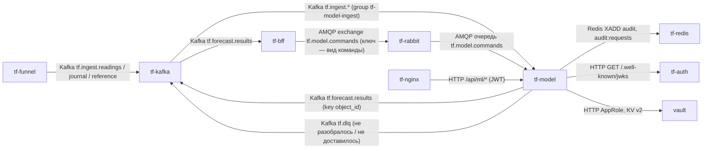

Часовой такт:

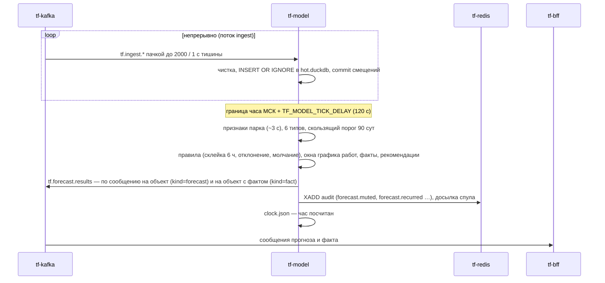

Команда диспетчера:

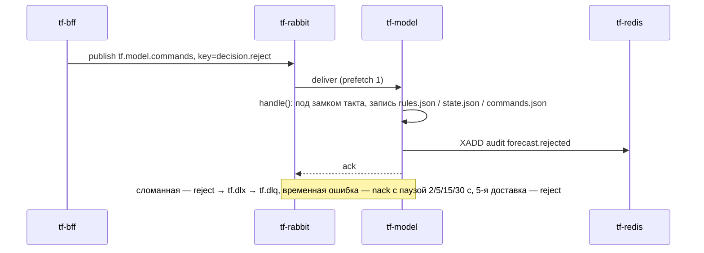

### 3. Интерфейсы

**Входящие.** Все HTTP-ручки доступны и с префиксом `/api/ml`, и без него (`ML/service/api.py:124-126`).

| Протокол | Адрес/путь/топик/очередь | Кто вызывает | Авторизация | Что делает |
|---|---|---|---|---|
| Kafka consume | `tf.ingest.readings`, `tf.ingest.journal`, `tf.ingest.reference`; `group.id = tf-model-ingest`; `auto.offset.reset = earliest`; автокоммит выключен (`ML/service/ingest.py:85-97`) | `tf-funnel` (пишет) | SASL PLAIN, пользователь `tf-model` | события — в горячий журнал; `channel.status` и строки справочника — сразу в таблицы (`ingest.py:139-191`) |
| AMQP consume | очередь `tf.model.commands` (vhost `tf`), пассивное объявление, `prefetch 1` (`commands.py:88-115`) | `tf-bff` публикует в exchange `tf.model.commands` | учётка RabbitMQ `tf-model` | команды §13.3 (раздел 4.3) |
| HTTP GET | `/health`, публично `/api/ml/health` | Docker, nginx | нет | `{ok, clock, last_hour}` (`core.py:723-725`) |
| HTTP GET | `/status` | админ-панель через BFF или напрямую | JWT: пользователь или техучётка с `ml.read` | версии, настройки, пороги, свежесть, счётчики приёма (`core.py:727-743`) |
| HTTP GET | `/estimate?type=&share=` | админ-панель (ползунок доли) | как `/status` | сколько тревог в сутки при доле `share` (`core.py:745-755`) |
| HTTP GET | `/forecast?object_id=` | BFF | только техучётка с `ml.read` | последнее сообщение прогноза по объекту (`api.py:103-108`) |
| HTTP GET | `/history?object_id=&type=&from=&to=` | BFF | только техучётка с `ml.read` | оценки, порог и статус по часам, не длиннее 100 суток (`api.py:110-122`) |

Публичный путь `/api/ml/*` → `tf-model:8000`, префикс не срезается, `proxy_read_timeout 60s` — есть в think-infra
ветке `dev` на 8a18c26 (`web-server/nginx/nginx.conf.template`, `ML_HOST`/`ML_PORT` по умолчанию `tf-model:8000` в
`web-server/scripts/generate-nginx-config.sh`); есть ли маршрут на prod — не проверено.

**Исходящие**

| Протокол | Куда | Зачем | Что при недоступности |
|---|---|---|---|
| Kafka produce | `tf.forecast.results`, `acks=all`, идемпотентный продюсер, `message.max.bytes` 1 МБ (`outbox.py:86-116`) | прогноз и факт, ключ `object_id` | неподтверждённое — в `tf.dlq` с заголовками `reason`, `topic`, счётчик `failed`; такт не останавливается |
| Kafka produce | `tf.dlq` | входное сообщение, которое не разобралось (`outbox.py:116-120`) | теряется, счётчик `failed` |
| AMQP | `tf-rabbit:5672/tf` | чтение команд | переподключение с паузой 2→60 с, прогнозы считаются (`commands.py:88-115`) |
| Redis | `tf-redis:6379`, потоки `audit`, `audit:requests` | события аудита, журнал запросов | события в `/work/service/out/audit.jsonl`, досылка на каждом такте (`core.py:280-283`) |
| HTTP | `tf-auth:8080/.well-known/jwks` | ключ RS256 (кэш 1 ч) | ручки с токеном — 503 |
| HTTP | `vault:8200` | секреты при старте | как у всех сервисов tfkit: ждёт `TF_VAULT_WAIT`, потом падает |

### 4. Контракты данных

#### 4.1 Вход — `tf.ingest.*`

Формат событий и `channel.status` задаёт `tf-funnel` (см. его раздел 4.2). Модель принимает также старый вид
`{"channel_id", "ts", "value"}` (`ingest.py:115-123`). Из `tf.ingest.reference` читаются ещё строки справочника
`{"kind":"object", "ид_объект", "иерархия_уровень", "родитель", "вид_объекта", "диспетчерское_название_объекта"}` и
`{"kind":"channel", "ид_канала_данных", "тип_инж_системы", "тип_датчика", "тег_инженерной_системы",
"название_датчика", "ид_объект"}` (`ML/service/storage.py:91-122`). Кто их публикует — не знаю (воронка — нет).
Чистка совпадает с исследованием: канал вне справочника и дата в канале «Состояние охраны» отбрасываются
(`storage.py:142-157`); не разобралось (не JSON, нет полей) — в `tf.dlq` (`ingest.py:169-173`).

#### 4.2 Выход — `tf.forecast.results`

Ключ — `object_id` строкой. Одно сообщение — один объект и один час (`outbox.py:14-19`, `core.py:330-385`).

```json
{"schema": 1, "kind": "forecast", "object_id": 5122, "hour_end": "2026-09-29T15:00+03:00",
 "horizon_hours": 24, "model_version": "export-2026-09-23", "clock": "live",
 "types": {
   "fire": {"score": 0.981, "threshold": 0.975, "alarm": true, "since_hours": 4, "confidence": 0.31,
            "reasons": [{"feature": "smoke_24h", "value": 3.0}],
            "evidence": [{"sensor_id": 7001, "ts": "2026-09-29T14:50:12+03:00", "value": "Пожар"}],
            "silent": ["smoke"],
            "recommendation": {"mode": "прогноз", "now": [], "visit": {}, "produced_by": "rules", "version": "…"}},
   "gas": {"score": 0.402, "threshold": 0.974, "alarm": false, "stale_hours": 1.5}
 },
 "object_recommendation": {"…": "…"}}
```

| поле | тип | обяз. | смысл |
|---|---|---|---|
| `schema` | int | да | версия формата, сейчас 1 |
| `kind` | `forecast` \| `fact` | да | прогноз или канал «по факту» |
| `object_id` | int | да | объект |
| `hour_end` | ISO с `+03:00`, до минут | да | конец посчитанного часа |
| `horizon_hours` | int | только `forecast` | 24 |
| `model_version` | string | да | версия выгрузки модели |
| `clock` | `live` \| `replay` | да | `replay` — демонстрационное время: BFF по нему заявок не создаёт |
| `types.<тип>.score` | float 0…1 | да | среднее рангов моделей типа, не вероятность |
| `types.<тип>.threshold` | float | да | квантиль оценок парка за 90 суток на долю из `operating.json` |
| `types.<тип>.alarm` | bool | да | тревога после правил и окон работ |
| `since_hours` | int | при тревоге | сколько часов тревога горит |
| `confidence` | float | при тревоге, если посчиталась | калиброванная доля подтверждений, снижена за молчащие семейства датчиков |
| `reasons` | `[{feature, value}]` | при тревоге | 3 главных признака |
| `evidence` | `[{sensor_id, ts, value}]` | при тревоге | до 5 последних событий каналов семейств типа за 24 ч |
| `silent` | `[семейство]` | если есть | семейства датчиков типа, молчащие по `channel.status` |
| `stale_hours` | float | если есть | часы без событий семейств типа по всему парку, если больше порога (1 ч; подтопление 3; проникновение 12) |
| `recommendation`, `object_recommendation` | object | при тревоге | меры по словарю (`ML/INTEGRATION.md` §2.3) |

Сообщение `kind: fact` (`outbox.py:44-53`, `core.py:387-441`) — только живые эпизоды часа:

```json
{"schema": 1, "kind": "fact", "object_id": 5122, "hour_end": "2026-09-29T15:00+03:00",
 "model_version": "export-2026-09-23", "clock": "live",
 "types": {"gas": {"started_at": "2026-09-29T14:12+03:00", "last_at": "2026-09-29T14:55+03:00", "new": true,
                   "note": "…", "work_id": 17},
           "blind": {"started_at": "…", "last_at": "…", "new": true, "cause": "…", "share": 0.8, "possible_accident": true}}}
```

`new: true` — объявление, `false` — обновление того же эпизода. `note`/`work_id` — эпизод в окне графика работ.
У `intrusion` — `route`, у `fire` при жаре — `temperature`; типы только по факту — `temperature`, `blind` (§13.11).
Отказавшее при доставке — в Kafka `tf.dlq` с заголовками `reason`, `topic`.

#### 4.3 Команды — RabbitMQ `tf.model.commands`

Ключ маршрута — вид команды. Конверт (издатель — think-bff `BFF/src/BFF.WebApi/Notifications/ModelCommandPublisher.cs`,
snake_case, `issued_at` — UTC со смещением):

```json
{"schema": 1, "command_id": "7c9e6679-7425-40de-944b-e07fc1f90ae7", "kind": "decision.reject",
 "issued_at": "2026-09-29T05:14:00+00:00", "issued_by": {"sub": "…", "login": "petrova"},
 "request_id": "e81b07c4f2a9", "payload": {"prediction_id": 1, "object_id": 5122, "type": "gas", "reason_code": "…"}}
```

| `kind` | `payload` | действие модели (`core.py:488-720`) | аудит |
|---|---|---|---|
| `decision.take` | `object_id`, `type` | в статистику правил | — |
| `decision.reject` | + `reason_code` | правило отклонения (газ, подтопление), остальным — история | `forecast.rejected` |
| `decision.mute` | + `until` (ISO) | молчание пары до `until`; прошедший `until` — отказ | `forecast.muted` |
| `decision.reopen` | `object_id`, `type` | снять отклонение | `forecast.reopened` |
| `decision.confirmed` | `object_id`, `type`, `incident_id`, `occurred_at` | метка; если пара была под отклонением — «переросло» | `forecast.recurred` |
| `settings.operating` | весь `operating.json`: `version`, `types` {доля `share`, `reject_k`}, `reason` | новые доли со следующего часа | `settings.changed` |
| `settings.works` | `version`, `rows` — вся таблица графика работ | окна молчания со следующего часа | `works.changed` |
| `settings.gaps` | `version`, `rows` [{a, b, comment}] | часы выпадают из порога, флаг «нужно переобучение» | `gaps.changed` |
| `model.switch` | `type`, `version_id` (0/`main` — основная), `reason` | другая версия типа, порог по её ретропрогону | `model.switched` |
| `retrain.request` | `strategy`, `reason` | очередь переобучения, если `TF_MODEL_RETRAIN=on`; иначе отказ | `retrain.requested` (`denied`), `retrain.finished` |

Ответ брокеру (`commands.py:1-72`): `ack` — применено, `command_id` уже видели (помнится 50 000, `core.py:35`) или
снимок настроек не новее текущего; `reject` без повтора (→ DLX `tf.dlx` → очередь `tf.dlq`) — не JSON, не `schema 1`,
неизвестный вид, неверный `payload`; `nack` с повтором через 2/5/15/30 с — временная ошибка; на 5-й доставке — `reject`.
Подтверждение — только после записи состояния на том.

#### 4.4 HTTP-ответы

`/health`: `{"ok": true, "clock": "live", "last_hour": "2026-09-29T15:00+03:00"}` — 200 всегда, `ok=false` до загрузки моделей.

`/status`: `env`, `clock`, `model` {`version`, `types`: {тип: {`version`, `available`}}}, `settings` (весь
`operating.json`), `works` {`version`, `rows`, …}, `gaps`, `retrain` {`enabled`, `needed`, `reason`}, `thresholds`,
`freshness_hours`, `last_tick` {`hour_end`, `seconds`, `features_seconds`, `objects`, `alarms`, `muted`, `rejected`,
`facts`, `stale`, `sweep`}, `ingest` {`accepted`, `dropped`, `dead`, `reference`, `written_at`}.

`/estimate`: `{"type", "share", "current_share", "threshold", "alarms_per_day", "window_days"}`
(`ML/service/settings.py:98-109`); 400 — тип не из шести или доля вне (0, 1).

`/history`: `{"object_id", "type", "hours": [{"hour_end", "score", "threshold", "model_version", "status", "reason", "ref"}]}`,
`status` — `ALARM`, `MUTED`, `REJECTED` или `null` (`ML/service/fclog.py:58-73`); по умолчанию 7 суток; 400 — период
не в порядке или длиннее 100 суток.

Коды: 401 — нет токена или он не прошёл проверку (`token.refused`); 401 без события — срок истёк; 403 — нет `ml.read`
или пользовательский токен на `/forecast`, `/history` (`access.denied`); 404 — по объекту расчёта ещё нет; 503 — нет
ключа проверки токенов. Ошибки FastAPI — `{"detail": "…"}`.

### 5. Данные и состояние

Всё — на томе `tf-ml-work` в `/work` (`TF_WORK`) и в пакете модели `/models/current` (только чтение). PostgreSQL не
используется (схемы `ml` нет).

| файл | что | код |
|---|---|---|
| `/work/service/hot.duckdb` | горячий журнал: `ev_all` (100 суток + вся история «Состояние охраны»; ключ `channel_id, ts, value`), `obj`, `ch` (справочники), `ch_status` (молчание каналов) | `storage.py:27-38`, `svc.py:29` |
| `/work/service/out/forecasts.duckdb` | журнал прогнозов: `fc_score`, `fc_status`, `fc_thr`, 100 суток | `fclog.py:23-33` |
| `/work/service/out/history.parquet` | история оценок парка для порога (90 суток) | `svc.py:37` |
| `…/out/rules.json`, `state.json`, `commands.json`, `clock.json`, `last.json`, `observe.json`, `retrain.json` | состояние правил, версии по типам, увиденные `command_id`, последний час, последнее сообщение по объекту, наблюдение, переобучение | `svc.py:37-70` |
| `…/out/audit.jsonl`, `audit-requests.jsonl` | спул аудита, пока Redis лежит | `svc.py:70`, `tfkit.py:369-374` |
| `…/out/results.ndjson` | выход при `TF_MODEL_SINK=file` | `outbox.py:74-83` |
| `/work/service/settings/` | `operating.json` и `operating_versions/`, график работ, игнорируемые периоды с версиями; первая версия — из `/models/current/settings` или `ML/settings` | `svc.py:43-46`, `core.py:108-118` |
| `/models/current` | пакет модели: `manifest.json`, модели CatBoost/XGBoost/PyTorch, шкалы, `history/h_2025.npy`, версии типов, `settings/` | `ML/INTEGRATION.md` §13.6 |

Первый такт на пустом томе заливает справочники из CSV образа (`core.py:154-155`) и поднимает историю порога по
витрине 2025 из пакета (`core.py:177-183`). Stateful: **один экземпляр** — DuckDB-файлы открыты одним процессом,
такт считается один раз за час; второй экземпляр с тем же томом не поднимется, с другим — продублирует прогнозы.
При перезапуске ничего не теряется: смещения Kafka коммитятся только после записи пачки (`ingest.py:179-185`), час
в `clock.json` пишется атомарно после такта (`clock.py:77-87`), команды подтверждаются после записи. Пропущенные,
пока сервис лежал, часы не досчитываются — в лог «такт: пропущено часов N» (`clock.py:75-81`).

### 6. Безопасность и политики

- Токен — `tfkit.Verifier` (`docs/backend/tfkit/tfkit.py:191-265`): RS256, обязательны `exp`, `sub`; `aud = api`;
  `iss` ∈ {`auth-service`, `tf-auth`}; `typ`/`token_type` = `access`. Техучётка — по `kind: service`, по наличию `scope`
  или по `sub` из `TF_MODEL_SERVICE_SUBS` (Vault `secret/tf/app/tf-model`); право — `ml.read` (`api.py:28`, `api.py:65-83`).
- `/forecast`, `/history` — только техучётка; `/status`, `/estimate` — ещё и пользователь (права пользователя модель не
  проверяет — это делает BFF, `api.py:13-16`).
- Без ключа (`TF_AUTH_PUBLIC_KEY`, `TF_AUTH_JWKS` пусты) при `TF_ENV=dev` ручки открыты; в prod ключ берётся с JWKS
  (`api.py:31-42`).
- Аудит (`service = "ml"`, `core.py:80-84`): `token.refused`, `access.denied` (в `details` — `reason`, `jti`),
  `forecast.muted`, `forecast.rejected`, `forecast.reopened`, `forecast.recurred`, `settings.changed`, `works.changed`,
  `gaps.changed`, `model.switched`, `retrain.requested`, `retrain.finished`. Для команд `actor_kind=user`,
  `actor_id`/`actor_login` — из `issued_by`, `request_id` — из конверта (`core.py:472-485`). Журнал запросов —
  `audit:requests`, кроме `/health` (`api.py:127-128`).
- Не пишутся: токены (только `jti`), пароли, тела запросов; поля `password`, `token`, `authorization`, `cookie`,
  `text`, `body` в `details` запрещены (`tfkit.py:271-295`). Значения секретов в лог не выводятся (`tfkit.py:147-162`).
- Процесс не от root (uid 10001), единственное место записи — `/work` (`ML/service/Dockerfile:33-38`).

### 7. Конфигурация

| Переменная | По умолчанию | Обязательна | Секрет (путь Vault → ключ) | Смысл |
|---|---|---|---|---|
| `TF_ENV` | `prod` | нет | — | `dev`: секреты из окружения, выход в файл, ручки без ключа |
| `TF_MODEL_CLOCK` | `live` | нет | — | `live` или `replay:<начало ISO>:<скорость>` (раздел ниже) |
| `TF_MODEL_TICK_DELAY` | `120` | нет | — | секунд после границы часа до такта (`clock.py:23`) |
| `TF_MODEL_BUNDLE` | `/models/current` (образ) | да | — | пакет модели |
| `TF_WORK` | `/work` (образ) | нет | — | рабочий том |
| `TF_MEMORY` | `2GB` | нет | — | предел памяти DuckDB горячего журнала (`storage.py:249-251`); prod — `1GB` |
| `TF_MODEL_SINK` | `kafka`, в dev — `file` | нет | — | куда писать прогнозы (`main.py:31-34`) |
| `TF_KAFKA_BOOTSTRAP` | `tf-kafka:9092` | нет | — | `off` — без приёма |
| `TF_KAFKA_MODEL_PASSWORD` | — | да (prod) | `secret/tf/kafka/model` → `TF_KAFKA_MODEL_PASSWORD` | пароль Kafka `tf-model` (`svc.py:99-109`) |
| `TF_RABBIT_URL` | `amqp://tf-rabbit:5672/tf` | нет | — | без пароля; `off` — без команд |
| `TF_RABBIT_MODEL_PASSWORD` | — | да (prod) | `secret/tf/rabbit/model` → `TF_RABBIT_MODEL_PASSWORD` | пароль RabbitMQ `tf-model` (`commands.py:75-85`) |
| `TF_REDIS_URL` | `redis://tf-redis:6379/0`, в dev — пусто (спул) | нет | `secret/tf/redis` → `TF_REDIS_PASSWORD` | поток аудита |
| `TF_AUTH_PUBLIC_KEY` / `TF_AUTH_JWKS` | нет / `http://tf-auth:8080/.well-known/jwks` | нет | не секрет | ключ токенов |
| `TF_MODEL_SERVICE_SUBS` | пусто | нет | `secret/tf/app/tf-model` → `TF_MODEL_SERVICE_SUBS` | `sub` техучёток без `scope` |
| `VAULT_ADDR`, `VAULT_ROLE_ID`, `VAULT_SECRET_ID` | нет | да (prod) | пара роли `tf-svc-tf-model` | вход AppRole; или `VAULT_TOKEN` / `VAULT_TOKEN_FILE` |
| `TF_VAULT_WAIT` | `0` (в выкатках `900`) | нет | — | ожидание запечатанного Vault |
| `TF_MODEL_SETTINGS` | `/work/service/settings` | нет | — | таблицы главного диспетчера |
| `TF_MODEL_RETRAIN` | `off` | нет | — | `on` — очередь переобучения (`core.py:36`) |
| `TF_WORKS`, `TF_GAPS` | `ML/settings/works_2026.csv`, нет | нет | — | первая версия графика работ и игнорируемых периодов |
| `TF_MODEL_API_HOST`, `TF_MODEL_API_PORT` | `0.0.0.0`, `8000` | нет | — | HTTP (`svc.py:131-132`) |
| `TF_KIT` | рядом | нет | — | где лежит `tfkit.py` |
| `TF_JOURNAL` | `ML/journal` | нет | — | csv журнала для `--import` (стенд) |

**Секреты** сервис берёт сам через `tfkit.secret` по AppRole (`tfkit.py:57-162`), без `vault-entrypoint.sh`; пути —
`kafka/model`, `rabbit/model`, `redis`, `app/tf-model` (think-infra `hashicorp/services.conf`, ветка `dev`). Секреты
читаются при старте и живут в памяти процесса.

**`TF_MODEL_CLOCK`** (`clock.py:1-11`): `live` — такт на границе часа МСК + 120 с, по настоящему времени;
`replay:2026-01-01T07:00:3600` — проигрыш тестового года с указанного часа, модельный час за 3600/N реальных секунд;
сообщения с `clock: "replay"`, заявок по ним BFF не создаёт. На dev и prod — `live`. Другие режимы — ключи запуска
(`main.py:1-13`): `--loop` (контур, `CMD` образа), `--tick-now ВРЕМЯ` (один такт), `--replay НАЧАЛО --days N`
(такты подряд без ожидания), `--import` (журнал из csv в пустой горячий журнал).

### 8. Сборка и запуск

- **Dockerfile**: `ML/service/Dockerfile`, контекст — корень репозитория; `python:3.12-slim`, torch 2.5.1 CPU, duckdb,
  polars, xgboost, catboost, fastapi, confluent-kafka, pika, redis (`Dockerfile:19-23`); в образе код `ML/pipeline`,
  `ML/service`, `ML/settings`, `tfkit`, два справочника датасета; моделей и секретов нет. `USER tfmodel` (10001),
  `VOLUME /work`, `EXPOSE 8000`, `HEALTHCHECK` — `GET /health` каждые 30 с, старт 120 с; `ENTRYPOINT python main.py --loop`.
- **Пакет модели** запекается вторым слоем в `/models/current`: архив `model-pa3.tar.gz` из приватного релиза
  `dev-assets` этого репозитория (`deploy-model-dev.yml:49-60`). Поэтому образ **не публикуется** в реестр.
- **dev** — `.github/workflows/deploy-model-dev.yml`: push в `main` по `ML/service/**`, `ML/pipeline/**`, `ML/settings/**`,
  `docs/backend/tfkit/**` или вручную. Сборка в CI → `docker save` → scp → `docker load`, тег `tf-model:dev`. Секреты
  окружения `dev`: `TF_MODEL_VAULT_ROLE_ID`, `TF_MODEL_VAULT_SECRET_ID`; без них образ только собирается.
  `--memory 4g`, `TF_MEMORY` по умолчанию (2GB).
- **prod** — `.github/workflows/deploy-model-prod.yml`, только вручную; так же файлом, тег `tf-model:prod`; секреты
  окружения `prod`: `MODEL_VAULT_ROLE_ID`, `MODEL_VAULT_SECRET_ID`; репозитория: `PROD_IP`, `PROD_USER`, `PROD_SSH_KEY`.
  Docker — через `sudo -n /usr/local/bin/tf-docker`. `--memory 2500m`, `TF_MEMORY=1GB` («свободно ~3,5 ГБ»,
  `deploy-model-prod.yml:1-5`, `:107-122`). Проверки: `State.Running`, нет `permission denied`; прежний образ удаляется.
- **Контейнер**: `tf-model`, сеть `think-fast-net`, порт 8000 без публикации, том `tf-ml-work:/work`,
  `--restart unless-stopped`, `TF_ENV=prod`, `VAULT_ADDR=http://vault:8200`, `TF_VAULT_WAIT=900`,
  `TF_REDIS_URL=redis://tf-redis:6379/0`, `TF_AUTH_JWKS=http://tf-auth:8080/.well-known/jwks`, `TF_MODEL_CLOCK=live`.
- **Локальный стенд**: `docs/backend/compose.yml:29-42` (пакет монтируется из `TF_MODEL_BUNDLE_DIR`).

**Порядок запуска.** Vault — обязателен (пароли Kafka и RabbitMQ вне dev `required`); ждёт `TF_VAULT_WAIT`. Kafka —
не обязательна при старте: поток приёма падает и перезапускается через 30 с (`main.py:45-52`), продюсер копит и
отдаёт в DLQ. RabbitMQ — не обязателен: поток команд переподключается. Redis — не обязателен (спул). tf-auth — только
для ручек с токеном.

**Ручная выкатка и откат.** Повтор workflow (`Actions → Deploy tf-model to dev/prod → Run workflow`). Вручную:

```bash
docker build -f ML/service/Dockerfile -t tf-model:base .
```

затем слой с пакетом (`printf 'FROM tf-model:base\nCOPY --chown=10001 . /models/current\n' | docker build -t tf-model:dev -f - bundle`),
`docker save` → на сервер → `docker load` и `docker run` как в `deploy-model-dev.yml:106-119`. Прежний образ после
выкатки удаляется — откат = выкатка с прежнего коммита (и прежнего `MODEL_ASSET`). Том `/work` при откате остаётся;
если новая версия поменяла формат файлов на томе — не проверено, совместим ли откат.

### 9. Эксплуатация

- **Жив**: `GET /api/ml/health` → `ok: true`, `last_hour` не старше часа с небольшим. `/status`: `last_tick.seconds`,
  `ingest.written_at` (свежесть приёма), `ingest.dead`, `freshness_hours`, `last_tick.stale`.
- **Строки лога**: `сервис: часы live, API :8000` — старт; `такт <время>: {…}` — каждый час; `RabbitMQ: читаю
  tf.model.commands`; `команда <id> <вид>: ok`; предупреждения — `приём Kafka упал — снова через 30 с`,
  `такт … не прошёл — повтор через минуту`, `такт: пропущено часов N`, `версия <тип> vN не поднялась`,
  `RabbitMQ: <ошибка> — снова через N с`, `поток аудита недоступен`, `жду распечатывания Vault`.
- **Время**: признаки всего парка ≈ 3 с, прогноз — секунды (`ML/INTEGRATION.md` §7, §12.3); точные замеры на prod —
  в `last_tick.seconds`. Обучение в сервисе по умолчанию выключено; в исследовании бустинг учится минуты, сети —
  часы на RTX 3050 (`ML/INTEGRATION.md` §3); переобучение внутри контейнера на CPU — не проверено.
- **Перезапуск**: `docker restart tf-model` — такт не повторится, приём дочитает с последнего коммита.
- **Миграций нет**; справочники обновляются через `tf.ingest.reference` или пересборкой образа.
- **Смена пакета модели**: новый архив в релиз `dev-assets`, новое имя в `MODEL_ASSET` обоих workflow, выкатка.
- **Настройки** (доли, график работ, периоды, версия модели) меняются только командами через BFF, не файлами.
- **Очистка**: горячий журнал чистится каждый такт (`retention_sweep`), журнал прогнозов — в полночь (`fclog.sweep`).
  Полный сброс — `docker rm -f tf-model && docker volume rm tf-ml-work` (теряются история порога, решения, настройки).

### 10. Ошибки и проблемы

| Симптом | Причина | Как исправить |
|---|---|---|
| такт падал `IndexError` на новом prod | пустая база: `np.array([])` давал `float64` вместо целых индексов (28.09) | исправлено в 7cfe8f2 |
| такт падал `IndexError` после 2026-07-01 | календарь признаков кончался на `DATA_END` (Н23) | исправлено: календарь строится на нужное число часов |
| приём останавливался на первой паузе, одно сломанное сообщение роняло приём | Н24 | исправлено: `consume()` ждёт дальше, сломанное — в `tf.dlq` |
| 120 одинаковых сообщений в час | такт каждые 30 с (Н1) | исправлено: `clock.py` |
| 403 `ручка только для техучётки` на `/forecast`, `/history` | think-auth кладёт во все токены `kind: user`, а `kind` проверяется раньше `TF_MODEL_SERVICE_SUBS` (`tfkit.py:261-265`) | нужен токен техучётки от think-auth (раздел 14) |
| 503 `аутентификация не отдала публичный ключ` | tf-auth недоступен | поднять tf-auth |
| 404 `по объекту N расчёта ещё нет` | такт ещё не прошёл после старта на пустом томе | дождаться границы часа + 120 с |
| выкатка prod: `Vault отказал во входе (permission denied)` | неверная пара `MODEL_VAULT_*` | выдать `setup.sh service-credentials tf-model` |
| в логе `RabbitMQ: ChannelClosedByBroker — снова через N с` | очереди `tf.model.commands` нет (объявление пассивное) или нет прав | завести очередь в think-infra `rabbitmq/definitions.json` |
| выкатка на dev «образ собран, выкатка пропущена» | нет `TF_MODEL_VAULT_*` в окружении `dev` | завести роль и пару |
| контейнер перезапускается, `OOMKilled` в `docker inspect` | нехватка памяти (DuckDB, torch, CatBoost в памяти) | уменьшить `TF_MEMORY`, увеличить `--memory`; такт продолжится со следующего часа |
| `stale: true`, `stale_hours` в сообщениях | поток встал (воронка, шина или эмулятор) | проверить `tf-funnel` `/status` |

### 11. Ограничения и известные недоработки

- **Память**: DuckDB горячего журнала ограничен `TF_MEMORY` (2 ГБ dev, 1 ГБ prod), но журнал прогнозов
  (`forecasts.duckdb`) — без явного предела (`fclog.py:26`); плюс модели в памяти. При OOM Docker убивает процесс,
  текущий час пересчитывается после перезапуска, если граница не ушла; иначе час пропускается. Замеров пикового
  потребления на prod нет — не проверено.
- `bulk_import` 100 суток одним INSERT не укладывается в 2 ГБ — поэтому порциями по неделе (`storage.py:180-191`).
- Диск `/work`: горячий журнал 100 суток плюс вся охрана; объём на реальном потоке — не проверено.
- Один экземпляр, масштабирования нет.
- Пропущенные часы не досчитываются.
- Справочник объектов в образе (Н26): новые объекты — только через `tf.ingest.reference` (кто пишет туда строки
  `object`/`channel` — не знаю) или новый образ.
- Переобучение выключено; при включении обучает в том же контейнере — риск по памяти и CPU.
- Kafka `tf.dlq` и очередь RabbitMQ `tf.dlq` называются одинаково — это разные сущности.
- На prod горячий журнал пуст, пока нет шины: признаки считаются по пустым данным (7cfe8f2).

### 12. Возможности доработки

| доработка | приоритет | объём |
|---|---|---|
| согласовать с think-auth токены техучёток (`kind: service`/`scope ml.read`) для BFF | высокий | 1 день (с think-auth) |
| предел памяти DuckDB для `forecasts.duckdb`, замер пика памяти на prod | высокий | 0,5 дня |
| метрики (Prometheus): длительность такта, лаг приёма, DLQ | средний | 1 день |
| досчёт пропущенных часов по флагу | низкий | 0,5 дня |
| справочник из BFF/топика вместо CSV в образе | средний | 1–2 дня |
| PostgreSQL-схема `ml` вместо DuckDB-файлов (§11 INTEGRATION) | низкий | 3–5 дней |

### 13. Как интегрироваться и что менять

- **Читать прогнозы**: ACL на чтение `tf.forecast.results` (think-infra `kafka/acls.conf`), своя группа; учитывать
  `kind` и `clock`; повтор сообщения возможен (идемпотентность по `object_id` + `hour_end`).
- **Слать команды**: право записи в exchange `tf.model.commands` (сейчас только `tf-bff`), конверт раздела 4.3,
  уникальный `command_id`.
- **HTTP**: токен техучётки с `scope` `ml.read` (или `sub` в `TF_MODEL_SERVICE_SUBS`), путь `/api/ml/...`.
- **С инфраструктурой согласовать**: новые топики и ACL (группы с префиксом `tf-model`), очереди RabbitMQ, пути Vault
  (`services.conf`: `tf-model kafka/model rabbit/model redis app/tf-model`), маршрут nginx `/api/ml/`, память сервера.

### 14. Открытые вопросы

- think-auth не выпускает токенов техучёток: все токены с `kind: user`. Как BFF будет вызывать `/forecast`, `/history`?
  Сейчас BFF эти ручки не зовёт (в think-bff вызовов не найдено).
- Кто публикует строки справочника `object`/`channel` в `tf.ingest.reference`.
- Маршрут `/api/ml/` на prod nginx — не проверено.
- Бюджет памяти prod: хватит ли 2500 МБ при реальном потоке — не проверено.
- Включать ли переобучение (`TF_MODEL_RETRAIN`) в контуре и на каком железе.
- Роль `tf-svc-tf-model` и пара `TF_MODEL_VAULT_*` на dev заведены ли — не проверено.


Ссылки `файл:строка` без каталога — относительно `docs/backend/audit/`, `tfkit.py` — `docs/backend/tfkit/`, workflow — `.github/workflows/`; пути think-infra и think-auth — в их репозиториях.

## tf-audit — сервис аудита

> Источник: репозиторий **Think-Faster**, `main@7cfe8f2`. Раздел написан агентом репозитория.

### 1. Назначение

Сервис переносит журнал действий и журнал запросов из потоков Redis `audit` и `audit:requests` в PostgreSQL
(схема `audit`, таблицы `audit.events` и `audit.requests`) и отдаёт журнал действий на чтение техучётке BFF
(`docs/backend/audit/audit.py:1-23`). Сервисы контура (`tf-funnel`, `tf-model`, сам `tf-audit`; notify из `docs/backend/notify` — контейнер `tf-notify`;
по замыслу — `tf-bff`, `tf-auth`) пишут события `XADD` в Redis и работают дальше, не дожидаясь базы
(права-и-аудит §6.5, вариант Б). Сервис — последний рубеж §6.3: вырезает из событий пароли, токены, куки и тела.
Правку и удаление строк журнала запрещают триггеры базы (`docs/backend/audit/schema.sql:118-133`).

### 2. Схема взаимодействия

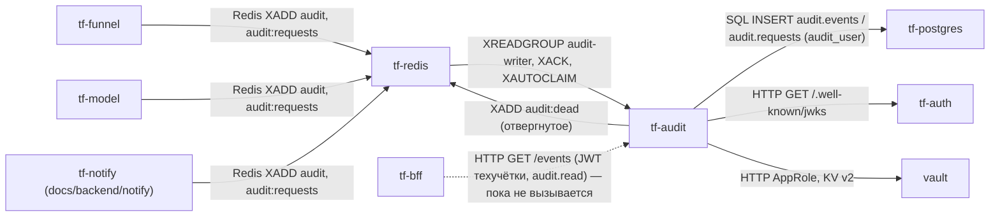

Запись пачки:

```mermaid
sequenceDiagram
    participant S as tf-model
    participant R as tf-redis
    participant A as tf-audit
    participant P as tf-postgres
    S->>R: XADD audit MAXLEN ~1000000 поле event = JSON события
    A->>R: XREADGROUP GROUP audit-writer hostname STREAMS audit audit:requests > COUNT 500 BLOCK 5000
    R-->>A: пачка
    A->>A: разбор, §6.3 — вырезать запрещённые поля, плохое — в audit:dead
    A->>P: INSERT ... ON CONFLICT DO NOTHING (одной транзакцией)
    alt commit
        A->>R: XACK audit audit-writer id пачки
    else строка отвергнута базой
        A->>P: по одной, в точках сохранения
        A->>R: XADD audit:dead (причина), XACK всех
    else база недоступна
        Note over A: XACK нет — пачка перечитается, пауза 1→30 с
    end
```

### 3. Интерфейсы

**Входящие**

| Протокол | Адрес/путь/топик/очередь | Кто вызывает | Авторизация | Что делает |
|---|---|---|---|---|
| Redis Streams | `audit`, группа `audit-writer`, потребитель — имя хоста контейнера (`audit.py:48-49`, `audit.py:199`) | пишут `tf-funnel` (`funnel`), `tf-model` (`ml`), `tf-notify` (`notify`; на dev/prod не выкатывается — там почта и Telegram у `tf-mail`/`tf-tg` think-infra, пишут ли они аудит — не проверено), сам `tf-audit` (`audit`) | пароль Redis | журнал действий → `audit.events` |
| Redis Streams | `audit:requests`, та же группа | те же сервисы (журнал запросов) | пароль Redis | строка на HTTP-запрос → `audit.requests` |
| HTTP GET | `/events` (порт 8000) | техучётка BFF | JWT: техучётка с правом `audit.read` (`audit.py:430-444`) | журнал действий по фильтрам (`audit.py:450-464`) |
| HTTP GET | `/health` | Docker, мониторинг | нет | счётчики записи (`audit.py:446-448`) |

Публичного маршрута через nginx нет (в think-infra `nginx.conf.template` `/api/audit` не найдено); порт на хост не публикуется.

**Исходящие**

| Протокол | Куда | Зачем | Что при недоступности |
|---|---|---|---|
| PostgreSQL | `tf-postgres`, база `tf`, пользователь `audit_user` (`TF_AUDIT_DB`) | запись и чтение `audit.*`, вызов `audit.ensure_partitions()` раз в сутки (`audit.py:216-224`) | запись стоит, события ждут в потоке, пауза 1→2→…→30 с (`audit.py:333-349`); `/events` — 503 |
| Redis | `tf-redis:6379` | чтение потоков, `XACK`, `XAUTOCLAIM`, `XADD audit:dead` | запись стоит с той же паузой |
| Redis | поток `audit` | свои события `token.refused`/`access.denied` на чтении (`audit.py:519`) | строка события в лог процесса (спула у сервиса нет) |
| HTTP | `tf-auth:8080/.well-known/jwks` | ключ RS256 | `/events` — 503 |
| HTTP | `vault:8200` | секреты при старте | ждёт `TF_VAULT_WAIT`, затем выход |

### 4. Контракты данных

#### 4.1 Событие в потоке `audit` (права-и-аудит §6.4)

Запись потока — одно поле `event` со строкой JSON (`docs/backend/tfkit/tfkit.py:297-324`, `docs/backend/funnel/kit.go:508-534`):

```json
{"event_id": "3f1c0a52-8d1e-4a3b-9c55-0e7f7b2a9d11", "occurred_at": "2026-09-29T11:14:00.123456+00:00",
 "service": "ml", "event_type": "forecast.rejected", "outcome": "success",
 "actor_kind": "user", "actor_id": "b7a1c2d3-0000-4000-8000-000000000001", "actor_login": "petrova",
 "request_id": "e81b07c4f2a9", "ip": null, "object_type": "forecast", "object_id": "5122:gas:2026-09-29T14:00+03:00",
 "area_id": null, "details": {"reason_code": "…", "reject_k": 0.2}}
```

| поле | тип | обяз. | проверка сервисом аудита (`audit.py:119-161`) |
|---|---|---|---|
| `event_id` | uuid | нет | нет или не uuid — `uuid5` от id записи потока (повтор той же записи даст тот же ключ) |
| `occurred_at` | ISO 8601 | да | без зоны — считается МСК; раньше 2026-01-01 или позже «сейчас + 1 сут» — в `audit:dead` |
| `service` | строка ≤ 40 | да | `auth`, `bff`, `dispatch`, `funnel`, `ml`, `notify`, `audit` |
| `event_type` | `сущность.действие` (`^[a-z][a-z_]*(\.[a-z_]+)+$`) | да | иначе `audit:dead` |
| `outcome` | `success` \| `denied` \| `error` | да | иначе `audit:dead` |
| `actor_kind` | `user` \| `service` \| `anonymous` | да | иначе `audit:dead` |
| `actor_id` | uuid | нет | не uuid (например `sub` think-auth другого вида) — в `details.actor_sub`, колонка `null` |
| `actor_login`, `request_id`, `object_type`, `object_id` | строки | нет | обрезаются до 200/100/60/200 символов |
| `ip` | IP | нет | неразборчивый — `null` |
| `area_id` | int | нет | неразборчивый — в `details.area_raw` |
| `details` | объект ≤ 16 КБ JSON | нет | поля `password`, `token`, `authorization`, `cookie`, `text`, `body` на любой глубине вырезаются, список — в `details._dropped`; больше 16 КБ — `audit:dead` |

#### 4.2 Строка в потоке `audit:requests` (§6.1)

```json
{"occurred_at": "2026-09-29T11:14:00.123456+00:00", "service": "funnel", "method": "GET",
 "route": "/api/funnel/log", "status": 200, "duration_ms": 41, "actor_kind": "user",
 "actor_id": "b7a1c2d3-0000-4000-8000-000000000001", "request_id": "e81b07c4f2a9", "ip": "172.18.0.5"}
```

`route` — шаблон маршрута без строки запроса; с `?` — `audit:dead` (`audit.py:164-180`). Пробы `/health` не пишутся.

#### 4.3 Поток `audit:dead`

`{"stream": "audit", "id": "<id записи>", "event": "<исходная строка, до 64 КБ>", "reason": "<причина, до 500>"}`,
`MAXLEN ~100000` (`audit.py:242-245`).

#### 4.4 `GET /events`

Параметры (`audit.py:450-460`, `audit.py:358-401`): `event_type` (можно несколько; точное имя или префикс с точкой:
`forecast.`), `service`, `object_type`, `object_id`, `actor_login`, `request_id`, `outcome`, `since`, `until` (ISO),
`before_id` (страница: строки с `id` меньше), `limit` (по умолчанию 200, 1…1000). Новые сверху.

```json
[{"id": 1042, "event_id": "3f1c0a52-…", "occurred_at": "2026-09-29T14:14:00.123456+03:00",
  "received_at": "2026-09-29T14:14:01.002+03:00", "service": "ml", "event_type": "forecast.rejected",
  "outcome": "success", "actor_kind": "user", "actor_id": "…", "actor_login": "petrova",
  "request_id": "e81b07c4f2a9", "ip": null, "object_type": "forecast", "object_id": "5122:gas:…",
  "area_id": null, "details": {}}]
```

Коды: 200; 401 — нет токена или он не прошёл проверку (`token.refused`), протухший — без события; 403 — токен
пользователя (`журнал отдаётся только техучётке BFF`) или нет `audit.read` (`access.denied`); 503 — база недоступна
или нет ключа токенов. `/health`: `{"ok": true, "written", "duplicates", "dead", "lost", "last_write"}` (`audit.py:202`).
Версионирования нет.

### 5. Данные и состояние

Схема PostgreSQL `audit` (`schema.sql`):

| объект | назначение |
|---|---|
| `audit.events` | журнал действий §6.4 + `event_id`; секционирование по месяцам `occurred_at` (`events_ГГГГ_ММ`); ключи `(id, occurred_at)`, уникальный `(event_id, occurred_at)`; индексы BRIN по времени, по исполнителю, объекту, типу (`schema.sql:28-52`) |
| `audit.requests` | журнал запросов §6.1, секции по месяцам (`requests_ГГГГ_ММ`) (`schema.sql:54-67`) |
| `audit.ensure_partitions(months_back, months_ahead)` | создаёт недостающие месячные секции обеих таблиц; `security definer`; сервис зовёт её при старте и раз в сутки (`schema.sql:71-90`) |
| `audit.drop_old_requests(keep_days=90)` | удаляет секции `requests` старше 90 дней; только администратор (`schema.sql:99-116`) |
| `audit.forbid_change()` + триггеры | запрет `UPDATE`/`DELETE` (и `TRUNCATE` у `events`) всем, включая владельца (`schema.sql:120-133`) |

**Кто создаёт.** Задумано: схему `audit`, роли `audit_admin` и `audit_user` и их пароли создаёт bootstrap think-infra по
строке `audit` в `postgree/db/schemas.conf`, затем администратор прогоняет `schema.sql` под `audit_admin`
(`schema.sql:1-10`, `deploy-audit-dev.yml:6-11`). **Сейчас** в think-infra (ветка `dev` 8a18c26 и все остальные ветки)
в `schemas.conf` только `auth` и `bff`, а в `secrets.conf` нет `postgres/audit` — схема и пароль на dev/prod не
заводятся. На локальном стенде схему создаёт одноразовый `tf-audit-db-init` под суперпользователем `tf` и ставит
пароль `audit_user` (`docs/backend/stand.yml:130-150`). Приложение само таблиц не создаёт — только секции через функцию.

**Пароль**: Vault `secret/tf/postgres/audit` → ключ `TF_PG_AUDIT_USER_PASSWORD` (`audit.py:470-478`).

**Хранение (retention)**: `audit.events` — вечно (функции очистки нет, удаление строк запрещено; удалить можно только
секцию целиком `drop table`); `audit.requests` — 90 дней, но только когда администратор вызывает
`audit.drop_old_requests()` — расписания нет. Потоки Redis: `audit` и `audit:requests` — `MAXLEN ~1 000 000` у
производителей (`tfkit.py:274-276`, `kit.go:466`), `audit:dead` — ~100 000.

**Состояние сервиса**: только в Redis (позиция группы, неподтверждённые) и в PostgreSQL. Файл жизни
`/tmp/tf-audit.alive`. Счётчики `/health` — в памяти. Можно запускать несколько экземпляров: у каждого своё имя
потребителя (hostname), чужое зависшее дольше 60 с забирается `XAUTOCLAIM` (`audit.py:314-319`), повтор отбрасывается
`on conflict do nothing` по `(event_id, occurred_at)`. У `audit.requests` уникального ключа нет — при повторе пачки
строки журнала запросов задублируются. При перезапуске теряются только счётчики; имя потребителя меняется
(новый контейнер — новый hostname), неподтверждённое старого забирается через минуту.

### 6. Безопасность и политики

- Чтение `/events`: RS256 (`tfkit.Verifier`, `tfkit.py:191-265`), `aud = api`, `iss` ∈ {`auth-service`, `tf-auth`},
  `typ`/`token_type` = `access`; допускается **только техучётка** (`kind: service`, `scope`, или `sub` из
  `TF_AUDIT_SERVICE_SUBS`) с правом `audit.read`. Кто из людей что видит (история отклонённых прогнозов — только главный
  диспетчер) решает BFF (`audit.py:13-14`).
- Без ключа (`TF_AUTH_PUBLIC_KEY`, `TF_AUTH_JWKS` пусты): в dev чтение открыто; в prod — JWKS `tf-auth` (`audit.py:481-491`).
- Роль базы `audit_user`: `usage` на схему, `insert, select` на таблицы, `execute` на `ensure_partitions`;
  `update, delete, truncate` отозваны (`schema.sql:135-142`). Bootstrap think-infra может выдать шире — опора на
  триггеры, а не на права (`schema.sql:12-13`).
- Свои события сервиса (`service = "audit"`): `token.refused`, `access.denied` на `/events`; журнал запросов своих ручек.
- Чувствительное (§6.3): вырезается на любой глубине `details` (`audit.py:99-112`), в лог — только имена вырезанных
  полей и тип события. Значения секретов и DSN с паролем не логируются: пароль передаётся отдельно от строки
  подключения (`audit.py:476-477`).
- Процесс — пользователь `tfaudit` (uid 10002) (`docs/backend/audit/Dockerfile:13-14`).

### 7. Конфигурация

| Переменная | По умолчанию | Обязательна | Секрет (путь Vault → ключ) | Смысл |
|---|---|---|---|---|
| `TF_ENV` | `prod` (образ) | нет | — | `dev`: секреты из окружения, чтение без ключа |
| `TF_REDIS_URL` | `redis://tf-redis:6379/0` | нет | `secret/tf/redis` → `TF_REDIS_PASSWORD` | Redis без пароля в адресе (`tfkit.py:165-175`) |
| `TF_AUDIT_DB` | `host=tf-postgres dbname=tf user=audit_user` | нет | — | строка подключения без пароля |
| `TF_PG_AUDIT_USER_PASSWORD` | — | да (prod) | `secret/tf/postgres/audit` → `TF_PG_AUDIT_USER_PASSWORD` | пароль `audit_user`; переменная — только в dev |
| `TF_AUDIT_PORT` / `--port` | `8000` | нет | — | HTTP |
| `TF_AUTH_PUBLIC_KEY` / `TF_AUTH_JWKS` | нет / в prod `http://tf-auth:8080/.well-known/jwks` | нет | не секрет | ключ токенов |
| `TF_AUDIT_SERVICE_SUBS` | пусто | нет | `secret/tf/app/tf-audit` → `TF_AUDIT_SERVICE_SUBS` | `sub` техучёток без `scope` |
| `VAULT_ADDR`, `VAULT_ROLE_ID`, `VAULT_SECRET_ID` | нет | да (prod) | пара роли `tf-svc-tf-audit` | вход AppRole |
| `TF_VAULT_WAIT` | `0` (в выкатках `900`) | нет | — | ожидание запечатанного Vault |
| `TF_KIT` | рядом | нет | — | путь к `tfkit.py` |

**Секреты** — сам через `tfkit.secret` по AppRole (`tfkit.py:57-162`), без `vault-entrypoint.sh`. Пути роли
`tf-svc-tf-audit`: `postgres/audit`, `redis`, `app/tf-audit` (think-infra `hashicorp/services.conf`, ветка `dev`).

### 8. Сборка и запуск

- **Dockerfile**: `docs/backend/audit/Dockerfile`, контекст — `docs/backend` (рядом `tfkit`). `python:3.12-slim`,
  `psycopg[binary] 3.3.6`, `redis 8.1.0`, `fastapi`, `uvicorn`, `PyJWT`, `cryptography`. `EXPOSE 8000`;
  `HEALTHCHECK` — `/tmp/tf-audit.alive` обновлялся не позже 120 с назад (`Dockerfile:19-21`); `ENTRYPOINT python audit.py`.
  Ключ `--once` — одна пачка и выход (проверка стенда).
- **dev** — `.github/workflows/deploy-audit-dev.yml`: push в `main` по `docs/backend/audit/**`, `docs/backend/tfkit/**` или
  вручную; сборка в CI → `docker save` → scp → `docker load`, тег `tf-audit:dev`; в реестр не публикуется. Секреты
  окружения `dev`: `TF_AUDIT_VAULT_ROLE_ID`, `TF_AUDIT_VAULT_SECRET_ID`; без них образ только собирается.
  `--memory 256m`, `TF_AUDIT_DB=host=tf-postgres dbname=tf user=audit_user`.
- **prod** — выкатывается не из этого репозитория, а из think-infra: `.github/workflows/deploy-apps-prod.yml`, шаг
  `audit` (в список шагов по умолчанию не входит). Образ `tf-audit:prod` собирается на сервере скриптом
  `/srv/thinkfaster/services/think-faster/build.sh` (в этом репозитории его нет — не проверено); пара роли —
  `TF_AUDIT_VAULT_ROLE_ID`/`TF_AUDIT_VAULT_SECRET_ID` окружения `prod` think-infra или выдаётся на лету из `VAULT_TOKEN`;
  `--memory 256m`. Пары `AUDIT_VAULT_*` в этом репозитории нет.
- **Контейнер**: `tf-audit`, сеть `think-fast-net`, порт 8000 без публикации, томов нет, `--restart unless-stopped`,
  `TF_ENV=prod`, `VAULT_ADDR=http://vault:8200`, `TF_VAULT_WAIT=900`, `TF_REDIS_URL=redis://tf-redis:6379/0`,
  `TF_AUTH_JWKS=http://tf-auth:8080/.well-known/jwks`.
- **Локальный стенд**: `docs/backend/compose.yml:76-85` + `stand.yml` (`tf-postgres`, `tf-audit-db-init`).

**Порядок запуска.** Нужны: Vault (пароль `audit_user` обязателен вне dev — без него процесс падает при старте
`audit.py:504`), схема `audit` в `tf-postgres`. Redis и PostgreSQL при старте могут лежать — цикл записи ждёт.
Пока сервис не запущен, события копятся в потоке Redis (до ~1 млн записей) и доедут потом: группа создаётся с `id 0`
(`audit.py:207-214`).

**Ручная выкатка и откат** (dev):

```bash
docker build -f docs/backend/audit/Dockerfile -t tf-audit:dev docs/backend
```

затем `docker save` → сервер → `docker load` и `docker run` как в `deploy-audit-dev.yml:85-97`. Откат — выкатка с
прежнего коммита (старый образ удаляется `image prune`).

### 9. Эксплуатация

- **Здоров**: `docker ps` — `healthy`; `/health` — `last_write` свежий, `dead` и `lost` не растут. Отставание — длина
  потока и `pending` группы:

```bash
docker exec tf-redis sh -c 'REDISCLI_AUTH="$TF_REDIS_PASSWORD" redis-cli XINFO GROUPS audit'
```

- На dev это же, плюс сводка по типам событий, — workflow `Dev status` (`.github/workflows/dev-status.yml`).
- **Строки лога**: `запись аудита стоит: <ошибка> — повтор через N с`; `в audit:dead: <поток> <id> — <причина>`;
  `из события <тип> вырезаны поля [...]`; `чтение журнала: <ошибка>`.
- **Подготовка базы** (администратор, один раз, повторно — без вреда):

```bash
psql -U audit_admin -d tf -v ON_ERROR_STOP=1 -f docs/backend/audit/schema.sql
```

- **Очистка журнала запросов** старше 90 дней (администратор; расписания нет):

```bash
psql -U audit_admin -d tf -c 'select audit.drop_old_requests()'
```

- **Разбор `audit:dead`**: `XRANGE audit:dead - + COUNT 20` — причина в поле `reason`; повторно отправить исправленную
  строку в `audit` можно `XADD`.
- **Ротация пароля `audit_user`**: сменить в Vault и в базе (`alter role audit_user password …`), перезапустить контейнер.
- **Смотреть журнал** сейчас можно только SQL-запросом (`select … from audit.events order by occurred_at desc limit 50`)
  или через `/events` с токеном техучётки. Отчётов и экрана в BFF/фронте нет.

### 10. Ошибки и проблемы

| Симптом | Причина | Как исправить |
|---|---|---|
| контейнер падает при старте, `SecretError` про `secret/tf/postgres/audit` | в Vault нет пароля или роли `tf-svc-tf-audit` не разрешён путь | think-infra: `postgres/audit` в `secrets.conf`, строка `audit` в `schemas.conf`, `setup.sh apply` |
| в логе `запись аудита стоит: OperationalError …` | PostgreSQL недоступен или нет роли `audit_user` / схемы | поднять базу, прогнать `schema.sql`; события ждут в потоке |
| `audit:dead` растёт с причиной `база: … no partition of relation …` | нет секции месяца (функция не вызывалась) | `select audit.ensure_partitions()` под `audit_admin` |
| `audit:dead` с `event_type не вида «сущность.действие»` / `outcome` / `actor_kind` | источник шлёт событие не по §6.4 | исправить источник |
| `lost` растёт | поток обрезан по `MAXLEN` раньше, чем сервис дочитал (сервис долго лежал) | потерю не вернуть; следить за отставанием |
| `/events` — 403 `журнал отдаётся только техучётке BFF` для любого токена think-auth | think-auth ставит всем токенам `kind: user` (think-auth `TokenService.cs:59-111`), а `kind` проверяется раньше `TF_AUDIT_SERVICE_SUBS` | нужен токен техучётки от think-auth |
| `unhealthy` в `docker ps` | цикл записи не проходит 120 с (Redis завис) | смотреть лог, Redis |
| выкатка dev «образ собран, выкатка tf-audit пропущена» | нет `TF_AUDIT_VAULT_*` в окружении `dev` | завести роль и пару |

### 11. Ограничения и известные недоработки

- На dev и prod схема `audit` и пароль `audit_user` в think-infra не заведены — сервис там не запустится (раздел 5).
- Никто не читает журнал через `/events`: think-auth не выдаёт техучёток, BFF ручку не вызывает.
- `audit.requests` без уникального ключа — дубли при повторной обработке пачки.
- Очистка журнала запросов — только руками, расписания нет; `audit.events` растёт бесконечно.
- Потребители не удаляются из группы (новый hostname на каждую выкатку) — `XINFO CONSUMERS` копится; вреда нет.
- Нет метрик, кроме `/health`; нет отчётов и выгрузок журнала.
- Поток Redis — единственный буфер: если Redis потеряет данные (AOF think-infra включён), события пропадут.

### 12. Возможности доработки

| доработка | приоритет | объём |
|---|---|---|
| завести схему `audit` и `postgres/audit` в think-infra, прогнать `schema.sql` на dev/prod | высокий | 2–4 ч (с think-infra) |
| токен техучётки BFF с `audit.read` и экран журнала в BFF/фронте | высокий | 2–3 дня (BFF, фронт, think-auth) |
| расписание `drop_old_requests` (pg_cron или таймер сервиса под отдельной ролью) | средний | 3–4 ч |
| уникальный ключ для `audit.requests` (например `request_id`+`occurred_at`+`route`) | низкий | 2 ч |
| удаление старых потребителей группы при старте | низкий | 1 ч |
| отчёты: выгрузка CSV по фильтрам | низкий | 1 день |

### 13. Как интегрироваться и что менять

- **Писать события**: `XADD audit MAXLEN ~ 1000000 * event <JSON>` в `tf-redis` (пароль — Vault `secret/tf/redis`), формат
  раздела 4.1; для Python — `tfkit.Audit('<сервис>')`, для Go — `kit.go` воронки. Журнал запросов — `audit:requests`,
  раздел 4.2. Путь `redis` должен быть в политике роли сервиса (`services.conf`).
- **Читать**: токен техучётки с `scope` `audit.read` (или её `sub` в `TF_AUDIT_SERVICE_SUBS`), `GET http://tf-audit:8000/events`.
- **Согласовать с инфраструктурой**: схема и роли (`postgree/db/schemas.conf`), пароль (`secrets.conf`), политика
  `tf-svc-tf-audit` (`services.conf`), изменения DDL `schema.sql`, публичный маршрут, если понадобится.

### 14. Открытые вопросы

- Когда think-infra заведёт схему `audit` и `postgres/audit`; кто прогоняет `schema.sql` под `audit_admin`.
- Запущен ли сейчас `tf-audit` на dev и есть ли пара `TF_AUDIT_VAULT_*` — не проверено.
- Кто и как собирает `tf-audit:prod` (`/srv/thinkfaster/services/think-faster/build.sh`) — скрипта в репозиториях нет.
- Пишут ли `tf-bff` и `tf-auth` в поток `audit` — не проверено (в BFF своя рассылка `ticket.created`, INTEGRATION §13.7).
- Кто и где будет смотреть журнал (экран главного диспетчера, отчёты) — не решено.
- Срок хранения `audit.events` — не задан.


Ссылки `файл:строка` без каталога — относительно `docs/backend/tests/` версии 0705b6b^ (см. врезку ниже), workflow — `.github/workflows/`; пути think-infra и think-auth — в их репозиториях.

## tf-emulator — эмулятор потока показаний

> Источник: репозиторий **Think-Faster**, `main@7cfe8f2`. Раздел написан агентом репозитория.

> Код эмулятора живёт в приватном репозитории think-test (`emulator/`), в этот репозиторий попадает только архивом
> `emulator-e8af7a3.tar.gz` в приватном релизе `dev-assets` (`.github/workflows/deploy-emulator-dev.yml:5-7`, `:30`).
> До 18.09 код лежал здесь, в `docs/backend/tests/` (удалён в 0705b6b). API и параметры ниже — по этой последней
> версии в истории репозитория (`git show 0705b6b^:docs/backend/tests/…`); совпадает ли с ней think-test@e8af7a3 —
> **не проверено**. Ручки, которыми пользуется воронка (`/events`, `/health`, поля `курсор`, `события`), подтверждаются
> кодом воронки (`docs/backend/funnel/pull.go:68-122`).

### 1. Назначение

Эмулятор подменяет шину объектов на стендах: проигрывает одни сутки журнала датасета по текущим часам (событие,
случившееся в исходных сутках в 03:09:27, выдаётся сегодня в 03:09:27) в формате журнала, так что потребитель не
отличает стенд от выгрузки (`engine.py:2-10`). Умеет ускорять время (1…3600×), выставлять ручное значение датчика и три
сбоя — залипание, отключение, замыкание. Потребитель — `tf-funnel` в режиме забора (`TF_FUNNEL_PULL`), дальше поток идёт
по контуру как настоящий: `tf.ingest.*` → `tf-model` и `tf-bff`. Запускается **только на локальном стенде и на dev
(greefob.ru). На prod (thinkfaster.ru) эмулятор не запускается**: workflow для prod нет, а выкатка воронки на prod
не задаёт `TF_FUNNEL_PULL`, «иначе в prod Kafka уйдут тестовые данные» (`.github/workflows/deploy-funnel-prod.yml:5-6`).

### 2. Схема взаимодействия

```mermaid
flowchart LR
    funnel["tf-funnel"] -- "HTTP GET /events?cursor=&limit=5000, GET /health (без авторизации)" --> emu["tf-emulator"]
    browser["браузер"] -. "только локальный стенд: HTTP 127.0.0.1:8090 — панель, /api/speed, /api/fault" .-> emu
    funnel -- "Kafka tf.ingest.*" --> kafka["tf-kafka"]
```

```mermaid
sequenceDiagram
    participant F as tf-funnel
    participant E as tf-emulator
    loop каждую секунду (полная пачка — сразу следующая)
        F->>E: GET /events?cursor=N&limit=5000
        E-->>F: курсор M, событий k, события списком
        F->>F: разбор, запись в Kafka, курсор = M только после подтверждения Kafka
    end
    Note over F: 30 с без событий
    F->>E: GET /health
    E-->>F: курсор M2 и счётчики
    alt M2 меньше курсора воронки
        F->>F: эмулятор перезапущен — курсор 0
    end
```

### 3. Интерфейсы

**Входящие** (`urls.py`, `views.py` версии 0705b6b^; порт 8000 внутри контейнера)

| Протокол | Адрес/путь | Кто вызывает | Авторизация | Что делает |
|---|---|---|---|---|
| HTTP GET | `/events` | `tf-funnel` | нет | события после курсора, JSON или CSV |
| HTTP GET | `/health` | `tf-funnel`, Docker healthcheck | нет | состояние и текущий курсор |
| HTTP GET | `/stream` | не используется контуром | нет | тот же поток через SSE |
| HTTP GET | `/channels`, `/objects` | человек на стенде | нет | справочники каналов и объектов |
| HTTP GET | `/` | человек на стенде | нет | панель оператора |
| HTTP GET | `/api/sensors` | панель | нет | таблица датчиков |
| HTTP POST | `/api/speed` | панель | нет | ускорение времени |
| HTTP POST/DELETE | `/api/override` | панель | нет | ручное значение датчика / снять |
| HTTP POST | `/api/fault` | панель | нет | сбой датчика |
| HTTP POST | `/api/reset` | панель | нет | снять ручные значения и сбои |

Публичного маршрута через nginx нет. На dev порт не публикуется (только сеть `think-fast-net`,
`deploy-emulator-dev.yml:8`, `:98-103`); на локальном стенде — `127.0.0.1:${TF_EMULATOR_PORT:-8090}`
(`docs/backend/stand.yml:164-165`).

**Исходящие**: нет (данные — файлы датасета внутри образа или клона think-test).

### 4. Контракты данных

`GET /events?cursor=0&limit=1000` (`views.py:47-76`):

| параметр | по умолчанию | смысл |
|---|---|---|
| `cursor` | 0 | вернуть события с курсором больше этого |
| `limit` | 1000, не больше 10 000 | размер страницы (воронка берёт 5000) |
| `channel_id`, `object_id`, `system`, `type`, `alarm_only` | нет | фильтры |
| `format` | JSON | `csv` — раскладка кавычек как в журнале датасета |

```json
{"курсор": 1043, "событий": 2, "события": [
  {"курсор": 1042, "ид_события": 90412331, "ид_канала_данных": 7001, "дата": "2026-09-29", "время": "14:03:11",
   "тревожное": false, "значение_датчика": "21.5", "тип_инж_системы": "…", "тип_датчика": "…",
   "название_датчика": "…", "ид_объект": 5122, "название_объекта": "…", "сбой": null}
]}
```

| поле | тип | смысл |
|---|---|---|
| `курсор` (верхний уровень) | int | курсор последнего события страницы (или переданный, если событий нет) |
| `курсор` (в событии) | int | сквозной номер выдачи с начала работы процесса |
| `ид_события` | int | номер события, продолжает максимальный номер исходных суток |
| `ид_канала_данных`, `дата`, `время`, `тревожное`, `значение_датчика` | как в журнале | то, что воронка кладёт в Kafka |
| `тип_инж_системы`, `тип_датчика`, `название_датчика`, `ид_объект`, `название_объекта`, `сбой` | справочные | воронка отбрасывает |

Воронка принимает этот ответ как пакет (`{"события": [...]}`, `docs/backend/funnel/parse.go:216-224`).

`GET /health` (`engine.py` `health()`): `{"состояние": "работает", "время_эмулятора", "исходные_сутки", "ускорение",
"выдано_событий", "из_них_тревожных", "событий_в_секунду", "курсор", "в_буфере", "подписчиков_на_поток",
"ручных_значений", "сбоев": {"залипание", "отключение", "замыкание"}}`.

Управление: `POST /api/speed {"speed": 60}` → `{"ускорение": 60.0}` (зажимается в 1…3600);
`POST /api/override {"channel_id": 7001, "value": "35"}` (значение — в пределах наблюдавшихся в сутках, иначе 400 с
`пределы`), `DELETE` — снять; `POST /api/fault {"channel_id": 7001, "kind": "stuck|offline|short"}`;
`POST /api/reset`. Ошибки — 400 `{"ошибка": "…"}`, 405 на чужой метод. Версионирования нет.

### 5. Данные и состояние

- Данные — файлы датасета: `журнал_событий_пример.csv`, `справочник_каналов_датчиков.csv`,
  `справочник_объектов_диспетчер.csv` из каталога `TF_DATA` (в версии 0705b6b^; что лежит в архиве e8af7a3 — не проверено).
- Всё состояние — в памяти процесса: часы, курсор, буфер последних 50 000 событий (`deque`), ручные значения, сбои.
  Базы нет (`DATABASES = {}`), томов нет.
- **При перезапуске** курсор начинается с 0, буфер пуст — воронка это замечает по `/health` и читает сначала; модель
  отбрасывает повторы по ключу. События старше 50 000 последних из буфера уже не отдать.
- Один экземпляр (часы и курсор в памяти).

### 6. Безопасность и политики

- Авторизации нет ни на поток, ни на управление. Django в режиме `DEBUG = True`, `ALLOWED_HOSTS = ['*']`, встроенный
  `runserver` (`settings.py` версии 0705b6b^; `deploy-emulator-dev.yml:62`). Поэтому эмулятор не публикуется наружу:
  на dev — только внутренняя сеть, на стенде — только `127.0.0.1`.
- Django-ключ — переменная `TF_SECRET_KEY` (в коде есть несекретное значение по умолчанию для стенда); в Vault его нет,
  в выкатке не задаётся.
- Аудит не пишет. Данные — обезличенный датасет проекта, персональных данных нет (не проверено для архива e8af7a3).
- В контейнере dev — пользователь `nobody` (`deploy-emulator-dev.yml:58`).

### 7. Конфигурация

| Переменная | По умолчанию | Обязательна | Секрет (путь Vault → ключ) | Смысл |
|---|---|---|---|---|
| `TF_SPEED` | `1` | нет | — | ускорение времени; на dev — вход workflow `speed` |
| `TF_DATA` | `../../dataset` от кода | нет | — | каталог датасета |
| `TF_JITTER` | `90` | нет | — | разброс времени событий, с |
| `TF_FAULT_INTERVAL` | `10` | нет | — | период сбоев, с (точный смысл — не проверено) |
| `TF_SEED` | нет | нет | — | зерно случайности |
| `TF_SECRET_KEY` | значение для стенда в коде | нет | нет в Vault | ключ Django |
| `TF_EMULATOR_PORT` | `8090` | нет | — | порт панели на хосте (только локальный стенд) |

Секретов из Vault эмулятор не читает, роли AppRole у него нет (`deploy-emulator-dev.yml:8`).

### 8. Сборка и запуск

- **Dockerfile** не хранится: workflow пишет его на лету — `python:3.12-slim`, `pip install -r requirements.txt`,
  `USER nobody`, `EXPOSE 8000`, `HEALTHCHECK` — `GET /health` каждые 30 с, `CMD python manage.py runserver 0.0.0.0:8000
  --noreload` (`deploy-emulator-dev.yml:51-63`).
- **dev** — `.github/workflows/deploy-emulator-dev.yml`: push в `main` только при изменении самого workflow, иначе вручную
  с параметром `speed`. Исходники — `gh release download dev-assets` архива `EMULATOR_ASSET`; образ `tf-emulator:dev`
  собирается в CI и переносится файлом (`docker save` → scp → `docker load`), в реестр не публикуется. Секреты
  репозитория: `DEV_IP`, `DEV_USER`, `DEV_SSH_KEY`; окружение `dev`, пар Vault нет. Контейнер `tf-emulator`, сеть
  `think-fast-net`, без портов, `--memory 384m`, `--restart unless-stopped`, `-e TF_SPEED`.
- **prod** — нет workflow и не запускается.
- **Локальный стенд** — `docs/backend/stand.yml:152-170`: образ `python:3.12-slim`, клон think-test (`TF_TEST`)
  монтируется только для чтения в `/app`, зависимости ставятся при каждом старте, панель на `127.0.0.1:8090`,
  healthcheck с `start_period 60s`.
- **Зависимости при старте**: нет. Воронка без эмулятора ждёт с растущей паузой до 60 с.

**Обновление кода и откат.** Новый архив из think-test — в релиз `dev-assets` этого репозитория, новое имя в
`EMULATOR_ASSET` (`deploy-emulator-dev.yml:30`), push — и workflow выкатится. Откат — вернуть прежнее имя архива.
Сменить ускорение без выкатки на dev нельзя (порт не опубликован) — только повтор workflow с другим `speed` или
`POST /api/speed` изнутри сети:

```bash
docker exec tf-emulator python -c "import urllib.request,json; r=urllib.request.Request('http://127.0.0.1:8000/api/speed', data=json.dumps({'speed': 60}).encode(), headers={'Content-Type': 'application/json'}); print(urllib.request.urlopen(r).read().decode())"
```

### 9. Эксплуатация

- **Жив**: `docker ps` — `healthy`; `/health` — `курсор` растёт, `событий_в_секунду` > 0. Workflow выкатки печатает
  начало `/health` (`deploy-emulator-dev.yml:108`); `Dev status` — хвост лога.
- **Со стороны воронки**: в логе `tf-funnel` — `стенд: забираю поток у http://tf-emulator:8000`; при сбоях —
  `эмулятор недоступен (…)`, `эмулятор перезапущен — читаю поток сначала`.
- **Перезапуск**: `docker restart tf-emulator` — поток начнётся заново с курсора 0 (штатно для воронки).
- **Сброс сбоев**: `POST /api/reset` изнутри сети.
- Миграций, ротации ключей, очистки данных нет.

### 10. Ошибки и проблемы

| Симптом | Причина | Как исправить |
|---|---|---|
| в логе воронки `эмулятор недоступен (…) — снова через N с` | контейнер лежит или ещё стартует | `docker ps`, `docker logs tf-emulator` |
| воронка `эмулятор перезапущен — читаю поток сначала` | курсор эмулятора в `/health` меньше курсора воронки | штатно; дубли отбросит модель |
| выкатка: `gh release download` не находит архив | в `dev-assets` нет файла `EMULATOR_ASSET` | загрузить архив в релиз, проверить имя |
| выкатка «DEV_IP/DEV_USER/DEV_SSH_KEY не заданы — выкатка пропущена» | нет секретов репозитория | завести секреты |
| модель на dev помечает типы `stale_hours` ночью | эмулятор проигрывает одни сутки: в журнале реальные паузы каналов (охрана молчит до 13 ч) | штатно |
| пропуски событий у воронки после долгого простоя Kafka | буфер эмулятора — последние 50 000 событий, курсор воронки отстал сильнее | перезапустить эмулятор и воронку — поток начнётся заново |

### 11. Ограничения и известные недоработки

- Только одни сутки журнала по кругу: для модели нет истории глубиной 100 суток — прогнозы на dev
  демонстрационные (`ML/INTEGRATION.md` §13.1, Н8).
- Буфер 50 000 событий в памяти; всё состояние теряется при перезапуске.
- Нет авторизации; `DEBUG = True`; сервер разработки Django — не для нагрузки.
- Код вне этого репозитория: правки — через think-test и новый архив; какая версия выкачена — видно только по имени
  `EMULATOR_ASSET`.
- ТЗ think-infra (`docs/funnel-tz/tf-funnel.md` §3) считает эмулятор только локальным, а он работает на dev.

### 12. Возможности доработки

| доработка | приоритет | объём |
|---|---|---|
| зафиксировать в этом репозитории описание API think-test (или тест-контракт в воронке) | средний | 2–3 ч |
| режим «несколько суток / вся история» для модели на dev | средний | 1–2 дня (think-test) |
| отключить `DEBUG`, gunicorn вместо `runserver` | низкий | 2 ч |
| курсор, переживающий перезапуск | низкий | 2–3 ч |

### 13. Как интегрироваться и что менять

- Потребителю достаточно доступа в сеть `think-fast-net`: `GET http://tf-emulator:8000/events?cursor=<последний>&limit=…`,
  хранить курсор, по `/health` отслеживать перезапуск. Писать в Kafka напрямую из эмулятора нельзя — только через воронку.
- С инфраструктурой согласовать: запуск на dev (ТЗ think-infra считает его только локальным), память сервера (384 МБ),
  что эмулятор **никогда** не выкатывается на prod и не публикуется наружу.

### 14. Открытые вопросы

- Совпадает ли API think-test@e8af7a3 с версией 0705b6b^, описанной здесь, — не проверено (доступа к think-test и к
  архиву `dev-assets` из этой сессии нет).
- Оставлять ли эмулятор на dev после подключения настоящей шины (ТЗ think-infra §3 против текущего dev).
- Какие сутки датасета проигрываются в архиве e8af7a3 — не проверено.


# Часть IV. Руководство по запуску

Команды — для сервера стенда, из клона think-infra (dev: `~/tf/infra-src`, prod: `/srv/thinkfaster/tf/think-infra`),
если не сказано иное. Ключи и токены вводите через `read -rs`: так они не попадут на экран и в историю команд.
Перед работой в новой сессии терминала выполните `set +H`, иначе `!` в командах bash подставит предыдущую
команду из истории (раздел 6.2, кейс 8).

## 4.1. Новый стенд

Первый запуск без предварительных знаний расписан по шагам в `QUICK_START.md`. Коротко:

```bash
git clone <репозиторий> tf.infra && cd tf.infra && git checkout <dev|prod>
```

```bash
scripts/bootstrap-stand.sh <dev|prod>
```

Скрипт проверяет окружение и создаёт сеть `think-fast-net`. Затем поднимает и инициализирует Vault
(**ключи и root показываются один раз** — сохраните их в менеджер паролей), распечатывает его и создаёт
политики и роли. Дальше генерирует секреты и выкатывает `postgree redis kafka rabbitmq web-server`, ставит
cron-бэкапы, выдаёт пару CI и личный токен и предлагает отозвать root. Если DNS ещё не готов, добавьте
`--skip web-server`. `mailing` и `telegram` в bootstrap не входят: им нужны `manual`-секреты.

## 4.2. Порядок запуска сервисов

```mermaid
flowchart TD
    net["docker-сеть think-fast-net"] --> vault["vault → распечатать"]
    vault --> pg["tf-postgres"]
    vault --> redis["tf-redis"]
    vault --> kafka["tf-kafka + tf-kafka-init"]
    vault --> rabbit["tf-rabbit + tf-rabbit-init"]
    pg --> authm["tf-auth-migrations"] --> auth["tf-auth"]
    pg --> bffm["bff-migrations + сидинг"] --> bff["tf-bff"]
    auth --> bff
    kafka --> funnel["tf-funnel"]
    auth --> funnel
    kafka --> model["tf-model"]
    rabbit --> model
    rabbit --> mail["tf-mail"]
    rabbit --> tg["tf-tg"]
    redis --> audit["tf-audit (нужна схема audit)"]
    pg --> audit
    nginx["tf-nginx"] --- front["tf-front"]
```

Жёсткие зависимости при старте:
- **Vault распечатан.** Без него не стартуют все сервисы, которым нужны секреты.
- **PostgreSQL** нужен миграциям tf-auth и tf-bff.

Остальные сервисы переподключаются сами: Kafka, RabbitMQ, Redis, tf-auth (JWKS), tf-bff (`/readings/scope`).
Пока зависимости нет, соответствующие ручки отвечают `503`. nginx стартует без апстримов и отдаёт `502`.

## 4.3. Выкатка инфраструктуры вручную

**Вход в Vault** — одним из двух способов.

Парой CI (только чтение, для выкатки достаточно):

```bash
read -rs -p "VAULT_ROLE_ID (CI): " VAULT_ROLE_ID; echo; read -rs -p "VAULT_SECRET_ID (CI): " VAULT_SECRET_ID; echo; export VAULT_ROLE_ID VAULT_SECRET_ID; unset VAULT_TOKEN
```

Или личным токеном (он нужен и для `secrets.sh set/get`):

```bash
read -rs -p "Личный токен: " VAULT_TOKEN; echo; export VAULT_TOKEN; unset VAULT_ROLE_ID VAULT_SECRET_ID
```

**Проверка nginx до выкатки web-server.** Команда генерирует конфиг во временной копии рядом с каталогом
выкатки (не в `/tmp`: docker на dev его не видит) и проверяет его в одноразовом контейнере. Для prod:

```bash
D=/srv/thinkfaster; rm -rf $D/nginx-check && cp -r web-server $D/nginx-check && rm -rf $D/nginx-check/certbot && ln -s $D/tf.infra/web-server/certbot $D/nginx-check/certbot && (set -a && . stands/prod.env && set +a && bash $D/nginx-check/scripts/generate-nginx-config.sh) > /dev/null && docker run --rm -v $D/nginx-check/nginx/nginx.conf:/etc/nginx/nginx.conf:ro -v $D/nginx-check/nginx/tf.d:/etc/nginx/tf.d:ro -v $D/tf.infra/web-server/certbot/conf:/etc/letsencrypt:ro nginx:1.29-alpine nginx -t; rm -rf $D/nginx-check
```

Для dev: `D=~/tf`, каталог выкатки `~/tf/think-prod`, файл `stands/dev.env`. Ожидается `syntax is ok` и
`test is successful`.

**Выкатка по порядку** (останавливается на первой ошибке):

```bash
for s in postgree redis kafka rabbitmq web-server; do echo "===== $s"; TF_STAND=<стенд> scripts/deploy.sh "$s" || { echo "===== $s УПАЛ"; break; }; done
```

Почта и Telegram (если их секреты заведены):

```bash
for s in mailing telegram; do TF_STAND=<стенд> scripts/deploy.sh "$s" || echo "===== $s не выкачен"; done
```

После работы — `unset VAULT_TOKEN VAULT_ROLE_ID VAULT_SECRET_ID`.

**Через GitHub (prod):** Actions → `deploy <сервис>` → Run workflow → ветка `prod`. Кнопка Run workflow
видна только тем, у кого есть право записи в репозиторий, и только для workflow из ветки по умолчанию.

## 4.4. Выкатка приложений

| Сервис | dev | prod |
|---|---|---|
| tf-auth | push в фичу → слияние в `dev` → SSH, сборка на сервере | `deploy-prod.yml` think-auth или шаг `auth` в `deploy-apps-prod.yml`; вручную — tf-auth §8 |
| tf-bff | так же, с миграциями | `deploy-prod.yml` think-bff или шаг `bff` в `deploy-apps-prod.yml` |
| tf-front | push в фичу → `dev` → SSH, `down → build → up` (простой) | `deploy-prod.yml` think-front |
| tf-funnel | Think-Faster `deploy-funnel-dev.yml`: сборка в CI, `docker load` | `deploy-funnel-prod.yml`: Docker Hub `…/tf-funnel:prod-<sha7>` |
| tf-model | `deploy-model-dev.yml` (пакет модели из релиза `dev-assets`) | `deploy-model-prod.yml`, `--memory 2500m`, `TF_MEMORY=1GB` |
| tf-audit | `deploy-audit-dev.yml` | шаг `audit` в `deploy-apps-prod.yml` — **только после схемы `audit`** |
| tf-emulator | `deploy-emulator-dev.yml` | **никогда** |
| tf-mail, tf-tg | `deploy.sh mailing|telegram` | так же или `deploy-mailing.yml`/`deploy-telegram.yml` |

**Правило:** образы не собираются на слабой dev-VM (раздел 6.2, кейс 1). Там только `docker load` /
`docker pull` и `docker run`.

## 4.5. После перезагрузки сервера

1. `docker exec vault vault status | grep Sealed`. Если `true`, распечатать двумя разными ключами:

   ```bash
   read -rs -p "Unseal Key: " K; echo; K=$(printf '%s' "$K" | tr -d '\r"' | awk '{print $NF}'); docker exec vault vault operator unseal "$K" | grep -E "Sealed|Progress"; unset K
   ```

2. Подождать 1–2 минуты: сервисы, которые ждут Vault, войдут сами (они повторяют попытку раз в 10 с).
3. `docker ps -a --format '{{.Names}}\t{{.Status}}' | sort` — всё основное `Up`, `*-init` — `Exited (0)`.
4. Снаружи: `/api/auth/health` — `200`, `/api/bff/health/live` — `200`, `/api/funnel/health` — `200`.
   Если `502`, сервис ещё не поднялся (смотреть `docker logs <контейнер>`).

## 4.6. Выдача кредов

Для всех операций ниже нужен **root**. Выпускайте его на время работы и сразу отзывайте.

**Временный root ключами** — скрипт `gen-root.sh` (приложение B): спрашивает два Unseal Key и печатает
root-токен. Проверить ключи, не получая root, можно скриптом `check-unseal-keys.sh` (приложение B).

```bash
read -rs -p "ROOT: " VAULT_TOKEN; echo; export VAULT_TOKEN
```

| Что | Команда | Куда положить |
|---|---|---|
| Политики и роли по `services.conf` | `hashicorp/scripts/setup.sh apply` | — |
| Пара CI | `hashicorp/scripts/setup.sh ci-credentials` | think-infra → Environment `<стенд>` → `VAULT_ROLE_ID`, `VAULT_SECRET_ID` |
| Пара сервиса | `hashicorp/scripts/setup.sh service-credentials <tf-auth\|tf-bff\|tf-funnel\|tf-model\|tf-audit>` | репозиторий сервиса → Environment `<стенд>` (имена — в разделе сервиса §8); для `deploy-apps-prod.yml` — think-infra `prod` → `TF_<СЕРВИС>_VAULT_*` |
| Личный токен | `docker exec -e VAULT_TOKEN="$VAULT_TOKEN" vault vault token create -policy=tf-admin -period=720h -orphan -display-name=<имя> -field=token` | менеджер паролей |
| Отзыв root | `docker exec -e VAULT_TOKEN="$VAULT_TOKEN" vault vault token revoke -self; unset VAULT_TOKEN` | — |

- **Не используйте `--rotate`**, если не хотите отозвать уже выданные `secret_id`.
- **Не выдавайте личный токен через `setup.sh admin-token`**, пока в нём нет `-orphan`: такой токен отзовётся
  вместе с root.
- **Креды dev и prod разные.** Храните их в менеджере паролей раздельно, с пометкой стенда (раздел 6.2, кейс 4).

## 4.7. Доступ к базе данных

1. Пароль: `scripts/secrets.sh get POSTGRES_PASSWORD` (или `TF_PG_<СХЕМА>_USER_PASSWORD`) под личным токеном.
   На prod для повседневной работы берите пользователя схемы, а не суперпользователя `tf`.
2. dev: `176.123.167.161:5432`, база `tf`.
3. prod: SSH-туннель. В pgAdmin на вкладке SSH Tunnel: host `45.87.41.186`, port 22, свой пользователь,
   Authentication — Identity file (закрытый ключ, **без** `.pub`), Password — пароль от ключа, если он есть.
   На вкладке Connection: `127.0.0.1:15432`, база `tf`.
4. Без клиента, прямо на сервере: `docker exec -it tf-postgres psql -U tf -d tf`.


# Часть V. Руководство по эксплуатации

## 5.1. Здоровье сервисов

| Сервис | Снаружи | На сервере | Признак беды |
|---|---|---|---|
| сайт | `GET https://<домен>/` → 200 | `docker ps` → `tf-nginx Up` | 502 на всех `/api/*` — сервисы не запущены или Vault запечатан |
| tf-auth | `GET /api/auth/health` → `Healthy` | `docker ps` → `(healthy)` | `/login` → 500 — Redis; перезапуски — Vault/ключ JWT |
| tf-bff | `GET /api/bff/health/live` → 200, `/health/ready` → `{database, jwks}` | `docker logs tf-bff` | `503 auth_service_unavailable`, в логе `Fact message dropped` |
| tf-funnel | `GET /api/funnel/health` → `{"ok":true,…}` | `/status` с токеном: `unavailable`, `archive_errors`, `silent` | `last_accepted` старый, `source_silent: true` |
| tf-model | `GET /api/ml/health` → `last_hour` не старше ~1 ч | `docker logs tf-model`: строка `такт …` каждый час | `такт: пропущено часов N`, `OOMKilled` |
| tf-audit | — | `/health` внутри сети: `last_write`, `dead`, `lost`; `XINFO GROUPS audit` | растут `dead`/`lost`, `pending` |
| tf-mail / tf-tg | — | `docker ps` → `(healthy)`; `docker logs --tail 20` | `unhealthy` — нет брокера или не подошёл пароль SMTP / токен бота |
| vault | `vault.greefob.ru/v1/sys/health` (dev) | `docker exec vault vault status` | `Sealed true` |
| tf-postgres / tf-redis / tf-kafka / tf-rabbit | — | `docker ps` → `(healthy)` | `unhealthy`, аларм памяти/диска у RabbitMQ |
| сертификат | `openssl s_client -connect <домен>:443` → `notAfter` | `docker logs tf-certbot` | меньше 30 дней до конца |

## 5.2. Логи

Централизованного сбора логов нет. Смотреть: `docker logs --tail 100 -f <контейнер>`.

| Сервис | Формат | Что искать |
|---|---|---|
| tf-bff | Serilog JSON | `[vault-entrypoint]`, `Consuming fact alerts`, `Failed to publish`, `Fact message dropped after 4 attempts` |
| tf-auth | текст .NET | `[vault-entrypoint] …загружено`, `Failed login attempt`, `Login rate limit exceeded`, `RedisConnectionException` |
| tf-funnel | slog, текст | `воронка слушает :8000`, `шина молчит`, `замолчали каналы`, `статус N каналов не записан`, `жду распечатывания Vault` |
| tf-model | текст | `такт …`, `команда <id> <вид>: ok`, `приём Kafka упал`, `такт: пропущено часов` |
| tf-audit | текст | `запись аудита стоит`, `в audit:dead` |
| tf-mail / tf-tg | текст + JSON событий | `вход как … — ok`, `RabbitMQ: читаю`, `notify.sent`, `notify.failed`, `повтор` |
| init-контейнеры | текст | `docker logs tf-kafka-init` / `tf-rabbit-init` — применённая топология |

Перед тем как пересылать логи, удалите из них всё, что похоже на `hvs.…`, ключи распечатывания,
`VAULT_SECRET_ID`, пароли, заголовки `Cookie:` и `Authorization:`.

## 5.3. Что наблюдать (мониторинга и метрик нет)

| Что | Как | Норма |
|---|---|---|
| Очереди RabbitMQ | `docker exec tf-rabbit rabbitmqctl list_queues -p tf name messages_ready messages_unacknowledged` | `tf.notify.*` и `tf.model.commands` около 0, `tf.dlq` не растёт |
| DLQ RabbitMQ | UI → `tf.dlq` → Get messages (Automatic ack — забрать), заголовок `x-death` | пусто или разобрано |
| Kafka DLQ и лаг | `kafka-consumer-groups.sh --describe --group tf-model-ingest` / `tf-bff-facts` (kafka/README.md) | лаг небольшой |
| Аудит | `XINFO GROUPS audit`, `XLEN audit:dead` | `pending` и `lag` небольшие |
| Диск | `df -h /`, `docker system df`, `du -sh` томов `tf-funnel-data`, `tf-ml-work`, `postgres_backups` | запас больше 20 % |
| Память | `docker stats --no-stream` | нет `OOMKilled` в `docker inspect` |
| Поток данных | `/api/funnel/health` → `last_accepted`, `/api/ml/health` → `last_hour` | свежие |
| Бэкапы | `ls -lt $TF_INFRA_DIR/hashicorp/backups`, `docker run --rm -v postgres_backups:/b alpine ls -l /b` | файл за последние сутки |
| Сертификат | `notAfter` | дольше 30 дней |

## 5.4. Типовые операции

### Секреты

| Операция | Команда | Применение |
|---|---|---|
| что есть / чего нет | `scripts/secrets.sh status [папка]` | — |
| сгенерировать недостающие | `scripts/secrets.sh init [папка]` | выкатить папку |
| своё значение (SMTP, токен бота, `sub`) | `scripts/secrets.sh set <КЛЮЧ>` | выкатить или перезапустить сервис |
| передать владельцу сервиса | `scripts/secrets.sh get <КЛЮЧ>` | только через менеджер паролей |
| ротация генерируемого | `scripts/secrets.sh rotate <КЛЮЧ>` | см. таблицу ниже |

| Секрет | Как применяется после ротации |
|---|---|
| `POSTGRES_PASSWORD`, `TF_PG_*` | выкатка `postgree` (`ALTER USER`, `create-schema`), затем перезапуск потребителей (секреты читаются при старте) |
| `TF_KAFKA_*_PASSWORD` | выкатка `kafka` (брокер перезапустится), затем перезапуск потребителей |
| `KAFKA_CLUSTER_ID` | **никогда** |
| `TF_RABBIT_ADMIN_PASSWORD` | сначала `rabbitmqctl change_password admin`, потом выкатка |
| прочие `TF_RABBIT_*` | выкатка `rabbitmq` (`tf-rabbit-init`), затем перезапуск потребителей |
| `TF_REDIS_PASSWORD` | выкатка `redis`, затем перезапуск **всех** клиентов Redis |
| `TF_AUTH_JWT_PRIVATE_KEY_B64` | `docker restart tf-auth`: все пользователи разлогинятся; потребители ключа (воронка, модель, аудит, BFF) перечитают его по истечении кеша или после перезапуска |
| пара AppRole сервиса | `service-credentials <сервис>` (без `--rotate`) → новый секрет в GitHub → выкатка сервиса |

### Прочее

| Операция | Как |
|---|---|
| Новый секрет сервиса | строка в `secrets.conf` → `secrets.sh init`/`set` на **каждом** стенде → путь в `services.conf` (если путь новый) → `setup.sh apply` |
| Новый сервис с Vault | строка в `services.conf` → `setup.sh apply` → `service-credentials` → Environment репозитория |
| Новый топик / ACL | `kafka/topics.conf`, `kafka/acls.conf` → выкатка `kafka` |
| Новая очередь / права | `rabbitmq/definitions.json`, `users.conf` → выкатка `rabbitmq` (удаление из файлов **не** удаляет из брокера) |
| Новая схема БД | строка в `postgree/db/schemas.conf` + два пароля в `secrets.conf` → `secrets.sh init postgree` → выкатка `postgree` |
| Снять блокировку входа | `redis-cli --scan --pattern 'auth:login-rate:*'` → `DEL` (или подождать 60 с) |
| Первый суперпользователь tf-auth | `POST /register`, затем `UPDATE auth."Users" SET "SuperUser" = true …` (tf-auth §9) |
| Первый администратор BFF | сидинг `001_seed_initial_data.sql` (tf-bff §8) |
| Очистить DLQ RabbitMQ | после разбора: `rabbitmqctl purge_queue -p tf tf.dlq` |
| Очистить архив воронки вручную | `docker run --rm -v tf-funnel-data:/data alpine sh -c 'du -sh /data/archive/*'`, затем удалить каталоги дней |
| Скорость эмулятора (dev) | повтор `deploy-emulator-dev.yml` с `speed` или `POST /api/speed` изнутри сети (tf-emulator §8) |
| `chat_id` для Telegram | `docker exec tf-tg python chats.py` |
| Бэкап Vault вручную | `VAULT_TOKEN_FILE=$TF_INFRA_DIR/hashicorp/.backup-token sh $TF_INFRA_DIR/hashicorp/scripts/backup.sh` |

## 5.5. Ресурсы

| Контейнер | Лимит памяти | Растёт на диске |
|---|---|---|
| tf-model | dev 4 ГБ, prod 2500 МБ (`TF_MEMORY` 2 / 1 ГБ) | `tf-ml-work`: горячий журнал 100 суток + журнал прогнозов |
| tf-funnel | 512 МБ (`GOMEMLIMIT` 400 МБ) | `tf-funnel-data`: около 10–30 байт на событие, 14 дней на prod |
| tf-bff | 512 МБ, 1 CPU | — |
| tf-auth | **не задан** (Argon2 — 64 МБ на проверку пароля) | — |
| tf-audit | 256 МБ | PostgreSQL `audit.*` растёт бесконечно |
| tf-emulator | 384 МБ | — |
| tf-mail, tf-tg | 256 МБ | — |
| tf-rabbit | 1 ГБ (аларм на 60 %) | том очередей |
| tf-kafka, tf-postgres, tf-redis, vault, tf-front | не заданы | тома данных; бэкапы Postgres 7 дней |

## 5.6. Правила безопасности эксплуатации

- ❌ Удалять тома (`down -v`, `volume rm`, `prune --volumes`).
- ❌ Перезапускать `vault` без необходимости и выкатывать `hashicorp` из CI: после этого его нужно
  распечатывать.
- ❌ `vault operator init` на работающем стенде.
- ❌ Держать root-токен дольше, чем идёт работа, и хранить его где-либо, кроме менеджера паролей.
- ❌ `--rotate` у ролей без плана обновить секреты во всех репозиториях.
- ❌ Отправлять ключи, токены, пароли, `VAULT_SECRET_ID` в чаты, issue, коммиты, скриншоты.
- ❌ Собирать образы на dev-сервере.
- ❌ Выкатывать эмулятор или задавать `TF_FUNNEL_PULL` на prod.
- ❌ Править файлы в `TF_INFRA_DIR` руками: ими управляет выкатка.
- ✅ Работать в терминале с `set +H`; вводить секреты через `read -rs`; проверять конфиг nginx до выкатки
  web-server; хранить креды dev и prod раздельно.


# Часть VI. Ошибки, проблемы, кейсы

Ошибки отдельных сервисов перечислены в их разделах (§10). Здесь — инфраструктурные и сквозные ошибки и
разборы реальных случаев при запуске dev и prod (27–29.09.2026).

## 6.1. Сводная таблица

| Симптом | Где | Причина | Что делать |
|---|---|---|---|
| `502 Bad Gateway` на `/api/auth`, `/api/bff`, `/api/funnel`, а `/` работает | nginx | сервис не запущен или ждёт Vault; после перезагрузки — **Vault запечатан** | `vault status` → распечатать (4.5); `docker ps`, `docker logs <сервис>` |
| `[DEPLOY] ERROR: VAULT_TOKEN не задан` | `deploy.sh` | в сессии нет ни `VAULT_TOKEN`, ни пары `VAULT_ROLE_ID`/`VAULT_SECRET_ID` (сброшены `unset` или новый терминал) | войти заново (4.3) |
| `invalid role or secret ID` | `deploy.sh`, контейнеры | пара не от этого стенда (dev ↔ prod), перепутаны `role_id`/`secret_id` разных ролей, `secret_id` отозван `--rotate` | взять правильную пару; при потере — `ci-credentials` / `service-credentials` без `--rotate` |
| `токен Vault недействителен или истёк` | `secrets.sh` | мусор при вставке, токен другого стенда, отозван вместе с root, 30 дней без использования | проверить через `token lookup`; выпустить новый с `-orphan` (4.6) |
| `нужен root-токен (короткий, ~28 символов)` | `setup.sh` | в `VAULT_TOKEN` не root | выпустить временный root ключами (`gen-root.sh`) |
| `'key' must be a valid hex or base64 string` | unseal / generate-root | ключ вставлен с подписью `Unseal Key 1:`, кавычками, `\r` или это не ключ | вставлять чистый ключ; команды из 4.5 и приложения B чистят ввод сами |
| `root generation already in progress` | generate-root | осталась незаконченная попытка | `vault operator generate-root -cancel` |
| `секрета TF_… нет в Vault — он заводится руками` | `deploy.sh` | `manual`-секрет не заведён | `secrets.sh set <КЛЮЧ>` или UI Vault |
| `секрета … нет в Vault … secrets.sh init <папка>` | `deploy.sh` | генерируемый секрет не создан на этом стенде | `secrets.sh init <папка>` |
| `… содержит недопустимые символы (A-Z a-z 0-9 _ -)` | `deploy.sh` | импортированный пароль с другими символами | `secrets.sh rotate <КЛЮЧ>` |
| Certbot `unauthorized`, `Invalid response … 403` | web-server | nginx не может прочитать `certbot/www` (права) | `chmod -R a+rX` в контейнере (делает выкатка, начиная с 06997b9) |
| Certbot `unauthorized`, DNS / `connection refused` | web-server | нет A-записи для имени или она ещё не разошлась | проверить `dig`/`nslookup`, подождать |
| `error mounting … not a directory` при `docker run -v /tmp/…` | dev | docker (snap) видит другой `/tmp`, и на месте файла создаётся каталог | монтировать из домашнего каталога |
| Команда bash «размножилась», выполнились лишние команды | любой терминал | `!!` в двойных кавычках — подстановка из истории | `set +H`; не использовать `!` в `echo "…"` |
| `Waiting for a runner to pick up this job…` | GitHub Actions | для репозитория нет раннера с метками `self-hosted, <стенд>` или он offline | подключить раннер (`config.sh --labels <стенд>`, `svc.sh install/start`) или выкатывать вручную |
| Нет кнопки Run workflow | GitHub | нет права записи, или workflow нет в ветке по умолчанию | выдать права; влить workflow в ветку по умолчанию |
| `Run Command Timeout` | `appleboy/ssh-action` | команда дольше `command_timeout` (по умолчанию 10 мин), обычно сборка на сервере | не собирать на сервере; `command_timeout: 30m` как временная мера |
| Сервер перестал отвечать по HTTP, но пингуется, порты открыты | dev | нехватка памяти (параллельные сборки Go) | мягкая перезагрузка, распечатать Vault; не собирать образы на сервере |
| `[Errno 101] Network is unreachable` у tf-mail | prod | в лог попала ошибка IPv6 (его нет), настоящая причина — таймаут IPv4: провайдер режет 25/465/587 | Resend на 2587 (2.10) |
| `tf-mail не стал healthy`, в логе `не принял логин и пароль` | tf-mail | неверный SMTP-пароль (для Gmail нужен пароль приложения) | `secrets.sh set TF_MAIL_SMTP_PASSWORD`, выкатка `mailing` |
| `Telegram не принял токен бота` | tf-tg | неверный или отозванный токен | `secrets.sh set TF_TG_BOT_TOKEN`, выкатка `telegram` |
| `permission denied … tf-docker` / `VAULT_ROLE_ID is missing a value` | prod | `sudo` в обёртке `tf-docker` сбросил переменные | `env_keep` в sudoers или `--env-file` (2.11) |
| `tf-docker: docker compose запускается только внутри /srv/thinkfaster` | prod | compose вызван вне разрешённого каталога | `TF_INFRA_DIR` внутри `/srv/thinkfaster` |
| `network postgree_app-network … could not be found` | tf-auth | нет сети старой схемы (не выкатан `postgree`) | выкатить `postgree` или убрать сеть из compose tf-auth |
| `password authentication failed for user …` | клиенты БД | пароль другого пользователя или стенда | `secrets.sh get` на нужном стенде |
| 403 `нужно право telemetry.push` / `только для техучётки` | tf-funnel, tf-model, tf-audit | tf-auth не выпускает техучёток (`kind: user`, без `scope`) | `TF_FUNNEL_SERVICE_SUBS` для воронки; для модели и аудита — нужна доработка tf-auth (Часть VII, № 1) |
| `RabbitMQ: ChannelClosedByBroker` / `ACCESS_REFUSED` | потребители RabbitMQ | очереди нет или сервис пытается объявить её не пассивно | топология — `definitions.json`; объявлять только `passive=true` |
| `TopicAuthorizationException` | клиенты Kafka | нет ACL на топик или группу | `kafka/acls.conf`, выкатка `kafka` |

## 6.2. Разборы случаев

### Кейс 1. Сборка Go-образа на dev положила весь стенд (27.09)

- **Что было.** Workflow воронки собирал образ на dev-сервере через `appleboy/ssh-action`. Первый запуск
  упал по `Run Command Timeout` (10 мин). Сборка внутри docker-демона при этом продолжилась, а повторный
  запуск стартовал вторую сборку параллельно. `go test` и `go build` вместе с Postgres, Kafka (JVM),
  RabbitMQ и остальными исчерпали память. Ping и TCP-рукопожатие проходили, но ни один процесс не отвечал.
- **Решение.** Мягкая перезагрузка VM, распечатывание Vault.
- **Профилактика.** Образы собираются в CI (GitHub) или локально и доставляются готовыми: Docker Hub,
  `docker save | docker load`. На сервере — только `pull`/`load` и `run`. Повторно запускать выкатку, пока
  может работать предыдущая, нельзя.

### Кейс 2. 502 на API после перезагрузки

- **Симптом.** Сайт отвечает `200`, `/api/auth|bff|funnel` — `502`.
- **Причина.** Vault после перезагрузки запечатан (`"sealed": true` в `/v1/sys/health`). Сервисы ждут его
  и не слушают порт.
- **Решение.** Распечатать двумя ключами. Сервисы поднимаются сами за 10–60 с.

### Кейс 3. Личный токен отозвался вместе с root

- **Что было.** На prod выдали личный токен через `setup.sh admin-token` под Initial Root Token, потом, по
  инструкции, отозвали root. `secrets.sh` ответил `токен Vault недействителен`.
- **Причина.** `admin-token` создаёт токен **дочерним** к вызывающему. Отзыв родителя отзывает всех потомков.
- **Решение.** Временный root ключами → `vault token create … -orphan` → отзыв root.
- **Профилактика.** Добавить `-orphan` в `cmd_admin_token` (Часть VIII, № 1). До правки выдавать личные
  токены командой из 4.6. Пары AppRole и токен бэкапа это не затрагивает.

### Кейс 4. Креды dev в prod

- **Симптом.** Выкатка на prod: `invalid role or secret ID`.
- **Причина.** В `read -rs` вставили пару dev. У каждого стенда свой Vault и свои `role_id`/`secret_id`.
- **Профилактика.** Раздельные записи в менеджере паролей с пометкой стенда. Первая проверка —
  `deploy postgree` через Actions: там пара берётся из Environment, и видно, в каком месте ошибка.

### Кейс 5. Письма не уходят на prod

- **Диагностика.** Из контейнера HTTPS до Google проходит (`200`). До `smtp.gmail.com` на 587/465/25 по IPv4 —
  `timed out`, по IPv6 — `unreachable` (IPv6 на машине нет). С хоста — то же самое. Правил фаервола на
  машине нет, значит порты режет провайдер.
- **Решение.** Resend на порту 2587 (STARTTLS): код tf-mail не менялся, поменялись только секреты и
  `MAIL_FROM`. Домен `thinkfaster.ru` подтверждён в Resend записями DKIM и SPF.
- **Урок.** В логе Python показывает **последнюю** ошибку из перебора адресов. `Network is unreachable` был
  про IPv6, а настоящей причиной был таймаут IPv4.

### Кейс 6. Let's Encrypt не выдал сертификат для `vault.greefob.ru` (403)

- **Диагностика.** Монтирование `certbot/www` верное, порт 80 держит `docker-proxy` nginx. Тестовый файл
  возвращает `403` на оба имени.
- **Причина.** Первый сертификат выпускали в режиме standalone, и путь через webroot ни разу не проверялся.
  Права на `certbot/www` не пускали пользователя nginx. Автопродление упало бы так же.
- **Решение.** `chmod -R a+rX` в контейнере от root. Шаг встроен в выкатку web-server.

### Кейс 7. Docker не видит файлы в `/tmp` (dev)

- **Симптом.** `docker run -v /tmp/x/nginx.conf:…` → `not a directory`, хотя файл на хосте есть.
- **Причина.** Демон работает в другом пространстве монтирования (похоже на snap). У него свой `/tmp`, и
  там docker создаёт каталог на месте несуществующего файла.
- **Решение.** Всё, что монтируется, держать в домашнем каталоге или в `/srv/thinkfaster`.

### Кейс 8. «Размножившиеся» команды в bash

- **Причина.** В командах инструкции было `echo "!!!!! $s упал"`. В интерактивном bash `!!` подставляет
  предыдущую команду, поэтому текст перемешался и выполнились лишние команды.
- **Решение.** `set +H` в начале сессии; в текстах команд не использовать `!`.

### Кейс 9. Выкатки висят в очереди GitHub

- **Причина.** Для think-infra на dev не был подключён раннер (`runs-on: [self-hosted, dev]`). Джобы ждут
  до 24 ч, выбрать раннер вручную нельзя. Вешать метку `dev` на раннер prod **нельзя**: выкатка идёт на машине
  раннера.
- **Решение.** Выкатка вручную на сервере (`deploy.sh`), коммиты с `[skip ci]`, зависшие джобы отменить.

### Кейс 10. Одна пара Vault на Environment

- **Проблема.** В репозитории Think-Faster три сервиса, а workflow читали одинаковые `VAULT_ROLE_ID`/`VAULT_SECRET_ID`.
- **Решение.** Префиксы имён секретов (`FUNNEL_VAULT_*`, `MODEL_VAULT_*`, `AUDIT_VAULT_*`). В контейнер они
  передаются под прежними именами, код сервисов не меняется.

### Кейс 11. «Несовпадение» JWKS оказалось мнимым

- **Опасение.** Воронка ждёт PEM, а tf-auth подписывает с `kid` — значит, отдаёт JSON JWKS?
- **Факт.** `/.well-known/jwks` у tf-auth отдаёт PEM (`text/plain`). Воронка, модель и аудит (tfkit) ждут PEM,
  BFF распознаёт оба формата. Всё совместимо. Риск остаётся для будущих стандартных JWKS-клиентов
  (Часть VII, № 6).

### Кейс 12. Ключи распечатывания — проверить, не запечатывая

- **Задача.** Убедиться, что три сохранённых ключа действительны, не рискуя запечатать prod.
- **Решение.** Выпустить root этими ключами (`generate-root`) и сразу отозвать полученный токен. Неверный
  ключ просто прерывает процедуру, Vault остаётся распечатанным. Скрипт — `check-unseal-keys.sh`
  (приложение B). Проверка пар 1+2 и 2+3 покрывает все три ключа.


# Часть VII. Сквозной анализ: несоответствия и риски

Здесь сведено то, что видно только при чтении всех разделов вместе: расхождения между сервисами, пробелы
в контрактах и риски эксплуатации. Приоритет: **К** — критично (блокирует функцию или угрожает безопасности
prod), **В** — высокий, **С** — средний, **Н** — низкий.

| № | Тема | Суть | Затронуты | Приоритет |
|---|---|---|---|---|
| 1 | Техучётки | tf-auth выпускает только пользовательские токены: `kind: user`, без `scope`, access живёт 10 мин, refresh — через cookie. Шине нечем получить долгий токен для `POST /events`: `TF_FUNNEL_SERVICE_SUBS` снимает проверку права, но не срок жизни токена. tf-model (`/forecast`, `/history`) и tf-audit (`/events`) проверяют `kind` раньше списка `*_SERVICE_SUBS`, поэтому обход через список у них **не работает вообще** | tf-auth, tf-funnel, tf-model, tf-audit, шина, tf-bff | **К** |
| 2 | Открытая регистрация | `POST /api/auth/register` доступен всем на prod. Без профиля в BFF новая учётка данных не увидит (`user_not_provisioned`), но это лишняя поверхность атаки: засорение таблицы, перебор, блокировка чужих логинов через лимит | tf-auth, nginx | **К** |
| 3 | IP клиента | nginx *дописывает* адрес к присланному клиентом `X-Forwarded-For`. tf-auth берёт из него первый адрес для аудита, а его подделывает клиент. Лимит входа tf-auth, аудит tf-funnel и tf-model видят адрес nginx. В итоге IP в журналах недостоверен, а лимит входа работает как блокировка по логину, и любой может заблокировать чужой логин | nginx, tf-auth, tf-funnel, tf-model, tf-audit | **В** |
| 4 | Выход из системы | **Закрыто 29.09:** `POST /api/auth/logout` в tf-auth `prod` (ветка `TF-Auth-Logout`). Раздел tf-auth в Части III написан до этого. Остаётся: refresh-токен не отзывается на сервере и действует до `exp` | tf-auth, tf-front | **Н** |
| 5 | Схема `audit` не заведена | Роль Vault `tf-svc-tf-audit` есть, а схемы, ролей БД и `postgres/audit` в `secrets.conf` нет. tf-audit на dev и prod не стартует. Потоки Redis копятся до `MAXLEN ~1 млн` и при долгом простое обрезаются: события теряются | think-infra, tf-audit | **В** |
| 6 | Формат ключа и ротация | `/.well-known/jwks` отдаёт PEM, а не JWKS. Ключ один, `kid` фиксированный. Ротация разлогинивает всех, а потребители держат старый ключ в кеше до 1 ч (tf-funnel, tfkit) или 60 мин (tf-bff) и всё это время отвергают новые токены | tf-auth, все проверяющие токены | **С** |
| 7 | Роли и права | В tf-auth одно право — `SuperUser`, роли ведёт BFF (RBAC). Контракт — концепт [Think-Faster: docs/common/права-и-аудит.md](https://github.com/GroznyiBombila/Think-Faster/blob/main/docs/common/права-и-аудит.md) (агенты сервисов его не нашли); реализация от него отходит: нет `scope` у техучёток и области видимости в грантах. Создание учётки (`/auth/create`) требует `SuperUser` в tf-auth, который выдаётся только SQL-запросом | tf-auth, tf-bff, tf-front | **С** |
| 8 | Справочник модели | tf-model ждёт строки `object`/`channel` в `tf.ingest.reference`, но их никто не публикует: воронка пишет туда только `channel.status`. Новые объекты и датчики попадут в модель только с новым образом. Логичный издатель — tf-bff: он владеет объектами и датчиками | tf-model, tf-bff, tf-funnel | **С** |
| 9 | Дубли событий | При частичном подтверждении Kafka воронка отвечает `503`, шина повторяет пакет, и подтверждённая часть уходит повторно. `ид_события` необязателен. Дубли отбрасывает только модель (по ключу `channel, ts, value`), другие потребители их не отличат | tf-funnel, шина, будущие потребители | **С** |
| 10 | Аудит уведомлений | tf-mail и tf-tg пишут `notify.sent`/`notify.failed` только в свой лог, а в поток `audit` — нет. tf-audit знает сервис `notify` (по старой заготовке `docs/backend/notify`) и ждёт от него событий | tf-mail, tf-tg, tf-audit | **С** |
| 11 | Дубликат сервиса уведомлений | В Think-Faster осталась заготовка `docs/backend/notify` (`tf-notify`). На стендах её заменили `tf-mail` и `tf-tg` из think-infra, но в описаниях аудита она фигурирует как активный источник. Если её выкатить, она будет читать те же очереди | Think-Faster, think-infra | **Н** |
| 12 | Лишние права Kafka | tf-bff имеет ACL на чтение `tf.ingest.journal/readings/reference`, но читает только `tf.forecast.results`. Схема в разделе tf-funnel показывает BFF читателем ingest-топиков — это не так | think-infra, tf-bff | **Н** |
| 13 | Батч Kafka воронки | `ProducerBatchMaxBytes` = 1 048 576 впритык к `max.message.bytes` топиков: под нагрузкой возможен `MESSAGE_TOO_LARGE`. Правка в одну строку не сделана | tf-funnel | **В** |
| 14 | Бэкапы | Снапшоты Vault и дампы Postgres лежат на том же сервере. При потере диска теряется всё, включая возможность расшифровать Vault. Бэкапа архива воронки и тома модели нет | think-infra | **В** |
| 15 | Root в GitHub | `deploy-apps-prod.yml` умеет брать root из `VAULT_TOKEN` Environment `prod`. Бессрочный root в GitHub даёт полный доступ к prod-Vault любому, кто может изменить workflow в ветке `prod`. Пары сервисов уже разложены, root там не нужен | think-infra, GitHub | **К** (пока секрет не удалён) |
| 16 | Личный токен без `-orphan` | `setup.sh admin-token` создаёт токен, дочерний к root. Инструкции требуют отзывать root, и личный токен пропадает вместе с ним | think-infra | **В** |
| 17 | Выкатка на prod из репозиториев | Обёртка `tf-docker` через `sudo` сбрасывает `VAULT_*`. Выкатки tf-auth и tf-bff из GitHub на prod не проходят без `env_keep` в sudoers | prod-сервер, tf-auth, tf-bff | **С** |
| 18 | PostgreSQL dev открыт в интернет | `DB_BIND=0.0.0.0` на dev: база доступна с любого адреса, защита — только пароль | think-infra | **С** |
| 19 | Vault UI dev без allowlist | `vault.greefob.ru` открыт всем, защита — токен и лимит попыток входа | think-infra | **Н** |
| 20 | Нет наблюдаемости | Метрик нет ни у одного сервиса. `/health` tf-auth и tf-funnel не проверяет зависимости, healthcheck tf-bff закомментирован, у tf-front его нет. Централизованных логов и алертов нет | все | **С** |
| 21 | Память prod | tf-model 2,5 ГБ, tf-funnel 512 МБ, tf-bff 512 МБ, RabbitMQ 1 ГБ; у tf-auth, Kafka, Postgres лимита нет, а Argon2 берёт 64 МБ на каждый вход. Пиковое потребление на prod не измерено | prod | **С** |
| 22 | Процесс dev-выкатки | tf-auth, tf-bff, tf-front сливают **любую** ветку в `dev` при пуше и выкатывают с простоем (`down → build --no-cache → up`); сборка идёт на dev-VM (кейс 1) | tf-auth, tf-bff, tf-front | **С** |
| 23 | Эмулятор на dev | ТЗ воронки think-infra считало эмулятор только локальным, фактически он работает на dev. Это нормально, ТЗ нужно обновить. На prod эмулятор запрещён, и это соблюдается | think-infra, tf-emulator | **Н** |
| 24 | Метка окружения фронта | На экране входа prod написано `development`: `REACT_APP_*` не передаются в сборку | tf-front | **Н** |
| 25 | `/status` воронки и `/api/ml/status` | Доступны любому вошедшему пользователю. Там номера молчащих каналов, настройки и пороги модели | tf-funnel, tf-model | **Н** |
| 26 | Настройки модели передаются не все | На `prod` BFF передаёт модели `model.switch`, `settings.operating`, `settings.gaps` (ручки `/model-commands/*`, `ModelSettingsRelay.cs`). **Не передаются** `settings.works` (график работ хранится в BFF, модель берёт свою копию из пакета) и `retrain.request`. Старые таблицы BFF (`coefficients`, `model-versions`, `ignored-ranges`) дублируют состояние модели и расходятся с ним | tf-bff, tf-model, tf-front | **С** |

## Что совместимо (проверено сверкой)

- **Уведомления.** Поля, которые шлёт tf-bff, совпадают с тем, что разбирают tf-mail и tf-tg. BFF шлёт одно
  письмо на каждого адресата со своим `notice_id`, Telegram — одним сообщением на все чаты.
- **Токены.** PEM из `/.well-known/jwks` понимают tf-bff, tf-funnel, tf-model и tf-audit. `iss=auth-service`,
  `aud=api`, `typ`/`token_type=access` у выпускающего и проверяющих совпадают. Cookie `access_token` с `Path=/`
  доходит до `/api/funnel/stream`.
- **Команды модели.** Конверт tf-bff совпадает с разбором tf-model. Ключ маршрута — `kind`, у exchange
  `tf.model.commands` привязка `#`.
- **Kafka.** Группы `tf-model-ingest` и `tf-bff-facts` попадают под ACL с префиксами `tf-model` и `tf-bff`.
- **Права «Логов».** Ответ BFF `GET /readings/scope` `{all, objectIds, sensorIds}` совпадает с тем, что ждут
  воронка и фронт.
- **Секреты AppRole.** `secret_id` у всех ролей бессрочные (`secret_id_ttl=0`). После перезагрузки
  контейнеры войдут в Vault с теми же парами (открытый вопрос tf-auth № 8 закрыт).
- **Сеть `postgree_app-network`.** Её создаёт compose `postgree`, так что на стенде с выкатанным `postgree`
  она есть (открытый вопрос tf-auth № 6). Но tf-auth она не нужна: `tf-postgres` доступен в `think-fast-net`.


# Часть VIII. Возможности доработки (сводный план)

Сведено из §12 разделов сервисов и Части VII. Объём оценён авторами разделов; «инфра» — think-infra.

## Первая очередь: безопасность и блокеры

| № | Что | Кто | Объём | Закрывает |
|---|---|---|---|---|
| 1 | `-orphan` в `setup.sh admin-token` | инфра | 0,5 ч | VII-16, кейс 3 |
| 2 | Удалить `VAULT_TOKEN` (root) из Environment `prod` think-infra и отозвать этот токен | инфра, владелец GitHub | 0,5 ч | VII-15 |
| 3 | Схема `audit`: строка в `schemas.conf`, `TF_PG_AUDIT_ADMIN/USER_PASSWORD` в `secrets.conf`, `secrets.sh init postgree`, выкатка `postgree`, прогон `schema.sql` под `audit_admin` на dev и prod; затем выкатка tf-audit | инфра + Think-Faster | 2–4 ч | VII-5 |
| 4 | Техучётки в tf-auth: `kind=service`, `scope` строкой через пробел (`telemetry.push`, `ml.read`, `audit.read`), долгий токен, выпускаемый суперпользователем; токены для шины и для BFF | tf-auth (+ BFF, шина) | 2–3 дня | VII-1 |
| 5 | Закрыть `/register` на prod (или удалить, оставить `/create`) | tf-auth | 1 ч | VII-2 |
| 6 | Достоверный IP клиента: nginx `proxy_set_header X-Forwarded-For $remote_addr` (заменить, а не дописать), в сервисах доверять только `tf-nginx` (`UseForwardedHeaders`, `TF_TRUSTED_PROXIES`) | инфра + tf-auth, tf-funnel, tfkit | 0,5 ч инфра + 2–3 ч на сервис | VII-3 |
| 7 | ~~`POST /logout`~~ — сделано 29.09; осталось: отзыв refresh по `jti` в Redis | tf-auth | 0,5 дня | VII-4 |
| 8 | Бэкапы вне сервера: копирование снапшотов Vault и дампов Postgres (rsync/S3), проверка восстановления раз в месяц | инфра | 0,5–1 день | VII-14 |
| 9 | `ProducerBatchMaxBytes = 1 000 000` в воронке | tf-funnel | 0,5 ч | VII-13 |

## Вторая очередь: надёжность и эксплуатация

| № | Что | Кто | Объём |
|---|---|---|---|
| 10 | `env_keep` для `tf-docker` в sudoers prod | владелец prod-сервера | 0,5 ч |
| 11 | Раннер GitHub на dev для think-infra (или официально зафиксировать ручную выкатку) | инфра | 1 ч |
| 12 | Healthcheck tf-bff (раскомментировать), проверки зависимостей в `/health` tf-auth и tf-funnel, healthcheck tf-front | сервисы | 2–4 ч |
| 13 | Метрики (Prometheus) и алерты: лаг Kafka, DLQ, такт модели, диск, сертификат, запечатанный Vault | инфра + сервисы | 2–4 дня |
| 14 | Лимиты памяти tf-auth, Kafka, Postgres; замер пикового потребления на prod | инфра + tf-auth, tf-model | 1 день |
| 15 | Сборка образов tf-auth, tf-bff, tf-front в CI с публикацией в реестр; dev-выкатка без простоя, без автослияния любой ветки в `dev` | сервисы | 1–2 дня на сервис |
| 16 | Публикация справочника объектов и каналов в `tf.ingest.reference` из tf-bff | tf-bff, tf-model | 1–2 дня |
| 17 | Аудит уведомлений: `notify.sent`/`notify.failed` из tf-mail и tf-tg в поток `audit` | инфра | 2–3 ч |
| 18 | Расписание `audit.drop_old_requests()`, срок хранения `audit.events`, уникальный ключ `audit.requests` | tf-audit + инфра | 0,5 дня |
| 19 | Закрыть PostgreSQL dev от интернета (`DB_BIND=127.0.0.1`, доступ по туннелю), `VAULT_ALLOW` на dev | инфра | 1 ч + уведомить разработчиков |
| 20 | Настоящий JWKS (`{"keys":[…]}`) с несколькими ключами по `kid` для ротации с перекрытием; PEM — отдельным путём | tf-auth + потребители | 1–2 дня |
| 21 | Воронка: таймауты сервера, лимит тела 8 МБ, кеш неудачи загрузки ключа, аудит не под общим мьютексом, обязательный `ид_события` | tf-funnel | 1 день |
| 22 | Кеш-заголовки, gzip, заголовки безопасности (CSP, HSTS) — в `tf-nginx` для всего сайта | инфра + tf-front | 0,5 дня |
| 22а | Передача `settings.works` и `retrain.request` из BFF в модель; убрать дублирующие таблицы настроек в BFF | tf-bff | 0,5–1 день |

## Третья очередь: развитие

| № | Что | Кто |
|---|---|---|
| 23 | Роли и права по контракту `docs/common/права-и-аудит.md` (Think-Faster): область видимости в грантах, техучётки со `scope` | tf-auth, tf-bff |
| 24 | Экран журнала аудита для главного диспетчера (BFF → tf-audit `/events` с техучёткой) | tf-bff, tf-front, tf-audit |
| 25 | Кластеризация: 3 брокера Kafka, 3 узла RabbitMQ (quorum-очереди уже готовы), реплика Postgres | инфра |
| 26 | Переобучение модели вне prod-контейнера, досчёт пропущенных часов | tf-model |
| 27 | Живой поток на экране показаний инженера | tf-front, tf-funnel |
| 28 | Удалить `docs/backend/notify` из Think-Faster (заменён tf-mail/tf-tg) | Think-Faster |
| 29 | Сократить ACL tf-bff на `tf.ingest.*`, если BFF их не читает | инфра |
| 30 | Отправка почты через HTTP API (443) как запасной путь, если закроют и 2587 | инфра |


# Часть IX. Интеграция и изменения

Чек-листы на типовые изменения. Всё, что касается инфраструктуры, делается пулреквестом в think-infra и
применяется на **обоих** стендах.

## 9.1. Новый сервис

1. Имя контейнера `tf-<имя>`, сеть `think-fast-net` (external), порт на хост не публиковать.
2. Секреты:
   - строка `tf-<имя>  <пути>` в `hashicorp/services.conf` → `setup.sh apply` (root) на каждом стенде;
   - свои секреты — строки `app/tf-<имя>` в `secrets.conf` → `secrets.sh init`/`set`;
   - пара: `setup.sh service-credentials tf-<имя>` → Environment `dev`/`prod` репозитория. Если в репозитории
     несколько сервисов — имена секретов с префиксом сервиса.
3. Способ входа в Vault: `vault-entrypoint.sh` (без изменений кода) или AppRole в коде (tfkit, kit.go).
   Пароли не класть в compose, `.env`, образ и `${VAR:-значение}`.
4. Доступы: учётка Kafka (`secrets.conf` + `kafka/acls.conf`), RabbitMQ (`users.conf`, права только на свои
   очереди, без `configure`), схема БД (`schemas.conf` + два пароля), Redis (путь `redis`).
5. Публичный путь — `location` в `web-server/nginx/nginx.conf.template` (+ переменные хоста и порта), решить,
   срезать ли префикс, лимиты. Проверить конфиг до выкатки (4.3).
6. Проверка токенов — по PEM из `http://tf-auth:8080/.well-known/jwks`: `RS256`, `iss=auth-service`, `aud=api`,
   `typ`/`token_type=access`, `sub` — id пользователя.
7. Аудит — `XADD audit` / `audit:requests` по контракту tf-audit §4; поле `service` — из списка tf-audit.
8. Сборка — **не на сервере стенда**: CI или реестр. Healthcheck обязателен.
9. Раздел документации `docs/system/<имя>.md` по шаблону (14 разделов), затем пересобрать документ (приложение E).

## 9.2. Изменения по видам

| Изменение | Файлы think-infra | Применение | Кого предупредить |
|---|---|---|---|
| Новый секрет | `secrets.conf` | `secrets.sh init`/`set` на каждом стенде; выкатка потребителя | владельца сервиса |
| Новый путь Vault у сервиса | `hashicorp/services.conf` | `setup.sh apply` (root) | — (креды не меняются) |
| Новый топик / партиции | `kafka/topics.conf` | выкатка `kafka` | потребителей топика |
| Права Kafka | `kafka/acls.conf` | выкатка `kafka` | — |
| Очередь / exchange / права RabbitMQ | `rabbitmq/definitions.json`, `users.conf` | выкатка `rabbitmq`; удаление — вручную в брокере | издателей и потребителей |
| TTL / DLX / лимиты очередей | `definitions.json` → `policies` | выкатка `rabbitmq`, без пересоздания | — |
| Схема БД | `postgree/db/schemas.conf` + `secrets.conf` | `secrets.sh init postgree`, выкатка `postgree` | владельца схемы (миграции под `<схема>_admin`) |
| Маршрут, лимит, домен | `web-server/nginx/*.template`, `stands/*.env` | проверка `nginx -t`, выкатка `web-server` | фронт, потребителей |
| Настройка стенда | `stands/<стенд>.env` | выкатка затронутых сервисов (пуш выкатывает все) | — |
| Формат `tf.notifications` | `docs/notify-tz/tf-bff.md`, `mailing/`, `telegram/` | согласованная выкатка BFF и потребителей | tf-bff |
| Формат событий шины / `tf.ingest.*` | — (владелец tf-funnel) | обратная совместимость или версия `schema` | tf-model, шина |
| Формат `tf.forecast.results` | — (владелец tf-model) | поле `schema` | tf-bff |
| Токены (`iss`, `aud`, формат ключа, cookie) | — (владелец tf-auth) | одновременно у всех проверяющих | tf-bff, tf-funnel, tf-model, tf-audit, фронт |
| Ротация ключа подписи JWT | Vault `app/tf-auth` | `docker restart tf-auth` + потребители | пользователи будут разлогинены |

## 9.3. Интеграция внешней шины (prod)

1. **tf-auth:** выпустить учётку и долгий токен шины. Сейчас это невозможно (VII-1, VIII-4). Временная схема —
   `sub` учётки в `TF_FUNNEL_SERVICE_SUBS`, но токен живёт 10 мин.
2. **Администратор:** `sub` → Vault `app/tf-funnel` → `TF_FUNNEL_SERVICE_SUBS`, перезапуск tf-funnel; статический
   IP шины → `FUNNEL_EVENTS_ALLOW` в `stands/prod.env`, выкатка `web-server`.
3. **Шина:** `POST https://thinkfaster.ru/api/funnel/events`, `Authorization: Bearer`, пакет ≤ 8 МБ и
   ≤ 10 000 событий, формат tf-funnel §4.1. На `503` — повтор через `Retry-After`, на `422` — не повторять,
   на `429` — снизить частоту.
4. **Проверка:** `/api/funnel/health` → `accepted` растёт; `tf-model` `/api/ml/health` → свежий `last_hour`.

## 9.4. Уведомления из нового сервиса

Публиковать в `tf.notifications` с ключом `email`/`telegram` может только учётка с правом записи (сейчас
`tf-bff`). Новому издателю нужны строка в `users.conf` и пароль в `secrets.conf`. Контракт —
`docs/notify-tz/tf-bff.md`: новый `notice_id` на каждое уведомление, тот же — при повторе, адреса проверять
до публикации.


# Приложения

## A. Словарь

| Термин | Значение |
|---|---|
| Стенд | окружение целиком на одном сервере: dev (`greefob.ru`) или prod (`thinkfaster.ru`) |
| Шина | внешний сервис объекта, присылающий пакеты событий датчиков |
| Канал (`ид_канала_данных`) | датчик-источник событий; он же `sensorId` фронта и `sensors.id` BFF |
| Объект | место с датчиками (уровень 3 справочника) |
| Такт | часовой расчёт модели: граница часа МСК + 120 с |
| Факт | происшествие, которое уже идёт (`kind: fact`) |
| Техучётка | учётная запись сервиса (не человека) с правами `scope` |
| AppRole | способ входа сервиса в Vault: `role_id` (постоянный) + `secret_id` |
| Распечатывание (unseal) | ввод 2 из 3 ключей после старта Vault; до этого секреты не читаются |
| Root-токен | токен с полными правами Vault; выпускается ключами на время работы |
| Личный токен | токен администратора с политикой `tf-admin` |
| DLQ | очередь / топик для сообщений, которые не удалось обработать (`tf.dlq`) |
| `[skip ci]` | пометка в коммите, отключающая workflow этого пуша |
| `manual` | генератор в `secrets.conf`: значение вводится руками |

## B. Скрипты для Vault

Скрипты выполняются на сервере стенда. `Nonce` и `OTP` они запоминают сами и спрашивают только ключи.
Ключи и токены на экран не выводятся (кроме итогового root у `gen-root.sh`).

### check-unseal-keys.sh — проверить пару ключей, не запечатывая Vault

Использование: `~/check-unseal-keys.sh 1 2`, затем `~/check-unseal-keys.sh 2 3`.

```bash
#!/bin/bash
# Проверка двух ключей распечатывания Vault через выпуск root (Vault остаётся распечатанным).
set -u
v() { docker exec vault vault "$@"; }
field() { sed -n "s/.*\"$1\": *\"\([^\"]*\)\".*/\1/p" | head -1; }
A="${1:?номера ключей, например: 1 2}"; B="${2:?номера ключей, например: 1 2}"
v operator generate-root -cancel > /dev/null 2>&1
init="$(v operator generate-root -init -format=json 2>&1)" || { echo "ОШИБКА: $init"; exit 1; }
nonce="$(printf '%s' "$init" | field nonce)"; otp="$(printf '%s' "$init" | field otp)"
[ -n "$nonce" ] && [ -n "$otp" ] || { echo "ОШИБКА: нет nonce/otp"; exit 1; }
last=""
for n in "$A" "$B"; do
    read -rs -p "Вставь Unseal Key $n и нажми Enter: " K; echo
    K="$(printf '%s' "$K" | tr -d '\r"' | awk '{print $NF}')"
    if ! last="$(v operator generate-root -nonce="$nonce" -format=json "$K" 2>&1)"; then
        unset K; v operator generate-root -cancel > /dev/null 2>&1
        echo "РЕЗУЛЬТАТ: Unseal Key $n НЕ ПРИНЯТ"; exit 2
    fi
    unset K
done
enc="$(printf '%s' "$last" | field encoded_token)"; [ -n "$enc" ] || enc="$(printf '%s' "$last" | field encoded_root_token)"
[ -n "$enc" ] || { v operator generate-root -cancel > /dev/null 2>&1; echo "РЕЗУЛЬТАТ: ключи $A и $B НЕ ПОДХОДЯТ"; exit 2; }
tok="$(v operator generate-root -decode="$enc" -otp="$otp" 2>/dev/null | tr -d '\r\n')"
docker exec -e VAULT_TOKEN="$tok" vault vault token revoke -self > /dev/null 2>&1
echo "РЕЗУЛЬТАТ: Unseal Key $A и Unseal Key $B — РАБОЧИЕ (проверочный root выпущен и отозван)"
```

### gen-root.sh — временный root-токен

Использование: `~/gen-root.sh`, ввести два ключа; полученный токен сразу использовать и отозвать (4.6).

```bash
#!/bin/bash
# Выпуск временного root-токена ключами распечатывания. Печатает токен в конце.
set -u
v() { docker exec vault vault "$@"; }
field() { sed -n "s/.*\"$1\": *\"\([^\"]*\)\".*/\1/p" | head -1; }
v operator generate-root -cancel > /dev/null 2>&1
init="$(v operator generate-root -init -format=json 2>&1)" || { echo "ОШИБКА: $init"; exit 1; }
nonce="$(printf '%s' "$init" | field nonce)"; otp="$(printf '%s' "$init" | field otp)"
[ -n "$nonce" ] && [ -n "$otp" ] || { echo "ОШИБКА: нет nonce/otp"; exit 1; }
last=""
for n in первый второй; do
    read -rs -p "Вставь $n Unseal Key и нажми Enter: " K; echo
    K="$(printf '%s' "$K" | tr -d '\r"' | awk '{print $NF}')"
    last="$(v operator generate-root -nonce="$nonce" -format=json "$K" 2>&1)" || { unset K; v operator generate-root -cancel > /dev/null 2>&1; echo "ОШИБКА: ключ не принят"; exit 2; }
    unset K
done
enc="$(printf '%s' "$last" | field encoded_token)"; [ -n "$enc" ] || enc="$(printf '%s' "$last" | field encoded_root_token)"
[ -n "$enc" ] || { v operator generate-root -cancel > /dev/null 2>&1; echo "ОШИБКА: ключи не подходят"; exit 2; }
echo "ROOT-ТОКЕН (временный, отозвать после работы):"
v operator generate-root -decode="$enc" -otp="$otp"
```

### Перевыпуск ключей (rekey), если один ключ утерян

Нужны два действующих ключа. Данные, токены и роли не меняются.

```bash
docker exec vault vault operator rekey -init -key-shares=3 -key-threshold=2
```

Из ответа — `Nonce`. Затем дважды, с разными действующими ключами:

```bash
read -rs -p "Действующий Unseal Key: " K; echo; K=$(printf '%s' "$K" | tr -d '\r"' | awk '{print $NF}'); docker exec vault vault operator rekey -nonce=<Nonce> "$K"; unset K
```

После второго ключа Vault один раз покажет три новых ключа. Старые с этого момента недействительны. Проверьте
новые ключи `check-unseal-keys.sh` и снимите свежий снапшот: старые снапшоты расшифровываются старыми ключами.

## C. Настройки стендов (`stands/<стенд>.env`)

| Переменная | dev | prod | Смысл |
|---|---|---|---|
| `TF_INFRA_DIR` | `/home/user1/tf/think-prod` | `/srv/thinkfaster/tf.infra` | каталог выкатки |
| `DB_BIND` / `DB_PORT` | `0.0.0.0` / `5432` | `127.0.0.1` / `15432` | PostgreSQL на хосте |
| `DOMAIN` / `DOMAIN_ALIASES` | `greefob.ru` / — | `thinkfaster.ru` / `www.thinkfaster.ru` | сайт и сертификат |
| `WEB_BIND` | — (все адреса) | `45.87.41.186` | где слушает nginx |
| `LETSENCRYPT_EMAIL` | задан | задан | уведомления Let's Encrypt |
| `DOCKER_NETWORK` | `think-fast-net` | `think-fast-net` | сеть |
| `FRONTEND_*`, `AUTH_*`, `BFF_*`, `FUNNEL_*` | `tf-front:80`, `tf-auth:8080`, `tf-bff:8080`, `tf-funnel:8000` | так же | апстримы nginx |
| `ML_HOST`/`ML_PORT` | по умолчанию `tf-model:8000` | так же | апстрим `/api/ml/` |
| `FUNNEL_EVENTS_ALLOW` | пусто | пусто (заполнить IP шины) | allowlist приёма |
| `VAULT_DOMAIN` / `VAULT_ALLOW` | `vault.greefob.ru` / пусто | выключен / пусто | Vault UI |
| `MAIL_FROM` | — (адрес Gmail-ящика) | `noreply@thinkfaster.ru` | отправитель tf-mail |

## D. Открытые вопросы (сводно)

| Вопрос | Кому решать | Источник |
|---|---|---|
| Как шина получит долгий токен; нужен ли `scope`; кто создаёт учётку | tf-auth, продукт | tf-auth №2, tf-funnel, VII-1 |
| Роли и права: довести реализацию до концепта `docs/common/права-и-аудит.md` (Think-Faster) или пересмотреть концепт | tf-auth, tf-bff | tf-auth №1, VII-7 |
| Оставлять ли `/register` открытым | продукт | tf-auth №3 |
| IP шины, ожидаемый поток событий/с (срок архива, диск) | заказчик / шина | tf-funnel |
| Подключена ли шина к prod (без неё модель считает на пустом журнале) | заказчик | tf-funnel, tf-model |
| Кто публикует справочник объектов и каналов в `tf.ingest.reference` | tf-bff, tf-model | tf-model, VII-8 |
| Хватит ли памяти prod под tf-model при реальном потоке | инфра, tf-model | tf-model, VII-21 |
| Включать ли переобучение модели в контуре и на каком железе | ML | tf-model |
| Срок хранения `audit.events`; кто и где смотрит журнал аудита | продукт, tf-audit | tf-audit |
| Кто собирает `tf-audit:prod` (`build.sh` на prod-сервере, в репозиториях его нет) | Think-Faster | tf-audit |
| Оставлять ли эмулятор на dev после подключения шины | продукт | tf-emulator |
| Сроки жизни токенов (10 мин / 24 ч), `SameSite=Strict` у refresh | продукт | tf-auth №9 |
| Должны ли различаться сборки фронта dev и prod | tf-front | tf-front |
| `env_keep` для `tf-docker` на prod | владелец prod-сервера | tf-auth №7, VII-17 |
| Раннер на dev или ручная выкатка навсегда | инфра | VII |

## E. Как обновлять документ

Исходники лежат в think-infra, `docs/system/`:

| Путь | Что |
|---|---|
| `parts/*.md` | части инфраструктуры и общие части, по порядку имён файлов |
| `services/<сервис>.md` | разделы сервисов — копии `docs/system/<сервис>.md` из их репозиториев |
| `services.json` | порядок сервисов, репозиторий и версия каждого раздела |
| `build.py` | сборка `SYSTEM.md`, `SYSTEM.html` и `SYSTEM.pdf` |

1. Агент сервиса обновляет свой `docs/system/<сервис>.md` (шаблон из 14 пунктов, строка версии первой).
2. Файл копируется в `services/`, версия записывается в `services.json`.
3. `python docs/system/build.py` пересобирает документ. Для PDF нужен Microsoft Edge или Chrome, для схем —
   доступ к cdn.jsdelivr.net (mermaid).
4. Сквозные замечания (Часть VII) перепроверяются при каждой сборке: закрытые — удаляются, новые — добавляются.
