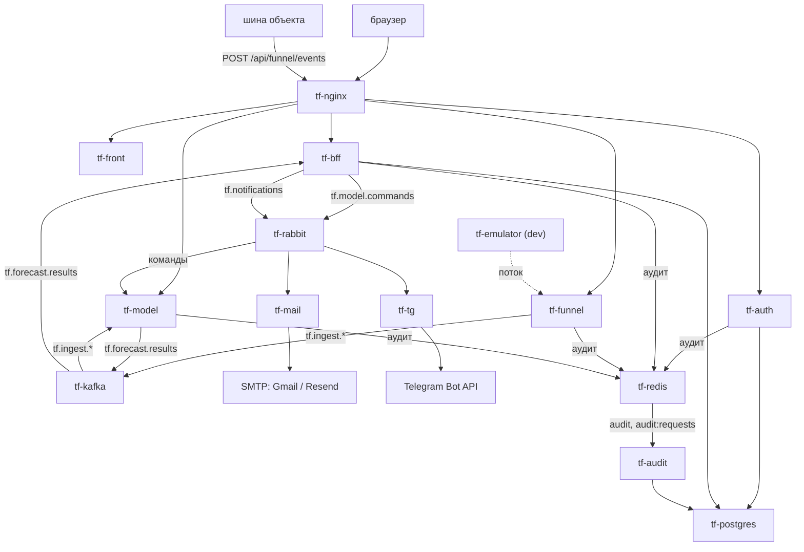
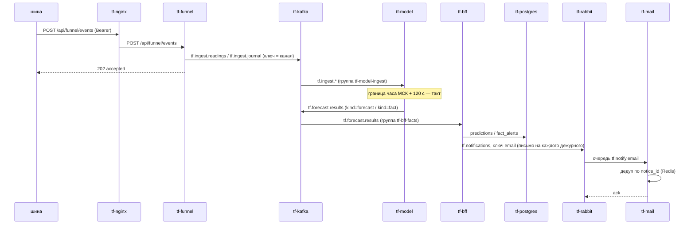
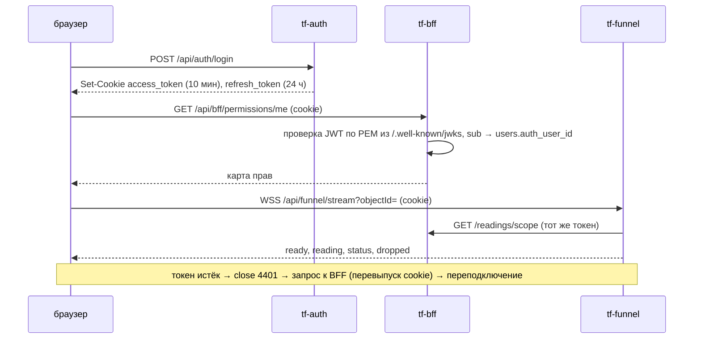
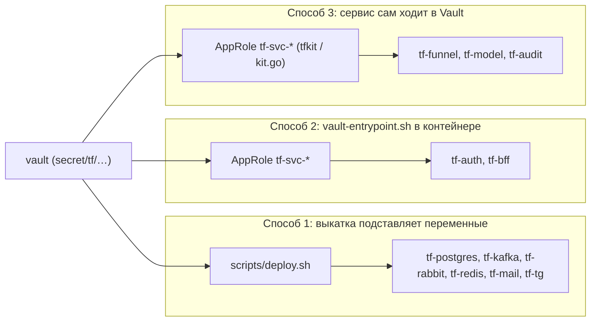

# Часть I. Обзор системы

## 1.1. Что делает система

Think Faster прогнозирует происшествия на объектах (пожар, загазованность, подтопление, отказ оборудования,
отказ датчика, проникновение) по потоку событий датчиков и помогает диспетчерам и инженерам на них реагировать.

- **Вход** — события датчиков объектов. На prod их присылает внешняя **шина** объекта, на dev их заменяет
  **эмулятор**.
- **Обработка** — воронка проверяет события и раскладывает их по топикам Kafka. Модель раз в час считает
  прогноз на 24 часа по каждому объекту и публикует прогнозы и события «по факту».
- **Реакция** — BFF создаёт по прогнозам и фактам записи и заявки, рассылает уведомления дежурным (почта,
  Telegram) и отдаёт всё это фронту: карта, журналы, заявки, живые показания.
- **Управление** — диспетчер принимает, отклоняет и глушит прогнозы, главный диспетчер меняет настройки
  модели. Эти решения уходят обратно в модель командами.
- **Контроль** — все сервисы пишут журнал действий и запросов, сервис аудита переносит его в базу.

## 1.2. Состав

| Компонент | Контейнер | Репозиторий | Технологии | Роль | Порт в сети | Публичный путь |
|---|---|---|---|---|---|---|
| Фронт | `tf-front` | think-front | React 19, TS, nginx | SPA для диспетчеров и инженеров | 80 | `/` |
| BFF | `tf-bff` | think-bff | .NET 8, EF Core | доменная логика, RBAC, заявки, прогнозы, рассылка | 8080 | `/api/bff/` (префикс срезается) |
| Аутентификация | `tf-auth` | think-auth | .NET 8 | учётки, вход, JWT RS256 в cookie | 8080 | `/api/auth/` (префикс срезается) |
| Воронка | `tf-funnel` | Think-Faster | Go 1.27 | приём пакетов шины, Kafka, архив, «Логи», WebSocket | 8000 | `/api/funnel/` (путь как есть) |
| Модель | `tf-model` | Think-Faster | Python 3.12, DuckDB, CatBoost/XGBoost/PyTorch | прогноз раз в час, факты, команды | 8000 | `/api/ml/` (путь как есть) |
| Аудит | `tf-audit` | Think-Faster | Python 3.12, FastAPI | потоки Redis → PostgreSQL `audit.*` | 8000 | нет |
| Эмулятор | `tf-emulator` | think-test (архив в Think-Faster) | Python, Django | подмена шины на dev | 8000 | нет |
| Почта | `tf-mail` | think-infra (`mailing/`) | Python 3.12 | очередь `tf.notify.email` → SMTP | нет | нет |
| Telegram | `tf-tg` | think-infra (`telegram/`) | Python 3.12 | очередь `tf.notify.telegram` → Bot API | нет | нет |
| Веб-сервер | `tf-nginx`, `tf-certbot` | think-infra (`web-server/`) | nginx 1.29, certbot | TLS, маршрутизация, лимиты, Vault UI | 80, 443 наружу | все |
| Секреты | `vault` | think-infra (`hashicorp/`) | Vault 1.20, raft | все пароли и ключи | 8200 (localhost + сеть) | `https://vault.greefob.ru` (только dev) |
| База | `tf-postgres` | think-infra (`postgree/`) | PostgreSQL 16 | схемы `auth`, `bff` (+ `audit`) | 5432 | нет |
| Шина событий | `tf-kafka` | think-infra (`kafka/`) | Kafka 4.0 KRaft | `tf.ingest.*`, `tf.forecast.results`, `tf.dlq` | 9092 | нет |
| Брокер задач | `tf-rabbit` | think-infra (`rabbitmq/`) | RabbitMQ 4.1 | уведомления, команды модели | 5672 | нет |
| Кэш и потоки | `tf-redis` | think-infra (`redis/`) | Redis 7 | аудит, лимиты входа, антиспам, дедуп уведомлений | 6379 | нет |

Все контейнеры работают в одной docker-сети **`think-fast-net`** на одном сервере стенда. Наружу опубликованы
только 80/443 (`tf-nginx`) и, на dev, 5432 PostgreSQL.

## 1.3. Общая схема

Основной поток сверху вниз. Vault (секреты всем сервисам при старте) и проверка токенов через tf-auth на схеме не показаны, они есть в таблице ниже. Подробные потоки — раздел 1.4.

| Кто | С кем | Как |
|---|---|---|
| tf-front (браузер) | tf-auth, tf-bff, tf-funnel | HTTPS через nginx, cookie `access_token`, WebSocket `/api/funnel/stream` |
| tf-bff, tf-funnel, tf-model, tf-audit | tf-auth | `GET /.well-known/jwks` (PEM), tf-bff — ещё `POST /refresh` |
| tf-funnel | tf-bff | `GET /readings/scope` (права на показания) |
| tf-funnel → tf-model | tf-kafka | `tf.ingest.readings`, `tf.ingest.journal`, `tf.ingest.reference` |
| tf-model → tf-bff | tf-kafka | `tf.forecast.results` |
| tf-bff → tf-model | tf-rabbit | `tf.model.commands` |
| tf-bff → tf-mail, tf-tg | tf-rabbit | `tf.notifications` (`email`, `telegram`) |
| tf-auth, tf-bff, tf-funnel, tf-model → tf-audit | tf-redis | потоки `audit`, `audit:requests` |
| tf-auth, tf-bff, tf-audit | tf-postgres | схемы `auth`, `bff`, `audit` |
| tf-mail, tf-tg | tf-redis | `notify:sent:*` (защита от повторной отправки) |
| все сервисы | vault | секреты при старте (три способа — раздел 1.4) |

## 1.4. Потоки данных

### От датчика до письма дежурному

### Пользователь

### Решение диспетчера → модель

`tf-bff` публикует конверт `{schema, command_id, kind, issued_at, issued_by, request_id, payload}` в exchange
`tf.model.commands` с ключом `kind` (`decision.take|reject|mute|reopen|confirmed`, `settings.*`, `model.switch`,
`retrain.request`). `tf-model` применяет команду под замком такта и подтверждает её только после записи
на том. Формат — раздел tf-model §4.3.

### Аудит

Сервисы пишут `XADD audit` (журнал действий) и `XADD audit:requests` (строка на HTTP-запрос) в `tf-redis`
и сразу продолжают работу. `tf-audit` читает потоки группой `audit-writer`, вырезает запрещённые поля и
пишет в `audit.events` / `audit.requests`. Всё, что не проходит проверку, уходит в поток `audit:dead`.
Формат события — tf-audit §4.1.

### Секреты

## 1.5. Стенды

| | dev | prod |
|---|---|---|
| Домен | `greefob.ru` | `thinkfaster.ru`, `www.thinkfaster.ru` |
| Сервер | `176.123.167.161`, пользователь `user1` | `45.87.41.186` (`predictor-home`), пользователь `grisha` |
| Каталог выкатки инфраструктуры (`TF_INFRA_DIR`) | `/home/user1/tf/think-prod` | `/srv/thinkfaster/tf.infra` |
| Клон think-infra на сервере | `~/tf/infra-src` | `/srv/thinkfaster/tf/think-infra` |
| Код приложений | по workflow сервисов | `/srv/thinkfaster/services/<репозиторий>` |
| Docker | обычный `docker` (есть признаки snap: не видит хостовый `/tmp`) | обёртка `sudo -n /usr/local/bin/tf-docker`, compose только внутри `/srv/thinkfaster`, `sudo` сбрасывает окружение |
| PostgreSQL на хосте | `0.0.0.0:5432` (открыт наружу) | `127.0.0.1:15432`, доступ по SSH-туннелю |
| nginx слушает | все адреса | только `45.87.41.186` (`WEB_BIND`) |
| Vault UI | `https://vault.greefob.ru` | выключен (`VAULT_DOMAIN` закомментирован), только SSH-туннель |
| Раннер GitHub для think-infra | **нет**: выкатка вручную | есть (`self-hosted, prod`): `deploy-<сервис>.yml`, `deploy-apps-prod.yml` |
| Источник событий | `tf-emulator` (`TF_FUNNEL_PULL`) | внешняя шина (на 29.09 не подключена) |
| Почта | Gmail SMTP 587 | Resend `smtp.resend.com:2587` (провайдер режет 25/465/587), `MAIL_FROM=noreply@thinkfaster.ru` |
| Ресурсы | слабая VM: сборка образов на ней кладёт стенд | «сильная машина», ~3,5 ГБ свободной памяти по оценке workflow модели |

Ветки и версии: фича → `dev` → `prod` (→ `master`). Выпуски — аннотированные теги `devX.Y.Z` / `prodX.Y.Z`
на одном коммите (последние — `dev1.1.0` / `prod1.1.0`, 27.09). Коммиты, которые не должны запускать
выкатку, помечаются `[skip ci]`.

## 1.6. Публичные маршруты (tf-nginx)

| Путь | Куда | Префикс | Ограничения |
|---|---|---|---|
| `/.well-known/acme-challenge/` (порт 80) | файлы certbot | — | для всех имён, включая `VAULT_DOMAIN` |
| всё остальное на порту 80 | `301` на HTTPS | — | — |
| `/api/auth/` | `tf-auth:8080` | срезается (`/api/auth/login` → `/login`) | — |
| `/api/bff/` | `tf-bff:8080` | срезается | — |
| `= /api/funnel/events` | `tf-funnel:8000` | как есть | тело ≤ 8 МБ, приём тела ≤ 30 с, 20 запросов/с с адреса (всплеск 40), ответ ≤ 60 с, allowlist `FUNNEL_EVENTS_ALLOW` |
| `= /api/funnel/stream` | `tf-funnel:8000` | как есть | WebSocket, `proxy_read_timeout`/`send_timeout` 120 с, без буферизации |
| `= /api/funnel/log` | `tf-funnel:8000` | как есть | 5 запросов/с (всплеск 10) |
| `/api/funnel/` | `tf-funnel:8000` | как есть | — |
| `/api/ml/` | `tf-model:8000` | как есть | `proxy_read_timeout` 60 с |
| `/` | `tf-front:80` | — | — |
| `https://<VAULT_DOMAIN>` | `vault:8200` | — | вход по токену; 30 попыток входа/мин на `/v1/auth/*/login`; allowlist `VAULT_ALLOW` |

Во все маршруты приложений nginx передаёт `Host`, `X-Real-IP`, `X-Forwarded-For` (дописывает свой адрес к
присланному клиентом), `X-Forwarded-Proto` и сквозной `X-Request-ID`. Адреса апстримов берутся из
переменных и разрешаются при каждом запросе (`resolver 127.0.0.11`). Поэтому nginx стартует, даже если
сервиса нет, а на запросы к такому сервису отвечает `502`.

## 1.7. Реестр контрактов

| Контракт | Владелец | Потребители | Где описан |
|---|---|---|---|
| Пакет шины `POST /events` | tf-funnel | шина, эмулятор | tf-funnel §4.1 |
| `tf.ingest.readings` / `journal` / `reference` | tf-funnel | tf-model, tf-bff (ACL) | tf-funnel §4.2, tf-model §4.1 |
| `tf.forecast.results` (`forecast`, `fact`) | tf-model | tf-bff | tf-model §4.2, tf-bff §4 |
| `tf.model.commands` | tf-bff (издатель) / tf-model (формат) | tf-model | tf-model §4.3, tf-bff §4 |
| `tf.notifications` email/telegram | think-infra (`docs/notify-tz/tf-bff.md`) | tf-mail, tf-tg | Часть II §2.10, tf-bff §4 |
| JWT, cookie, `/.well-known/jwks` (PEM) | tf-auth | tf-bff, tf-funnel, tf-model, tf-audit, фронт | tf-auth §4 |
| `GET /readings/scope` | tf-bff | tf-funnel, фронт | tf-bff §3–4, tf-funnel §4.3 |
| WebSocket `/stream`, `/log` | tf-funnel | фронт | tf-funnel §4.3, tf-front §4 |
| Событие аудита §6.4, строка запроса §6.1 | tf-audit (контракт «права-и-аудит», в репозиториях не найден) | все, кто пишет аудит | tf-audit §4 |
| API BFF (`/api/bff/*`), формат ошибок | tf-bff | фронт | tf-bff §3–4 |
| Топология RabbitMQ, топики и ACL Kafka, пути Vault, маршруты nginx | think-infra | все | Часть II |
