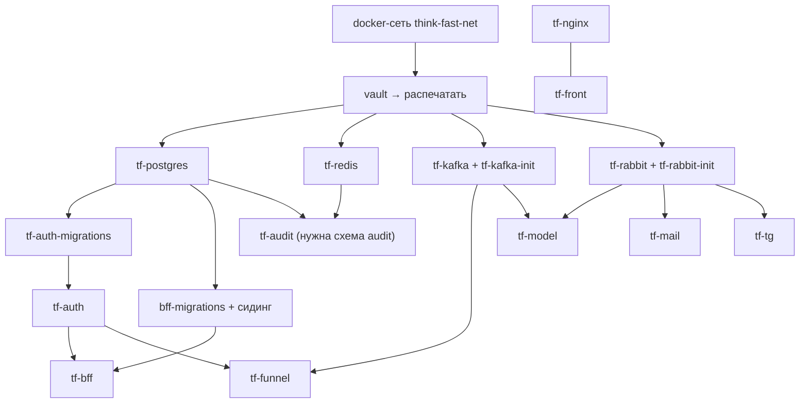

# Часть IV. Руководство по запуску

Команды — для сервера стенда, из клона think-infra (dev: `~/tf/infra-src`, prod: `/srv/thinkfaster/tf/think-infra`),
если не сказано иное. Ключи и токены вводите через `read -rs`: так они не попадут на экран и в историю команд.
Перед работой в новой сессии терминала выполните `set +H`, иначе `!` в командах bash подставит предыдущую
команду из истории (раздел 6.2, кейс 8).

## 4.1. Новый стенд

Первый запуск без предварительных знаний расписан по шагам в `QUICK_START.md`. Коротко:

```bash
git clone <репозиторий> tf.infra && cd tf.infra && git checkout <dev|prod>
```

```bash
scripts/bootstrap-stand.sh <dev|prod>
```

Скрипт проверяет окружение и создаёт сеть `think-fast-net`. Затем поднимает и инициализирует Vault
(**ключи и root показываются один раз** — сохраните их в менеджер паролей), распечатывает его и создаёт
политики и роли. Дальше генерирует секреты и выкатывает `postgree redis kafka rabbitmq web-server`, ставит
cron-бэкапы, выдаёт пару CI и личный токен и предлагает отозвать root. Если DNS ещё не готов, добавьте
`--skip web-server`. `mailing` и `telegram` в bootstrap не входят: им нужны `manual`-секреты.

## 4.2. Порядок запуска сервисов



Жёсткие зависимости при старте:
- **Vault распечатан.** Без него не стартуют все сервисы, которым нужны секреты.
- **PostgreSQL** нужен миграциям tf-auth и tf-bff.

Остальные сервисы переподключаются сами: Kafka, RabbitMQ, Redis, tf-auth (JWKS), tf-bff (`/readings/scope`).
Пока зависимости нет, соответствующие ручки отвечают `503`. nginx стартует без апстримов и отдаёт `502`.

## 4.3. Выкатка инфраструктуры вручную

**Вход в Vault** — одним из двух способов.

Парой CI (только чтение, для выкатки достаточно):

```bash
read -rs -p "VAULT_ROLE_ID (CI): " VAULT_ROLE_ID; echo; read -rs -p "VAULT_SECRET_ID (CI): " VAULT_SECRET_ID; echo; export VAULT_ROLE_ID VAULT_SECRET_ID; unset VAULT_TOKEN
```

Или личным токеном (он нужен и для `secrets.sh set/get`):

```bash
read -rs -p "Личный токен: " VAULT_TOKEN; echo; export VAULT_TOKEN; unset VAULT_ROLE_ID VAULT_SECRET_ID
```

**Проверка nginx до выкатки web-server.** Команда генерирует конфиг во временной копии рядом с каталогом
выкатки (не в `/tmp`: docker на dev его не видит) и проверяет его в одноразовом контейнере. Для prod:

```bash
D=/srv/thinkfaster; rm -rf $D/nginx-check && cp -r web-server $D/nginx-check && rm -rf $D/nginx-check/certbot && ln -s $D/tf.infra/web-server/certbot $D/nginx-check/certbot && (set -a && . stands/prod.env && set +a && bash $D/nginx-check/scripts/generate-nginx-config.sh) > /dev/null && docker run --rm -v $D/nginx-check/nginx/nginx.conf:/etc/nginx/nginx.conf:ro -v $D/nginx-check/nginx/tf.d:/etc/nginx/tf.d:ro -v $D/tf.infra/web-server/certbot/conf:/etc/letsencrypt:ro nginx:1.29-alpine nginx -t; rm -rf $D/nginx-check
```

Для dev: `D=~/tf`, каталог выкатки `~/tf/think-prod`, файл `stands/dev.env`. Ожидается `syntax is ok` и
`test is successful`.

**Выкатка по порядку** (останавливается на первой ошибке):

```bash
for s in postgree redis kafka rabbitmq web-server; do echo "===== $s"; TF_STAND=<стенд> scripts/deploy.sh "$s" || { echo "===== $s УПАЛ"; break; }; done
```

Почта и Telegram (если их секреты заведены):

```bash
for s in mailing telegram; do TF_STAND=<стенд> scripts/deploy.sh "$s" || echo "===== $s не выкачен"; done
```

После работы — `unset VAULT_TOKEN VAULT_ROLE_ID VAULT_SECRET_ID`.

**Через GitHub (prod):** Actions → `deploy <сервис>` → Run workflow → ветка `prod`. Кнопка Run workflow
видна только тем, у кого есть право записи в репозиторий, и только для workflow из ветки по умолчанию.

## 4.4. Выкатка приложений

| Сервис | dev | prod |
|---|---|---|
| tf-auth | push в фичу → слияние в `dev` → SSH, сборка на сервере | `deploy-prod.yml` think-auth или шаг `auth` в `deploy-apps-prod.yml`; вручную — tf-auth §8 |
| tf-bff | так же, с миграциями | `deploy-prod.yml` think-bff или шаг `bff` в `deploy-apps-prod.yml` |
| tf-front | push в фичу → `dev` → SSH, `down → build → up` (простой) | `deploy-prod.yml` think-front |
| tf-funnel | Think-Faster `deploy-funnel-dev.yml`: сборка в CI, `docker load` | `deploy-funnel-prod.yml`: Docker Hub `…/tf-funnel:prod-<sha7>` |
| tf-model | `deploy-model-dev.yml` (пакет модели из релиза `dev-assets`) | `deploy-model-prod.yml`, `--memory 2500m`, `TF_MEMORY=1GB` |
| tf-audit | `deploy-audit-dev.yml` | шаг `audit` в `deploy-apps-prod.yml` — **только после схемы `audit`** |
| tf-emulator | `deploy-emulator-dev.yml` | **никогда** |
| tf-mail, tf-tg | `deploy.sh mailing|telegram` | так же или `deploy-mailing.yml`/`deploy-telegram.yml` |

**Правило:** образы не собираются на слабой dev-VM (раздел 6.2, кейс 1). Там только `docker load` /
`docker pull` и `docker run`.

## 4.5. После перезагрузки сервера

1. `docker exec vault vault status | grep Sealed`. Если `true`, распечатать двумя разными ключами:

   ```bash
   read -rs -p "Unseal Key: " K; echo; K=$(printf '%s' "$K" | tr -d '\r"' | awk '{print $NF}'); docker exec vault vault operator unseal "$K" | grep -E "Sealed|Progress"; unset K
   ```

2. Подождать 1–2 минуты: сервисы, которые ждут Vault, войдут сами (они повторяют попытку раз в 10 с).
3. `docker ps -a --format '{{.Names}}\t{{.Status}}' | sort` — всё основное `Up`, `*-init` — `Exited (0)`.
4. Снаружи: `/api/auth/health` — `200`, `/api/bff/health/live` — `200`, `/api/funnel/health` — `200`.
   Если `502`, сервис ещё не поднялся (смотреть `docker logs <контейнер>`).

## 4.6. Выдача кредов

Для всех операций ниже нужен **root**. Выпускайте его на время работы и сразу отзывайте.

**Временный root ключами** — скрипт `gen-root.sh` (приложение B): спрашивает два Unseal Key и печатает
root-токен. Проверить ключи, не получая root, можно скриптом `check-unseal-keys.sh` (приложение B).

```bash
read -rs -p "ROOT: " VAULT_TOKEN; echo; export VAULT_TOKEN
```

| Что | Команда | Куда положить |
|---|---|---|
| Политики и роли по `services.conf` | `hashicorp/scripts/setup.sh apply` | — |
| Пара CI | `hashicorp/scripts/setup.sh ci-credentials` | think-infra → Environment `<стенд>` → `VAULT_ROLE_ID`, `VAULT_SECRET_ID` |
| Пара сервиса | `hashicorp/scripts/setup.sh service-credentials <tf-auth\|tf-bff\|tf-funnel\|tf-model\|tf-audit>` | репозиторий сервиса → Environment `<стенд>` (имена — в разделе сервиса §8); для `deploy-apps-prod.yml` — think-infra `prod` → `TF_<СЕРВИС>_VAULT_*` |
| Личный токен | `docker exec -e VAULT_TOKEN="$VAULT_TOKEN" vault vault token create -policy=tf-admin -period=720h -orphan -display-name=<имя> -field=token` | менеджер паролей |
| Отзыв root | `docker exec -e VAULT_TOKEN="$VAULT_TOKEN" vault vault token revoke -self; unset VAULT_TOKEN` | — |

- **Не используйте `--rotate`**, если не хотите отозвать уже выданные `secret_id`.
- **Не выдавайте личный токен через `setup.sh admin-token`**, пока в нём нет `-orphan`: такой токен отзовётся
  вместе с root.
- **Креды dev и prod разные.** Храните их в менеджере паролей раздельно, с пометкой стенда (раздел 6.2, кейс 4).

## 4.7. Доступ к базе данных

1. Пароль: `scripts/secrets.sh get POSTGRES_PASSWORD` (или `TF_PG_<СХЕМА>_USER_PASSWORD`) под личным токеном.
   На prod для повседневной работы берите пользователя схемы, а не суперпользователя `tf`.
2. dev: `176.123.167.161:5432`, база `tf`.
3. prod: SSH-туннель. В pgAdmin на вкладке SSH Tunnel: host `45.87.41.186`, port 22, свой пользователь,
   Authentication — Identity file (закрытый ключ, **без** `.pub`), Password — пароль от ключа, если он есть.
   На вкладке Connection: `127.0.0.1:15432`, база `tf`.
4. Без клиента, прямо на сервере: `docker exec -it tf-postgres psql -U tf -d tf`.
