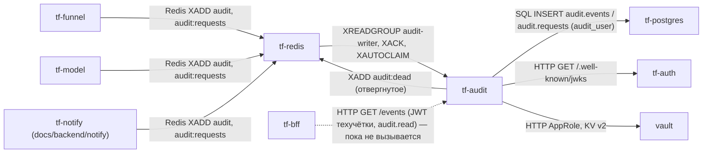
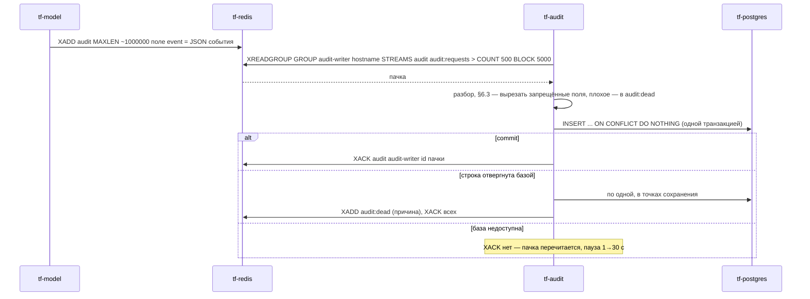

Версия: main@7cfe8f2, дата: 2026-09-29

Ссылки `файл:строка` без каталога — относительно `docs/backend/audit/`, `tfkit.py` — `docs/backend/tfkit/`, workflow — `.github/workflows/`; пути think-infra и think-auth — в их репозиториях.

## tf-audit — сервис аудита

### 1. Назначение

Сервис переносит журнал действий и журнал запросов из потоков Redis `audit` и `audit:requests` в PostgreSQL
(схема `audit`, таблицы `audit.events` и `audit.requests`) и отдаёт журнал действий на чтение техучётке BFF
(`docs/backend/audit/audit.py:1-23`). Сервисы контура (`tf-funnel`, `tf-model`, сам `tf-audit`; notify из `docs/backend/notify` — контейнер `tf-notify`;
по замыслу — `tf-bff`, `tf-auth`) пишут события `XADD` в Redis и работают дальше, не дожидаясь базы
(права-и-аудит §6.5, вариант Б). Сервис — последний рубеж §6.3: вырезает из событий пароли, токены, куки и тела.
Правку и удаление строк журнала запрещают триггеры базы (`docs/backend/audit/schema.sql:118-133`).

### 2. Схема взаимодействия



Запись пачки:



### 3. Интерфейсы

**Входящие**

| Протокол | Адрес/путь/топик/очередь | Кто вызывает | Авторизация | Что делает |
|---|---|---|---|---|
| Redis Streams | `audit`, группа `audit-writer`, потребитель — имя хоста контейнера (`audit.py:48-49`, `audit.py:199`) | пишут `tf-funnel` (`funnel`), `tf-model` (`ml`), `tf-notify` (`notify`; на dev/prod не выкатывается — там почта и Telegram у `tf-mail`/`tf-tg` think-infra, пишут ли они аудит — не проверено), сам `tf-audit` (`audit`) | пароль Redis | журнал действий → `audit.events` |
| Redis Streams | `audit:requests`, та же группа | те же сервисы (журнал запросов) | пароль Redis | строка на HTTP-запрос → `audit.requests` |
| HTTP GET | `/events` (порт 8000) | техучётка BFF | JWT: техучётка с правом `audit.read` (`audit.py:430-444`) | журнал действий по фильтрам (`audit.py:450-464`) |
| HTTP GET | `/health` | Docker, мониторинг | нет | счётчики записи (`audit.py:446-448`) |

Публичного маршрута через nginx нет (в think-infra `nginx.conf.template` `/api/audit` не найдено); порт на хост не публикуется.

**Исходящие**

| Протокол | Куда | Зачем | Что при недоступности |
|---|---|---|---|
| PostgreSQL | `tf-postgres`, база `tf`, пользователь `audit_user` (`TF_AUDIT_DB`) | запись и чтение `audit.*`, вызов `audit.ensure_partitions()` раз в сутки (`audit.py:216-224`) | запись стоит, события ждут в потоке, пауза 1→2→…→30 с (`audit.py:333-349`); `/events` — 503 |
| Redis | `tf-redis:6379` | чтение потоков, `XACK`, `XAUTOCLAIM`, `XADD audit:dead` | запись стоит с той же паузой |
| Redis | поток `audit` | свои события `token.refused`/`access.denied` на чтении (`audit.py:519`) | строка события в лог процесса (спула у сервиса нет) |
| HTTP | `tf-auth:8080/.well-known/jwks` | ключ RS256 | `/events` — 503 |
| HTTP | `vault:8200` | секреты при старте | ждёт `TF_VAULT_WAIT`, затем выход |

### 4. Контракты данных

#### 4.1 Событие в потоке `audit` (права-и-аудит §6.4)

Запись потока — одно поле `event` со строкой JSON (`docs/backend/tfkit/tfkit.py:297-324`, `docs/backend/funnel/kit.go:508-534`):

```json
{"event_id": "3f1c0a52-8d1e-4a3b-9c55-0e7f7b2a9d11", "occurred_at": "2026-09-29T11:14:00.123456+00:00",
 "service": "ml", "event_type": "forecast.rejected", "outcome": "success",
 "actor_kind": "user", "actor_id": "b7a1c2d3-0000-4000-8000-000000000001", "actor_login": "petrova",
 "request_id": "e81b07c4f2a9", "ip": null, "object_type": "forecast", "object_id": "5122:gas:2026-09-29T14:00+03:00",
 "area_id": null, "details": {"reason_code": "…", "reject_k": 0.2}}
```

| поле | тип | обяз. | проверка сервисом аудита (`audit.py:119-161`) |
|---|---|---|---|
| `event_id` | uuid | нет | нет или не uuid — `uuid5` от id записи потока (повтор той же записи даст тот же ключ) |
| `occurred_at` | ISO 8601 | да | без зоны — считается МСК; раньше 2026-01-01 или позже «сейчас + 1 сут» — в `audit:dead` |
| `service` | строка ≤ 40 | да | `auth`, `bff`, `dispatch`, `funnel`, `ml`, `notify`, `audit` |
| `event_type` | `сущность.действие` (`^[a-z][a-z_]*(\.[a-z_]+)+$`) | да | иначе `audit:dead` |
| `outcome` | `success` \| `denied` \| `error` | да | иначе `audit:dead` |
| `actor_kind` | `user` \| `service` \| `anonymous` | да | иначе `audit:dead` |
| `actor_id` | uuid | нет | не uuid (например `sub` think-auth другого вида) — в `details.actor_sub`, колонка `null` |
| `actor_login`, `request_id`, `object_type`, `object_id` | строки | нет | обрезаются до 200/100/60/200 символов |
| `ip` | IP | нет | неразборчивый — `null` |
| `area_id` | int | нет | неразборчивый — в `details.area_raw` |
| `details` | объект ≤ 16 КБ JSON | нет | поля `password`, `token`, `authorization`, `cookie`, `text`, `body` на любой глубине вырезаются, список — в `details._dropped`; больше 16 КБ — `audit:dead` |

#### 4.2 Строка в потоке `audit:requests` (§6.1)

```json
{"occurred_at": "2026-09-29T11:14:00.123456+00:00", "service": "funnel", "method": "GET",
 "route": "/api/funnel/log", "status": 200, "duration_ms": 41, "actor_kind": "user",
 "actor_id": "b7a1c2d3-0000-4000-8000-000000000001", "request_id": "e81b07c4f2a9", "ip": "172.18.0.5"}
```

`route` — шаблон маршрута без строки запроса; с `?` — `audit:dead` (`audit.py:164-180`). Пробы `/health` не пишутся.

#### 4.3 Поток `audit:dead`

`{"stream": "audit", "id": "<id записи>", "event": "<исходная строка, до 64 КБ>", "reason": "<причина, до 500>"}`,
`MAXLEN ~100000` (`audit.py:242-245`).

#### 4.4 `GET /events`

Параметры (`audit.py:450-460`, `audit.py:358-401`): `event_type` (можно несколько; точное имя или префикс с точкой:
`forecast.`), `service`, `object_type`, `object_id`, `actor_login`, `request_id`, `outcome`, `since`, `until` (ISO),
`before_id` (страница: строки с `id` меньше), `limit` (по умолчанию 200, 1…1000). Новые сверху.

```json
[{"id": 1042, "event_id": "3f1c0a52-…", "occurred_at": "2026-09-29T14:14:00.123456+03:00",
  "received_at": "2026-09-29T14:14:01.002+03:00", "service": "ml", "event_type": "forecast.rejected",
  "outcome": "success", "actor_kind": "user", "actor_id": "…", "actor_login": "petrova",
  "request_id": "e81b07c4f2a9", "ip": null, "object_type": "forecast", "object_id": "5122:gas:…",
  "area_id": null, "details": {}}]
```

Коды: 200; 401 — нет токена или он не прошёл проверку (`token.refused`), протухший — без события; 403 — токен
пользователя (`журнал отдаётся только техучётке BFF`) или нет `audit.read` (`access.denied`); 503 — база недоступна
или нет ключа токенов. `/health`: `{"ok": true, "written", "duplicates", "dead", "lost", "last_write"}` (`audit.py:202`).
Версионирования нет.

### 5. Данные и состояние

Схема PostgreSQL `audit` (`schema.sql`):

| объект | назначение |
|---|---|
| `audit.events` | журнал действий §6.4 + `event_id`; секционирование по месяцам `occurred_at` (`events_ГГГГ_ММ`); ключи `(id, occurred_at)`, уникальный `(event_id, occurred_at)`; индексы BRIN по времени, по исполнителю, объекту, типу (`schema.sql:28-52`) |
| `audit.requests` | журнал запросов §6.1, секции по месяцам (`requests_ГГГГ_ММ`) (`schema.sql:54-67`) |
| `audit.ensure_partitions(months_back, months_ahead)` | создаёт недостающие месячные секции обеих таблиц; `security definer`; сервис зовёт её при старте и раз в сутки (`schema.sql:71-90`) |
| `audit.drop_old_requests(keep_days=90)` | удаляет секции `requests` старше 90 дней; только администратор (`schema.sql:99-116`) |
| `audit.forbid_change()` + триггеры | запрет `UPDATE`/`DELETE` (и `TRUNCATE` у `events`) всем, включая владельца (`schema.sql:120-133`) |

**Кто создаёт.** Задумано: схему `audit`, роли `audit_admin` и `audit_user` и их пароли создаёт bootstrap think-infra по
строке `audit` в `postgree/db/schemas.conf`, затем администратор прогоняет `schema.sql` под `audit_admin`
(`schema.sql:1-10`, `deploy-audit-dev.yml:6-11`). **Сейчас** в think-infra (ветка `dev` 8a18c26 и все остальные ветки)
в `schemas.conf` только `auth` и `bff`, а в `secrets.conf` нет `postgres/audit` — схема и пароль на dev/prod не
заводятся. На локальном стенде схему создаёт одноразовый `tf-audit-db-init` под суперпользователем `tf` и ставит
пароль `audit_user` (`docs/backend/stand.yml:130-150`). Приложение само таблиц не создаёт — только секции через функцию.

**Пароль**: Vault `secret/tf/postgres/audit` → ключ `TF_PG_AUDIT_USER_PASSWORD` (`audit.py:470-478`).

**Хранение (retention)**: `audit.events` — вечно (функции очистки нет, удаление строк запрещено; удалить можно только
секцию целиком `drop table`); `audit.requests` — 90 дней, но только когда администратор вызывает
`audit.drop_old_requests()` — расписания нет. Потоки Redis: `audit` и `audit:requests` — `MAXLEN ~1 000 000` у
производителей (`tfkit.py:274-276`, `kit.go:466`), `audit:dead` — ~100 000.

**Состояние сервиса**: только в Redis (позиция группы, неподтверждённые) и в PostgreSQL. Файл жизни
`/tmp/tf-audit.alive`. Счётчики `/health` — в памяти. Можно запускать несколько экземпляров: у каждого своё имя
потребителя (hostname), чужое зависшее дольше 60 с забирается `XAUTOCLAIM` (`audit.py:314-319`), повтор отбрасывается
`on conflict do nothing` по `(event_id, occurred_at)`. У `audit.requests` уникального ключа нет — при повторе пачки
строки журнала запросов задублируются. При перезапуске теряются только счётчики; имя потребителя меняется
(новый контейнер — новый hostname), неподтверждённое старого забирается через минуту.

### 6. Безопасность и политики

- Чтение `/events`: RS256 (`tfkit.Verifier`, `tfkit.py:191-265`), `aud = api`, `iss` ∈ {`auth-service`, `tf-auth`},
  `typ`/`token_type` = `access`; допускается **только техучётка** (`kind: service`, `scope`, или `sub` из
  `TF_AUDIT_SERVICE_SUBS`) с правом `audit.read`. Кто из людей что видит (история отклонённых прогнозов — только главный
  диспетчер) решает BFF (`audit.py:13-14`).
- Без ключа (`TF_AUTH_PUBLIC_KEY`, `TF_AUTH_JWKS` пусты): в dev чтение открыто; в prod — JWKS `tf-auth` (`audit.py:481-491`).
- Роль базы `audit_user`: `usage` на схему, `insert, select` на таблицы, `execute` на `ensure_partitions`;
  `update, delete, truncate` отозваны (`schema.sql:135-142`). Bootstrap think-infra может выдать шире — опора на
  триггеры, а не на права (`schema.sql:12-13`).
- Свои события сервиса (`service = "audit"`): `token.refused`, `access.denied` на `/events`; журнал запросов своих ручек.
- Чувствительное (§6.3): вырезается на любой глубине `details` (`audit.py:99-112`), в лог — только имена вырезанных
  полей и тип события. Значения секретов и DSN с паролем не логируются: пароль передаётся отдельно от строки
  подключения (`audit.py:476-477`).
- Процесс — пользователь `tfaudit` (uid 10002) (`docs/backend/audit/Dockerfile:13-14`).

### 7. Конфигурация

| Переменная | По умолчанию | Обязательна | Секрет (путь Vault → ключ) | Смысл |
|---|---|---|---|---|
| `TF_ENV` | `prod` (образ) | нет | — | `dev`: секреты из окружения, чтение без ключа |
| `TF_REDIS_URL` | `redis://tf-redis:6379/0` | нет | `secret/tf/redis` → `TF_REDIS_PASSWORD` | Redis без пароля в адресе (`tfkit.py:165-175`) |
| `TF_AUDIT_DB` | `host=tf-postgres dbname=tf user=audit_user` | нет | — | строка подключения без пароля |
| `TF_PG_AUDIT_USER_PASSWORD` | — | да (prod) | `secret/tf/postgres/audit` → `TF_PG_AUDIT_USER_PASSWORD` | пароль `audit_user`; переменная — только в dev |
| `TF_AUDIT_PORT` / `--port` | `8000` | нет | — | HTTP |
| `TF_AUTH_PUBLIC_KEY` / `TF_AUTH_JWKS` | нет / в prod `http://tf-auth:8080/.well-known/jwks` | нет | не секрет | ключ токенов |
| `TF_AUDIT_SERVICE_SUBS` | пусто | нет | `secret/tf/app/tf-audit` → `TF_AUDIT_SERVICE_SUBS` | `sub` техучёток без `scope` |
| `VAULT_ADDR`, `VAULT_ROLE_ID`, `VAULT_SECRET_ID` | нет | да (prod) | пара роли `tf-svc-tf-audit` | вход AppRole |
| `TF_VAULT_WAIT` | `0` (в выкатках `900`) | нет | — | ожидание запечатанного Vault |
| `TF_KIT` | рядом | нет | — | путь к `tfkit.py` |

**Секреты** — сам через `tfkit.secret` по AppRole (`tfkit.py:57-162`), без `vault-entrypoint.sh`. Пути роли
`tf-svc-tf-audit`: `postgres/audit`, `redis`, `app/tf-audit` (think-infra `hashicorp/services.conf`, ветка `dev`).

### 8. Сборка и запуск

- **Dockerfile**: `docs/backend/audit/Dockerfile`, контекст — `docs/backend` (рядом `tfkit`). `python:3.12-slim`,
  `psycopg[binary] 3.3.6`, `redis 8.1.0`, `fastapi`, `uvicorn`, `PyJWT`, `cryptography`. `EXPOSE 8000`;
  `HEALTHCHECK` — `/tmp/tf-audit.alive` обновлялся не позже 120 с назад (`Dockerfile:19-21`); `ENTRYPOINT python audit.py`.
  Ключ `--once` — одна пачка и выход (проверка стенда).
- **dev** — `.github/workflows/deploy-audit-dev.yml`: push в `main` по `docs/backend/audit/**`, `docs/backend/tfkit/**` или
  вручную; сборка в CI → `docker save` → scp → `docker load`, тег `tf-audit:dev`; в реестр не публикуется. Секреты
  окружения `dev`: `TF_AUDIT_VAULT_ROLE_ID`, `TF_AUDIT_VAULT_SECRET_ID`; без них образ только собирается.
  `--memory 256m`, `TF_AUDIT_DB=host=tf-postgres dbname=tf user=audit_user`.
- **prod** — выкатывается не из этого репозитория, а из think-infra: `.github/workflows/deploy-apps-prod.yml`, шаг
  `audit` (в список шагов по умолчанию не входит). Образ `tf-audit:prod` собирается на сервере скриптом
  `/srv/thinkfaster/services/think-faster/build.sh` (в этом репозитории его нет — не проверено); пара роли —
  `TF_AUDIT_VAULT_ROLE_ID`/`TF_AUDIT_VAULT_SECRET_ID` окружения `prod` think-infra или выдаётся на лету из `VAULT_TOKEN`;
  `--memory 256m`. Пары `AUDIT_VAULT_*` в этом репозитории нет.
- **Контейнер**: `tf-audit`, сеть `think-fast-net`, порт 8000 без публикации, томов нет, `--restart unless-stopped`,
  `TF_ENV=prod`, `VAULT_ADDR=http://vault:8200`, `TF_VAULT_WAIT=900`, `TF_REDIS_URL=redis://tf-redis:6379/0`,
  `TF_AUTH_JWKS=http://tf-auth:8080/.well-known/jwks`.
- **Локальный стенд**: `docs/backend/compose.yml:76-85` + `stand.yml` (`tf-postgres`, `tf-audit-db-init`).

**Порядок запуска.** Нужны: Vault (пароль `audit_user` обязателен вне dev — без него процесс падает при старте
`audit.py:504`), схема `audit` в `tf-postgres`. Redis и PostgreSQL при старте могут лежать — цикл записи ждёт.
Пока сервис не запущен, события копятся в потоке Redis (до ~1 млн записей) и доедут потом: группа создаётся с `id 0`
(`audit.py:207-214`).

**Ручная выкатка и откат** (dev):

```bash
docker build -f docs/backend/audit/Dockerfile -t tf-audit:dev docs/backend
```

затем `docker save` → сервер → `docker load` и `docker run` как в `deploy-audit-dev.yml:85-97`. Откат — выкатка с
прежнего коммита (старый образ удаляется `image prune`).

### 9. Эксплуатация

- **Здоров**: `docker ps` — `healthy`; `/health` — `last_write` свежий, `dead` и `lost` не растут. Отставание — длина
  потока и `pending` группы:

```bash
docker exec tf-redis sh -c 'REDISCLI_AUTH="$TF_REDIS_PASSWORD" redis-cli XINFO GROUPS audit'
```

- На dev это же, плюс сводка по типам событий, — workflow `Dev status` (`.github/workflows/dev-status.yml`).
- **Строки лога**: `запись аудита стоит: <ошибка> — повтор через N с`; `в audit:dead: <поток> <id> — <причина>`;
  `из события <тип> вырезаны поля [...]`; `чтение журнала: <ошибка>`.
- **Подготовка базы** (администратор, один раз, повторно — без вреда):

```bash
psql -U audit_admin -d tf -v ON_ERROR_STOP=1 -f docs/backend/audit/schema.sql
```

- **Очистка журнала запросов** старше 90 дней (администратор; расписания нет):

```bash
psql -U audit_admin -d tf -c 'select audit.drop_old_requests()'
```

- **Разбор `audit:dead`**: `XRANGE audit:dead - + COUNT 20` — причина в поле `reason`; повторно отправить исправленную
  строку в `audit` можно `XADD`.
- **Ротация пароля `audit_user`**: сменить в Vault и в базе (`alter role audit_user password …`), перезапустить контейнер.
- **Смотреть журнал** сейчас можно только SQL-запросом (`select … from audit.events order by occurred_at desc limit 50`)
  или через `/events` с токеном техучётки. Отчётов и экрана в BFF/фронте нет.

### 10. Ошибки и проблемы

| Симптом | Причина | Как исправить |
|---|---|---|
| контейнер падает при старте, `SecretError` про `secret/tf/postgres/audit` | в Vault нет пароля или роли `tf-svc-tf-audit` не разрешён путь | think-infra: `postgres/audit` в `secrets.conf`, строка `audit` в `schemas.conf`, `setup.sh apply` |
| в логе `запись аудита стоит: OperationalError …` | PostgreSQL недоступен или нет роли `audit_user` / схемы | поднять базу, прогнать `schema.sql`; события ждут в потоке |
| `audit:dead` растёт с причиной `база: … no partition of relation …` | нет секции месяца (функция не вызывалась) | `select audit.ensure_partitions()` под `audit_admin` |
| `audit:dead` с `event_type не вида «сущность.действие»` / `outcome` / `actor_kind` | источник шлёт событие не по §6.4 | исправить источник |
| `lost` растёт | поток обрезан по `MAXLEN` раньше, чем сервис дочитал (сервис долго лежал) | потерю не вернуть; следить за отставанием |
| `/events` — 403 `журнал отдаётся только техучётке BFF` для любого токена think-auth | think-auth ставит всем токенам `kind: user` (think-auth `TokenService.cs:59-111`), а `kind` проверяется раньше `TF_AUDIT_SERVICE_SUBS` | нужен токен техучётки от think-auth |
| `unhealthy` в `docker ps` | цикл записи не проходит 120 с (Redis завис) | смотреть лог, Redis |
| выкатка dev «образ собран, выкатка tf-audit пропущена» | нет `TF_AUDIT_VAULT_*` в окружении `dev` | завести роль и пару |

### 11. Ограничения и известные недоработки

- На dev и prod схема `audit` и пароль `audit_user` в think-infra не заведены — сервис там не запустится (раздел 5).
- Никто не читает журнал через `/events`: think-auth не выдаёт техучёток, BFF ручку не вызывает.
- `audit.requests` без уникального ключа — дубли при повторной обработке пачки.
- Очистка журнала запросов — только руками, расписания нет; `audit.events` растёт бесконечно.
- Потребители не удаляются из группы (новый hostname на каждую выкатку) — `XINFO CONSUMERS` копится; вреда нет.
- Нет метрик, кроме `/health`; нет отчётов и выгрузок журнала.
- Поток Redis — единственный буфер: если Redis потеряет данные (AOF think-infra включён), события пропадут.

### 12. Возможности доработки

| доработка | приоритет | объём |
|---|---|---|
| завести схему `audit` и `postgres/audit` в think-infra, прогнать `schema.sql` на dev/prod | высокий | 2–4 ч (с think-infra) |
| токен техучётки BFF с `audit.read` и экран журнала в BFF/фронте | высокий | 2–3 дня (BFF, фронт, think-auth) |
| расписание `drop_old_requests` (pg_cron или таймер сервиса под отдельной ролью) | средний | 3–4 ч |
| уникальный ключ для `audit.requests` (например `request_id`+`occurred_at`+`route`) | низкий | 2 ч |
| удаление старых потребителей группы при старте | низкий | 1 ч |
| отчёты: выгрузка CSV по фильтрам | низкий | 1 день |

### 13. Как интегрироваться и что менять

- **Писать события**: `XADD audit MAXLEN ~ 1000000 * event <JSON>` в `tf-redis` (пароль — Vault `secret/tf/redis`), формат
  раздела 4.1; для Python — `tfkit.Audit('<сервис>')`, для Go — `kit.go` воронки. Журнал запросов — `audit:requests`,
  раздел 4.2. Путь `redis` должен быть в политике роли сервиса (`services.conf`).
- **Читать**: токен техучётки с `scope` `audit.read` (или её `sub` в `TF_AUDIT_SERVICE_SUBS`), `GET http://tf-audit:8000/events`.
- **Согласовать с инфраструктурой**: схема и роли (`postgree/db/schemas.conf`), пароль (`secrets.conf`), политика
  `tf-svc-tf-audit` (`services.conf`), изменения DDL `schema.sql`, публичный маршрут, если понадобится.

### 14. Открытые вопросы

- Когда think-infra заведёт схему `audit` и `postgres/audit`; кто прогоняет `schema.sql` под `audit_admin`.
- Запущен ли сейчас `tf-audit` на dev и есть ли пара `TF_AUDIT_VAULT_*` — не проверено.
- Кто и как собирает `tf-audit:prod` (`/srv/thinkfaster/services/think-faster/build.sh`) — скрипта в репозиториях нет.
- Пишут ли `tf-bff` и `tf-auth` в поток `audit` — не проверено (в BFF своя рассылка `ticket.created`, INTEGRATION §13.7).
- Кто и где будет смотреть журнал (экран главного диспетчера, отчёты) — не решено.
- Срок хранения `audit.events` — не задан.
