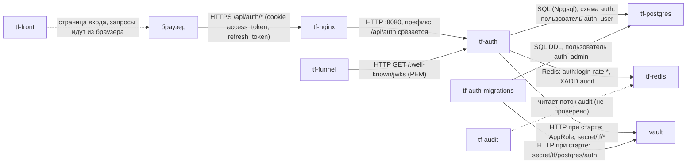
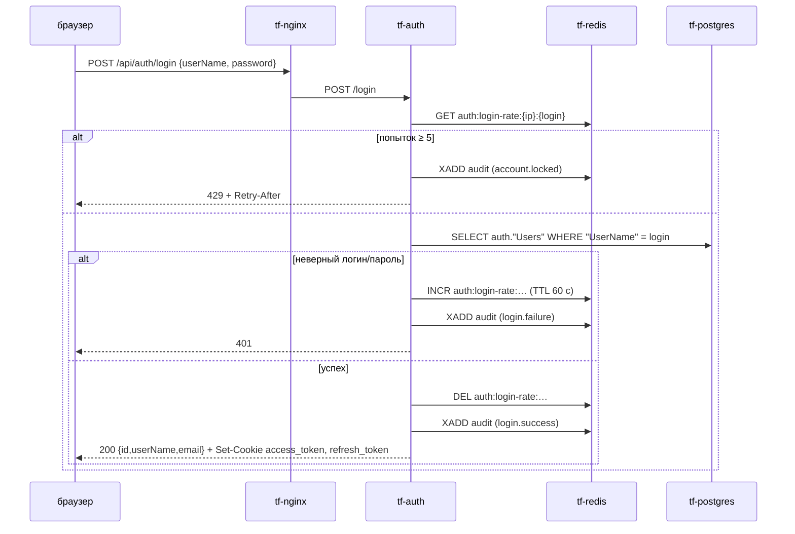
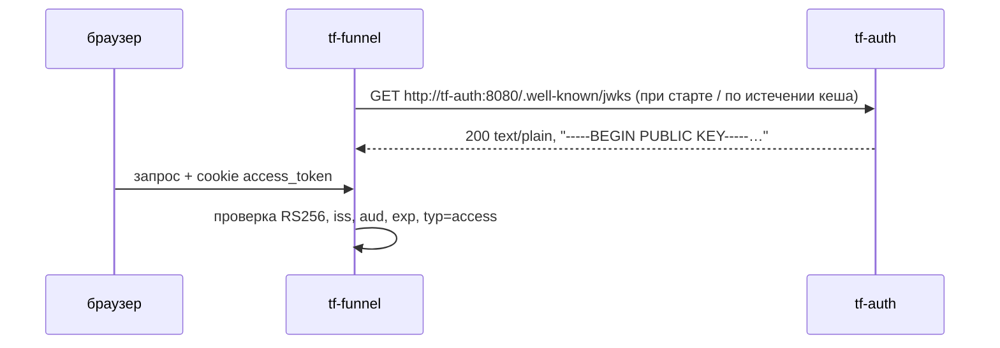

Версия: prod@b7154da, дата: 2026-09-29

# tf-auth — сервис аутентификации

Ссылки `файл:строка` — от корня репозитория think-auth. Код .NET лежит в `AuthService/`, поэтому
в ссылках этот префикс опущен у путей вида `WebAPI/…`, `AuthService.Cryptography/…`, `AuthService.Context/…`,
`AuthContext.Models/…`. Ссылки на `deploy/docker-compose.yml` даны с учётом строки `name: think-auth`
(строка 1). Она добавлена в ветке `TF-Auth-Docs` вместе с этим файлом, в `prod@b7154da` её ещё нет.

## 1. Назначение

tf-auth хранит учётные записи пользователей Think Faster, проверяет логин и пароль и выпускает пару
JWT (access и refresh, RS256). Токены отдаются браузеру в HttpOnly-cookie. Другие сервисы проверяют
access-токен сами по открытому ключу из `GET /.well-known/jwks` и в tf-auth за каждым запросом не ходят.
Сервис ограничивает частоту неудачных попыток входа (Redis) и пишет события безопасности в поток Redis `audit`.
Снаружи он доступен только через `tf-nginx` по префиксу `/api/auth/`.

## 2. Схема взаимодействия



Вход пользователя:



Проверка токена другим сервисом (так делает tf-funnel, по его ТЗ):



## 3. Интерфейсы

### Входящие

У контроллеров нет общего префикса маршрута. Путь в сервисе = публичный путь без `/api/auth`:
nginx делает `rewrite ^/api/auth/(.*)$ /$1` (tf.infra `web-server/nginx/nginx.conf.template:90-98`).
Маршрут объявлен только в HTTPS-блоке (там же, `:58-60`).

| Протокол | Путь в сервисе → публичный путь | Кто вызывает | Авторизация | Что делает |
|---|---|---|---|---|
| HTTP POST | `/register` → `/api/auth/register` | браузер, **кто угодно** | нет (`WebAPI/Controllers/AuthController.cs:44-45`) | создаёт обычного пользователя и сразу выдаёт cookie |
| HTTP POST | `/login` → `/api/auth/login` | браузер | нет; ограничение попыток (`AuthController.cs:160`) | проверка пароля, выдача cookie |
| HTTP POST | `/refresh` → `/api/auth/refresh` | браузер | cookie `refresh_token` | перевыпуск обеих cookie (`AuthController.cs:263-293`) |
| HTTP GET | `/me` → `/api/auth/me` | браузер | cookie `access_token`, иначе неявный refresh по `refresh_token` | профиль текущего пользователя (`WebAPI/Controllers/UserController.cs:40-66`) |
| HTTP POST | `/create` → `/api/auth/create` | браузер (администратор) | cookie + `SuperUser = true` | создаёт пользователя (`UserController.cs:68-199`) |
| HTTP GET | `/users/{id:guid}` → `/api/auth/users/{id}` | браузер, любой вошедший | cookie | пользователь по id (`UserController.cs:204-245`) |
| HTTP GET | `/.well-known/jwks` → `/api/auth/.well-known/jwks` | tf-funnel (внутри сети: `http://tf-auth:8080/.well-known/jwks`) | нет | открытый ключ подписи в PEM (`WebAPI/Controllers/PublicKeyController.cs:17-23`) |
| HTTP GET | `/health` → `/api/auth/health` | healthcheck Docker | нет | всегда `Healthy`, зависимости не проверяет (`WebAPI/Program.cs:27,36`) |
| HTTP GET | `/api/health` → `/api/auth/api/health` | нет известных | нет | `{"status":"Healthy"}` (`WebAPI/Controllers/HealtController.cs:5-16`) |
| HTTP GET | `/swagger` | разработчик | нет | только при `ASPNETCORE_ENVIRONMENT=Development` (`Program.cs:39-43`); на dev и prod выключен |

Ручки выхода (logout) нет. Смены пароля, списка пользователей, удаления и блокировки тоже нет.

Авторизация читается **только из cookie** (`WebAPI/Services/AuthSession/AuthSessionService.cs:29,58`).
Заголовок `Authorization: Bearer` ручки tf-auth не принимают.

### Исходящие

| Протокол | Куда | Зачем | Что при недоступности |
|---|---|---|---|
| HTTP | `vault` `http://vault:8200` (только при старте, `vault-entrypoint.sh`) | AppRole-вход, чтение `postgres/auth`, `redis`, `app/tf-auth` | ждёт до 10 мин (60 попыток × 10 с, `vault-entrypoint.sh:58-64`), затем выход с ошибкой и перезапуск по `restart: unless-stopped` |
| PostgreSQL | `tf-postgres:5432`, база `tf`, схема `auth` | пользователи | запрос падает с 500; сервис при этом стартует и `/health` отвечает `Healthy` |
| Redis | `tf-redis:6379` | ограничение попыток входа | `POST /login` → 500: проверка лимита стоит вне `try` (`AuthController.cs:160-164`); подключение ленивое (`AbortOnConnectFail = false`, `WebAPI/Services/RateLimit/AddRedisExtension.cs:25`) |
| Redis | поток `audit` | журнал действий | событие уходит в лог сервиса (`Audit stream unavailable …`), запрос не падает (`WebAPI/Services/Audit/AuditWriter.cs:59-67`) |

## 4. Контракты данных

Версионирования нет. Все JSON-ответы — camelCase (настройки ASP.NET Core по умолчанию).

### Запросы

`POST /register`, `POST /create` (`WebAPI/Contracts/RegisterRequest.cs`):

```json
{ "userName": "ivanov", "email": "ivanov@example.com", "password": "<не короче 8 символов>" }
```

| Поле | Тип | Обяз. | Смысл / проверка |
|---|---|---|---|
| `userName` | string | да | логин, ≥ 3 символов; уникальность с учётом регистра |
| `email` | string | да | формат e-mail; уникальность с учётом регистра |
| `password` | string | да | ≥ 8 символов, других требований нет |

`POST /login` (`WebAPI/Contracts/LoginRequest.cs`): `{ "userName": "…", "password": "…" }`. `userName` должен быть не короче 3 символов,
перед поиском обрезаются пробелы (`AuthController.cs:148`), регистр учитывается.

Ошибки валидации отдаёт стандартный ответ `[ApiController]`: **400** `application/problem+json` с полем `errors`.

### Ответы

Пользователь (`/register`, `/login`, `/refresh`, `/me`, `/create`, `/users/{id}`):

```json
{ "id": "3f0c…-uuid", "userName": "ivanov", "email": "ivanov@example.com" }
```

| Поле | Тип | Смысл |
|---|---|---|
| `id` | uuid | = `sub` в токенах |
| `userName` | string | логин |
| `email` | string | e-mail |

Признак `SuperUser` в ответах и токенах **не передаётся**.

Ошибка: `{ "message": "<текст по-русски>" }`. Для 429 добавляется поле `retryAfterSeconds` (int).

| Ручка | Коды |
|---|---|
| `/register` | 200 + cookie; 400; 409 логин или e-mail заняты; 500 |
| `/login` | 200 + cookie; 400; 401 неверный логин/пароль; 429 + заголовок `Retry-After`; 500 (в т. ч. Redis недоступен) |
| `/refresh` | 200 + новые cookie; 401 + cookie удаляются |
| `/me`, `/users/{id}` | 200 (может прийти с новыми cookie после неявного refresh); 401 + cookie удаляются; `/users/{id}`: 404 |
| `/create` | 200; 401 «Не авторизован.»; **401** «Недостаточно прав.» (не 403, `UserController.cs:106`); 409; 400 |
| `/.well-known/jwks` | 200 `text/plain; charset=utf-8` |

### Токены (JWT)

Пример расшифрован из токена, выпущенного кодом сервиса. Access-токен:

```json
// header
{ "alg": "RS256", "kid": "main-key", "typ": "JWT" }
// payload
{
  "http://schemas.xmlsoap.org/ws/2005/05/identity/claims/nameidentifier": "<uuid пользователя>",
  "sub": "<uuid пользователя>",
  "typ": "access",
  "token_type": "access",
  "kind": "user",
  "jti": "<uuid>",
  "login": "ivanov",
  "exp": 1790630965,
  "iss": "auth-service",
  "aud": "api"
}
```

| Claim | Значение | Где задаётся |
|---|---|---|
| `alg` / `kid` | `RS256` / `main-key` (жёстко в коде) | `AuthService.Cryptography/Services/TokenService.cs:40-43,98-100` |
| `sub` | id пользователя (uuid) | `TokenService.cs:71-73` |
| `…/nameidentifier` | тот же id под длинным URI-именем, побочный эффект `ClaimTypes.NameIdentifier`. Потребителям читать `sub` | `TokenService.cs:67-69` |
| `typ` | `access` \| `refresh` (по контракту) | `TokenService.cs:15,75-77` |
| `token_type` | то же, прежнее имя, для совместимости | `TokenService.cs:16,79-81` |
| `kind` | всегда `user` | `TokenService.cs:17-19,83-85` |
| `login` | логин; есть, если у пользователя непустой `UserName` | `TokenService.cs:92-96` |
| `jti` | случайный uuid, нигде не хранится | `TokenService.cs:87-89` |
| `iss` | `Jwt:Issuer`, по умолчанию `auth-service` | `TokenService.cs:32-33` |
| `aud` | `Jwt:Audience`, по умолчанию `api` | `TokenService.cs:35-36` |
| `exp` | access: +10 мин; refresh: +24 ч | `TokenService.cs:47-56` |
| `iat`, `nbf` | **нет** | — |
| `scope` | **нет**, ни строкой, ни массивом | — |
| роли / `SuperUser` | **нет** | — |

Refresh-токен имеет тот же состав с `typ` = `token_type` = `refresh`. На сервере refresh нигде не хранится (нет ни таблицы, ни ключа Redis).
При каждом refresh перевыпускаются оба токена (`AuthSessionService.cs:110-114`). Старый refresh при этом не отзывается
и остаётся действительным до своего `exp`.

### Cookie

| Cookie | HttpOnly | Secure | SameSite | Path | Domain | Max-Age |
|---|---|---|---|---|---|---|
| `access_token` | да | да | `Lax` | `/` | не задан (только текущий хост) | 10 мин |
| `refresh_token` | да | да | `Strict` | `/` | не задан | 24 ч |

Источник: `AuthService.Cryptography/Services/AuthCookies.cs:7-8,16-49`. На dev cookie ставятся для `greefob.ru`, на prod для `thinkfaster.ru`.

### `GET /.well-known/jwks` — точный формат

Несмотря на имя пути, ответ — **не JSON JWKS**, а PEM открытого ключа (SubjectPublicKeyInfo),
`Content-Type: text/plain; charset=utf-8`, строки по 64 символа (`TokenService.cs:190-213`, `PublicKeyController.cs:22`):

```
-----BEGIN PUBLIC KEY-----
<base64 SPKI, по 64 символа в строке>
-----END PUBLIC KEY-----
```

`kid` в ответе нет, ключ всегда один. tf-funnel ждёт PEM (tf.infra `docs/funnel-tz/tf-funnel.md:98`, `kit.go:278`).
Форматы совпадают, переделывать tf-funnel под JSON не нужно.

## 5. Данные и состояние

**PostgreSQL**, база `tf`, схема `auth` (`AuthService.Context/AuthContext.cs:18`):

| Таблица | Назначение |
|---|---|
| `auth."Users"` | учётные записи: `Id` uuid PK, `UserName` text, `Email` text, `SuperUser` bool, `PasswordHash` text, `CreatedBy`/`UpdatedBy` uuid (всегда `00000000-…`), `CreatedAt`/`UpdatedAt` timestamptz (`AuthService.Context/Migrations/20260920070451_CreateUserTable.cs:17-35`) |
| `auth."__EFMigrationsHistory"` | история миграций EF Core (`WebAPI/Program.cs:70-72`) |

Уникальных индексов на `UserName` и `Email` **нет**: уникальность проверяется только в коде.

Хеш пароля — Argon2id, соль 16 байт, память 64 МБ, 3 итерации, параллелизм 4, хеш 32 байта. Формат строки `v1.<соль base64>.<хеш base64>`
(`AuthService.Cryptography/Services/Argon2PasswordHasher.cs:8-23`).

**Redis**:

| Ключ | Тип | Назначение |
|---|---|---|
| `auth:login-rate:{ip}:{логин в нижнем регистре}` | string (счётчик) | число неудачных входов; TTL 60 с ставится на первой неудаче (`WebAPI/Services/RateLimit/RedisRateLimitService.cs:7-8,95-103,134-142`) |
| `audit` | stream, поле `event` | журнал действий, `MAXLEN ~ 1 000 000` (`AuditWriter.cs:14-15,61-62`) |

`audit:requests` в коде не используется.

**Файлы**: закрытый ключ подписи `/run/secrets/jwt-private.pem` лежит в tmpfs (`deploy/docker-compose.yml:53,66-67`). Томов нет.

**Состояние.** Сервис stateless: всё состояние хранится в PostgreSQL и Redis. При перезапуске ничего не теряется, ключ заново читается из Vault.
Несколько экземпляров технически возможны, если у всех один ключ из Vault: лимит попыток общий в Redis. Мешает
фиксированный `container_name: tf-auth` (`deploy/docker-compose.yml:38`). Так не запускалось, **не проверено**.

## 6. Безопасность и политики

**Проверка вызывающего внутри tf-auth.** `access_token` из cookie проверяется так: RS256 тем же ключом, `iss`, `aud`, срок, `ClockSkew = 0`,
`typ`/`token_type` = `access` (`TokenService.cs:114-187`). Если access нет или он невалиден, сервис пробует `refresh_token`.
При этом он сверяет, что id в просроченном access совпадает с id в refresh (`AuthSessionService.cs:74-95`), и выдаёт новую пару.

**Права.** В системе одно право: `SuperUser` (`AuthContext.Models/Models/User.cs:18`). Оно нужно только для `POST /create`.
Других ролей нет. Другим сервисам права **не передаются**: их нет ни в токене, ни в ответах.
Назначить `SuperUser` через API нельзя, только SQL-запросом (раздел 9).

**Техучётки.** **Нет.** Ручки выпуска долгого токена нет, `kind` всегда `user`, `scope` в токене не бывает.
Метод `GenerateToken(subject, minutes, …)` умеет выпускать токен на любой срок (`AuthService.Cryptography/Interfaces/ITokenService.cs:9-13`),
но наружу не выведен.

**Аудит.** Каждое событие — JSON в snake_case (`AuditWriter.cs:41-57`):

```json
{
  "event_id": "<uuid>", "occurred_at": "2026-09-29T10:00:00+00:00", "service": "auth",
  "event_type": "login.success", "outcome": "success",
  "actor_kind": "user", "actor_id": "<uuid|null>", "actor_login": "ivanov",
  "request_id": "<X-Request-ID или TraceIdentifier>", "ip": "<первый адрес из X-Forwarded-For>",
  "object_type": "user", "object_id": "<= actor_id>", "area_id": null,
  "details": { "method": "password" }
}
```

| `event_type` | `outcome` | Когда | `details` | Код |
|---|---|---|---|---|
| `login.success` | success | успешный вход | `method: password` | `AuthController.cs:241-242` |
| `login.failure` | denied | неверный логин или пароль | `reason: unknown_login \| wrong_password` | `AuthController.cs:216-220` |
| `account.locked` | denied | превышен лимит попыток | `retry_after_seconds` | `AuthController.cs:174-175` |
| `token.refreshed` | success | явный `POST /refresh` (неявный refresh в `/me` **не пишется**) | — | `AuthController.cs:285` |
| `user.created` | success | `/register` или `/create` | `method: register \| create`; для create ещё `created_by`, `created_by_login` | `AuthController.cs:119-120`, `UserController.cs:175-181` |
| `access.denied` | denied | `/create` не от суперпользователя | `action: user.create`, `reason: not_superuser` | `UserController.cs:103-104` |

В `user.created` поля `actor_*` и `object_id` указывают на **созданного** пользователя, а создатель лежит в `details`.
В `login.failure` с неизвестным логином `actor_kind` = `user`, а `actor_login` — логин в том виде, в каком его ввели.

**Чувствительные данные.** Пароли и токены не логируются и в аудит не попадают (`AuthController.cs:215`).
В лог пишутся логин, e-mail, IP и id пользователя (например, `AuthController.cs:50-53,155-158`). Значения секретов не логирует ни сервис, ни `vault-entrypoint.sh`.

**Известные слабые места** (подробнее в разделе 11):
- `/register` открыт всем.
- IP для лимита попыток — адрес `tf-nginx`: `UseForwardedHeaders` не подключён, `Connection.RemoteIpAddress` (`AuthController.cs:150-153`).
- IP в аудите берётся из `X-Forwarded-For` клиента и может быть подделан. nginx дописывает к нему свой адрес (`$proxy_add_x_forwarded_for`), а не заменяет.

## 7. Конфигурация

| Переменная | По умолчанию | Обязательна | Секрет (путь Vault → ключ) | Смысл |
|---|---|---|---|---|
| `ConnectionStrings__DefaultConnection` | собирается в compose из `POSTGRES_*`, пользователь `auth_user` (`deploy/docker-compose.yml:75`) | да (`Program.cs:69`) | `postgres/auth` → `TF_PG_AUTH_USER_PASSWORD` (подставляется через `VAULT_EXPAND`) | строка подключения приложения |
| `Redis__ConnectionString` | `${REDIS_HOST}:${REDIS_PORT},password=…` (`deploy/docker-compose.yml:76`) | да, иначе падает при старте (`AddRedisExtension.cs:12-16`) | `redis` → `TF_REDIS_PASSWORD` | Redis |
| `Jwt__PrivateKeyPath` | `/run/secrets/jwt-private.pem` (`deploy/docker-compose.yml:67`) | да (`AuthService.Cryptography/Services/RsaKeyProvider.cs:12-14`) | файл из `app/tf-auth` → `TF_AUTH_JWT_PRIVATE_KEY_B64` (`VAULT_FILES`, base64 PEM) | закрытый ключ RS256. Если файла нет, сервис **сам генерирует** новый ключ (`RsaKeyProvider.cs:50-70`) |
| `Jwt__Issuer` | `auth-service` | нет | — | `iss` |
| `Jwt__Audience` | `api` | нет | — | `aud` |
| `ASPNETCORE_ENVIRONMENT` | `Production` (`AuthService/Dockerfile:40`) | нет | — | `Development` включает Swagger |
| `ASPNETCORE_HTTP_PORTS` | `8080` | нет | — | порт Kestrel |
| `POSTGRES_HOST` / `POSTGRES_PORT` / `POSTGRES_DB` | `tf-postgres` / `5432` / `tf` | нет | — | подстановка в compose из `deploy/.env` |
| `REDIS_HOST` / `REDIS_PORT` | `tf-redis` / `6379` | нет | — | то же |
| `VAULT_ADDR` | `http://vault:8200` (`deploy/docker-compose.yml:11`) | да на стендах | — | адрес Vault |
| `VAULT_ROLE_ID`, `VAULT_SECRET_ID` | — | да на стендах; без `VAULT_ROLE_ID` Vault не используется (`vault-entrypoint.sh:37-39`) | GitHub Environment `dev` / `prod` | AppRole сервиса |
| `VAULT_SECRET_PATHS` | `postgres/auth redis app/tf-auth` (`deploy/docker-compose.yml:60`) | да на стендах | — | какие пути читать |
| `VAULT_EXPAND` | `ConnectionStrings__DefaultConnection Redis__ConnectionString` (`:63`) | нет | — | куда подставить `${…}` |
| `VAULT_FILES` | `TF_AUTH_JWT_PRIVATE_KEY_B64:/run/secrets/jwt-private.pem` (`:66`) | нет | — | секреты-файлы |

Контейнер миграций `tf-auth-migrations` получает только `postgres/auth` и строку подключения под `auth_admin`
с `TF_PG_AUTH_ADMIN_PASSWORD` (`deploy/docker-compose.yml:29-33`).

`deploy/.env` на сервере содержит только настройки без секретов. Если его нет, он создаётся из `deploy/.env.example`
(`.github/workflows/deploy-dev.yml:79-82`, `.github/workflows/deploy-prod.yml:87`).

**Как сервис получает секреты.** Через `vault-entrypoint.sh` (ENTRYPOINT, `AuthService/Dockerfile:46`). Скрипт входит в Vault по AppRole
(политика `tf-svc-tf-auth`, tf.infra `hashicorp/services.conf:15`) и читает `secret/tf/postgres/auth`, `secret/tf/redis`, `secret/tf/app/tf-auth`.
Он подставляет пароли в строки подключения, пишет ключ файлом с правами 600, отзывает свой токен и через `exec` запускает `dotnet WebAPI.dll`.
Код приложения о Vault не знает.

## 8. Сборка и запуск

| | |
|---|---|
| Dockerfile приложения | `AuthService/Dockerfile`, контекст сборки — корень репозитория. Build на `dotnet/sdk:8.0`, runtime `dotnet/aspnet:8.0` + `curl`, `jq` |
| Dockerfile миграций | `migration/Dockerfile.migrations`: `dotnet/sdk:8.0` + `dotnet-ef 8.0.25`. При старте выполняет `dotnet ef database update` (проект собирается в момент запуска) |
| Публикация образа | нигде не публикуется, собирается на сервере (`docker compose build`) |
| Выкатка dev | `.github/workflows/deploy-dev.yml`: push в любую ветку, кроме `dev/prod/main/master`, сливает её в `dev` и по SSH выполняет на сервере `git reset --hard origin/dev`, затем `docker-compose down` → `build --no-cache` → `up -d`. Сервис недоступен всё время сборки |
| Выкатка prod | `.github/workflows/deploy-prod.yml`: push в `prod` или Run workflow. `git archive` → scp → `/srv/thinkfaster/services/think-auth` (прошлая версия переносится в `think-auth.old`) → `docker compose build` → `up -d` |
| Контейнеры | `tf-auth` (`restart: unless-stopped`), `tf-auth-migrations` (`restart: "no"`), compose-проект `think-auth` |
| Сети | `think-fast-net`, `postgree_app-network` (обе external, `deploy/docker-compose.yml:48-50,88-92`) |
| Порт | 8080 внутри сети, наружу не публикуется, доступ только через `tf-nginx` |
| Тома | нет; tmpfs `/run/secrets` |
| Лимиты памяти | не заданы |
| Healthcheck | `curl -f http://localhost:8080/health`, каждые 10 с, `start_period` 60 с (`deploy/docker-compose.yml:78-84`) |

**Порядок запуска.**
1. Распечатанный `vault`.
2. `tf-postgres`. Нужен миграциям; если он недоступен, миграции падают и `tf-auth` не стартует.
3. `tf-auth-migrations` завершается с кодом 0 (`depends_on: service_completed_successfully`, `deploy/docker-compose.yml:44-46`).
4. `tf-auth`.

`tf-redis` для старта не нужен, но без него не работает вход (500).
После `docker restart tf-auth` и перезагрузки сервера миграции **не** перезапускаются, контейнер снова читает секреты из Vault.

**Ручная выкатка на prod.** На prod `docker` — обёртка `sudo -n /usr/local/bin/tf-docker`, а `sudo` сбрасывает окружение (`env_reset`).
Поэтому экспортированные `VAULT_ROLE_ID`/`VAULT_SECRET_ID` до compose не доходят (раздел 10). Пока в sudoers нет
`env_keep` для этих переменных, доступ передаётся временным файлом:

```bash
cd /srv/thinkfaster/services/think-auth/deploy
[ -f .env ] || cp .env.example .env
read -rsp 'VAULT_ROLE_ID: ' R; echo; read -rsp 'VAULT_SECRET_ID: ' S; echo
(umask 077; printf 'VAULT_ROLE_ID=%s\nVAULT_SECRET_ID=%s\n' "$R" "$S" > .vault.env); unset R S
docker compose --env-file .env --env-file .vault.env build
docker compose --env-file .env --env-file .vault.env up tf-auth-migrations
docker compose --env-file .env --env-file .vault.env up -d
rm -f .vault.env; history -c
```

**Откат на prod** (выполнить при созданном `.vault.env`, как выше):

```bash
cd /srv/thinkfaster/services && mv think-auth think-auth.bad && mv think-auth.old think-auth
cd think-auth/deploy && docker compose --env-file .env --env-file .vault.env up -d --build
```

Откат на dev: `git revert` в ветке и push. Workflow сольёт её в `dev` и выкатит.

## 9. Эксплуатация

**Сервис здоров, если:**
- `docker ps` показывает `tf-auth … (healthy)`;
- `docker exec tf-auth curl -fsS http://localhost:8080/health` возвращает `Healthy`. Это проверка только процесса, БД и Redis она не проверяет;
- в логе старта есть строки `[vault-entrypoint] secret/tf/postgres/auth: загружено` (и так же для `redis`, `app/tf-auth`), `файл /run/secrets/jwt-private.pem: записан`,
  `секретов загружено: N, запуск приложения`, `Now listening on: http://[::]:8080`.

Метрик нет.

**Что смотреть в логах** (`docker logs tf-auth`):
- `Invalid login credentials …`, `Failed login attempt … Attempts: n/5` — подбор пароля;
- `Login rate limit exceeded …` — сработала блокировка;
- `Refresh отклонён: …` — проблемы с сессиями;
- `Audit stream unavailable` — Redis недоступен для аудита;
- `RedisConnectionException` — Redis недоступен для входа.

**Типовые операции:**

| Операция | Команда |
|---|---|
| Перезапуск (секреты читаются заново) | `docker restart tf-auth` |
| Повторить миграции | `docker start -a tf-auth-migrations`, затем проверить `docker inspect tf-auth-migrations --format '{{.State.ExitCode}}'`; должно быть `0` |
| Новая миграция (разработчику) | `dotnet ef migrations add <Имя> --project AuthService/AuthService.Context`. Строка подключения берётся из `ConnectionStrings__DefaultConnection` или заглушки (`AuthService.Context/DesignTimeAuthContextFactory.cs`) |
| Первый суперпользователь | `POST /register` изнутри контейнера, затем `docker exec -it tf-postgres psql -U <админ БД> -d tf -c "UPDATE auth.\"Users\" SET \"SuperUser\" = true WHERE \"UserName\" = '<логин>';"` |
| Снять блокировку входа | `docker exec -it tf-redis redis-cli --askpass --scan --pattern 'auth:login-rate:*'`, затем `DEL` нужного ключа. Ключ и так истекает через 60 с |
| Ротация ключа подписи | см. ниже |

**Ротация ключа подписи (`TF_AUTH_JWT_PRIVATE_KEY_B64`).**
Последствия: ключ один, `kid` фиксирован (`main-key`), двух ключей одновременно сервис держать не умеет. Поэтому после ротации **все** выданные
access- и refresh-токены сразу становятся недействительными: все пользователи выходят из системы и должны войти заново.
Сервисы, закешировавшие старый PEM (tf-funnel), отклоняют новые токены, пока не перечитают ключ.

Порядок:
1. Записать новый ключ в Vault. Для этого нужен админский токен; ключ генерируется в памяти и в историю shell не попадает:

   ```bash
   openssl genrsa 2048 2>/dev/null | base64 -w0 | docker exec -i -e VAULT_TOKEN="$VAULT_TOKEN" vault vault kv patch secret/tf/app/tf-auth TF_AUTH_JWT_PRIVATE_KEY_B64=-
   ```

   `kv patch`, а не `kv put`, чтобы не стереть другие ключи этого пути. Если путь создаётся впервые, нужен `kv put`.
2. `docker restart tf-auth`.
3. Перезапустить потребителей ключа (`tf-funnel`) или дождаться истечения их кеша.
4. Ключи dev и prod разные; копировать ключ между стендами нельзя.

**Очистка данных.** Штатных средств нет. Пользователей можно удалить только SQL-запросом; refresh-токены удалённого пользователя
перестают работать (`user_not_found`, `AuthSessionService.cs:101-108`).

## 10. Ошибки и проблемы

| Симптом | Причина | Как исправить |
|---|---|---|
| Контейнер перезапускается по кругу, в логе `ERROR: нет доступа к secret/tf/app/tf-auth (нет такого пути или его нет в политике сервиса)` | в Vault стенда нет ключа JWT. Так было после пересоздания инфраструктуры | завести `TF_AUTH_JWT_PRIVATE_KEY_B64` (раздел 9, ротация, шаг 1, через `kv put`), затем `docker restart tf-auth` |
| `Vault недоступен, запечатан или неверный VAULT_ROLE_ID/VAULT_SECRET_ID — попытка n/60` | Vault запечатан после перезагрузки или неверные AppRole-данные | распечатать Vault (`docker exec -it vault vault operator unseal`, 2 ключа); проверить секреты GitHub Environment |
| Выкатка на prod: `tf-docker: не удалось прочитать имя compose-проекта` | обёртка выполняет `docker compose config`; `sudo` отрезал `VAULT_*`, и `${VAULT_ROLE_ID:?…}` не разбирается | администратору: `Defaults!/usr/local/bin/tf-docker env_keep += "VAULT_ROLE_ID VAULT_SECRET_ID"` в sudoers; до этого — ручная выкатка с `--env-file` (раздел 8) |
| `required variable VAULT_ROLE_ID is missing a value` при любой команде `docker compose` | compose требует доступ к Vault даже для `logs`/`ps` | экспортировать `VAULT_*` или передать `--env-file`; логи смотреть через `docker logs tf-auth` |
| Нет кнопки Run workflow у «Deploy to prod Server» | `deploy-prod.yml` нет в ветке по умолчанию `main` | влить `prod` в `main`; до этого — Re-run прошлого запуска |
| `container name "/tf-auth" is already in use` | сменилось имя compose-проекта (`deploy` → `think-auth`) | один раз `docker rm -f tf-auth tf-auth-migrations`, затем выкатка |
| `network postgree_app-network declared as external, but could not be found` | сети старой инфраструктуры нет | убрать сеть из compose, если `tf-postgres` есть в `think-fast-net` (на prod **не проверено**) |
| `tf-auth-migrations` с кодом ≠ 0: `permission denied` / `must be owner of table` | таблицы `auth` созданы не `auth_admin` | администратору: передать владение схемой `auth` пользователю `auth_admin` |
| `POST /login` → 500, в логе `RedisConnectionException … SocketClosed` / `NOAUTH` | Redis недоступен или подключение без пароля | проверить `tf-redis` и `TF_REDIS_PASSWORD` в Vault |
| `POST /login` → 429 для всех пользователей с одним логином | после 5 неудач за минуту заблокирован логин; IP для всех один — адрес nginx | подождать `Retry-After` или удалить ключ `auth:login-rate:*` |
| `POST /create` → 401 «Недостаточно прав.» | у вызывающего `SuperUser = false`; суперпользователя в новой БД нет | назначить SQL-запросом (раздел 9) |
| `GET /me` → 401, cookie пропали | нет или просрочен `refresh_token`, либо ключ подписи сменился | войти заново |
| Контейнер `unhealthy` (исторически) | healthcheck ходил на `tf-auth:8081`, а сервис слушает 8080; в образе не было `curl` | исправлено: `localhost:${ASPNETCORE_HTTP_PORTS}` + `curl` в образе |

## 11. Ограничения и известные недоработки

- **Нет выхода.** Cookie HttpOnly, фронт удалить их не может; сессия живёт до 24 ч. Refresh-токены не хранятся и не отзываются: утёкший refresh действует до `exp`.
- **`/register` открыт всем**, кто может достучаться до `/api/auth/register`.
- **Лимит попыток привязан к адресу nginx**, а не клиента. Это фактически блокировка по логину: любой может заблокировать чужой логин 5 неверными попытками в минуту.
- **IP в аудите можно подделать** заголовком `X-Forwarded-For`.
- **Нет ролей, scope и техучёток.** Сервисы не узнают права пользователя. Шине нечем получить токен; tf-funnel обходит это списком `TF_FUNNEL_SERVICE_SUBS`
  (tf.infra `secrets.conf:59-61`).
- **Один ключ подписи, без ротации с перекрытием** (раздел 9).
- **`/.well-known/jwks` отдаёт PEM**, а не JWKS. Стандартные JWKS-клиенты работать с ним не будут.
- **Уникальность логина и e-mail только в коде**, без индексов. При одновременных регистрациях возможны дубли, после чего `/login` для такого логина падает с 500 (`SingleOrDefaultAsync`, `AuthController.cs:193-197`).
  Регистр учитывается: `Admin` и `admin` — разные пользователи, а ключ лимита у них общий.
- **`/create` на отказ в правах отвечает 401 вместо 403.**
- **Любой вошедший видит логин и e-mail любого пользователя** по id (`/users/{id}`).
- **Мёртвый код.** `RefreshTokenFilter` зарегистрирован глобально (`Program.cs:60,78`), но ждёт `HttpContext.Items["access_expired"]`, которое нигде не ставится.
  К тому же он и `TokenReader` работают с cookie `accessToken`/`refreshToken`, а не `access_token`/`refresh_token`.
- **Ключ читается с диска на каждый запрос.** `TokenService` — Scoped и в конструкторе вызывает `LoadOrCreate()` (`AuthService.Cryptography/Extension.cs:18`, `TokenService.cs:38`).
- **Память.** Argon2 берёт 64 МБ на каждую проверку пароля, лимита памяти у контейнера нет: всплеск входов может съесть память сервера.
- **`/health` не проверяет** PostgreSQL и Redis.
- **Выкатка на dev с простоем** (`down` → `build --no-cache` → `up`). Миграции собираются из исходников при каждом запуске контейнера миграций.
- **`CreatedBy`/`UpdatedBy`** всегда нулевой uuid.

## 12. Возможности доработки

| Доработка | Приоритет | Объём |
|---|---|---|
| `POST /logout`: удалить cookie; по желанию — отзыв refresh через Redis (`jti` в чёрном списке до `exp`) | высокий | 0,5 дня (без отзыва — 1 ч) |
| Закрыть или удалить `/register` (оставить `/create`) | высокий | 1 ч |
| `UseForwardedHeaders` с доверием только `tf-nginx`: правильный IP для лимита и аудита; в nginx `X-Forwarded-For $remote_addr` | высокий | 2–3 ч + согласование с инфраструктурой |
| Уникальные индексы `UserName`, `Email` (без учёта регистра) + миграция | высокий | 2–4 ч |
| Техучётки: `kind=service`, `scope` строкой через пробел (`telemetry.push`), выпуск долгого токена суперпользователем | высокий (нужен шине и tf-funnel) | 2–3 дня |
| Роли/права в токене или ручка прав по контракту прав | средний | 2–5 дней, зависит от контракта |
| Настоящий JWKS (`{"keys":[…]}`) по `/.well-known/jwks` и PEM отдельным путём, несколько ключей по `kid` для ротации с перекрытием | средний | 1–2 дня (+ tf-funnel) |
| `/create` → 403; `/users/{id}` — только себе или суперпользователю | средний | 2 ч |
| Bootstrap первого суперпользователя (`dotnet WebAPI.dll create-superuser`) | средний | 0,5 дня |
| Health-проверки PostgreSQL и Redis | средний | 2 ч |
| Кешировать ключ в `RsaKeyProvider` (Singleton), убрать `RefreshTokenFilter`/`TokenReader` | низкий | 2 ч |
| Лимит памяти контейнера, ограничение параллельных хешей Argon2 | низкий | 2–4 ч |
| Сборка образа в CI и публикация в реестр; выкатка без простоя | низкий | 1–2 дня |
| `iat` в токенах, смена пароля, список и блокировка пользователей | низкий | 1–3 дня |

## 13. Как интегрироваться и что менять

**Проверка пользователя в своём сервисе:**
1. Получить открытый ключ: `GET http://tf-auth:8080/.well-known/jwks` из сети `think-fast-net`. Ответ — PEM (раздел 4). Кешировать его, при ошибке проверки подписи один раз перечитать.
2. Брать токен из cookie `access_token` (браузер присылает её на все пути домена, `Path=/`).
3. Проверять `alg=RS256`, `iss=auth-service`, `aud=api`, `exp` (разрешить небольшой сдвиг часов: tf-auth выпускает без `nbf`/`iat`),
   `typ` (или `token_type`) = `access`. Id пользователя — `sub`, логин — `login`.
4. Refresh-токены не принимать. Обновлением сессии занимается браузер через `POST /api/auth/refresh` или `GET /api/auth/me`.

**Фронтенд:** все запросы на тот же домен с `credentials: 'include'`/same-origin. На 401 от любого сервиса вызвать `POST /api/auth/refresh`;
если и он ответил 401 — показать страницу входа.

**Служебный доступ (шина, сервис-сервис):** сейчас нет (раздел 6). Временная схема tf-funnel — `TF_FUNNEL_SERVICE_SUBS` в Vault.

**Что согласовать с инфраструктурой при изменениях:**
- новые пути Vault или ключи в `app/tf-auth` — администратор заводит их на обоих стендах (tf.infra `secrets.conf`, `hashicorp/services.conf`);
- изменения схемы `auth` — миграции выполняются под `auth_admin`, права `auth_user` без DDL;
- новые ключи или потоки Redis (`auth:*`, `audit`) — формат `audit` согласуется с tf-audit;
- новые публичные пути — всё под `/api/auth/` проксируется автоматически, отдельные `location` не нужны; другой префикс — правка `nginx.conf.template`;
- смена `iss`/`aud`, формата `/.well-known/jwks`, имени cookie или ключа подписи — затрагивает tf-funnel и всех, кто проверяет токены;
- сети `think-fast-net` / `postgree_app-network` и имя compose-проекта `think-auth` (обёртка `tf-docker` на prod).

## 14. Открытые вопросы

1. **Роли и права.** Код ссылается на контракт `docs/common/права-и-аудит.md` (`TokenService.cs:13`, `AuditWriter.cs:7`), но в репозитории think-auth и в tf.infra его нет.
   Какие роли и `scope` должны быть в токене и как их передавать?
2. **Техучётка шины.** Кто и как её создаёт, какой срок у токена, нужен ли `scope: "telemetry.push"`? До решения tf-funnel работает через `TF_FUNNEL_SERVICE_SUBS`.
3. **`/register`.** Должна ли регистрация быть открытой на prod?
4. **Потребитель `audit`.** Читает ли tf-audit поток `audit` из того же Redis, и устраивает ли его, что в `user.created` актор — созданный пользователь? **Не проверено.**
5. **Кто ещё проверяет токены**, кроме tf-funnel (tf-bff?), и как именно. **Не проверено.**
6. **Сеть `postgree_app-network` на prod** — существует ли после пересоздания инфраструктуры; нужна ли вообще, если `tf-postgres` есть в `think-fast-net`.
7. **`env_keep` для `tf-docker`** на prod — без него не работает выкатка из GitHub (раздел 10). Нужно решение администратора.
8. **Срок и число использований `secret_id`** AppRole на prod: при ограниченном TTL контейнер не поднимется после перезагрузки, когда `secret_id` истечёт. **Не знаю.**
9. **Сроки жизни токенов** (10 мин / 24 ч) и `SameSite=Strict` у refresh — утверждены ли продуктово? Если фронт окажется на другом site, Strict придётся ослабить (`AuthCookies.cs:41-44`).
