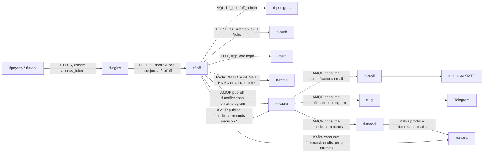
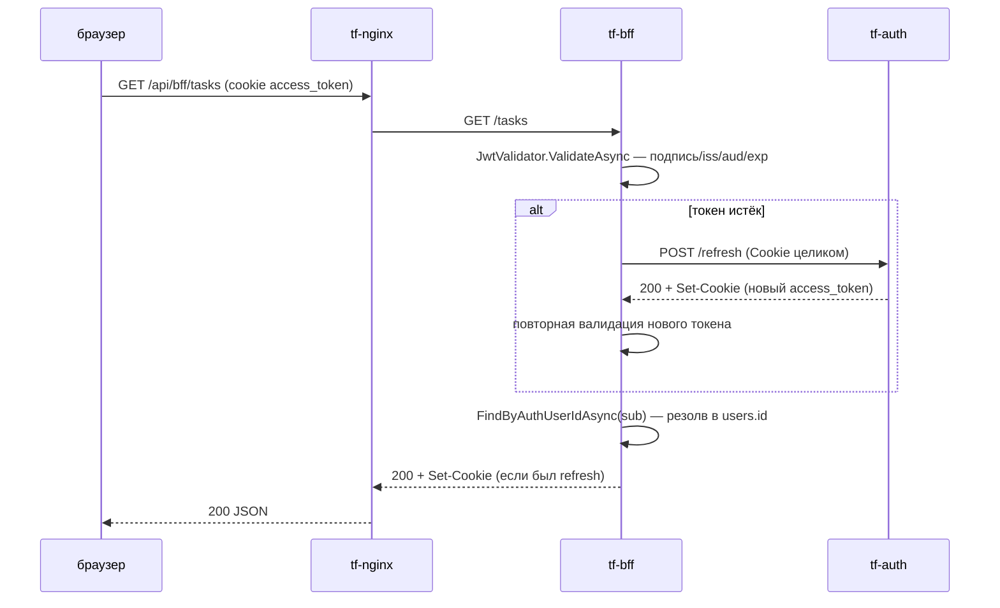
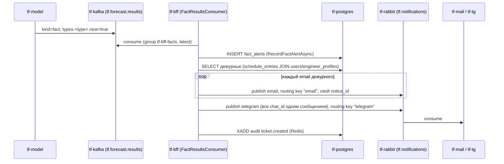

# tf-bff

Версия: dev@1c5a171, дата: 2026-09-29

## 1. Назначение

`tf-bff` — Backend For Frontend для SPA `think-front`. Единственная точка входа фронтенда в предметную
область: RBAC (пользователи/группы/права), топология объектов и датчиков, прогнозы и происшествия модели,
заявки и работы диспетчеров/инженеров, график/присутствие/инженерные допуски, админ-настройки модели
(версии, коэффициенты, дообучение), рассылка уведомлений (email/Telegram) и приём готовых прогнозов/фактов
от `tf-model` через Kafka. Сам ничего не вычисляет и не хранит сырые показания датчиков — это зона
`tf-funnel`/`tf-model`. Наружу виден только через `tf-nginx` (`/api/bff/...` → внутрь как `/...`,
[docs/DECISIONS.md:134-141](../DECISIONS.md)).

## 2. Схема взаимодействия



Два ключевых сценария:





## 3. Интерфейсы

### Входящие (через nginx, `/api/bff/...`)

Права указаны как `ресурс:флаг`; для GET `/permissions/me`, `/permissions/check`, `/resources` и
`GET /readings/scope` отдельного грант-права нет — доступен любому аутентифицированному, логика внутри
сервиса (см. §6).

| Метод | Путь | Право | Что делает |
|---|---|---|---|
| GET | `/health/live` | — (не аутентифицируется, `AUTH_SKIP_PATHS`) | процесс жив |
| GET | `/health/ready` | — | БД + JWKS доступны |
| GET | `/permissions/me` | любой вошедший | эффективные права текущего пользователя |
| GET | `/permissions/check?resource=&permission=` | любой вошедший | одна проверка права |
| GET | `/permissions/grants` | `permissions:read` | список грантов |
| POST | `/permissions/grants` | `permissions:manage` | выдать/обновить грант |
| DELETE | `/permissions/grants/{id}` | `permissions:manage` | отозвать грант |
| GET | `/resources` | любой вошедший | справочник кодов ресурсов |
| POST | `/resources` | `permissions:manage` | зарегистрировать новый код ресурса |
| GET | `/users` | `users:read` | список пользователей |
| GET | `/users/{id}` | `users:read` | профиль + группы 1-го уровня |
| POST | `/users` | `users:create` | создать профиль |
| PUT | `/users/{id}` | `users:update` | изменить профиль |
| DELETE | `/users/{id}?soft=` | `users:delete` | деактивировать/удалить |
| POST | `/users/{id}/groups` | `users:update` | добавить в группы |
| DELETE | `/users/{id}/groups/{groupId}` | `users:update` | исключить из группы |
| GET | `/users/{id}/schedule` | `schedule:read` | график пользователя |
| POST | `/users/{id}/schedule` | `schedule:update` | строка графика |
| DELETE | `/users/{id}/schedule/{entryId}` | `schedule:update` | удалить строку |
| GET | `/users/{id}/assigned-objects` | `assigned_objects:read` | закреплённые объекты |
| POST | `/users/{id}/assigned-objects` | `assigned_objects:update` | закрепить (upsert) |
| DELETE | `/users/{id}/assigned-objects/{objectId}` | `assigned_objects:update` | открепить |
| GET | `/users/{id}/engineer-profile` | `engineers:read` | профиль инженера |
| PUT | `/users/{id}/engineer-profile` | `engineers:update` | upsert профиля |
| GET | `/users/{id}/permits` | `engineers:read` | допуски, включая просроченные |
| POST | `/users/{id}/permits` | `engineers:update` | добавить допуск |
| DELETE | `/users/{id}/permits/{permitId}` | `engineers:update` | удалить допуск |
| GET | `/groups` | `groups:read` | список групп |
| GET | `/groups/{id}` | `groups:read` | группа |
| POST | `/groups` | `groups:create` | создать |
| PUT | `/groups/{id}` | `groups:update` | изменить |
| DELETE | `/groups/{id}` | `groups:delete` | удалить |
| POST | `/groups/{id}/members` | `groups:update` | добавить участника |
| POST | `/groups/{id}/members/batch` | `groups:update` | добавить пачкой |
| DELETE | `/groups/{id}/members/{memberType}/{memberId}` | `groups:update` | исключить участника |
| GET | `/presence?userIds=` | `presence:read` | кто онлайн (пишется автоматически на каждый запрос) |
| GET | `/objects` | `objects:read` | список объектов |
| GET | `/objects/{id}` | `objects:read` | объект |
| POST | `/objects` | `objects:create` | создать |
| PUT | `/objects/{id}` | `objects:update` | изменить |
| DELETE | `/objects/{id}` | `objects:delete` | удалить |
| GET/POST/PUT/DELETE | `/objects/{id}/pickets[/{picketId}]` | `objects:read`/`objects:update` | пикеты объекта |
| GET/POST | `/objects/{id}/layers` | `objects:read`/`objects:update` | слои карты |
| GET | `/sensors` | `sensors:read` | список датчиков |
| GET | `/sensors/types` | `sensors:read` | справочник подсистем/типов для формы |
| GET | `/sensors/{id}` | `sensors:read` | датчик |
| POST | `/sensors` | `sensors:create` | создать |
| PUT | `/sensors/{id}` | `sensors:update` | изменить |
| DELETE | `/sensors/{id}` | `sensors:delete` | удалить |
| GET/POST/DELETE | `/sensors/{id}/links[/{toSensorId}/{kind}]` | `sensors:read`/`sensors:update` | связи датчиков |
| GET | `/readings/scope?objectId=` | любой вошедший, решает сервис | кому что видно в окне «Логи» — см. §4 |
| GET | `/predictions` | `predictions:read` | список прогнозов |
| GET | `/predictions/{id}` | `predictions:read` | прогноз с факторами/свидетелями |
| POST | `/predictions` | `predictions:create` | создать вручную (нормально — Kafka-консьюмер, §4) |
| POST | `/predictions/{id}/decisions` | `predictions:update` | решение диспетчера — take/reject/mute/reopen |
| GET | `/fact-alerts` | `predictions:read` | список событий «по факту» |
| POST | `/fact-alerts` | `predictions:create` | создать вручную (нормально — Kafka-консьюмер) |
| GET | `/tasks?dispatcherId=&status=&assignedToMe=&page=&pageSize=` | `tasks:read` | список заявок |
| GET | `/tasks/assignees?role=engineers\|dispatchers` | `tasks:read` | кандидаты на назначение/возврат |
| GET | `/tasks/{id}` | `tasks:read` | заявка целиком |
| POST | `/tasks` | `tasks:create` | создать |
| PUT | `/tasks/{id}` | `tasks:update` | изменить |
| POST | `/tasks/{id}/take` | `tasks:update` | взять в работу (гонка → `409 task_already_taken`) |
| POST | `/tasks/{id}/predictions` | `tasks:update` | прикрепить прогноз-основание |
| DELETE | `/tasks/{id}/predictions/{predictionId}` | `tasks:update` | открепить |
| POST | `/tasks/{id}/assignments` | `tasks:update` | назначить инженера |
| POST | `/tasks/{id}/reports` | `tasks:update` | сдать отчёт |
| POST | `/tasks/{id}/returns` | `tasks:update` | вернуть заявку |
| POST | `/tasks/{id}/start` | `tasks:update` | `assigned` → `engineerWorking` |
| POST | `/tasks/{id}/close` | `tasks:update` | `completed` → `closed` |
| POST | `/tasks/{id}/cancel` | `tasks:update` | отмена из любого активного статуса |
| GET | `/incidents` | `incidents:read` | список происшествий |
| GET | `/incidents/{id}` | `incidents:read` | происшествие |
| POST | `/incidents` | `incidents:create` | создать |
| POST | `/incidents/{id}/confirm` | `incidents:update` | подтвердить |
| GET | `/brigades` | `engineers:read` | список бригад |
| POST | `/brigades` | `engineers:create` | создать бригаду |
| GET/POST | `/model-versions[/{id}/activate]` | `model_settings:read`/`manage` | версии модели |
| GET/POST | `/coefficients` | `model_settings:read`/`manage` | коэффициенты (версионируются, не редактируются) |
| GET/POST | `/retrain-jobs` | `model_settings:read`/`manage` | заявки на дообучение |
| GET/POST/DELETE | `/ignored-ranges[/{id}]` | `model_settings:read`/`manage` | игнорируемые диапазоны |
| GET/POST/PUT/DELETE | `/work-schedule[/{workId}]` | `model_settings:read`/`manage` | плановые работы |
| POST | `/notifications/email` | `notifications:create` | рассылка писем, см. §4 |

Источник — атрибуты `[HttpGet]`/`[HttpPost]`/`[HttpPut]`/`[HttpDelete]` и `[RequirePermission]` во всех
файлах `src/BFF.WebApi/Controllers/*.cs`.

### Исходящие

| Протокол | Куда | Зачем | Что при недоступности |
|---|---|---|---|
| SQL (Npgsql) | `tf-postgres`, БД `tf`, схема `bff` | всё хранение состояния BFF | сервис не отвечает (`/health/ready` → 503 по `database`) |
| HTTP | `tf-auth`, `AUTH_REFRESH_PATH` | обновить access-token по истечении | `401 token_refresh_failed` пользователю |
| HTTP | `tf-auth`, `AUTH_JWKS_URL` | публичный ключ для проверки подписи, кэш `AUTH_JWKS_CACHE_MINUTES` | `503 auth_service_unavailable`, `/health/ready` → `jwks: false` |
| HTTP | Vault, `VAULT_ADDR` | AppRole-логин, чтение секретов при старте контейнера | контейнер не стартует (см. §7) |
| Redis (StackExchange.Redis) | `tf-redis` | поток `audit` (журнал действий), ключи `email:ratelimit:*` (антиспам) | аудит уходит в лог сервиса вместо Redis; лимитер пропускает (fail-open) — `src/BFF.WebApi/Audit/AuditWriter.cs:70`, `src/BFF.WebApi/Notifications/EmailRateLimiter.cs` |
| AMQP (RabbitMQ.Client 7.2.2) | `tf-rabbit`, exchange `tf.notifications` | публикация email/telegram-уведомлений | `PublishException` → вызывающий код помечает получателя `failed`, автоповтора нет |
| AMQP | `tf-rabbit`, exchange `tf.model.commands` | решения диспетчера обратно в модель | ошибка только в лог — решение уже в БД, диспетчеру не мешает |
| Kafka (Confluent.Kafka) | `tf-kafka`, топик `tf.forecast.results`, группа `tf-bff-facts` | приём прогнозов/фактов от модели | без `TF_KAFKA_BFF_PASSWORD` консьюмер не стартует, остальной BFF работает; сбой обработки — 4 попытки, потом пропуск с логом |

## 4. Контракты данных

### Ошибки (все ручки)

```json
{ "code": "not_found", "message": "...", "details": null }
```

`code`/`message` всегда; `details` — объект с массивами сообщений по полю, только у `validation_failed`
(`400`). Источник — `src/BFF.WebApi/Middleware/ExceptionHandlingMiddleware.cs`.

| HTTP | code | Когда |
|---|---|---|
| 400 | `validation_failed` | не прошла FluentValidation |
| 400 | `bad_request` | `ArgumentException` в контроллере/сервисе |
| 401 | `unauthenticated` / `invalid_token` / `token_refresh_failed` | нет токена / подпись-формат не те / refresh не удался |
| 403 | `user_not_provisioned` / `user_inactive` | claim валиден, но профиля в BFF нет / деактивирован |
| 403 | (через `[RequirePermission]`) | нет права на ресурс |
| 404 | `not_found` (+ конкретный `ErrorCode` исключения) | |
| 409 | `task_already_taken`, `prediction_already_decided`, `invalid_status`, `duplicate_code` и т.п. | конфликт/гонка |
| 503 | `auth_service_unavailable` | не удалось получить ключ подписи от `tf-auth` |
| 500 | `internal_error` | необработанное исключение |

### `POST /notifications/email` → RabbitMQ `tf.notifications`, routing key `email`

Контракт задан think-infra (`docs/notify-tz/tf-bff.md` — не в этом репозитории, **не проверено**, что
текущая реализация совпадает буква в букву; сверено с копией задания, полученной в чат, см.
`docs/DECISIONS.md`). Тело:

```json
{
  "schema": 1,
  "notice_id": "0b6f3c1e-2f0a-4c55-9a55-3f1d6c0e8a11",
  "subject": "...",
  "text": "...",
  "to": { "emails": ["a@example.com"] },
  "ticket_id": "...",
  "kind": "...",
  "request_id": "..."
}
```

| Поле | Тип | Обяз. | Смысл |
|---|---|---|---|
| `schema` | int | да | всегда `1` |
| `notice_id` | uuid | да | новый на каждое сообщение (BFF не переиспользует, `Guid.NewGuid()` на каждый вызов) |
| `subject` | string | да | обрезается BFF до 255 символов |
| `text` | string | да | только текст, обрезается до 20000; `\n` — перевод строки |
| `to.emails` | string[1] | да | у BFF всегда ровно один адрес — одно сообщение на получателя |
| `ticket_id` | string? | нет | id заявки/эпизода, для логов `tf-mail` |
| `kind` | string? | нет | `"fact"` для событий модели, не задаётся у ручной рассылки |
| `request_id` | string? | нет | `X-Request-ID`/`TraceIdentifier` запроса |

`routing key "telegram"` — то же тело, `to.chat_ids` вместо `to.emails` (`long` или `"@канал"`), одно
сообщение на все чаты дежурных разом (не по одному, в отличие от email). Источник —
`src/BFF.WebApi/Notifications/NoticePublisher.cs`, `FactNotifier.cs:65-85`.

`notice_id` не связан с идемпотентностью на стороне BFF — обнаружение дублей и правило «в течение суток
одному адресату второй раз не уйдёт» реализует `tf-mail` (**не проверено** — вне этого репозитория).

### `tf.model.commands` (публикация)

```json
{
  "schema": 1,
  "command_id": "...",
  "kind": "decision.take|decision.reject|decision.mute|decision.reopen|decision.confirmed",
  "issued_at": "...",
  "issued_by": { "sub": "...", "login": "..." },
  "request_id": "...",
  "payload": { "...": "..." }
}
```

`routing key` = `kind`. `command_id` = id решения диспетчера или id происшествия — повторная публикация
с тем же `command_id` идемпотентна на стороне модели (**не проверено**, со слов ML/INTEGRATION.md §13.3).
Источник — `src/BFF.WebApi/Notifications/ModelCommandPublisher.cs`, `ModelDecisionRelay.cs`.

### `tf.forecast.results` (потребление, топик Kafka)

Два вида сообщений, различаются полем `kind`:

- `kind: "forecast"` — прогноз объекта на час: `object_id`, `hour_end`, `horizon_hours`, `model_version`,
  `types.<тип>.{score,threshold,alarm,confidence,since_hours,reasons[],evidence[],recommendation,silent[]}`.
  BFF берёт только типы с `alarm: true`.
- `kind: "fact"` — событие по факту: `object_id`, `types.<тип>.{new,started_at,last_at,route[],work_id,
  note,temperature,...}`. `new: true` — объявление нового эпизода, `new: false` — обновление того же.

`clock: "replay"` — демонстрационное время; прогнозы из него принимаются, только если
`TF_FORECAST_REPLAY=true` (в проде не задаётся), факты из `replay` не принимаются никогда. Разбор —
`src/BFF.WebApi/Notifications/FactResultsConsumer.cs:176-402`.

## 5. Данные и состояние

PostgreSQL, схема задаётся `DB_SCHEMA` через `Search Path` в строке подключения (ни в одной EF-конфигурации
схема не захардкожена — `src/BFF.Context/BffDbContext.cs:61-63`). 30 таблиц:

| Домен | Таблицы |
|---|---|
| RBAC-ядро | `users`, `groups`, `group_members`, `group_closure`, `resources`, `access_grants`, `rbac_version` |
| Пользователи-доп | `schedule_entries`, `user_activity`, `assigned_objects`, `brigades`, `engineer_profiles`, `engineer_permits` |
| Топология | `objects`, `pickets`, `sensors`, `sensor_links`, `map_layers` |
| Прогнозы | `predictions`, `prediction_factors`, `prediction_evidence`, `prediction_decisions`, `fact_alerts` |
| Заявки | `tasks`, `task_predictions`, `task_assignments`, `task_reports`, `task_returns`, `incidents` |
| Админ-настройки модели | `model_versions`, `coefficients`, `retrain_jobs`, `ignored_ranges`, `work_schedule` |

Источник имён — `ToTable(...)` во всех файлах `src/BFF.Context/Configurations/*.cs`.

**Redis** (`tf-redis`, опционален — без `REDIS_HOST` соответствующая функция просто не работает,
остальной сервис не страдает):
- Stream `audit`, `XADD audit * event <json>`, максимум 1 000 000 записей (`MaxLength` в
  `AuditWriter.cs:34`) — читает `tf-audit` (**не проверено**, вне репозитория).
- Ключи `email:ratelimit:{email}` (email в нижнем регистре), `SET NX EX 60` — антиспам-лимит для
  `POST /notifications/email`; на рассылку «по факту» (`FactNotifier`) не действует.

**Kafka** — потребитель без сохранения оффсета вне брокера (`EnableAutoCommit: false`, коммит вручную
после обработки — `FactResultsConsumer.cs:59,98`); первый запуск группы `tf-bff-facts` стартует с конца
топика (`AutoOffsetReset.Latest`) — старые сообщения при первом подключении не разбираются.

**In-process кэши** (`IMemoryCache`, не Redis — не общие между репликами):
- Права пользователя: ключ `perm:{userId}:{rbacVersion}`, TTL `PERMISSIONS_CACHE_TTL_SECONDS` (300 с по
  умолчанию); версия RBAC кэшируется `RBAC_VERSION_POLL_SECONDS` (5 с) — `PermissionCache.cs`.
- JWKS/подписывающий ключ: `AUTH_JWKS_CACHE_MINUTES` (60 мин) — `JwtValidator.cs:96`.
- Присутствие: не пишет в БД чаще раза в `FlushIntervalSeconds` (30 с) на пользователя —
  `PresenceTracker.cs:27-48`, `PresenceOptions.cs`.

Сервис в остальном stateless. Несколько реплик технически можно запускать (RabbitMQ-соединение и
Kafka-консьюмер поднимаются в каждом процессе независимо, БД — общий источник истины), но **не
проверялось под нагрузкой/на реальной multi-replica среде**: каждая реплика держит свой `IMemoryCache`,
поэтому инвалидация прав по `rbac_version` у разных реплик рассинхронизирована в пределах
`RBAC_VERSION_POLL_SECONDS`. Docker Compose сейчас (`deploy/docker-compose.yml`) поднимает ровно один
контейнер, без `replicas`.

При перезапуске контейнера теряются только перечисленные in-process кэши (пересобираются из БД/Vault/
JWKS заново) — данных это не касается.

## 6. Безопасность и политики

Единственное место разбора токена — `TokenAuthenticationMiddleware`
(`src/BFF.WebApi/Middleware/TokenAuthenticationMiddleware.cs`). Источник токена — заголовок
`Authorization: Bearer ...` или cookie `AUTH_ACCESS_TOKEN_COOKIE` (по умолчанию `access_token`), в этом
порядке (`ExtractToken`, строки 195-207).

Проверка (`JwtValidator.cs`): подпись (RSA или ECDSA — автоопределение по PEM/JWKS, `ParseSigningKeys`),
`ValidateIssuer` = `AUTH_ISSUER`, `ValidateAudience` = `AUTH_AUDIENCE`, `ValidateLifetime`, `ClockSkew`
30 с. `MapInboundClaims = false` — иначе `JwtSecurityTokenHandler` переименовывает `sub` в legacy URI и
ломает резолв пользователя (см. `docs/DECISIONS.md`, инцидент). Обязательный claim — `AUTH_USER_ID_CLAIM`
(по умолчанию `sub`): по его значению ищется `users.auth_user_id`; нет такой строки → `403
user_not_provisioned`, `is_active = false` → `403 user_inactive`. Токен истёк → один прогон обновления
через `AUTH_SERVICE_URL` + `AUTH_REFRESH_PATH`, cookie-заголовок пересылается в `tf-auth` **как есть**
(`AuthServiceClient.cs`), параллельные обновления по одному и тому же набору cookie схлопываются
(`RefreshesInFlight`, `TokenAuthenticationMiddleware.cs:21,148`).

Своих учётных записей для межсервисного вызова у BFF нет: RabbitMQ/Kafka-клиенты BFF выступают только
инициатором (публикуют/потребляют), входящих вызовов от других сервисов к API BFF с отдельной
аутентификацией не предусмотрено — всё через тот же JWT конечного пользователя.

**RBAC**: битовая маска `PermissionFlags` (`Create=1, Read=2, Update=4, Delete=8, Export=16, Import=32,
Manage=64`, `src/BFF.Models/Enums/PermissionFlags.cs`), гранты — `access_grants` (принципал: пользователь
или группа), группы поддерживают вложенность через материализованное замыкание `group_closure`. Политики
авторизации не регистрируются заранее — `PermissionPolicyProvider` строит `perm:{resource}:{mask}` на
лету (`src/BFF.WebApi/Authorization/PermissionPolicyProvider.cs`). Ручки без `[RequirePermission]`
(`/permissions/me`, `/permissions/check`, `/resources` GET, `/readings/scope`) — под `[Authorize]`
(валидный токен обязателен), а конкретную область решает сам сервис (пример — `ReadingsScopeService`,
§13 доп.).

**Аудит**: `AuditMiddleware` пишет событие по белому списку маршрутов
(`src/BFF.WebApi/Audit/AuditMiddleware.cs:17-45`) — только эти POST/PUT/DELETE, плюс `access.denied` на
любой `403`. Из тела запроса в лог попадают только явно перечисленные поля (whitelist), не тело целиком.
Покрыты далеко не все мутирующие ручки — см. §11.

**Чувствительные данные**: пароли/токены Vault не логируются нигде в коде (grep по репозиторию не находит
таких мест); тело запроса в аудит идёт только по whitelist полей. Секреты в контейнер попадают через
`vault-entrypoint.sh`, не хранятся в `.env` на диске (кроме локальной разработки без `VAULT_ROLE_ID`) —
см. §7.

## 7. Конфигурация

| Переменная | По умолчанию | Обязательна | Секрет (Vault путь → ключ) | Смысл |
|---|---|---|---|---|
| `DB_HOST` | — | да | нет | хост Postgres, прод/dev: `tf-postgres` |
| `DB_PORT` | — | да | нет | порт Postgres |
| `DB_NAME` | — | да | нет | база, прод/dev: `tf` |
| `DB_USER` | — | да | нет | `bff_user` |
| `DB_PASSWORD` | — | да | `postgres/bff` → `TF_PG_BFF_USER_PASSWORD` | пароль `bff_user` |
| `DB_SCHEMA` | — | да | нет | схема, `bff` |
| `DB_MAX_POOL_SIZE` | 50 | нет | нет | пул соединений Npgsql |
| `AUTH_SERVICE_URL` | — | да | нет | базовый адрес `tf-auth` |
| `AUTH_REFRESH_PATH` | `/api/auth/refresh` | нет | нет | путь обновления токена (на проде — `/refresh`, см. `deploy-prod.yml`) |
| `AUTH_REFRESH_TIMEOUT_SECONDS` | 5 | нет | нет | таймаут запроса обновления |
| `AUTH_JWKS_URL` | — | да | нет | откуда брать ключ подписи |
| `AUTH_JWKS_CACHE_MINUTES` | 60 | нет | нет | TTL кэша ключа |
| `AUTH_ISSUER` | `""` | нет | нет | ожидаемый `iss` |
| `AUTH_AUDIENCE` | `""` | нет | нет | ожидаемый `aud` |
| `AUTH_ACCESS_TOKEN_COOKIE` | `access_token` | нет | нет | имя cookie |
| `AUTH_USER_ID_CLAIM` | `sub` | нет | нет | claim → `users.auth_user_id` |
| `PERMISSIONS_CACHE_TTL_SECONDS` | 300 | нет | нет | TTL кэша прав |
| `RBAC_VERSION_POLL_SECONDS` | 5 | нет | нет | как часто перечитывать версию RBAC |
| `CORS_ALLOWED_ORIGINS` | `""` (CORS выключен) | нет | нет | список через запятую |
| `LOG_LEVEL` | `Information` | нет | нет | уровень логирования Serilog |
| `REDIS_HOST` | не задан → функции выключены | нет | `redis` → `TF_REDIS_PASSWORD` | адрес Redis, `tf-redis:6379` |
| `RABBIT_HOST` | `tf-rabbit` | нет | `rabbit/bff` → `TF_RABBIT_BFF_PASSWORD` | адрес RabbitMQ |
| `RABBIT_PORT` | `5672` | нет | — | порт |
| `RABBIT_VHOST` | `tf` | нет | — | vhost |
| `RABBIT_USER` | `tf-bff` | нет | — | пользователь |
| `KAFKA_BOOTSTRAP` | `tf-kafka:9092` | нет | `kafka/bff` → `TF_KAFKA_BFF_PASSWORD` | адрес Kafka |
| `KAFKA_USER` | `tf-bff` | нет | — | SASL-пользователь |
| `KAFKA_FACTS_GROUP` | `tf-bff-facts` | нет | — | consumer group |
| `TF_FORECAST_REPLAY` | не задан (false) | нет | нет | принимать ли прогнозы из демонстрационного времени модели; **в проде не задавать** |
| `DB_MIGRATION_USER` / `DB_MIGRATION_PASSWORD` | — | да (контур миграций) | `postgres/bff` → `TF_PG_BFF_ADMIN_PASSWORD` | `bff_admin`, только контур миграций |
| `VAULT_ROLE_ID` / `VAULT_SECRET_ID` | — | да (кроме локальной разработки) | сами являются секретом (GitHub Environment) | AppRole сервиса |

`DB_HOST`/`DB_NAME`/`DB_USER`/`DB_PASSWORD`/`DB_SCHEMA`/`AUTH_SERVICE_URL`/`AUTH_JWKS_URL` — жёстко
обязательны, без них процесс падает при старте с понятным сообщением
(`src/BFF.WebApi/Extensions/ServiceCollectionExtensions.cs:11-24`). Остальные — либо у кода есть дефолт
(`RABBIT_*`/`KAFKA_*`), либо функция просто выключается (`REDIS_HOST`, `TF_KAFKA_BFF_PASSWORD`,
`TF_RABBIT_BFF_PASSWORD` пустой — тогда падает только конкретная публикация, не весь процесс).

**Как сервис получает секреты**: `vault-entrypoint.sh` (корень репозитория, копия из задания
инфраструктуры, `docs/VAULT_MIGRATION.md`) — при старте контейнера логинится в Vault по AppRole
(`VAULT_ROLE_ID`/`VAULT_SECRET_ID`), читает пути из `VAULT_SECRET_PATHS`
(`postgres/bff redis rabbit/bff kafka/bff` — `deploy/docker-compose.yml:23`), каждый ключ пути
экспортирует переменной окружения с тем же именем, подставляет `${TF_PG_BFF_USER_PASSWORD}` в
`DB_PASSWORD` (единственная переменная в `VAULT_EXPAND`), затем `exec` в основной процесс. Без
`VAULT_ROLE_ID` (локальная разработка) ничего не делает — сервис читает переменные окружения как есть.
Секреты никогда не пишутся на диск и не логируются.

## 8. Сборка и запуск

Образ — `deploy/Dockerfile`: многоступенчатая сборка, `mcr.microsoft.com/dotnet/sdk:8.0` →
`mcr.microsoft.com/dotnet/aspnet:8.0-alpine`. Публикуется не в реестр — собирается прямо на сервере при
выкатке. `EXPOSE 8080`, порт наружу не публикуется (`docker-compose.yml` без `ports:`) — единственный
вход снаружи сети — `tf-nginx`. Сеть — `think-fast-net` (внешняя, единая для Postgres/Vault/Redis/
RabbitMQ/Kafka/nginx). Лимиты (`deploy/docker-compose.yml:40-47`): 1 CPU / 512 MB (резерв 0.25 CPU / 128
MB). **Healthcheck в compose закомментирован** (`docker-compose.yml:34-39`) — Docker не перезапускает
контейнер сам по нездоровью, полагается на `restart: unless-stopped` (перезапуск только при падении
процесса).

**dev** — `.github/workflows/deploy-dev.yml`: любой push в ветку кроме `dev`/`prod`/`main`/`master`
мержит её в `dev` и деплоит через SSH — `git checkout`/`reset --hard` на сервере, миграции, затем
`docker compose build && up -d`.

**prod** — `.github/workflows/deploy-prod.yml`: push в `prod` (или ручной запуск). Код не клонируется на
сервере — `git archive` пакуется и копируется по SCP в `/srv/thinkfaster/services/think-bff` (переменная
`APP_DIR`). `.env`-файлы переносятся из предыдущей выкатки; если их ещё нет — создаются из
`.env.example` с подстановкой прод-значений (`AUTH_SERVICE_URL=http://tf-auth:8080`,
`AUTH_REFRESH_PATH=/refresh`, домен `thinkfaster.ru` в CORS). **Без секретов `PROD_IP`/`PROD_USER`/
`PROD_SSH_KEY` (repo secrets) или `VAULT_ROLE_ID`/`VAULT_SECRET_ID` (Environment `prod`) — деплой не
падает, а молча пропускается** (`::notice::`) — это стоит проверять отдельно, не только по зелёной
галочке в Actions.

Старая версия сохраняется как `$APP_DIR.old` перед подменой на новую — откат вручную: остановить
контейнеры, `rm -rf $APP_DIR && mv $APP_DIR.old $APP_DIR`, поднять заново (сама выкатка это не
автоматизирует).

**Порядок запуска**: перед `tf-bff` в обоих workflow сначала выполняется миграционный контур
(`deploy/migration/`, пользователь `bff_admin`) — `dotnet ef database update`, затем автоматически
`scripts/001_seed_initial_data.sql` (создаёт роль `admins`, коды ресурсов, при полностью пустой БД —
плейсхолдер первого администратора). Если миграции падают — `docker compose ... up
--abort-on-container-exit` возвращает ошибку, весь деплой останавливается (`set -e`), старый `tf-bff`
продолжает работать. Сам `tf-bff` при старте требует доступности Vault (или упадёт, если
`VAULT_ROLE_ID` задан, но Vault недоступен — до 10 минут ретраев логина, см.
`vault-entrypoint.sh`); Postgres, Redis, RabbitMQ, Kafka не проверяются на старте явно (кроме
БД — приложение не поднимется без connection string, но не делает preflight-пинг до первого запроса к
БД).

**Ручной запуск миграций/сидинга** — `deploy/migration/docker-compose.migrations.yml --profile
migrations up --abort-on-container-exit`, или точечно `scripts/seed-via-vault.sh` (логинится в Vault
сам, прогоняет `001_seed_initial_data.sql`).

## 9. Эксплуатация

`GET /health/live` — только жив ли процесс, БД не трогает (`HealthController.cs:29-31`).
`GET /health/ready` — 200/503, тело `{ status, database, jwks }`: `database` — простой пинг БД
(`IHealthService.IsDatabaseReadyAsync`), `jwks` — GET на `AUTH_JWKS_URL` с таймаутом 3 с.

Логи — Serilog, JSON построчно в stdout (`CompactJsonFormatter`), уровень — `LOG_LEVEL`. На что смотреть:
- `[vault-entrypoint] ...` — загрузка секретов при старте контейнера (успех/ошибка по каждому пути).
- `Consuming fact alerts from tf.forecast.results as tf-bff-facts` — Kafka-консьюмер поднялся;
  `TF_KAFKA_BFF_PASSWORD is not set — fact alerts ... are not consumed` — не поднялся (не ошибка, если
  так и задумано).
- Предупреждения `Audit stream unavailable`, `Email rate limiter unavailable`, `Failed to publish
  ...notice`, `Kafka: {Reason}` — деградация вспомогательной функции, не отказ всего сервиса.
- `Fact message dropped after 4 attempts` — конкретное сообщение из Kafka потеряно (не заявка/уведомление
  — исходное сообщение брокера).

Метрик (Prometheus и т.п.) нет — не реализовано (см. §11).

Типовые операции:
```bash
# миграции + сидинг вручную
docker compose -f deploy/migration/docker-compose.migrations.yml --profile migrations up --abort-on-container-exit

# пересидить вручную (после правки scripts/001_seed_initial_data.sql)
VAULT_ADDR=http://vault:8200 VAULT_TOKEN=<токен> DB_HOST=tf-postgres ./scripts/seed-via-vault.sh

# перезапуск приложения (безопасен — теряются только in-process кэши, §5)
docker compose -f deploy/docker-compose.yml restart tf-bff
```
Ротации ключей отдельной команды не требует — секреты перечитываются при каждом старте контейнера.
Очистки данных вручную (кроме обычного `DELETE`/деактивации через API) не предусмотрено.

## 10. Ошибки и проблемы

| Симптом | Причина | Как исправить |
|---|---|---|
| `401 invalid_token: Token has no 'sub' claim`, хотя `sub` есть в JWT | `JwtSecurityTokenHandler` переименовывает `sub` в legacy XML-URI по умолчанию | `MapInboundClaims = false` — уже исправлено, `JwtValidator.cs:39` |
| `503 auth_service_unavailable` / `IDX10805` при разборе JWKS | `AUTH_JWKS_URL` отдаёт голый PEM, а не JWKS-документ | `ParseSigningKeys` определяет формат по первому символу — уже исправлено, `JwtValidator.cs:106-117` |
| `password authentication failed for user "tf"` в контуре миграций | в `deploy/migration/.env` на сервере устарел `DB_MIGRATION_USER` (роль `tf` — суперпользователь инфраструктуры, BFF её не использует) | привести `DB_MIGRATION_USER=bff_admin` в `.env` на сервере |
| `bff-migrations` 10 минут ретраит логин в Vault, потом падает по таймауту | `DOCKER_NETWORK` в `.env` указывал не на ту сеть (сеть Postgres вместо сети Vault) | устранено структурно — сеть теперь зашита буквально (`think-fast-net`), переменной `DOCKER_NETWORK` больше нет |
| `permission denied for database tf` на `CREATE SCHEMA IF NOT EXISTS` | `bff_admin` владеет схемой, но не имеет `CREATE` на базу (инфраструктура заводит схему сама) | `DB_SKIP_SCHEMA_CREATE: "true"` зашито в `docker-compose.migrations.yml`, не зависит от `.env` |
| Деплой в prod «прошёл», но ничего не поменялось | `deploy-prod.yml` молча пропускает шаги без `PROD_IP`/`PROD_USER`/`PROD_SSH_KEY`/`VAULT_ROLE_ID`/`VAULT_SECRET_ID` | проверить `::notice::` в логе шага, завести секреты |

Источник — `docs/DECISIONS.md` (полная история решений и инцидентов, самый подробный источник фактов о
прошлых проблемах).

## 11. Ограничения и известные недоработки

- **Healthcheck в compose не подключён** (закомментирован, `docker-compose.yml:34-39`) — оркестратор не
  перезапускает контейнер по `/health/ready`, только по падению процесса.
- **Нет метрик** (Prometheus/что-либо ещё) — только логи.
- **In-process кэши не общие между репликами** — при масштабировании выше одного контейнера (сейчас не
  настроено) права/JWKS у разных реплик обновляются независимо, с разбросом до
  `RBAC_VERSION_POLL_SECONDS`/`AUTH_JWKS_CACHE_MINUTES`.
- **Аудит покрывает не все мутирующие ручки** — whitelist в `AuditMiddleware.cs:17-45` не включает,
  например: `PUT /users/{id}`, состав групп/графика/закреплений/допусков пользователя, весь CRUD
  объектов/датчиков/пикетов/слоёв, ручное создание прогнозов/fact-alerts, переходы `start`/`close`/
  `cancel` заявки, ручки админ-настроек модели (`retrain-jobs`, `work-schedule`), создание бригад и
  ресурсов.
- **Антиспам-лимит email — fail-open**: при недоступном Redis лимит не применяется, письма всё равно
  уходят (сознательное решение, `docs/DECISIONS.md`).
- **Нет автоповтора публикации в RabbitMQ** с тем же `notice_id`/`command_id` — при сбое публикации
  вызывающая сторона получает `failed`/запись в лог и должна повторить действие сама.
- **Kafka-консьюмер один поток на процесс**, без партиционирования/масштабирования потребления.
- **Нет multi-tenancy** — одна схема БД на окружение.

## 12. Возможности доработки

| Приоритет | Объём | Что |
|---|---|---|
| Высокий | часы | Включить healthcheck в `docker-compose.yml` (уже закомментирован, только раскомментировать и проверить) |
| Средний | часы | Расширить `AuditMiddleware.Rules` на непокрытые мутирующие ручки (§11) |
| Средний | дни | Метрики (Prometheus `/metrics` или аналог) — латентность ручек, размер очередей публикации, статус Kafka-консьюмера |
| Средний | дни | Автоповтор с backoff для публикации в RabbitMQ вместо разового `Failed` |
| Низкий/средний | дни | Общий (Redis-backed) кэш прав вместо `IMemoryCache`, если реплик станет больше одной |

## 13. Как интегрироваться и что менять

Чтобы новому сервису начать пользоваться API BFF: получить учётную запись в `tf-auth`, чтобы получить
`access_token`/`sub`; завести профиль в BFF (`users.auth_user_id` = этот `sub` — не автоматически, нужен
существующий администратор с правом `users:create`, либо ручной `INSERT`/`UPDATE` в БД, как при
бутстрапе первого администратора — `scripts/001_seed_initial_data.sql`); выдать грант на нужный ресурс
через `POST /permissions/grants` (`permissions:manage`). Отдельного механизма service-to-service (без
пользовательского токена) нет.

Что обязательно согласовать с инфраструктурой при изменениях:
- новый Vault-путь — добавить в `VAULT_SECRET_PATHS` (`deploy/docker-compose.yml`) и в политику AppRole
  на стороне think-infra;
- новый RabbitMQ exchange/routing key или Kafka-топик/группу — топологию создаёт инфраструктура
  (`ExchangeDeclare`/`QueueDeclare` со стороны BFF запрещены, вернут `ACCESS_REFUSED`);
- новую схему/таблицу БД — только через EF-миграцию, применяется `bff_admin`, никогда — при старте
  приложения;
- новый публичный маршрут — добавить `location` в `tf-nginx` (репозиторий инфраструктуры, не здесь).

## 14. Открытые вопросы

- Контракт `POST /notifications/email` → `tf.notifications` сверен с копией задания think-infra,
  полученной в чате этой сессии — не сверялся напрямую с файлом `docs/notify-tz/tf-bff.md` в репозитории
  think-infra.
- Путь Vault `rabbit/bff` для прод-AppRole — со слов инфраструктуры уже настроен; из этого репозитория
  не проверялось, действительно ли политика прод-AppRole даёт к нему доступ.
- Реальный список секретов в GitHub (repo `PROD_IP`/`PROD_USER`/`PROD_SSH_KEY`, Environment `prod`
  `VAULT_ROLE_ID`/`VAULT_SECRET_ID`) — не проверялось напрямую (нет доступа к GitHub API из этой сессии);
  судя по логу `git log`, prod уже получал минимум два успешных деплоя (`Merge pull request #4/#5`), то
  есть на момент их проведения секреты были на месте.
- Нет ответа, ожидает ли оркестратор документации отдельного раздела про Docker Hub/реестр образов —
  сейчас образ нигде не публикуется, собирается на сервере при каждой выкатке.
