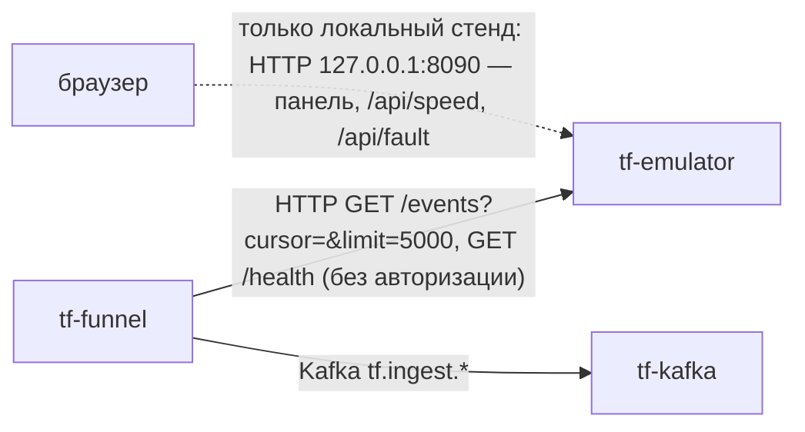
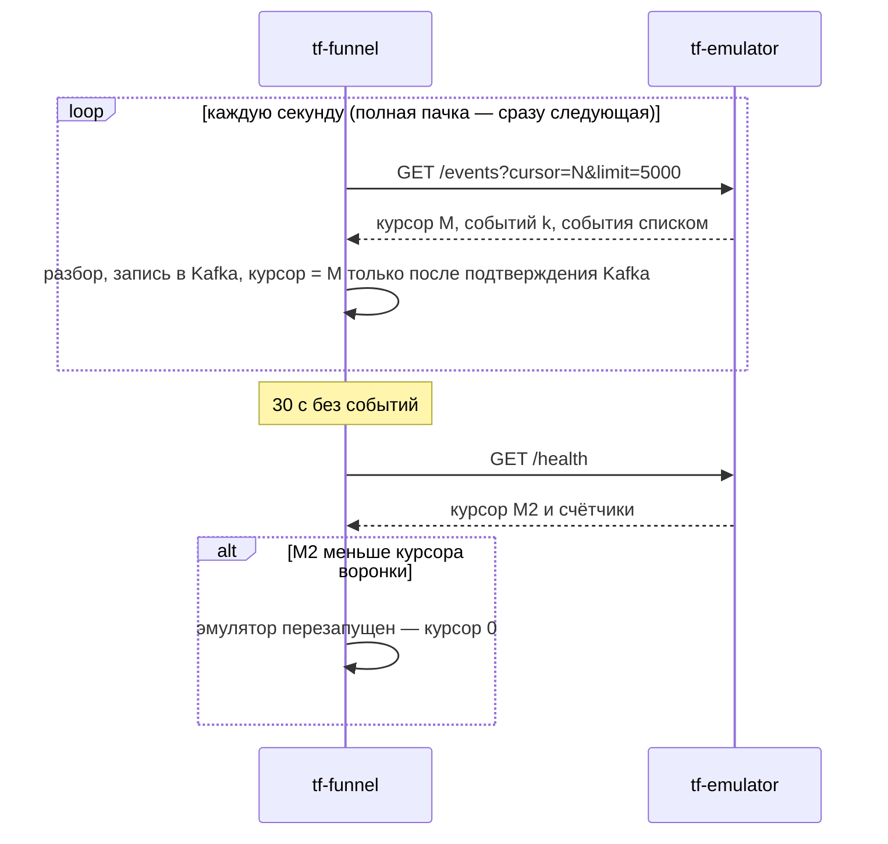

Версия: main@7cfe8f2, дата: 2026-09-29

Ссылки `файл:строка` без каталога — относительно `docs/backend/tests/` версии 0705b6b^ (см. врезку ниже), workflow — `.github/workflows/`; пути think-infra и think-auth — в их репозиториях.

## tf-emulator — эмулятор потока показаний

> Код эмулятора живёт в приватном репозитории think-test (`emulator/`), в этот репозиторий попадает только архивом
> `emulator-e8af7a3.tar.gz` в приватном релизе `dev-assets` (`.github/workflows/deploy-emulator-dev.yml:5-7`, `:30`).
> До 18.09 код лежал здесь, в `docs/backend/tests/` (удалён в 0705b6b). API и параметры ниже — по этой последней
> версии в истории репозитория (`git show 0705b6b^:docs/backend/tests/…`); совпадает ли с ней think-test@e8af7a3 —
> **не проверено**. Ручки, которыми пользуется воронка (`/events`, `/health`, поля `курсор`, `события`), подтверждаются
> кодом воронки (`docs/backend/funnel/pull.go:68-122`).

### 1. Назначение

Эмулятор подменяет шину объектов на стендах: проигрывает одни сутки журнала датасета по текущим часам (событие,
случившееся в исходных сутках в 03:09:27, выдаётся сегодня в 03:09:27) в формате журнала, так что потребитель не
отличает стенд от выгрузки (`engine.py:2-10`). Умеет ускорять время (1…3600×), выставлять ручное значение датчика и три
сбоя — залипание, отключение, замыкание. Потребитель — `tf-funnel` в режиме забора (`TF_FUNNEL_PULL`), дальше поток идёт
по контуру как настоящий: `tf.ingest.*` → `tf-model` и `tf-bff`. Запускается **только на локальном стенде и на dev
(greefob.ru). На prod (thinkfaster.ru) эмулятор не запускается**: workflow для prod нет, а выкатка воронки на prod
не задаёт `TF_FUNNEL_PULL`, «иначе в prod Kafka уйдут тестовые данные» (`.github/workflows/deploy-funnel-prod.yml:5-6`).

### 2. Схема взаимодействия





### 3. Интерфейсы

**Входящие** (`urls.py`, `views.py` версии 0705b6b^; порт 8000 внутри контейнера)

| Протокол | Адрес/путь | Кто вызывает | Авторизация | Что делает |
|---|---|---|---|---|
| HTTP GET | `/events` | `tf-funnel` | нет | события после курсора, JSON или CSV |
| HTTP GET | `/health` | `tf-funnel`, Docker healthcheck | нет | состояние и текущий курсор |
| HTTP GET | `/stream` | не используется контуром | нет | тот же поток через SSE |
| HTTP GET | `/channels`, `/objects` | человек на стенде | нет | справочники каналов и объектов |
| HTTP GET | `/` | человек на стенде | нет | панель оператора |
| HTTP GET | `/api/sensors` | панель | нет | таблица датчиков |
| HTTP POST | `/api/speed` | панель | нет | ускорение времени |
| HTTP POST/DELETE | `/api/override` | панель | нет | ручное значение датчика / снять |
| HTTP POST | `/api/fault` | панель | нет | сбой датчика |
| HTTP POST | `/api/reset` | панель | нет | снять ручные значения и сбои |

Публичного маршрута через nginx нет. На dev порт не публикуется (только сеть `think-fast-net`,
`deploy-emulator-dev.yml:8`, `:98-103`); на локальном стенде — `127.0.0.1:${TF_EMULATOR_PORT:-8090}`
(`docs/backend/stand.yml:164-165`).

**Исходящие**: нет (данные — файлы датасета внутри образа или клона think-test).

### 4. Контракты данных

`GET /events?cursor=0&limit=1000` (`views.py:47-76`):

| параметр | по умолчанию | смысл |
|---|---|---|
| `cursor` | 0 | вернуть события с курсором больше этого |
| `limit` | 1000, не больше 10 000 | размер страницы (воронка берёт 5000) |
| `channel_id`, `object_id`, `system`, `type`, `alarm_only` | нет | фильтры |
| `format` | JSON | `csv` — раскладка кавычек как в журнале датасета |

```json
{"курсор": 1043, "событий": 2, "события": [
  {"курсор": 1042, "ид_события": 90412331, "ид_канала_данных": 7001, "дата": "2026-09-29", "время": "14:03:11",
   "тревожное": false, "значение_датчика": "21.5", "тип_инж_системы": "…", "тип_датчика": "…",
   "название_датчика": "…", "ид_объект": 5122, "название_объекта": "…", "сбой": null}
]}
```

| поле | тип | смысл |
|---|---|---|
| `курсор` (верхний уровень) | int | курсор последнего события страницы (или переданный, если событий нет) |
| `курсор` (в событии) | int | сквозной номер выдачи с начала работы процесса |
| `ид_события` | int | номер события, продолжает максимальный номер исходных суток |
| `ид_канала_данных`, `дата`, `время`, `тревожное`, `значение_датчика` | как в журнале | то, что воронка кладёт в Kafka |
| `тип_инж_системы`, `тип_датчика`, `название_датчика`, `ид_объект`, `название_объекта`, `сбой` | справочные | воронка отбрасывает |

Воронка принимает этот ответ как пакет (`{"события": [...]}`, `docs/backend/funnel/parse.go:216-224`).

`GET /health` (`engine.py` `health()`): `{"состояние": "работает", "время_эмулятора", "исходные_сутки", "ускорение",
"выдано_событий", "из_них_тревожных", "событий_в_секунду", "курсор", "в_буфере", "подписчиков_на_поток",
"ручных_значений", "сбоев": {"залипание", "отключение", "замыкание"}}`.

Управление: `POST /api/speed {"speed": 60}` → `{"ускорение": 60.0}` (зажимается в 1…3600);
`POST /api/override {"channel_id": 7001, "value": "35"}` (значение — в пределах наблюдавшихся в сутках, иначе 400 с
`пределы`), `DELETE` — снять; `POST /api/fault {"channel_id": 7001, "kind": "stuck|offline|short"}`;
`POST /api/reset`. Ошибки — 400 `{"ошибка": "…"}`, 405 на чужой метод. Версионирования нет.

### 5. Данные и состояние

- Данные — файлы датасета: `журнал_событий_пример.csv`, `справочник_каналов_датчиков.csv`,
  `справочник_объектов_диспетчер.csv` из каталога `TF_DATA` (в версии 0705b6b^; что лежит в архиве e8af7a3 — не проверено).
- Всё состояние — в памяти процесса: часы, курсор, буфер последних 50 000 событий (`deque`), ручные значения, сбои.
  Базы нет (`DATABASES = {}`), томов нет.
- **При перезапуске** курсор начинается с 0, буфер пуст — воронка это замечает по `/health` и читает сначала; модель
  отбрасывает повторы по ключу. События старше 50 000 последних из буфера уже не отдать.
- Один экземпляр (часы и курсор в памяти).

### 6. Безопасность и политики

- Авторизации нет ни на поток, ни на управление. Django в режиме `DEBUG = True`, `ALLOWED_HOSTS = ['*']`, встроенный
  `runserver` (`settings.py` версии 0705b6b^; `deploy-emulator-dev.yml:62`). Поэтому эмулятор не публикуется наружу:
  на dev — только внутренняя сеть, на стенде — только `127.0.0.1`.
- Django-ключ — переменная `TF_SECRET_KEY` (в коде есть несекретное значение по умолчанию для стенда); в Vault его нет,
  в выкатке не задаётся.
- Аудит не пишет. Данные — обезличенный датасет проекта, персональных данных нет (не проверено для архива e8af7a3).
- В контейнере dev — пользователь `nobody` (`deploy-emulator-dev.yml:58`).

### 7. Конфигурация

| Переменная | По умолчанию | Обязательна | Секрет (путь Vault → ключ) | Смысл |
|---|---|---|---|---|
| `TF_SPEED` | `1` | нет | — | ускорение времени; на dev — вход workflow `speed` |
| `TF_DATA` | `../../dataset` от кода | нет | — | каталог датасета |
| `TF_JITTER` | `90` | нет | — | разброс времени событий, с |
| `TF_FAULT_INTERVAL` | `10` | нет | — | период сбоев, с (точный смысл — не проверено) |
| `TF_SEED` | нет | нет | — | зерно случайности |
| `TF_SECRET_KEY` | значение для стенда в коде | нет | нет в Vault | ключ Django |
| `TF_EMULATOR_PORT` | `8090` | нет | — | порт панели на хосте (только локальный стенд) |

Секретов из Vault эмулятор не читает, роли AppRole у него нет (`deploy-emulator-dev.yml:8`).

### 8. Сборка и запуск

- **Dockerfile** не хранится: workflow пишет его на лету — `python:3.12-slim`, `pip install -r requirements.txt`,
  `USER nobody`, `EXPOSE 8000`, `HEALTHCHECK` — `GET /health` каждые 30 с, `CMD python manage.py runserver 0.0.0.0:8000
  --noreload` (`deploy-emulator-dev.yml:51-63`).
- **dev** — `.github/workflows/deploy-emulator-dev.yml`: push в `main` только при изменении самого workflow, иначе вручную
  с параметром `speed`. Исходники — `gh release download dev-assets` архива `EMULATOR_ASSET`; образ `tf-emulator:dev`
  собирается в CI и переносится файлом (`docker save` → scp → `docker load`), в реестр не публикуется. Секреты
  репозитория: `DEV_IP`, `DEV_USER`, `DEV_SSH_KEY`; окружение `dev`, пар Vault нет. Контейнер `tf-emulator`, сеть
  `think-fast-net`, без портов, `--memory 384m`, `--restart unless-stopped`, `-e TF_SPEED`.
- **prod** — нет workflow и не запускается.
- **Локальный стенд** — `docs/backend/stand.yml:152-170`: образ `python:3.12-slim`, клон think-test (`TF_TEST`)
  монтируется только для чтения в `/app`, зависимости ставятся при каждом старте, панель на `127.0.0.1:8090`,
  healthcheck с `start_period 60s`.
- **Зависимости при старте**: нет. Воронка без эмулятора ждёт с растущей паузой до 60 с.

**Обновление кода и откат.** Новый архив из think-test — в релиз `dev-assets` этого репозитория, новое имя в
`EMULATOR_ASSET` (`deploy-emulator-dev.yml:30`), push — и workflow выкатится. Откат — вернуть прежнее имя архива.
Сменить ускорение без выкатки на dev нельзя (порт не опубликован) — только повтор workflow с другим `speed` или
`POST /api/speed` изнутри сети:

```bash
docker exec tf-emulator python -c "import urllib.request,json; r=urllib.request.Request('http://127.0.0.1:8000/api/speed', data=json.dumps({'speed': 60}).encode(), headers={'Content-Type': 'application/json'}); print(urllib.request.urlopen(r).read().decode())"
```

### 9. Эксплуатация

- **Жив**: `docker ps` — `healthy`; `/health` — `курсор` растёт, `событий_в_секунду` > 0. Workflow выкатки печатает
  начало `/health` (`deploy-emulator-dev.yml:108`); `Dev status` — хвост лога.
- **Со стороны воронки**: в логе `tf-funnel` — `стенд: забираю поток у http://tf-emulator:8000`; при сбоях —
  `эмулятор недоступен (…)`, `эмулятор перезапущен — читаю поток сначала`.
- **Перезапуск**: `docker restart tf-emulator` — поток начнётся заново с курсора 0 (штатно для воронки).
- **Сброс сбоев**: `POST /api/reset` изнутри сети.
- Миграций, ротации ключей, очистки данных нет.

### 10. Ошибки и проблемы

| Симптом | Причина | Как исправить |
|---|---|---|
| в логе воронки `эмулятор недоступен (…) — снова через N с` | контейнер лежит или ещё стартует | `docker ps`, `docker logs tf-emulator` |
| воронка `эмулятор перезапущен — читаю поток сначала` | курсор эмулятора в `/health` меньше курсора воронки | штатно; дубли отбросит модель |
| выкатка: `gh release download` не находит архив | в `dev-assets` нет файла `EMULATOR_ASSET` | загрузить архив в релиз, проверить имя |
| выкатка «DEV_IP/DEV_USER/DEV_SSH_KEY не заданы — выкатка пропущена» | нет секретов репозитория | завести секреты |
| модель на dev помечает типы `stale_hours` ночью | эмулятор проигрывает одни сутки: в журнале реальные паузы каналов (охрана молчит до 13 ч) | штатно |
| пропуски событий у воронки после долгого простоя Kafka | буфер эмулятора — последние 50 000 событий, курсор воронки отстал сильнее | перезапустить эмулятор и воронку — поток начнётся заново |

### 11. Ограничения и известные недоработки

- Только одни сутки журнала по кругу: для модели нет истории глубиной 100 суток — прогнозы на dev
  демонстрационные (`ML/INTEGRATION.md` §13.1, Н8).
- Буфер 50 000 событий в памяти; всё состояние теряется при перезапуске.
- Нет авторизации; `DEBUG = True`; сервер разработки Django — не для нагрузки.
- Код вне этого репозитория: правки — через think-test и новый архив; какая версия выкачена — видно только по имени
  `EMULATOR_ASSET`.
- ТЗ think-infra (`docs/funnel-tz/tf-funnel.md` §3) считает эмулятор только локальным, а он работает на dev.

### 12. Возможности доработки

| доработка | приоритет | объём |
|---|---|---|
| зафиксировать в этом репозитории описание API think-test (или тест-контракт в воронке) | средний | 2–3 ч |
| режим «несколько суток / вся история» для модели на dev | средний | 1–2 дня (think-test) |
| отключить `DEBUG`, gunicorn вместо `runserver` | низкий | 2 ч |
| курсор, переживающий перезапуск | низкий | 2–3 ч |

### 13. Как интегрироваться и что менять

- Потребителю достаточно доступа в сеть `think-fast-net`: `GET http://tf-emulator:8000/events?cursor=<последний>&limit=…`,
  хранить курсор, по `/health` отслеживать перезапуск. Писать в Kafka напрямую из эмулятора нельзя — только через воронку.
- С инфраструктурой согласовать: запуск на dev (ТЗ think-infra считает его только локальным), память сервера (384 МБ),
  что эмулятор **никогда** не выкатывается на prod и не публикуется наружу.

### 14. Открытые вопросы

- Совпадает ли API think-test@e8af7a3 с версией 0705b6b^, описанной здесь, — не проверено (доступа к think-test и к
  архиву `dev-assets` из этой сессии нет).
- Оставлять ли эмулятор на dev после подключения настоящей шины (ТЗ think-infra §3 против текущего dev).
- Какие сутки датасета проигрываются в архиве e8af7a3 — не проверено.
