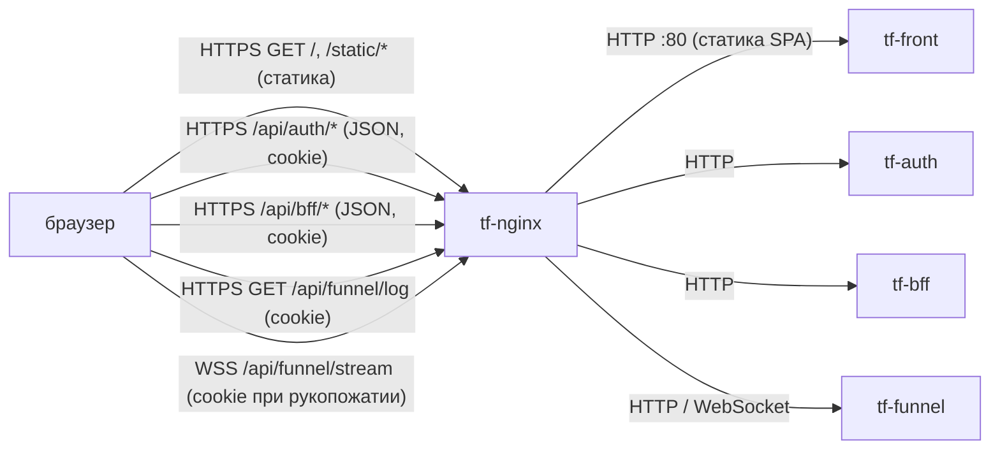
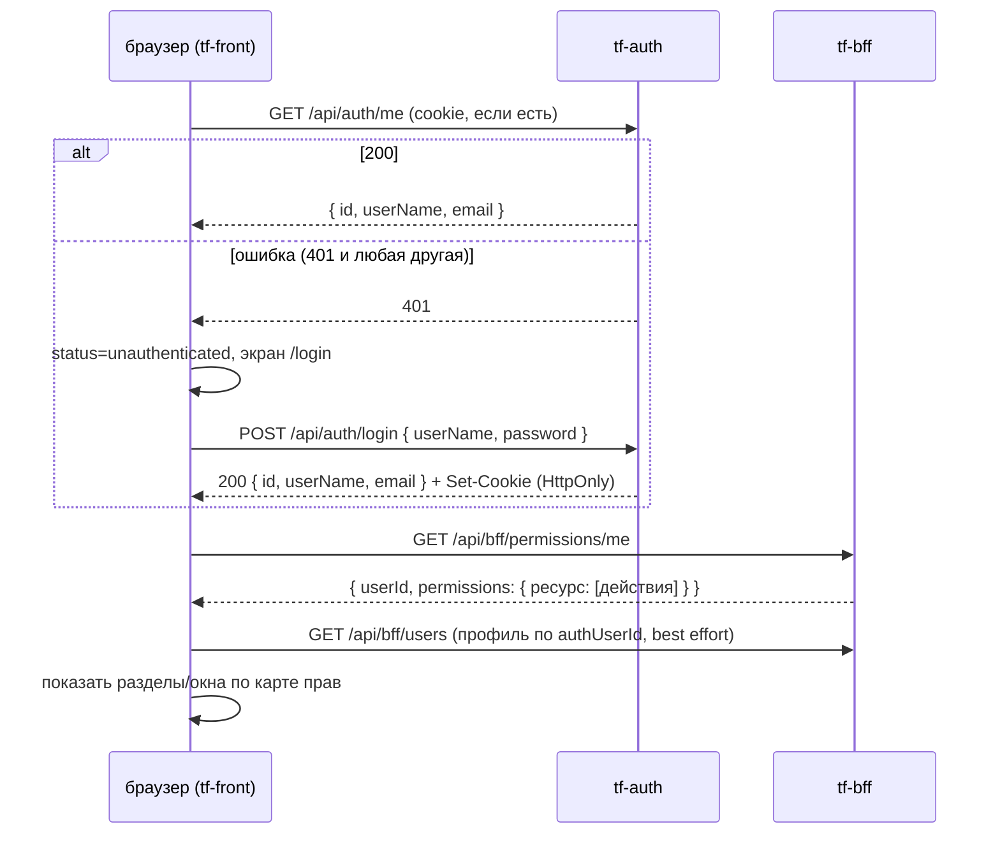
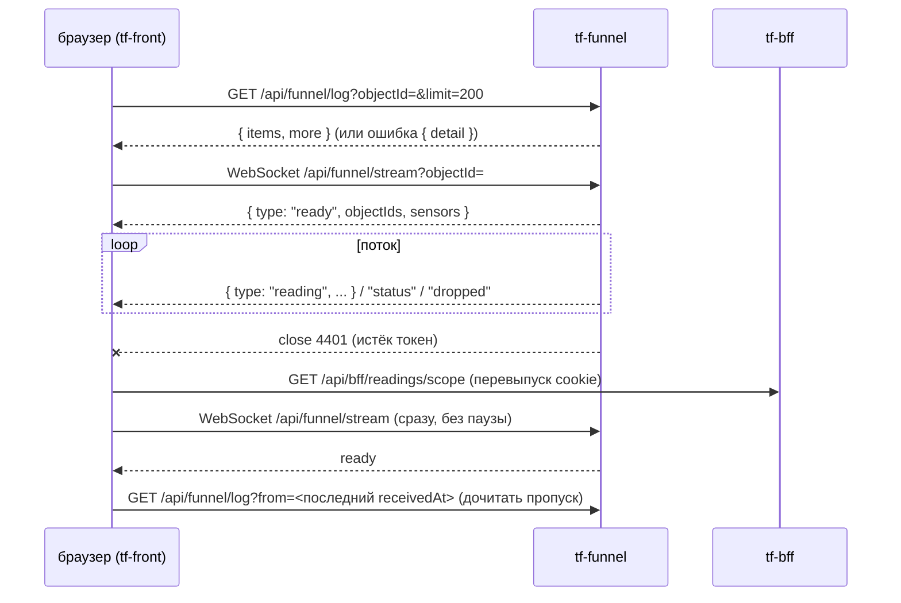

Версия: TF-Front-Docs@46e013e, дата: 2026-09-29

# tf-front — веб-интерфейс Think Faster

## 1. Назначение

`tf-front` — одностраничное веб-приложение (React 19 + TypeScript, Create React App, состояние — Zustand) для людей, работающих с системой: диспетчеров, главных, администраторов и инженеров. Диспетчерская часть («Рабочая область», `/`) — холст с окнами: карта объектов, журналы прогнозов и тревог по факту, заявки, живые показания датчиков, люди, права доступа, настройки модели. Инженерская часть («Мои заявки», `/engineer`) рассчитана на телефон: свои заявки, карточка, отчёт, запрос к диспетчеру. Своих данных и серверной логики у сервиса нет: контейнер — nginx, отдающий статическую сборку; все данные браузер берёт у `tf-auth`, `tf-bff` и `tf-funnel` через `tf-nginx` по относительному префиксу `/api` (`app/src/core/config/config.ts:12`).

## 2. Схема взаимодействия



Маршрутизация `/api/*` на `tf-auth` / `tf-bff` / `tf-funnel` настраивается в `tf-nginx` (репозиторий инфраструктуры), в этом репозитории её нет — из кода фронта видно только, какие префиксы он ожидает (`app/src/core/api/endpoints.ts`). Сам `tf-front` ни к кому не обращается: все запросы делает браузер.

### Сценарий: вход пользователя



Код: `app/src/stores/auth/authStore.ts:26-42`, `app/src/app/App.tsx`, `app/src/stores/profile/profileStore.ts:22-23`.

### Сценарий: живые показания (окно «Логи»)



Код: `app/src/features/logs/hooks/useReadingsStream.ts:63-200`.

## 3. Интерфейсы

### Входящие

| Протокол | Адрес/путь | Кто вызывает | Авторизация | Что делает |
|---|---|---|---|---|
| HTTP | `tf-front:80`, `/` и любые пути | `tf-nginx` (запросы браузера) | нет | Отдаёт `index.html` для любого неизвестного пути — SPA-роутинг (`nginx/default.conf:8-10`) |
| HTTP | `tf-front:80`, `/static/*`, `/favicon.*`, `/manifest.json` и т.п. | `tf-nginx` | нет | Статика сборки CRA |
| HTTP | `tf-front:80`, `/assets/*` | `tf-nginx` | нет | Отдаёт файл или 404 (`nginx/default.conf:12-14`). В сборке CRA папки `assets/` нет — блок фактически не используется |

Публичный путь: `/` (и все клиентские маршруты: `/login`, `/dashboard`, `/predictions/:id`, `/tasks/:id`, `/engineer`, `/engineer/tasks/:id[/report|/request|/sensors/:sensorId]` — `app/src/app/AppRoutes.tsx`). Под каким именно `location` в `tf-nginx` проксируется `tf-front` — не проверено (конфигурация в репозитории инфраструктуры).

### Исходящие (из браузера)

Все пути — относительно `REACT_APP_API_BASE_URL` (по умолчанию `/api`), т.е. это публичные пути через `tf-nginx`.

| Протокол | Куда | Зачем | Что при недоступности |
|---|---|---|---|
| HTTPS | `/api/auth/*` → `tf-auth` | Вход, текущий пользователь, создание учётки | `GET /auth/me` упал → экран входа; ошибка логина → «Неверный логин или пароль» (кроме 429) (`app/src/features/auth/LoginForm.tsx:28-35`) |
| HTTPS | `/api/bff/*` → `tf-bff` | Все доменные данные и права | `permissions/me` упал → карта прав пустая, разделы скрыты, шторка пишет причину (`app/src/stores/permissions/permissionsStore.ts:41-42`, `app/src/widgets/workspace/WorkspaceSidebar.tsx:248-257`); окна показывают ошибку загрузки |
| HTTPS | `/api/funnel/log` → `tf-funnel` | История показаний | Окно «Логи» показывает текст ошибки (`detail`), поток не открывается |
| WSS | `/api/funnel/stream` → `tf-funnel` | Живые показания | Переподключение с паузами 1/3/10/30 с (`useReadingsStream.ts:14`) |

Любой ответ 401 на любой запрос через `apiClient` (auth, bff, funnel/log) переводит приложение в «не вошёл» и уводит на `/login` (`app/src/core/api/client.ts:17`, `app/src/stores/auth/authStore.ts:52-62`).

### Карта экранов → запросы

Разделы верхнего уровня (`app/src/core/registry/sectionRegistry.ts`): «Рабочая область» (`/`, видна при наличии хотя бы одного доступного окна) и «Мои заявки» (`/engineer`, право `tasks:read`, на узком экране ≤767 px открывается сразу после входа — `app/src/app/routing/SectionRoute.tsx:7,39`).

Окна рабочей области (`app/src/core/registry/windowRegistry.ts:93-246`); окно видно, если есть **хотя бы одно** из прав в столбце «Права» (`manage` покрывает любое действие — `app/src/core/permissions/permissionService.ts:25`).

| Экран / окно | Права для видимости | Запросы |
|---|---|---|
| Вход (`/login`) | — | `POST /auth/login` |
| Старт приложения | — | `GET /auth/me`, `GET /bff/permissions/me`, `GET /bff/users` (поиск своего профиля) |
| Карта | `objects:read` | `GET /bff/objects`, `GET /bff/objects/{id}`, `GET /bff/objects/{id}/layers?level=` (кэш на сессию — `app/src/features/map/hooks/useMapLayers.ts:27`), `GET /bff/tasks?status=engineerWorking&pageSize=200` (при `tasks:read`), `GET /bff/fact-alerts?live=true&pageSize=200` каждые 60 с (при `predictions:read`, `app/src/features/map/hooks/useLiveFacts.ts:10`) |
| Журнал прогнозов | `predictions:read` | `GET /bff/predictions` (фильтры, страницы) |
| Карточка прогноза (`/predictions/:id`) | `predictions:read` | `GET /bff/predictions/{id}`, `POST /bff/predictions/{id}/decisions` |
| Дневник диспетчера | `tasks:read` | `GET /bff/tasks` |
| Карточка заявки (`/tasks/:id`) | `tasks:read` | `GET /bff/tasks/{id}`, `POST .../take`, `POST/DELETE .../predictions[/{predictionId}]`, `POST .../assignments`, `.../reports`, `.../returns`, `.../start`, `.../close`, `.../cancel`, `GET /bff/tasks/assignees?role=` |
| Создать заявку | `tasks:create` | `POST /bff/tasks`, `GET /bff/tasks/assignees` |
| История объектов | `objects:read` | `GET /bff/predictions`, `/bff/tasks`, `/bff/incidents`, `/bff/fact-alerts` по объекту |
| Журнал данных | `predictions:read` | `GET /bff/fact-alerts` |
| Логи | `readings:read` или `tasks:read` | `GET /bff/readings/scope`, `GET /bff/sensors`, `GET /bff/objects`, `GET /funnel/log`, WS `/funnel/stream` |
| Происшествия | `incidents:read` | `GET /bff/incidents`, `GET /bff/incidents/{id}`, `POST /bff/incidents/{id}/confirm` |
| Объекты и датчики | `objects:read` или `sensors:read` | `GET/POST /bff/objects`, `PUT /bff/objects/{id}`, `GET/POST /bff/sensors`, `PUT /bff/sensors/{id}`, `GET /bff/sensors/types`, `GET /bff/objects/{id}/pickets` |
| Люди | `schedule:read`, `assigned_objects:read`, `engineers:read` или `presence:read` | `GET/POST/DELETE /bff/users/{id}/schedule[/{entryId}]`, `GET/POST/DELETE /bff/users/{id}/assigned-objects[/{objectId}]`, `GET/PUT /bff/users/{id}/engineer-profile`, `GET /bff/presence`, `GET/POST /bff/brigades` |
| Пользователи и группы | `users:read` или `groups:read` | `GET/POST /bff/users`, `PUT /bff/users/{id}`, `POST /auth/create` (новая учётка), `GET/POST /bff/groups`, `GET /bff/groups/{id}`, `POST /bff/groups/{id}/members`, `DELETE /bff/groups/{id}/members/{user|group}/{memberId}` |
| Конфигурация доступа | `permissions:read` (правка — `permissions:manage`) | `GET /bff/resources`, `GET/POST /bff/permissions/grants`, `DELETE /bff/permissions/grants/{id}` |
| Настройки модели | `model_settings:read` | `GET/POST /bff/model-versions`, `POST /bff/model-versions/{id}/activate`, `GET/POST /bff/coefficients`, `GET/POST /bff/retrain-jobs`, `GET/POST/DELETE /bff/ignored-ranges[/{id}]`, `GET /bff/work-schedule` |
| Кнопка «письмо» в шторке | `notifications:create` (`app/src/features/notifications/MailButton.tsx:8`) | `POST /bff/notifications/email` |
| Мои заявки (`/engineer`) | `tasks:read` | `GET /bff/tasks?assignedToMe=true`, `GET /bff/objects/{id}` |
| Карточка заявки инженера (`/engineer/tasks/:id`) | `tasks:read` | `GET /bff/tasks/{id}`, `POST .../start`, `GET /bff/tasks/assignees?role=dispatchers`, `GET /bff/objects/{id}/layers?level=2|3` (при `objects:read`) |
| Отчёт (`.../report`) / запрос к диспетчеру (`.../request`) | `tasks:read` | отчёт — `POST /bff/tasks/{id}/reports`, запрос — `POST /bff/tasks/{id}/returns` (`app/src/features/engineer/EngineerTaskForms.tsx:56,110`) |
| Показания датчика инженера (`.../sensors/:sensorId`) | `tasks:read` | `GET /funnel/log?objectId=&limit=1000`, фильтр по датчику на клиенте (`app/src/features/engineer/hooks/useSensorReadings.ts:9`); живого потока нет |

Эндпоинт `PUT /bff/tasks/{id}` и `GET /bff/work-schedule/{workId}` объявлены в коде (`app/src/core/api/endpoints.ts`, `app/src/entities/task/taskRepository.ts:52`), но вызовов из экранов не найдено.

## 4. Контракты данных

Фронт — потребитель; ниже то, что он **ожидает** от бэкендов. Полные DTO BFF — в `app/src/entities/*/types.ts`; ссылки в коде на `docs/FRONTEND_INTEGRATION.md` и `docs/FRONTEND_INTEGRATION_DOMAIN_MODELS.md` ведут на документы BFF, в этом репозитории их нет.

### tf-auth

`POST /api/auth/login` (`app/src/core/auth/types.ts`):

```json
{ "userName": "dispatcher1", "password": "<пароль>" }
```

Ответ `200` (и на `GET /api/auth/me`, и на `POST /api/auth/create`):

```json
{ "id": "0b6f…", "userName": "dispatcher1", "email": "d1@example.org" }
```

| Поле | Тип | Обяз. | Смысл |
|---|---|---|---|
| `id` | string | да | id учётки; в BFF это `authUserId` профиля |
| `userName` | string | да | логин |
| `email` | string | да | почта |

`POST /api/auth/create` принимает `{ userName, password, email }` — все обязательны. Контракт сделан «по аналогии», отдельно не задокументирован (`app/ARCHITECTURE.md`, раздел «Интеграция с BFF»). Логаута на бэкенде нет.

Коды: `401` — не вошёл / неверный логин; `429` — «Слишком много попыток входа» (`LoginForm.tsx:32`); прочие ошибки логина показываются как «Неверный логин или пароль».

### tf-bff: общие форматы

Список — `PagedResult` (`app/src/core/api/types.ts`):

```json
{ "items": [], "total": 0, "page": 1, "pageSize": 50 }
```

Запрос страницы: `?page=` (с 1) и `?pageSize=` (по умолчанию 50 на стороне BFF). Массивные параметры отправляются как `objectId=1&objectId=2` (без `[]`, `app/src/entities/reading/readingRepository.ts:8-11`).

Ошибка BFF (`app/src/core/errors/bffError.ts`):

```json
{ "code": "permission_denied", "message": "...", "details": { "field": ["..."] } }
```

Коды, которые фронт различает: `unauthenticated`, `invalid_token`, `token_refresh_failed`, `auth_service_unavailable`, `user_not_provisioned`, `user_inactive`, `permission_denied`, `not_found`, `cycle_detected`, `duplicate_code`, `system_group_protected`, `validation_failed`, `bad_request`, `internal_error`, `task_already_taken`. `details` выводится пользователю как «поле: сообщения». `user_not_provisioned` / `user_inactive` на `GET /permissions/me` дают отдельный текст в шторке.

`GET /api/bff/permissions/me`:

```json
{ "userId": "…", "permissions": { "objects": ["read"], "tasks": ["read", "create"], "permissions": ["manage"] } }
```

Действия: `create | read | update | delete | export | import | manage` (`app/src/core/permissions/permissionService.ts`). Ресурсы, которые использует фронт: `objects`, `sensors`, `predictions`, `tasks`, `readings`, `incidents`, `schedule`, `assigned_objects`, `engineers`, `presence`, `users`, `groups`, `permissions`, `model_settings`, `notifications`.

`GET /api/bff/readings/scope?objectId=…`:

| Поле | Тип | Смысл |
|---|---|---|
| `all` | boolean | есть `readings:read` — виден любой объект |
| `objectIds` | number[] | объекты заявок пользователя в работе |
| `sensorIds` | number[] | датчики этих объектов |

`POST /api/bff/notifications/email` (`app/src/entities/notification/types.ts`): запрос `{ subject (≤255), text (≤20000, простой текст), userIds?, emails?, ticketId?, kind? }`, ответ `{ requested, sent, results: [{ email, userId?, status }] }`, `status` ∈ `sent | rateLimited | userNotFound | noEmailOnFile | invalidEmail | failed`. `sent` — «принято в обработку», не «доставлено».

### tf-funnel

`GET /api/funnel/log?objectId=&from=&to=&limit=` → `{ "items": Reading[], "more": boolean }`, новые сверху. Ошибка — `{ "detail": "текст" }` (показывается как есть, `useReadingsStream.ts:41-52`). Без `objectId` — объекты заявок инженера (воронка сама спрашивает BFF).

`Reading` (`app/src/entities/reading/types.ts`):

```json
{ "sensorId": 101, "eventId": 5531, "date": "2026-09-28", "time": "14:03:12",
  "alarm": false, "value": "12.4", "receivedAt": "2026-09-28T11:03:13Z" }
```

| Поле | Тип | Смысл |
|---|---|---|
| `sensorId` | number | канал данных |
| `eventId` | number | номер события; пара `sensorId:eventId` — ключ дедупликации на клиенте |
| `date`, `time` | string | время на объекте, как в пакете (МСК) |
| `alarm` | boolean | флаг источника «тревожное сообщение» |
| `value` | string | число или текст состояния |
| `receivedAt` | string (ISO 8601) | когда воронка приняла пакет; по нему идёт `from` при дочитывании |

WebSocket `/api/funnel/stream?objectId=` — сообщения JSON:

| `type` | Поля | Что делает фронт |
|---|---|---|
| `ready` | `objectIds: number[]`, `sensors: number` | состояние «В эфире», сброс счётчика попыток; если были данные — дочитать пропуск через `/log?from=` |
| `reading` | поля `Reading` | добавить в список (дедуп, сортировка, в памяти не больше 500 живых) |
| `status` | `sensorId`, `status: "silent"\|"ok"`, `at`, `since` | отметить/снять «датчик молчит с `since`» |
| `dropped` | `count` | увеличить счётчик пропущенных сообщений, показать пользователю |

Коды закрытия: `4401` — истёк токен (см. §6); `1000` фронт шлёт сам при закрытии окна. Остальные коды — переподключение с паузой.

Версионирования API на стороне фронта нет.

## 5. Данные и состояние

- Сервер: stateless. Контейнер содержит только статику; томов нет (`deploy/docker-compose.yml`). Можно запускать несколько экземпляров; при перезапуске ничего не теряется.
- Браузер, `localStorage` (только настройки интерфейса):

| Ключ | Что хранит | Файл |
|---|---|---|
| `kontur_grid_v2` | раскладка сетки окон | `app/src/core/workspace/gridStorage.ts:3` |
| `kontur_free_v1` | раскладка свободного режима | `app/src/stores/workspace/freeStore.ts:12` |
| `kontur_instances_v1` | контекст экземпляров окон (объект/карточка у копии) | `app/src/stores/workspace/instanceStore.ts:3` |
| `kontur_layout_v1` | режим раскладки | `app/src/stores/workspace/layoutStore.ts:3` |
| `kontur_theme_v1` | тема (светлая/тёмная) | `app/src/stores/theme/themeStore.ts:3` |

- Токен в JS не хранится: авторизация — cookie, выставляемая бэкендом (по документации BFF — HttpOnly, `app/src/core/auth/clearAllCookies.ts:3`). Имя cookie — не знаю (в коде фронта не фигурирует).
- В памяти вкладки: текущий пользователь, карта прав, кэш слоёв карты (на сессию), до 500 живых показаний на окно «Логи».

## 6. Безопасность и политики

- **Как фронт авторизуется.** Все запросы `axios` идут с `withCredentials: true` (`app/src/core/api/client.ts:8`); cookie браузер прикладывает сам, в т.ч. к рукопожатию WebSocket (`app/src/entities/reading/readingRepository.ts:20-21`). Заголовок `Authorization` фронт не ставит. Алгоритм/iss/aud JWT фронт не проверяет и не знает — это дело `tf-auth`/`tf-bff`/`tf-funnel`.
- **Обновление токена (refresh).** Своей логики refresh у фронта нет. По комментарию в коде, cookie перевыпускает BFF на любом запросе (`useReadingsStream.ts:15-16`); код ошибки `token_refresh_failed` фронт знает, но специально не обрабатывает. Как именно BFF делает refresh — не проверено.
- **401.** Интерсептор `apiClient` на любой 401 вызывает `handleUnauthorized`: состояние → `unauthenticated`, переход на `/login` с запоминанием текущего пути; после входа — возврат на него (`authStore.ts:52-59`, `app/src/pages/LoginPage.tsx`). Повторных попыток запроса нет.
- **WebSocket 4401.** При закрытии с кодом 4401 фронт делает `GET /api/bff/readings/scope` (чтобы BFF перевыпустил cookie) и сразу переподключается; при следующих подряд 4401 — с обычными паузами. Если `scope` сам вернёт 401 — сработает общий обработчик и пользователь уйдёт на `/login` (`useReadingsStream.ts:153-170`).
- **Выход.** Серверной ручки нет. `logout()` стирает доступные JS cookie и уходит на `/login` (`authStore.ts:46-50`). HttpOnly-cookie JS стереть не может — она остаётся валидной до истечения срока, и следующий `GET /auth/me` снова впустит пользователя (см. §11).
- **Права.** Видимость разделов и окон — по карте `GET /bff/permissions/me`; `manage` — надправо. Пока права не загружены или запрос упал — карта пустая, разделы скрыты. Это только UI: реальную проверку делает BFF/воронка.
- **Аудит.** Фронт ничего не пишет в аудит.
- **Чувствительные данные.** Пароль уходит только в `POST /auth/login` и `POST /auth/create`, нигде не сохраняется. В `console` пишется только предупреждение о недоступности `permissions/me` с объектом ошибки (`permissionsStore.ts:41`). Секретов в сборке нет.

## 7. Конфигурация

Переменные читаются **при сборке** (CRA подставляет `process.env.REACT_APP_*` в бандл), в рантайме их поменять нельзя.

| Переменная | По умолчанию | Обязательна | Секрет | Смысл |
|---|---|---|---|---|
| `REACT_APP_APP_NAME` | `Thinkfaster` | нет | нет | заголовок вкладки |
| `REACT_APP_ENVIRONMENT` | `development` | нет | нет | имя окружения, выводится на экране входа (`LoginPage.tsx`) |
| `REACT_APP_API_BASE_URL` | `/api` | нет | нет | префикс API для HTTP и WebSocket (WS-адрес строится из него: `https`→`wss`) |
| `VITE_API_URL` (compose build arg) | `/api` | нет | нет | передаётся в `docker-compose.yml:10`, но `Dockerfile` его не объявляет и приложение (CRA) его не читает — **ни на что не влияет** |

Фактически в Docker-сборке ни одна `REACT_APP_*` не задаётся (`deploy/Dockerfile` без `ARG`/`ENV`), поэтому на dev и prod работают значения по умолчанию, включая `environment = development` на экране входа prod.

Секреты: сервис секретов не использует, в Vault не ходит. `deploy/.env` в `.gitignore`; на prod он переносится из прошлой выкатки (`.github/workflows/deploy-prod.yml`), что в нём — не знаю.

`deploy/entrypoint.sh` (генерация `config.js` с `window.__ENV__` и `envsubst` шаблона nginx) в образ **не копируется** и не используется; приложение `window.__ENV__` не читает.

## 8. Сборка и запуск

| Параметр | Значение |
|---|---|
| Dockerfile | `deploy/Dockerfile`: стадия `node:22-alpine` (`npm ci`, `npm run build`), стадия `nginx:1.29-alpine` с `build/` в `/usr/share/nginx/html` и `nginx/default.conf` |
| Где собирается | на сервере (`docker compose build`), в реестр не публикуется |
| Контейнер | `tf-front` |
| Сеть | `think-fast-net` (external) |
| Порт | 80 внутри, наружу не публикуется — доступ только через `tf-nginx` |
| Тома | нет |
| Лимиты памяти | не заданы |
| Healthcheck | не задан |
| Рестарт | `unless-stopped` |

### dev (greefob.ru) — `.github/workflows/deploy-dev.yml`

Запуск: пуш в **любую** ветку, кроме `dev`, `prod`, `main`, `master`. Шаги: ветка сливается `--no-ff` в `dev` и пушится; по SSH (`secrets.DEV_IP`, `DEV_USER`, `DEV_SSH_KEY`, путь `DEV_PATH`) на сервере `git reset --hard origin/dev`, затем в `deploy/`: `docker-compose down` → `docker-compose build --no-cache` → `docker-compose up -d`. Контейнер лежит всё время сборки (минуты).

Локальный помощник `scripts/finish-feature.bat` делает то же слияние ветки в `dev` вручную.

### prod (thinkfaster.ru) — `.github/workflows/deploy-prod.yml`

Запуск: пуш в `prod` или вручную (Run workflow). Если нет `PROD_IP` — выкатка пропускается с notice. Шаги: `git archive` → scp на сервер → распаковка в `/srv/thinkfaster/services/think-front.new`, перенос `deploy/.env` из прошлой версии, прошлая версия → `think-front.old`, новая → `think-front`; `docker compose build` → `docker compose up -d` (без `down`, простой — только на пересоздание контейнера). Требует существующей сети `think-fast-net`.

### Порядок запуска

При старте ни от чего не зависит (nginx отдаёт статику). Для работы пользователя нужны `tf-nginx`, `tf-auth`, `tf-bff`, `tf-funnel`. Без `tf-auth` — только экран входа; без `tf-bff` — пустая шторка «Не удалось загрузить права»; без `tf-funnel` — окно «Логи» с ошибкой / вечным «переподключаюсь».

### Ручная выкатка и откат

```bash
# prod, на сервере: пересобрать текущую версию
cd /srv/thinkfaster/services/think-front/deploy && docker compose build && docker compose up -d
```

```bash
# prod, откат на предыдущую выкатку (хранится одна)
cd /srv/thinkfaster/services && mv think-front think-front.bad && mv think-front.old think-front && cd think-front/deploy && docker compose build && docker compose up -d
```

```bash
# dev, на сервере в DEV_PATH: откат на нужный коммит (до следующего пуша)
git reset --hard <sha> && cd deploy && docker-compose build && docker-compose up -d
```

Локально: `cd app && npm ci && npm start` (порт 3000; без прокси `/api` на бэкенд окна покажут ошибки — прокси в `package.json` не настроен).

## 9. Эксплуатация

- **Здоров ли.** Отдельного health-эндпоинта нет. Признак — `GET /` отдаёт 200 и HTML с `<div id="root">`: `docker exec tf-front wget -qO- http://localhost/ | head`. `docker compose ps` — контейнер `Up`.
- **Логи.** Только access/error-логи nginx в stdout контейнера: `docker logs --tail=100 tf-front`. Ошибки приложения видны только в консоли браузера и во вкладке «Сеть» (запросы `/api/...`, WS `/api/funnel/stream`).
- **Метрики.** Нет.
- **Перезапуск.** `docker restart tf-front` (данных нет, безопасно).
- **Миграции, ротация ключей, очистка данных** — не применимо. Сброс раскладки у пользователя — очистить ключи `kontur_*` в `localStorage` его браузера.

## 10. Ошибки и проблемы

| Симптом | Причина | Как исправить |
|---|---|---|
| После «Выйти» и перезагрузки пользователь снова вошёл | Нет серверного логаута, HttpOnly-cookie не стирается из JS (`clearAllCookies.ts`) | Сделать `POST /auth/logout` с `Set-Cookie` истёкшим сроком; до тех пор — ждать истечения cookie |
| Шторка пустая, «Не удалось загрузить права» | `GET /bff/permissions/me` упал (BFF недоступен, 5xx) | Проверить `tf-bff`; в консоли браузера — предупреждение `GET /permissions/me недоступна` |
| Шторка: «Учётная запись ещё не заведена…» | BFF: 403 `user_not_provisioned` — учётка в `tf-auth` есть, профиля в BFF нет | Администратор создаёт пользователя в «Пользователи и группы» с этим `authUserId` |
| Шторка: «Учётная запись отключена» | 403 `user_inactive` | Включить пользователя (`isActive`) |
| Аватар без инициалов/профиля | Профиль ищется в первой странице `GET /bff/users`, нужно `users:read` (`profileStore.ts:22`) | Ограничение, см. §11 |
| «Логи»: «Нет связи — переподключаюсь» бесконечно | `tf-funnel` недоступен, `tf-nginx` не проксирует WebSocket (Upgrade) или отвергает Origin | Проверить `tf-funnel` и location `/api/funnel/stream` в `tf-nginx` |
| «Логи»: текст ошибки вместо показаний | `/funnel/log` вернул `{ detail }` (нет прав, нет заявок в работе) | По тексту; права — `readings:read` или назначение на заявку в работе |
| На экране входа prod написано `development` | `REACT_APP_ENVIRONMENT` не передаётся в сборку | Добавить `ARG`/`ENV` в Dockerfile и build arg в compose |
| dev недоступен несколько минут после пуша | `docker-compose down` до `build --no-cache` в `deploy-dev.yml` | Собирать до `down`, либо `up -d --build` |
| Любая рабочая ветка сразу попадает в `dev` | `deploy-dev.yml` срабатывает на пуш любой ветки и сливает её в `dev` | Осознанно пушить; при необходимости ограничить `branches` |
| История: пересборка с падениями пайплайна (sudo, путь, имя контейнера, сеть/порт) | Первые версии workflow и compose (коммиты `754dde5`…`6c7e01e`, 2026-09-19) | Исправлено: без sudo, `cd deploy`, контейнер `tf-front` в `think-fast-net`, порт наружу не публикуется |
| История: несохранённые правки в «Конфигурации доступа» пропадали | Нестабильная ссылка на массив грантов сбрасывала черновик (`app/ARCHITECTURE.md`, «Важный баг и его фикс») | Исправлено мемоизацией среза |
| История: окно «Конфигурация доступа» не видно пользователям с `permissions:read` | Видимость требовала `manage` | Исправлено (коммит `299e1e7`): видимость по `read` |

## 11. Ограничения и известные недоработки

- Нет серверного логаута — выход ненастоящий (см. §6, §10).
- Нет refresh на стороне фронта и повторов запросов: любой 401 сразу выкидывает на `/login`, несохранённый ввод в формах теряется.
- Переменные окружения запекаются при сборке; `VITE_API_URL` и `deploy/entrypoint.sh` — мёртвая конфигурация, вводящая в заблуждение.
- nginx внутри контейнера без настроек кэша (`Cache-Control` для `/static/*` с хешами и `no-cache` для `index.html`), без gzip в `default.conf`, без заголовков безопасности (CSP и т.п.) — если их не ставит `tf-nginx`.
- Нет healthcheck и лимитов памяти в compose.
- Профиль текущего пользователя ищется в первой странице списка пользователей — у большого списка или без `users:read` профиля не будет.
- Показания датчика у инженера — только история (`limit=1000` за объект, фильтр на клиенте), без живого потока; при большом числе датчиков нужный канал может не попасть в выборку.
- «Логи»: в памяти до 500 живых показаний на окно; некорректный JSON в сообщении WebSocket бросит исключение в обработчике (`JSON.parse` без `try`, `useReadingsStream.ts:120`).
- Нет автотестов (`app/README.md`).
- Нет React Query/общего кэша: окна перечитывают данные независимо; карта опрашивает `fact-alerts` раз в минуту на каждое окно «Карта».
- Удаление пользователей/групп и создание ресурсов в UI не реализованы (`app/ARCHITECTURE.md`, «Чего сознательно нет»).

## 12. Возможности доработки

| Доработка | Приоритет | Объём |
|---|---|---|
| Серверный логаут (`tf-auth`/`tf-bff`) + вызов с фронта | высокий | 0,5 дня фронт + бэкенд |
| Передавать `REACT_APP_*` в Docker-сборку, удалить `VITE_API_URL` и `entrypoint.sh` | высокий | 1–2 часа |
| Dev-выкатка без простоя (build до `down`) | средний | 1 час |
| Кэш-заголовки, gzip, security-заголовки в `nginx/default.conf`; убрать `/assets/` | средний | 2–4 часа |
| Healthcheck и `mem_limit` в compose | средний | 1 час |
| Ручка «мой профиль» в BFF вместо поиска по списку | средний | 0,5 дня (с BFF) |
| Живой поток для экрана показаний инженера, фильтр по датчику на стороне воронки | средний | 1 день |
| Защита `JSON.parse` в обработчике WebSocket | низкий | 0,5 часа |
| Автотесты на авторизацию, права, поток показаний | средний | 2–3 дня |
| Общий кэш запросов (React Query) | низкий | 2–3 дня |

## 13. Как интегрироваться и что менять

**Новому бэкенду, чтобы им пользовался фронт:**
- Быть доступным под тем же доменом за `tf-nginx`, под `/api/<сервис>/*` — фронт ходит только относительными путями (same-origin), поэтому **CORS не нужен и не ожидается**. Если когда-нибудь `REACT_APP_API_BASE_URL` станет другим origin — бэкенд должен отвечать `Access-Control-Allow-Origin` с точным origin (не `*`) и `Access-Control-Allow-Credentials: true`, cookie — `SameSite=None; Secure`.
- Принимать авторизацию по той же cookie, что выставляет `tf-auth` (заголовок `Authorization` фронт не шлёт).
- Отвечать `401` на истёкшую/нет сессии (фронт уведёт на вход); ошибки — в формате BFF `{ code, message, details }` или `{ detail }` как у воронки.
- Для WebSocket: `tf-nginx` должен проксировать `Upgrade`/`Connection`; сервис должен проверять cookie при рукопожатии и принимать `Origin` `https://greefob.ru` (dev) и `https://thinkfaster.ru` (prod). Проверяет ли `tf-funnel` Origin — не проверено. Код закрытия `4401` — договорённость «истёк токен, обнови cookie через BFF».
- Новые пути добавляются в `app/src/core/api/endpoints.ts`, сущность — в `app/src/entities/<имя>/`, окно — записью в `app/src/core/registry/windowRegistry.ts` (подробно — `app/ARCHITECTURE.md`).

**Согласовать с инфраструктурой:**
- Новые префиксы `/api/*` и WebSocket-маршруты в `tf-nginx`.
- Маршрут отдачи фронта (`/` → `tf-front:80`) и заголовки кэша/безопасности, если их ставит `tf-nginx`.
- Имя контейнера `tf-front` и сеть `think-fast-net` (на них завязан `tf-nginx`).
- Новые ресурсы/действия прав (строки вида `objects`, `readings`) — согласовать с BFF, иначе окно не появится.
- Сборочные переменные (`REACT_APP_*`), если начнут различаться между стендами.

## 14. Открытые вопросы

- Имя, срок жизни, `SameSite`/`Domain` auth-cookie и механизм её перевыпуска в BFF — в коде фронта не видно.
- Когда появится серверный логаут и кто его делает (`tf-auth` или `tf-bff`).
- Конфигурация `tf-nginx` для `/`, `/api/auth`, `/api/bff`, `/api/funnel` (включая WebSocket и таймауты простоя WS) — не проверено.
- Проверяет ли `tf-funnel` заголовок `Origin` при рукопожатии.
- Что лежит в `deploy/.env` на серверах и нужно ли оно вообще (из используемого — только `VITE_API_URL`, который ни на что не влияет).
- Должны ли различаться сборки dev и prod (имя окружения на экране входа, адрес API).
- Нужен ли отдельный health-эндпоинт/метрики для фронта в мониторинге.
- Правильно ли, что пуш любой ветки автоматически сливается в `dev`.
