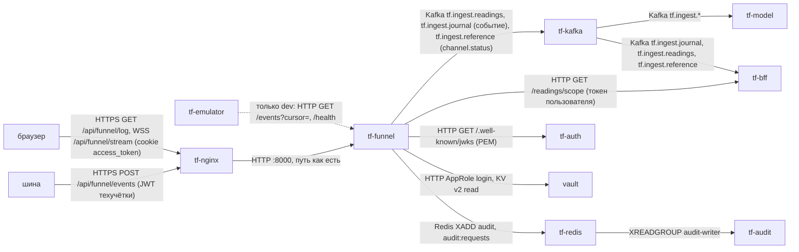
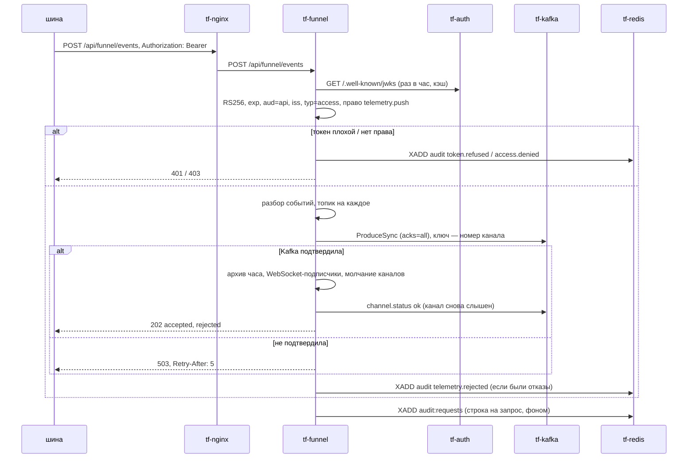
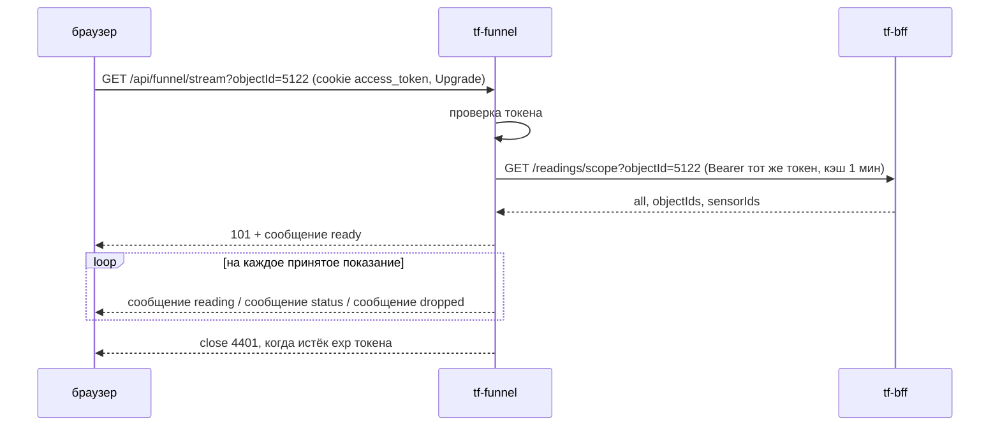

Версия: main@7cfe8f2, дата: 2026-09-29

Ссылки `файл:строка` без каталога — относительно `docs/backend/funnel/`, workflow — `.github/workflows/`; пути think-infra и think-auth — в их репозиториях.

## tf-funnel — воронка показаний

### 1. Назначение

Воронка принимает от шины объектов пакеты событий датчиков (`POST /events`), проверяет каждое событие,
раскладывает принятые по топикам Kafka `tf.ingest.readings` (числа) и `tf.ingest.journal` (тревожные и
текстовые состояния) и отмечает замолчавшие и ожившие каналы в `tf.ingest.reference`
(`docs/backend/funnel/main.go:1-5`). Всё принятое она ещё и пишет в свой архив на томе и раздаёт окну
«Логи» фронта: история объекта (`GET /log`) и живой поток по WebSocket (`GET /stream`)
(`docs/backend/funnel/stream.go:1-12`). Воронка — единственная точка входа показаний в контур: её
читают модель (`tf-model`) и BFF. На dev шины нет — воронка сама забирает поток у эмулятора
`tf-emulator` (`TF_FUNNEL_PULL`, `docs/backend/funnel/pull.go:66-122`). Язык — Go 1.27, библиотеки
franz-go, golang-jwt v5, go-redis v9, coder/websocket, klauspost/compress (`docs/backend/funnel/go.mod`).

### 2. Схема взаимодействия



Приём пакета шины:



Окно «Логи» (живой поток):



### 3. Интерфейсы

Каждая ручка доступна по двум путям: без префикса и с `/api/funnel` (`docs/backend/funnel/http.go:203-209`).
nginx передаёт путь без изменений (think-infra `docs/funnel-tz/tf-funnel.md` §4).

**Входящие**

| Протокол | Адрес/путь/топик/очередь | Кто вызывает | Авторизация | Что делает |
|---|---|---|---|---|
| HTTP POST | `/events`, публично `/api/funnel/events` | шина (prod), на dev не используется | Bearer JWT, право `telemetry.push` (`parse.go:19`, `http.go:155`) | принимает пакет, пишет в Kafka (`http.go:154-187`) |
| HTTP GET | `/log`, публично `/api/funnel/log` | браузер (окно «Логи») | JWT пользователя из cookie `access_token` или `Authorization`; права на объекты — у BFF | история показаний объекта из архива (`stream.go:224-271`) |
| WebSocket | `/stream`, публично `/api/funnel/stream` | браузер | как `/log` | живые показания и статусы каналов (`stream.go:275-351`) |
| HTTP GET | `/status`, публично `/api/funnel/status` | фронт, мониторинг | любой действующий JWT (`http.go:140`) | счётчики, молчащие каналы, число окон «Логи» (`http.go:139-152`) |
| HTTP GET | `/health`, публично `/api/funnel/health` | Docker, nginx, мониторинг | нет | признак жизни и счётчики (`http.go:134-137`) |

Ограничения nginx на публичных путях (think-infra `docs/funnel-tz/tf-funnel.md` §4): `POST /api/funnel/events` —
тело ≤ 8 МБ, 20 запросов/с с адреса (всплеск 40), ответ ждётся до 60 с, при заданном `FUNNEL_EVENTS_ALLOW` —
только с IP шины; `/api/funnel/log` — 5 запросов/с (всплеск 10); `/stream` — WebSocket, тишина до 120 с.
Порт 8000 на хост не публикуется.

**Исходящие**

| Протокол | Куда | Зачем | Что при недоступности |
|---|---|---|---|
| Kafka (SASL_PLAINTEXT/PLAIN, пользователь `tf-funnel`) | `tf-kafka:9092`, топики `tf.ingest.readings`, `tf.ingest.journal`, `tf.ingest.reference` | запись событий и `channel.status` (`funnel.go:69-89`, `funnel.go:294-316`) | пакет — 503 с `Retry-After: 5`, шина повторяет (`http.go:176-181`); `channel.status` теряется, в лог «статус N каналов не записан» (`funnel.go:310-315`); режим pull — курсор стоит (`pull.go:112-113`) |
| Redis | `tf-redis:6379`, потоки `audit`, `audit:requests` | события аудита и журнал запросов (`kit.go:432-447`) | событие дописывается в файл `TF_AUDIT_SPOOL` и досылается каждые 30 с (`kit.go:558-581`, `main.go:160-173`); без спула — только строка в лог |
| HTTP | `tf-bff:8080/readings/scope` | какие датчики видит пользователь (`scope.go:72-127`) | `/log`, `/stream` — 503 «BFF не отвечает — права на показания не проверить» |
| HTTP | `tf-auth:8080/.well-known/jwks` | открытый ключ RS256, кэш 1 ч (`kit.go:274-275`, `kit.go:306-333`) | ручки с токеном — 503 «аутентификация не отдала публичный ключ» |
| HTTP | `vault:8200` | AppRole-вход и чтение секретов при старте (`kit.go:113-202`) | 502/503/504 — ждёт `TF_VAULT_WAIT` с, затем выход; 403/404 — выход сразу |
| HTTP | `TF_FUNNEL_PULL` (dev: `tf-emulator:8000`) | забор потока `/events?cursor=&limit=5000` (`pull.go:68-122`) | пауза растёт 1→2→…→60 с, в лог «эмулятор недоступен» |

### 4. Контракты данных

#### 4.1 Пакет шины — `POST /events`

Тело: объект `{"events": [...]}`, голый список `[...]` или ответ эмулятора `{"события": [...]}`
(`parse.go:216-233`). Не больше 10 000 событий (`parse.go:20`), тело — до 64 МБ на стороне сервиса
(`http.go:14`), 8 МБ — на nginx.

```json
{"events": [
  {"ид_события": 90412331, "ид_канала_данных": 7001, "дата": "2026-09-29", "время": "14:03:11",
   "тревожное": false, "значение_датчика": "21.5"},
  {"ид_канала_данных": 7002, "дата": "2026-09-29", "время": "14:03:12",
   "тревожное": "true", "значение_датчика": "Пожар"}
]}
```

| поле | тип | обязательно | смысл и проверка (`parse.go:76-141`) |
|---|---|---|---|
| `ид_канала_данных` | целое > 0 или строка из цифр (дробное число усекается) | да | номер канала датчика; он же `sensorId` фронта и `sensors.id` в BFF |
| `дата` | строка `ГГГГ-ММ-ДД` (месяц и день — 1–2 цифры) | да | местное (московское) время события, без зоны |
| `время` | строка `ЧЧ:ММ:СС` (1–2 цифры) | да | то же |
| `значение_датчика` | строка или число | да | непустое, не длиннее 255 символов; число печатается как `str()` в Python: `12` → `"12"`, `1.50` → `"1.5"` (`parse.go:143-184`) |
| `тревожное` | bool или строка `true/t/1/false/f/0` | нет, по умолчанию `false` | тревожное событие |
| `ид_события` | целое или строка из цифр, `null` | нет | номер события у источника; передаётся дальше как есть |

Остальные поля (у эмулятора — `курсор`, `ид_объект`, `сбой` и т. п.) отбрасываются.

**Ответ**

```json
{"accepted": 1, "rejected": [{"index": 1, "reason": "нет даты или времени"}]}
```

`rejected` — не больше 100 элементов (`funnel.go:219-221`); `index` — номер события в пакете с нуля;
`reason` — одна из причин `Normalize`, без значения датчика.

| код | когда |
|---|---|
| 202 | принято хотя бы одно событие или пакет пустой (`http.go:182-186`) |
| 401 | нет `Authorization: Bearer`, подпись/`aud`/`iss`/тип не прошли, срок истёк; заголовок `WWW-Authenticate: Bearer` (`http.go:90-92`) |
| 403 | токен верный, нет права `telemetry.push` (`http.go:120-123`) |
| 413 | тело длиннее 64 МБ (`http.go:160-164`); на nginx — длиннее 8 МБ |
| 422 | тело не JSON; не список; больше 10 000 событий; не принято ни одно событие (тело — тот же `{accepted, rejected}`) |
| 503 | Kafka не подтвердила запись (`Retry-After: 5`, `{"detail":"Kafka не подтвердила N сообщений; повторите пакет"}`); нет ключа проверки токенов |
| 429 | от nginx при превышении частоты |

Ошибки, кроме 202/422 с `{accepted, rejected}`, — `{"detail": "<причина>"}` (`http.go:22-24`).

**Повторы и дубли.** Пакет записывается одной пачкой `ProduceSync` и засчитывается, только когда брокер
подтвердил все записи (`funnel.go:69-89`). Если часть записей подтверждена, а часть нет, шина получает 503,
повторяет пакет — и подтверждённая часть попадает в Kafka второй раз. Воронка дубли не отбрасывает;
модель отбрасывает их первичным ключом горячего журнала `(channel_id, ts, value)`
(`ML/service/storage.py:27-31`). Идемпотентность продюсера franz-go спасает только от повторов внутри
одной отправки. Версионирования формата нет.

#### 4.2 Сообщения Kafka

Сериализация — JSON без экранирования `<>&` (`parse.go:47-54`), сжатие lz4, `acks=all`
(`funnel.go:52-67`). Каждое событие попадает ровно в один из двух топиков событий (`parse.go:208-214`).

| топик | key | value |
|---|---|---|
| `tf.ingest.readings` | номер канала строкой: `"7001"` | событие, если `тревожное=false` и значение читается как конечное число (`parse.go:186-206`) |
| `tf.ingest.journal` | номер канала строкой | событие, если оно тревожное или значение не число («Норма», дата охраны и т. п.) |
| `tf.ingest.reference` (compact) | `channel-status:<канал>`, например `channel-status:7001` | переход канала в «молчит» или обратно (`funnel.go:303-305`) |

Value событий (порядок полей фиксирован, `parse.go:24-32`):

```json
{"ид_события":90412331,"ид_канала_данных":7001,"дата":"2026-09-29","время":"14:03:11","тревожное":false,"значение_датчика":"21.5"}
```

`ид_события` — `null`, если его не было в пакете. `значение_датчика` — всегда строка.

Value `channel.status`:

```json
{"kind":"channel.status","ид_канала_данных":7001,"status":"silent","at":"2026-09-29T15:10:00+03:00","since":"2026-09-29T14:03:11+03:00"}
```

| поле | смысл |
|---|---|
| `status` | `silent` — замолчал, `ok` — снова слышен |
| `at` | момент обнаружения (время воронки, МСК) |
| `since` | для `silent` — время последнего приёма события канала; для `ok` — равно `at` (`funnel.go:296-302`) |

Молчание: канал, который слышали не меньше 3 раз, молчит, если нового события нет дольше
`max(TF_FUNNEL_SILENT_MIN мин, 4 × сглаженный интервал канала)` (`channels.go:37-87`). Обход — раз в 30 с
(`main.go:160-173`). Молчание шины целиком видно только в `/health` и `/status` (`source_silent`), в Kafka не пишется.

#### 4.3 Окно «Логи»

Кто что видит, решает BFF: `GET {TF_BFF_URL}/readings/scope?objectId=…` с токеном пользователя, ответ
`{"all": bool, "objectIds": [..], "sensorIds": [..]}`, кэш 1 мин на пару «хэш токена + набор объектов»
(`scope.go:22-127`). BFF ответил 401 — 401; 403 — 403 и событие `access.denied`; иначе — 503.

`GET /log?objectId=5122[&objectId=…|objectId=1,2]&from=&to=&limit=` (`stream.go:224-271`):

| параметр | по умолчанию | формат |
|---|---|---|
| `objectId` | нет (для инженера — объекты его заявок; для остальных пусто → 403 «укажите objectId») | положительное целое, можно несколько |
| `to` | текущая секунда + 1 | ISO 8601 с поясом или секунды эпохи |
| `from` | `to` − 24 ч | то же; `from < to` |
| `limit` | 200 | 1…1000 |

Просматривается не больше `TF_FUNNEL_LOG_HOURS` (72) часов архива от `to` назад. Ответ, новые сверху:

```json
{"items": [
  {"sensorId": 7001, "eventId": 90412331, "date": "2026-09-29", "time": "14:03:11", "alarm": false,
   "value": "21.5", "receivedAt": "2026-09-29T14:03:12+03:00"}
], "more": true}
```

`more: true` — упёрлись в `limit` или в предел часов, раньше `from` ещё могут быть записи. Коды: 200; 401 (нет
токена / плохой токен); 403 (BFF отказал; нет видимых датчиков; нет `objectId`); 422 (плохой параметр);
500 «архив не читается»; 503 (архив или логи выключены, BFF или ключ недоступны).

`GET /stream?objectId=…` — WebSocket (`stream.go:7-12`, `stream.go:275-351`). Разрешённые `Origin` —
`TF_FUNNEL_WS_ORIGINS`, пусто — только свой хост. Сообщения — текстовые кадры, один JSON на кадр:

```json
{"type":"ready","objectIds":[5122],"sensors":14}
{"type":"reading","sensorId":7001,"eventId":90412331,"date":"2026-09-29","time":"14:03:11","alarm":false,"value":"21.5","receivedAt":"2026-09-29T14:03:12+03:00"}
{"type":"status","sensorId":7001,"status":"silent","at":"2026-09-29T15:10:00+03:00","since":"2026-09-29T14:03:11+03:00"}
{"type":"dropped","count":37}
```

| тип | когда |
|---|---|
| `ready` | подписка принята; `objectIds` — доступные объекты из запрошенных, `sensors` — число видимых каналов |
| `reading` | каждое принятое показание видимого канала (после подтверждения Kafka) |
| `status` | канал замолчал или ожил (как `channel.status`) |
| `dropped` | клиент не успевал: буфер 1024 сообщения переполнился, `count` показаний пропущено (`stream.go:43`, `stream.go:69-87`) |

Закрытие: `4401` — истёк `exp` токена (обновить токен любым запросом к BFF и переподключиться); `1001` —
воронка останавливается. Пинг сервера — раз в 30 с, запись кадра — таймаут 10 с (`stream.go:293-336`).

#### 4.4 `/health` и `/status`

```json
{"ok": true, "accepted": 120394, "last_accepted": "2026-09-29T14:03:12+03:00", "source_silent": false}
```

`/status` (`http.go:139-152`, `funnel.go:134-141`, `channels.go:108-146`):

```json
{"packets": 5210, "accepted": 120394, "rejected": 12, "unavailable": 0, "archive_errors": 0,
 "last_accepted": "2026-09-29T14:03:12+03:00",
 "channels": 8120, "silent": 3, "silent_channels": [{"channel": 7001, "since": "2026-09-29T14:03:11+03:00"}],
 "source_silent": false, "source_last": "2026-09-29T14:03:12+03:00", "log_viewers": 2}
```

`silent_channels` — не больше 200. Счётчики — с момента старта процесса.

### 5. Данные и состояние

| что | где | живёт |
|---|---|---|
| архив показаний | `TF_FUNNEL_ARCHIVE` (`/data/archive`, том `tf-funnel-data`): `<ГГГГ-ММ-ДД>/<ЧЧ>.jsonl` по часу приёма МСК; закрытые часы (через 5 мин после конца) сжимаются zstd в `<ЧЧ>.jsonl.zst` (`archive.go:3-6`, `archive.go:82-176`) | дни старше `TF_FUNNEL_ARCHIVE_DAYS` удаляются; 0 — вечно. dev — 0, prod — 14 |
| строка архива | `{"получено":"<ISO МСК>", <поля события>}` (`archive.go:26-30`) | — |
| спул аудита | `TF_AUDIT_SPOOL` и `<имя>-requests<расширение>` (`kit.go:639-645`) | до досылки в Redis. dev — `/tmp/tf-audit.spool` (теряется с контейнером), prod — `/data/audit.spool` (на томе) |
| молчание каналов, интервалы, счётчики, подписки WebSocket, кэш прав BFF, курсор pull | память процесса | теряется при перезапуске |
| файл вместо Kafka | `TF_FUNNEL_OUT` (`/tmp/tf-funnel.jsonl`), только при `TF_KAFKA_BOOTSTRAP=off` (`main.go:57-64`) | отладка |

PostgreSQL и ключей Redis, кроме потоков аудита, нет. Сервис не stateless: **только один экземпляр**
(молчание каналов и WebSocket-подписки в памяти; архив — один файл часа, дописывает один процесс).
После перезапуска молчание каналов набирается заново (нужно 3 события на канал, `channels.go:76`),
`channel.status ok` для каналов, которые молчали до перезапуска, не придёт; окна «Логи» переподключаются;
в режиме pull воронка читает эмулятор с курсора 0, повтор отбрасывает модель по ключу (`pull.go:66-67`).

### 6. Безопасность и политики

- **Токен** (`kit.go:253-423`): RS256, ключ — `TF_AUTH_PUBLIC_KEY` (PEM) или с `TF_AUTH_JWKS` (PEM, сертификат
  X.509 или открытый ключ; кэш 1 ч); обязательны `exp`, `sub`; `aud = api`; `iss` ∈ {`auth-service`, `tf-auth`};
  `typ` или `token_type` = `access`. Протухший токен — 401 без события аудита (`kit.go:241-243`, `kit.go:353-355`).
- **Право шины** `telemetry.push`: из `scope` (строка через пробел); если `scope` в токене нет — `sub` должен быть в
  `TF_FUNNEL_SERVICE_SUBS` (Vault `secret/tf/app/tf-funnel`) (`kit.go:407-412`). think-auth `scope` не выпускает
  (think-auth `AuthService/AuthService.Cryptography/Services/TokenService.cs:59-111`), поэтому на практике — список `sub`.
- **Пользователь** «Логов»: любой действующий токен доступа; какие объекты видны — решает BFF (диспетчер,
  главный диспетчер и админ — любой объект; инженер — объекты своих открытых заявок, `scope.go:3-5`).
- **Без ключа** (`TF_AUTH_PUBLIC_KEY` и `TF_AUTH_JWKS` пусты) при `TF_ENV=dev` приём открыт без токена; при `prod`
  берётся `http://tf-auth:8080/.well-known/jwks` (`main.go:74-93`).
- **Аудит** (`service = "funnel"`, поток `audit`, формат права-и-аудит §6.4, `kit.go:508-534`):
  `token.refused` (401, `outcome=denied`, в `details` — `reason`, `jti`), `access.denied` (403 по праву или отказ BFF),
  `telemetry.rejected` (отвергнутые события пакета: `via` = `http`/`pull`, `events`, `rejected`, до 5 `reasons`,
  `funnel.go:252-281`). Журнал запросов — поток `audit:requests`, строка на каждый запрос кроме `/health`: метод,
  шаблон маршрута, код, длительность, `actor_kind`, `actor_id`, `request_id` (`X-Request-Id`), IP (`kit.go:626-685`).
- **Не пишутся никогда**: значения датчиков, токены, cookie, пароли; в `details` аудита поля `password`, `token`,
  `authorization`, `cookie`, `text`, `body` запрещены (`kit.go:429-430`, `kit.go:509-513`). В ошибках Vault —
  только путь и поле (`kit.go:43-46`). В `jwtKind` — только вид ошибки (`kit.go:382-396`).
- **IP** в аудите — адрес TCP-соединения, то есть nginx, а не клиента (`http.go:26-32`; см. раздел 11).
- Контейнер: distroless без оболочки, пользователь 10004 (`docs/backend/funnel/Dockerfile:12-16`).

### 7. Конфигурация

| Переменная | По умолчанию | Обязательна | Секрет (путь Vault → ключ) | Смысл |
|---|---|---|---|---|
| `TF_ENV` | `prod` | нет | — | `dev` разрешает секреты из окружения и приём без ключа токенов (`kit.go:30-39`) |
| `TF_FUNNEL_PORT` / флаг `-port` | `8000` | нет | — | порт HTTP |
| `VAULT_ADDR` | нет | да (prod) | — | `http://vault:8200` |
| `VAULT_ROLE_ID`, `VAULT_SECRET_ID` | нет | да (prod) | пара роли `tf-svc-tf-funnel` | вход AppRole; `VAULT_TOKEN` / `VAULT_TOKEN_FILE` — готовый токен вместо роли |
| `TF_VAULT_WAIT` | `0` (в выкатках `900`) | нет | — | сколько секунд ждать запечатанный Vault |
| `TF_KAFKA_BOOTSTRAP` | `tf-kafka:9092` | нет | — | `off` — писать в файл `TF_FUNNEL_OUT` |
| `TF_KAFKA_USER` | `tf-funnel` | нет | — | пользователь SASL |
| `TF_KAFKA_FUNNEL_PASSWORD` | — | да (prod) | `secret/tf/kafka/funnel` → `TF_KAFKA_FUNNEL_PASSWORD` | пароль Kafka; переменная окружения — только в dev |
| `TF_FUNNEL_OUT` | `/tmp/tf-funnel.jsonl` | нет | — | файл вместо Kafka |
| `TF_AUTH_PUBLIC_KEY` | пусто | нет | не секрет | открытый ключ think-auth (PEM) |
| `TF_AUTH_JWKS` | пусто → в prod `http://tf-auth:8080/.well-known/jwks` | нет | — | адрес ключа |
| `TF_FUNNEL_SERVICE_SUBS` | пусто | нет | `secret/tf/app/tf-funnel` → `TF_FUNNEL_SERVICE_SUBS` | `sub` техучёток шины через запятую |
| `TF_REDIS_URL` | пусто — аудит без транспорта | нет (в выкатках задан) | пароль — `secret/tf/redis` → `TF_REDIS_PASSWORD` | `redis://tf-redis:6379/0` без пароля |
| `TF_AUDIT_SPOOL` | пусто | нет | — | файл досылки аудита |
| `TF_FUNNEL_SILENT_MIN` | `60` | нет | — | минут тишины до «молчит» |
| `TF_FUNNEL_ARCHIVE` | `/data/archive` | нет | — | каталог архива; `off` — архив и `/log` выключены |
| `TF_FUNNEL_ARCHIVE_DAYS` | `0` | нет | — | срок хранения архива в днях, 0 — вечно |
| `TF_BFF_URL` | `http://tf-bff:8080` | нет | — | `off` — `/log` и `/stream` отвечают 503 |
| `TF_FUNNEL_LOG_HOURS` | `72` | нет | — | сколько часов архива смотреть за один `/log` |
| `TF_AUTH_COOKIE` | `access_token` | нет | — | имя cookie с токеном пользователя |
| `TF_FUNNEL_WS_ORIGINS` | пусто — только свой хост | нет | — | разрешённые `Origin` WebSocket через запятую |
| `TF_FUNNEL_PULL` | пусто | нет | — | адрес эмулятора; **на prod не задаётся** |
| `GOMEMLIMIT` | `400MiB` (образ) | нет | — | мягкий предел кучи Go |

**Как сервис получает секреты.** Сам, по AppRole: `POST /v1/auth/approle/login` с `VAULT_ROLE_ID`/`VAULT_SECRET_ID`,
затем `GET /v1/secret/data/tf/<путь>` (KV v2), кэш на время жизни процесса; на 403 — один повторный вход
(`kit.go:64-202`). `vault-entrypoint.sh` не используется. Пути: `kafka/funnel`, `redis`, `app/tf-funnel`
(роль `tf-svc-tf-funnel`, think-infra `hashicorp/services.conf`). Порядок чтения при старте: `redis`
(необязательный), `kafka/funnel` (обязательный вне dev), `app/tf-funnel` (необязательный) (`main.go:126-135`).

### 8. Сборка и запуск

- **Dockerfile**: `docs/backend/funnel/Dockerfile`, контекст — `docs/backend`. Стадия `golang:1.27` прогоняет
  `go test ./...` и собирает статический бинарь; итог — `gcr.io/distroless/static-debian12`, пользователь 10004,
  `EXPOSE 8000`, `HEALTHCHECK` — `/tf-funnel -health` каждые 30 с (curl в образе нет) (`Dockerfile:4-20`).
- **dev (greefob.ru)** — `.github/workflows/deploy-funnel-dev.yml`: на push в `main` по `docs/backend/funnel/**` или
  вручную. Образ собирается в CI, переносится файлом (`docker save | gzip` → scp → `docker load`), в реестр не
  публикуется; тег `tf-funnel:dev`. Секреты окружения `dev`: `VAULT_ROLE_ID`, `VAULT_SECRET_ID` (без префикса);
  репозитория: `DEV_IP`, `DEV_USER`, `DEV_SSH_KEY`. Параметры: `TF_FUNNEL_PULL=http://tf-emulator:8000`,
  `TF_FUNNEL_ARCHIVE_DAYS=0`, `TF_AUDIT_SPOOL=/tmp/tf-audit.spool`, `TF_FUNNEL_WS_ORIGINS` не задан
  (`deploy-funnel-dev.yml:88-108`).
- **prod (thinkfaster.ru)** — `.github/workflows/deploy-funnel-prod.yml`, только вручную. Образ публикуется на
  Docker Hub: `<DOCKERHUB_USERNAME>/tf-funnel:prod-<sha7>` и `:prod`; сервер делает `docker pull` без логина
  (`deploy-funnel-prod.yml:69-78`). Секреты окружения `prod`: `FUNNEL_VAULT_ROLE_ID`, `FUNNEL_VAULT_SECRET_ID`
  (в контейнер — как `VAULT_ROLE_ID`/`VAULT_SECRET_ID`); репозитория: `DOCKERHUB_USERNAME`, `DOCKERHUB_TOKEN`,
  `PROD_IP`, `PROD_USER`, `PROD_SSH_KEY`. Docker на сервере — через `sudo -n /usr/local/bin/tf-docker`
  (в sudoers нужен `env_keep += "VAULT_ROLE_ID VAULT_SECRET_ID"`). Параметры: без `TF_FUNNEL_PULL`,
  `TF_FUNNEL_ARCHIVE_DAYS=14`, `TF_AUDIT_SPOOL=/data/audit.spool`,
  `TF_FUNNEL_WS_ORIGINS=https://thinkfaster.ru,https://www.thinkfaster.ru` (`deploy-funnel-prod.yml:30-32`, `105-123`).
  После запуска проверяется `State.Running` и отсутствие `permission denied` в логе; прежний образ удаляется по id.
- **Контейнер**: имя `tf-funnel`, сеть `think-fast-net`, порт 8000 без публикации, том `tf-funnel-data:/data`,
  `--memory 512m`, `--restart unless-stopped`. Общие переменные: `TF_ENV=prod`, `VAULT_ADDR=http://vault:8200`,
  `TF_VAULT_WAIT=900`, `TF_REDIS_URL=redis://tf-redis:6379/0`, `TF_AUTH_JWKS=http://tf-auth:8080/.well-known/jwks`,
  `TF_FUNNEL_SILENT_MIN=60`, `TF_FUNNEL_ARCHIVE=/data/archive`, `TF_BFF_URL=http://tf-bff:8080`.
- **Локальный стенд** — `docs/backend/compose.yml:44-61` поверх `docs/backend/stand.yml`.

**Порядок запуска и зависимости.**

| зависимость | нужна при старте | если недоступна |
|---|---|---|
| `vault` | да (вне dev) | 5xx — ждёт `TF_VAULT_WAIT` (900 с), раз в минуту «жду распечатывания Vault», потом выход 1 и перезапуск Docker; 403/404 — выход сразу |
| `tf-kafka` | нет (клиент подключается лениво) | сервис стартует, пакеты получают 503 |
| `tf-redis` | нет | аудит в спул |
| `tf-auth` | нет | ручки с токеном — 503 до появления ключа |
| `tf-bff` | нет | `/log`, `/stream` — 503 |
| `tf-emulator` (dev) | нет | цикл забора ждёт с растущей паузой |

**Ручная выкатка и откат.**

```bash
docker build -f docs/backend/funnel/Dockerfile -t tf-funnel:dev docs/backend
```

```bash
docker save tf-funnel:dev | gzip -1 | ssh "$DEV_USER@$DEV_IP" 'gunzip -c | docker load'
```

Затем на сервере — `docker rm -f tf-funnel` и тот же `docker run`, что в `deploy-funnel-dev.yml:90-108`
(пару роли передать переменными окружения). Откат prod — на предыдущий тег Docker Hub:

```bash
sudo -n /usr/local/bin/tf-docker pull <DOCKERHUB_USERNAME>/tf-funnel:prod-<прежний sha7>
```

и `rm --force` + `run` с параметрами из `deploy-funnel-prod.yml:105-123`, подставив прежний тег. На dev прежний
образ не хранится (`docker image prune -f`), откат — повтор workflow с прежнего коммита.

### 9. Эксплуатация

- **Жив**: `GET /api/funnel/health` → 200 `{"ok":true,...}`; `docker ps` — `healthy`. Поток идёт, если
  `last_accepted` свежий и `source_silent=false`. `/status` (с токеном) — `unavailable` (сколько пакетов упёрлись
  в Kafka), `archive_errors`, `silent`, `log_viewers`.
- **Строки лога** (slog, текст в stderr): `воронка слушает :8000` — старт; `стенд: забираю поток у …` — режим pull;
  `шина молчит дольше N мин` / `шина снова на связи`; `замолчали каналы: N`; `архив: сжато часов N`;
  `поток аудита недоступен`; `жду распечатывания Vault`; `эмулятор недоступен (…)`;
  `эмулятор перезапущен — читаю поток сначала`; `статус N каналов не записан: Kafka недоступна`.
- **Перезапуск**: `docker restart tf-funnel` (архив и спул prod — на томе).
- **Миграций нет.**
- **Ротация пароля Kafka**: сменить `kafka/funnel` в Vault (think-infra), затем перезапустить контейнер — секрет
  читается только при старте. Ротация `secret_id` роли: новые `FUNNEL_VAULT_*` / `VAULT_*` в окружении GitHub и
  повтор выкатки.
- **Очистка архива**: дни старше `TF_FUNNEL_ARCHIVE_DAYS` удаляются сами раз в минуту (`main.go:174-184`); вручную —
  удалить каталоги дней в томе:

```bash
docker run --rm -v tf-funnel-data:/data alpine sh -c 'du -sh /data/archive/*'
```

- **Проверка потока аудита** на dev — workflow `Dev status` (`.github/workflows/dev-status.yml`).

### 10. Ошибки и проблемы

| Симптом | Причина | Как исправить |
|---|---|---|
| 503 `аутентификация не отдала публичный ключ` на всех ручках с токеном | `tf-auth` недоступен или `TF_AUTH_JWKS` неверный | проверить `tf-auth`, `curl http://tf-auth:8080/.well-known/jwks` из сети |
| 403 `нужно право telemetry.push` на `/events` | в токене шины нет `scope`, а её `sub` нет в `TF_FUNNEL_SERVICE_SUBS` | администратору think-infra — завести `sub` в `app/tf-funnel`, перезапустить воронку |
| 401 `это не токен доступа` / `чужой издатель` | refresh-токен или другой `iss` | выдать токен доступа think-auth с `iss=auth-service` |
| 503 `Kafka не подтвердила N сообщений; повторите пакет`, растёт `unavailable` | Kafka лежит или отвергает запись (ACL, размер) | проверить `tf-kafka`, ACL `tf-funnel`; см. раздел 11 про `MESSAGE_TOO_LARGE` |
| 413 от nginx | пакет больше 8 МБ | шине — дробить пакеты |
| 422 `в пакете N событий, больше 10000 нельзя` | большой пакет | дробить |
| в логе `жду распечатывания Vault`, через 15 мин — выход и перезапуск | Vault после перезапуска сервера запечатан | распечатать Vault (think-infra) |
| выкатка prod: `tf-funnel: Vault отказал во входе (permission denied)` | неверная или отозванная пара `FUNNEL_VAULT_*` | выдать `setup.sh service-credentials tf-funnel`, обновить секреты окружения `prod` |
| выкатка dev падала по таймауту 10 мин ssh-action | `go build` на слабом сервере (было 27.09) | исправлено: сборка в CI, перенос файлом (`deploy-funnel-dev.yml:1-3`) |
| выкатка prod: `docker` без прав, `rm -f` понимался как ключ со значением, `image prune` запрещён | на prod docker только через обёртку `tf-docker` (было 28.09, коммиты 567d5a8, bc88139) | исправлено: `sudo -n tf-docker`, `rm --force`, удаление только своего прежнего образа |
| `/log`, `/stream` — 503 `логи выключены: нет адреса BFF` / `BFF не отвечает` | `TF_BFF_URL=off` или BFF лежит | поднять BFF |
| `/log`, `/stream` — 403 `нет заявок в работе — показания смотреть не по чему` | инженер без открытых заявок и без `objectId` | штатно |
| WebSocket закрыт кодом 4401 | истёк `exp` токена (10 мин у think-auth) | фронт обновляет токен и переподключается |
| WebSocket отклонён при установке | `Origin` не в `TF_FUNNEL_WS_ORIGINS` (или не свой хост) | добавить домен фронта |
| `archive_errors` растёт, в логе `архив показаний: …` | нет места или прав на томе | освободить диск, проверить права 10004 на `/data` |
| в логе `эмулятор перезапущен — читаю поток сначала` (dev) | эмулятор перезапущен, его курсор меньше нашего | штатно; дубли отбросит модель |

### 11. Ограничения и известные недоработки

- Один экземпляр; горизонтального масштабирования нет (состояние в памяти, архив одним процессом).
- IP клиента в аудите — адрес nginx (`http.go:26-32`): `X-Real-IP`/`X-Forwarded-For` не читаются.
- `ProducerBatchMaxBytes = 1 048 576` впритык к `max.message.bytes` топиков — риск `MESSAGE_TOO_LARGE` под
  нагрузкой (`funnel.go:59`).
- Предел тела 64 МБ читается целиком в память при `GOMEMLIMIT=400MiB` и лимите контейнера 512 МБ; у
  HTTP-сервера только `ReadHeaderTimeout` 10 с, нет `ReadTimeout`/`WriteTimeout`/`IdleTimeout` (`http.go:14`,
  `main.go:193-194`). От внешнего мира спасает предел nginx 8 МБ.
- Дубли в Kafka при частичном сбое записи; `ид_события` необязателен, поэтому потребители, кроме модели
  (у неё ключ канал+время+значение), дубль не отличат.
- Ключ проверки токенов после истечения кэша не используется повторно при сбое `tf-auth`, неудача не
  запоминается — каждый запрос ждёт до 5 с (`kit.go:306-333`). `Audit.Send` делит мьютекс с `Flush` — при лежащем
  Redis запросы с аудитом ждут таймаут 5 с (`kit.go:558-569`).
- Молчание и курсор pull теряются при перезапуске; `channel.status ok` для каналов, молчавших до перезапуска,
  не придёт.
- Нет проверки готовности (`/health` не смотрит Kafka и ключ) и метрик Prometheus.
- Журнал запросов при переполнении очереди (10 000 строк) теряет строки молча, счётчик `Dropped` наружу не отдаётся
  (`kit.go:666-685`).
- `/status` доступен любому пользователю с токеном (показывает номера молчащих каналов).
- На dev `TF_FUNNEL_WS_ORIGINS` не задан: WebSocket пускает только Origin, совпадающий с `Host` запроса; с фронтом
  через nginx на том же домене это должно работать — не проверено.

#### Сверка с ТЗ think-infra `docs/funnel-tz/tf-funnel.md` §5 — что исправлено, что нет

| № | пункт ТЗ | состояние | где |
|---|---|---|---|
| 1 | ключ tf-auth: разбирать JSON JWKS по `kid` | **не делалось и не нужно**: think-auth отдаёт PEM открытого ключа (`SubjectPublicKeyInfo`), а не JSON | think-auth `AuthService/AuthService.Cryptography/Services/TokenService.cs:190-205`, `kit.go:278-304` |
| 2 | `ProducerBatchMaxBytes` → 1 000 000 | не исправлено | `funnel.go:59` |
| 3 | IP клиента из `X-Real-IP` | не исправлено | `http.go:26-32` |
| 4 | тело 8 МБ, таймауты сервера | не исправлено | `http.go:14`, `main.go:193-194` |
| 5 | `TF_FUNNEL_ARCHIVE_DAYS` ≠ 0, спул в `/data` | в коде нет; на prod закрыто параметрами выкатки (14 дней, `/data/audit.spool`); на dev — 0 и `/tmp` | `main.go:143`, `deploy-funnel-prod.yml:32`, `:120` |
| 6 | `ид_события` обязательным | не исправлено | `parse.go:133-139` |
| 7 | кэш неудачи ключа, аудит не под общим мьютексом | не исправлено | `kit.go:306-333`, `kit.go:558-569` |
| 8 | курсор pull в `/data/pull.cursor` | не исправлено | `pull.go:72` |
| 9 | проверка готовности, метрики, комментарий `Dockerfile:3`, `go mod tidy` | не исправлено; `go mod tidy` — не проверено | `http.go:134-137`, `Dockerfile:3` |

### 12. Возможности доработки

| доработка | приоритет | объём |
|---|---|---|
| IP клиента из `X-Real-IP` за доверенной сетью (`TF_TRUSTED_PROXIES`) | высокий | 2–3 ч |
| `ProducerBatchMaxBytes` 1 000 000 | высокий | 0,5 ч |
| предел тела 8 МБ, `ReadTimeout`/`WriteTimeout` (кроме `/stream`)/`IdleTimeout` | высокий | 2–4 ч |
| кэш неудачи загрузки ключа 30–60 с и работа на старом ключе; аудит не под общим мьютексом | средний | 3–4 ч |
| обязательный `ид_события` или свой id события в сообщении Kafka | средний | 2 ч + согласование с шиной и BFF |
| проверка готовности и метрики (Prometheus) | средний | 1 день |
| курсор pull на томе (`/data/pull.cursor`) | низкий | 1 ч |
| умолчания `TF_FUNNEL_ARCHIVE_DAYS=14`, спул в `/data` в самом коде; комментарий `Dockerfile:3` | низкий | 0,5 ч |
| сохранение молчания каналов на томе между перезапусками | низкий | 0,5 дня |

### 13. Как интегрироваться и что менять

- **Шина**: получить у think-auth токен доступа учётки шины; администратор think-infra заводит её `sub` в Vault
  `secret/tf/app/tf-funnel` → `TF_FUNNEL_SERVICE_SUBS` (пока токены без `scope`) и IP шины в `FUNNEL_EVENTS_ALLOW`.
  Слать `POST https://thinkfaster.ru/api/funnel/events`, пакеты ≤ 8 МБ и ≤ 10 000 событий, на 503 — повтор через
  `Retry-After`, на 422 — не повторять.
- **Потребитель Kafka**: ACL на чтение `tf.ingest.*` в think-infra `kafka/acls.conf`, своя группа; формат — раздел 4.2;
  дубли возможны.
- **Фронт**: `/api/funnel/log` и `wss://…/api/funnel/stream` с cookie `access_token`; домен фронта — в
  `TF_FUNNEL_WS_ORIGINS`. BFF обязан отдавать `GET /readings/scope`.
- **Согласовать с инфраструктурой**: новые топики или смена партиций `tf.ingest.*` (`kafka/topics.conf`),
  ACL (`kafka/acls.conf`), пути Vault (`hashicorp/services.conf`, `secrets.conf`), маршруты и лимиты
  `/api/funnel/*` (`web-server/nginx/nginx.conf.template`), объём диска под архив.

### 14. Открытые вопросы

- Кто и как выпускает долгий токен техучётки шины: think-auth выпускает только пользовательские токены
  (`kind: user`, 10 мин) — не знаю, как шина получит токен.
- Ожидаемый поток шины (событий/с) — от него зависит срок архива (14 дней ≈ 15–35 ГБ при 1000 событий/с по
  оценке think-infra `docs/funnel-tz/tf-funnel.md` §7).
- IP шины для `FUNNEL_EVENTS_ALLOW` — не известен.
- На dev воронка берёт поток у эмулятора (`TF_FUNNEL_PULL`), хотя ТЗ think-infra (§3) просит не задавать его на dev —
  нужно решение, оставлять ли эмулятор на dev.
- Подключена ли уже шина к prod — не проверено; без неё prod-модель считает на пустом журнале.
- Проверка критериев приёмки ТЗ think-infra §8 на dev (WebSocket > 2 мин, 413 от nginx) — не проверено.
