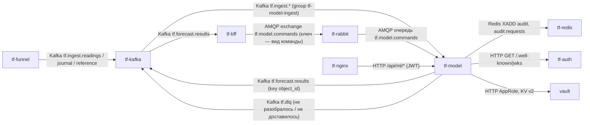
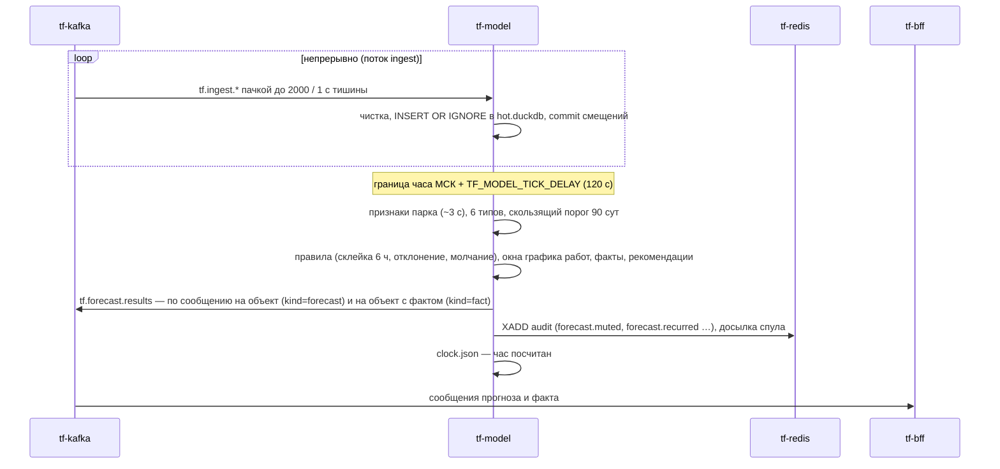
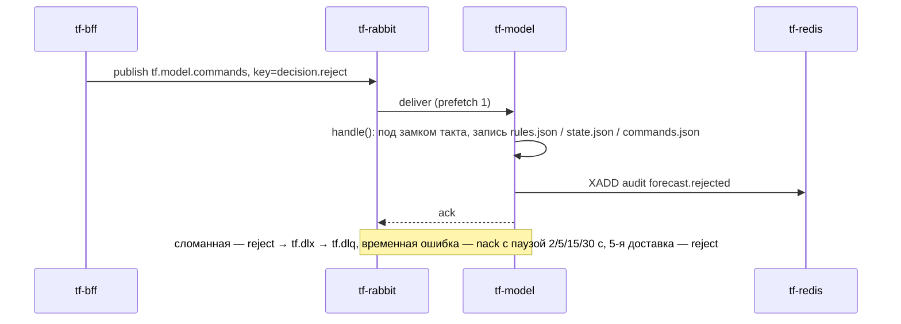

Версия: main@7cfe8f2, дата: 2026-09-29

Ссылки `файл:строка` без каталога — относительно `ML/service/`, workflow — `.github/workflows/`; пути think-infra и think-auth — в их репозиториях.

## tf-model — сервис модели

### 1. Назначение

Сервис раз в час по московскому времени считает для каждого объекта (уровень 3 справочника) прогноз шести
типов происшествий на 24 ч вперёд — `fire`, `gas`, `flood`, `equipment`, `sensor`, `intrusion` — и публикует его в
Kafka `tf.forecast.results`; туда же уходит канал «по факту» (происшествие уже идёт, аварии и слепота объекта)
(`ML/service/core.py:198-305`, `ML/INTEGRATION.md` §13.1, §13.11). Данные — события журнала из `tf.ingest.*`,
которые пишет `tf-funnel`; обратный поток — решения диспетчера и настройки главного диспетчера — приходят
командами RabbitMQ `tf.model.commands` от `tf-bff` (`ML/service/commands.py`). Потребители прогноза — BFF
(заявки, рассылка по факту) и админ-панель через ручки `/api/ml/*`. Процесс один, четыре потока: приём Kafka,
такт, команды, HTTP (`ML/service/main.py:59-78`).

### 2. Схема взаимодействия



Часовой такт:



Команда диспетчера:



### 3. Интерфейсы

**Входящие.** Все HTTP-ручки доступны и с префиксом `/api/ml`, и без него (`ML/service/api.py:124-126`).

| Протокол | Адрес/путь/топик/очередь | Кто вызывает | Авторизация | Что делает |
|---|---|---|---|---|
| Kafka consume | `tf.ingest.readings`, `tf.ingest.journal`, `tf.ingest.reference`; `group.id = tf-model-ingest`; `auto.offset.reset = earliest`; автокоммит выключен (`ML/service/ingest.py:85-97`) | `tf-funnel` (пишет) | SASL PLAIN, пользователь `tf-model` | события — в горячий журнал; `channel.status` и строки справочника — сразу в таблицы (`ingest.py:139-191`) |
| AMQP consume | очередь `tf.model.commands` (vhost `tf`), пассивное объявление, `prefetch 1` (`commands.py:88-115`) | `tf-bff` публикует в exchange `tf.model.commands` | учётка RabbitMQ `tf-model` | команды §13.3 (раздел 4.3) |
| HTTP GET | `/health`, публично `/api/ml/health` | Docker, nginx | нет | `{ok, clock, last_hour}` (`core.py:723-725`) |
| HTTP GET | `/status` | админ-панель через BFF или напрямую | JWT: пользователь или техучётка с `ml.read` | версии, настройки, пороги, свежесть, счётчики приёма (`core.py:727-743`) |
| HTTP GET | `/estimate?type=&share=` | админ-панель (ползунок доли) | как `/status` | сколько тревог в сутки при доле `share` (`core.py:745-755`) |
| HTTP GET | `/forecast?object_id=` | BFF | только техучётка с `ml.read` | последнее сообщение прогноза по объекту (`api.py:103-108`) |
| HTTP GET | `/history?object_id=&type=&from=&to=` | BFF | только техучётка с `ml.read` | оценки, порог и статус по часам, не длиннее 100 суток (`api.py:110-122`) |

Публичный путь `/api/ml/*` → `tf-model:8000`, префикс не срезается, `proxy_read_timeout 60s` — есть в think-infra
ветке `dev` на 8a18c26 (`web-server/nginx/nginx.conf.template`, `ML_HOST`/`ML_PORT` по умолчанию `tf-model:8000` в
`web-server/scripts/generate-nginx-config.sh`); есть ли маршрут на prod — не проверено.

**Исходящие**

| Протокол | Куда | Зачем | Что при недоступности |
|---|---|---|---|
| Kafka produce | `tf.forecast.results`, `acks=all`, идемпотентный продюсер, `message.max.bytes` 1 МБ (`outbox.py:86-116`) | прогноз и факт, ключ `object_id` | неподтверждённое — в `tf.dlq` с заголовками `reason`, `topic`, счётчик `failed`; такт не останавливается |
| Kafka produce | `tf.dlq` | входное сообщение, которое не разобралось (`outbox.py:116-120`) | теряется, счётчик `failed` |
| AMQP | `tf-rabbit:5672/tf` | чтение команд | переподключение с паузой 2→60 с, прогнозы считаются (`commands.py:88-115`) |
| Redis | `tf-redis:6379`, потоки `audit`, `audit:requests` | события аудита, журнал запросов | события в `/work/service/out/audit.jsonl`, досылка на каждом такте (`core.py:280-283`) |
| HTTP | `tf-auth:8080/.well-known/jwks` | ключ RS256 (кэш 1 ч) | ручки с токеном — 503 |
| HTTP | `vault:8200` | секреты при старте | как у всех сервисов tfkit: ждёт `TF_VAULT_WAIT`, потом падает |

### 4. Контракты данных

#### 4.1 Вход — `tf.ingest.*`

Формат событий и `channel.status` задаёт `tf-funnel` (см. его раздел 4.2). Модель принимает также старый вид
`{"channel_id", "ts", "value"}` (`ingest.py:115-123`). Из `tf.ingest.reference` читаются ещё строки справочника
`{"kind":"object", "ид_объект", "иерархия_уровень", "родитель", "вид_объекта", "диспетчерское_название_объекта"}` и
`{"kind":"channel", "ид_канала_данных", "тип_инж_системы", "тип_датчика", "тег_инженерной_системы",
"название_датчика", "ид_объект"}` (`ML/service/storage.py:91-122`). Кто их публикует — не знаю (воронка — нет).
Чистка совпадает с исследованием: канал вне справочника и дата в канале «Состояние охраны» отбрасываются
(`storage.py:142-157`); не разобралось (не JSON, нет полей) — в `tf.dlq` (`ingest.py:169-173`).

#### 4.2 Выход — `tf.forecast.results`

Ключ — `object_id` строкой. Одно сообщение — один объект и один час (`outbox.py:14-19`, `core.py:330-385`).

```json
{"schema": 1, "kind": "forecast", "object_id": 5122, "hour_end": "2026-09-29T15:00+03:00",
 "horizon_hours": 24, "model_version": "export-2026-09-23", "clock": "live",
 "types": {
   "fire": {"score": 0.981, "threshold": 0.975, "alarm": true, "since_hours": 4, "confidence": 0.31,
            "reasons": [{"feature": "smoke_24h", "value": 3.0}],
            "evidence": [{"sensor_id": 7001, "ts": "2026-09-29T14:50:12+03:00", "value": "Пожар"}],
            "silent": ["smoke"],
            "recommendation": {"mode": "прогноз", "now": [], "visit": {}, "produced_by": "rules", "version": "…"}},
   "gas": {"score": 0.402, "threshold": 0.974, "alarm": false, "stale_hours": 1.5}
 },
 "object_recommendation": {"…": "…"}}
```

| поле | тип | обяз. | смысл |
|---|---|---|---|
| `schema` | int | да | версия формата, сейчас 1 |
| `kind` | `forecast` \| `fact` | да | прогноз или канал «по факту» |
| `object_id` | int | да | объект |
| `hour_end` | ISO с `+03:00`, до минут | да | конец посчитанного часа |
| `horizon_hours` | int | только `forecast` | 24 |
| `model_version` | string | да | версия выгрузки модели |
| `clock` | `live` \| `replay` | да | `replay` — демонстрационное время: BFF по нему заявок не создаёт |
| `types.<тип>.score` | float 0…1 | да | среднее рангов моделей типа, не вероятность |
| `types.<тип>.threshold` | float | да | квантиль оценок парка за 90 суток на долю из `operating.json` |
| `types.<тип>.alarm` | bool | да | тревога после правил и окон работ |
| `since_hours` | int | при тревоге | сколько часов тревога горит |
| `confidence` | float | при тревоге, если посчиталась | калиброванная доля подтверждений, снижена за молчащие семейства датчиков |
| `reasons` | `[{feature, value}]` | при тревоге | 3 главных признака |
| `evidence` | `[{sensor_id, ts, value}]` | при тревоге | до 5 последних событий каналов семейств типа за 24 ч |
| `silent` | `[семейство]` | если есть | семейства датчиков типа, молчащие по `channel.status` |
| `stale_hours` | float | если есть | часы без событий семейств типа по всему парку, если больше порога (1 ч; подтопление 3; проникновение 12) |
| `recommendation`, `object_recommendation` | object | при тревоге | меры по словарю (`ML/INTEGRATION.md` §2.3) |

Сообщение `kind: fact` (`outbox.py:44-53`, `core.py:387-441`) — только живые эпизоды часа:

```json
{"schema": 1, "kind": "fact", "object_id": 5122, "hour_end": "2026-09-29T15:00+03:00",
 "model_version": "export-2026-09-23", "clock": "live",
 "types": {"gas": {"started_at": "2026-09-29T14:12+03:00", "last_at": "2026-09-29T14:55+03:00", "new": true,
                   "note": "…", "work_id": 17},
           "blind": {"started_at": "…", "last_at": "…", "new": true, "cause": "…", "share": 0.8, "possible_accident": true}}}
```

`new: true` — объявление, `false` — обновление того же эпизода. `note`/`work_id` — эпизод в окне графика работ.
У `intrusion` — `route`, у `fire` при жаре — `temperature`; типы только по факту — `temperature`, `blind` (§13.11).
Отказавшее при доставке — в Kafka `tf.dlq` с заголовками `reason`, `topic`.

#### 4.3 Команды — RabbitMQ `tf.model.commands`

Ключ маршрута — вид команды. Конверт (издатель — think-bff `BFF/src/BFF.WebApi/Notifications/ModelCommandPublisher.cs`,
snake_case, `issued_at` — UTC со смещением):

```json
{"schema": 1, "command_id": "7c9e6679-7425-40de-944b-e07fc1f90ae7", "kind": "decision.reject",
 "issued_at": "2026-09-29T05:14:00+00:00", "issued_by": {"sub": "…", "login": "petrova"},
 "request_id": "e81b07c4f2a9", "payload": {"prediction_id": 1, "object_id": 5122, "type": "gas", "reason_code": "…"}}
```

| `kind` | `payload` | действие модели (`core.py:488-720`) | аудит |
|---|---|---|---|
| `decision.take` | `object_id`, `type` | в статистику правил | — |
| `decision.reject` | + `reason_code` | правило отклонения (газ, подтопление), остальным — история | `forecast.rejected` |
| `decision.mute` | + `until` (ISO) | молчание пары до `until`; прошедший `until` — отказ | `forecast.muted` |
| `decision.reopen` | `object_id`, `type` | снять отклонение | `forecast.reopened` |
| `decision.confirmed` | `object_id`, `type`, `incident_id`, `occurred_at` | метка; если пара была под отклонением — «переросло» | `forecast.recurred` |
| `settings.operating` | весь `operating.json`: `version`, `types` {доля `share`, `reject_k`}, `reason` | новые доли со следующего часа | `settings.changed` |
| `settings.works` | `version`, `rows` — вся таблица графика работ | окна молчания со следующего часа | `works.changed` |
| `settings.gaps` | `version`, `rows` [{a, b, comment}] | часы выпадают из порога, флаг «нужно переобучение» | `gaps.changed` |
| `model.switch` | `type`, `version_id` (0/`main` — основная), `reason` | другая версия типа, порог по её ретропрогону | `model.switched` |
| `retrain.request` | `strategy`, `reason` | очередь переобучения, если `TF_MODEL_RETRAIN=on`; иначе отказ | `retrain.requested` (`denied`), `retrain.finished` |

Ответ брокеру (`commands.py:1-72`): `ack` — применено, `command_id` уже видели (помнится 50 000, `core.py:35`) или
снимок настроек не новее текущего; `reject` без повтора (→ DLX `tf.dlx` → очередь `tf.dlq`) — не JSON, не `schema 1`,
неизвестный вид, неверный `payload`; `nack` с повтором через 2/5/15/30 с — временная ошибка; на 5-й доставке — `reject`.
Подтверждение — только после записи состояния на том.

#### 4.4 HTTP-ответы

`/health`: `{"ok": true, "clock": "live", "last_hour": "2026-09-29T15:00+03:00"}` — 200 всегда, `ok=false` до загрузки моделей.

`/status`: `env`, `clock`, `model` {`version`, `types`: {тип: {`version`, `available`}}}, `settings` (весь
`operating.json`), `works` {`version`, `rows`, …}, `gaps`, `retrain` {`enabled`, `needed`, `reason`}, `thresholds`,
`freshness_hours`, `last_tick` {`hour_end`, `seconds`, `features_seconds`, `objects`, `alarms`, `muted`, `rejected`,
`facts`, `stale`, `sweep`}, `ingest` {`accepted`, `dropped`, `dead`, `reference`, `written_at`}.

`/estimate`: `{"type", "share", "current_share", "threshold", "alarms_per_day", "window_days"}`
(`ML/service/settings.py:98-109`); 400 — тип не из шести или доля вне (0, 1).

`/history`: `{"object_id", "type", "hours": [{"hour_end", "score", "threshold", "model_version", "status", "reason", "ref"}]}`,
`status` — `ALARM`, `MUTED`, `REJECTED` или `null` (`ML/service/fclog.py:58-73`); по умолчанию 7 суток; 400 — период
не в порядке или длиннее 100 суток.

Коды: 401 — нет токена или он не прошёл проверку (`token.refused`); 401 без события — срок истёк; 403 — нет `ml.read`
или пользовательский токен на `/forecast`, `/history` (`access.denied`); 404 — по объекту расчёта ещё нет; 503 — нет
ключа проверки токенов. Ошибки FastAPI — `{"detail": "…"}`.

### 5. Данные и состояние

Всё — на томе `tf-ml-work` в `/work` (`TF_WORK`) и в пакете модели `/models/current` (только чтение). PostgreSQL не
используется (схемы `ml` нет).

| файл | что | код |
|---|---|---|
| `/work/service/hot.duckdb` | горячий журнал: `ev_all` (100 суток + вся история «Состояние охраны»; ключ `channel_id, ts, value`), `obj`, `ch` (справочники), `ch_status` (молчание каналов) | `storage.py:27-38`, `svc.py:29` |
| `/work/service/out/forecasts.duckdb` | журнал прогнозов: `fc_score`, `fc_status`, `fc_thr`, 100 суток | `fclog.py:23-33` |
| `/work/service/out/history.parquet` | история оценок парка для порога (90 суток) | `svc.py:37` |
| `…/out/rules.json`, `state.json`, `commands.json`, `clock.json`, `last.json`, `observe.json`, `retrain.json` | состояние правил, версии по типам, увиденные `command_id`, последний час, последнее сообщение по объекту, наблюдение, переобучение | `svc.py:37-70` |
| `…/out/audit.jsonl`, `audit-requests.jsonl` | спул аудита, пока Redis лежит | `svc.py:70`, `tfkit.py:369-374` |
| `…/out/results.ndjson` | выход при `TF_MODEL_SINK=file` | `outbox.py:74-83` |
| `/work/service/settings/` | `operating.json` и `operating_versions/`, график работ, игнорируемые периоды с версиями; первая версия — из `/models/current/settings` или `ML/settings` | `svc.py:43-46`, `core.py:108-118` |
| `/models/current` | пакет модели: `manifest.json`, модели CatBoost/XGBoost/PyTorch, шкалы, `history/h_2025.npy`, версии типов, `settings/` | `ML/INTEGRATION.md` §13.6 |

Первый такт на пустом томе заливает справочники из CSV образа (`core.py:154-155`) и поднимает историю порога по
витрине 2025 из пакета (`core.py:177-183`). Stateful: **один экземпляр** — DuckDB-файлы открыты одним процессом,
такт считается один раз за час; второй экземпляр с тем же томом не поднимется, с другим — продублирует прогнозы.
При перезапуске ничего не теряется: смещения Kafka коммитятся только после записи пачки (`ingest.py:179-185`), час
в `clock.json` пишется атомарно после такта (`clock.py:77-87`), команды подтверждаются после записи. Пропущенные,
пока сервис лежал, часы не досчитываются — в лог «такт: пропущено часов N» (`clock.py:75-81`).

### 6. Безопасность и политики

- Токен — `tfkit.Verifier` (`docs/backend/tfkit/tfkit.py:191-265`): RS256, обязательны `exp`, `sub`; `aud = api`;
  `iss` ∈ {`auth-service`, `tf-auth`}; `typ`/`token_type` = `access`. Техучётка — по `kind: service`, по наличию `scope`
  или по `sub` из `TF_MODEL_SERVICE_SUBS` (Vault `secret/tf/app/tf-model`); право — `ml.read` (`api.py:28`, `api.py:65-83`).
- `/forecast`, `/history` — только техучётка; `/status`, `/estimate` — ещё и пользователь (права пользователя модель не
  проверяет — это делает BFF, `api.py:13-16`).
- Без ключа (`TF_AUTH_PUBLIC_KEY`, `TF_AUTH_JWKS` пусты) при `TF_ENV=dev` ручки открыты; в prod ключ берётся с JWKS
  (`api.py:31-42`).
- Аудит (`service = "ml"`, `core.py:80-84`): `token.refused`, `access.denied` (в `details` — `reason`, `jti`),
  `forecast.muted`, `forecast.rejected`, `forecast.reopened`, `forecast.recurred`, `settings.changed`, `works.changed`,
  `gaps.changed`, `model.switched`, `retrain.requested`, `retrain.finished`. Для команд `actor_kind=user`,
  `actor_id`/`actor_login` — из `issued_by`, `request_id` — из конверта (`core.py:472-485`). Журнал запросов —
  `audit:requests`, кроме `/health` (`api.py:127-128`).
- Не пишутся: токены (только `jti`), пароли, тела запросов; поля `password`, `token`, `authorization`, `cookie`,
  `text`, `body` в `details` запрещены (`tfkit.py:271-295`). Значения секретов в лог не выводятся (`tfkit.py:147-162`).
- Процесс не от root (uid 10001), единственное место записи — `/work` (`ML/service/Dockerfile:33-38`).

### 7. Конфигурация

| Переменная | По умолчанию | Обязательна | Секрет (путь Vault → ключ) | Смысл |
|---|---|---|---|---|
| `TF_ENV` | `prod` | нет | — | `dev`: секреты из окружения, выход в файл, ручки без ключа |
| `TF_MODEL_CLOCK` | `live` | нет | — | `live` или `replay:<начало ISO>:<скорость>` (раздел ниже) |
| `TF_MODEL_TICK_DELAY` | `120` | нет | — | секунд после границы часа до такта (`clock.py:23`) |
| `TF_MODEL_BUNDLE` | `/models/current` (образ) | да | — | пакет модели |
| `TF_WORK` | `/work` (образ) | нет | — | рабочий том |
| `TF_MEMORY` | `2GB` | нет | — | предел памяти DuckDB горячего журнала (`storage.py:249-251`); prod — `1GB` |
| `TF_MODEL_SINK` | `kafka`, в dev — `file` | нет | — | куда писать прогнозы (`main.py:31-34`) |
| `TF_KAFKA_BOOTSTRAP` | `tf-kafka:9092` | нет | — | `off` — без приёма |
| `TF_KAFKA_MODEL_PASSWORD` | — | да (prod) | `secret/tf/kafka/model` → `TF_KAFKA_MODEL_PASSWORD` | пароль Kafka `tf-model` (`svc.py:99-109`) |
| `TF_RABBIT_URL` | `amqp://tf-rabbit:5672/tf` | нет | — | без пароля; `off` — без команд |
| `TF_RABBIT_MODEL_PASSWORD` | — | да (prod) | `secret/tf/rabbit/model` → `TF_RABBIT_MODEL_PASSWORD` | пароль RabbitMQ `tf-model` (`commands.py:75-85`) |
| `TF_REDIS_URL` | `redis://tf-redis:6379/0`, в dev — пусто (спул) | нет | `secret/tf/redis` → `TF_REDIS_PASSWORD` | поток аудита |
| `TF_AUTH_PUBLIC_KEY` / `TF_AUTH_JWKS` | нет / `http://tf-auth:8080/.well-known/jwks` | нет | не секрет | ключ токенов |
| `TF_MODEL_SERVICE_SUBS` | пусто | нет | `secret/tf/app/tf-model` → `TF_MODEL_SERVICE_SUBS` | `sub` техучёток без `scope` |
| `VAULT_ADDR`, `VAULT_ROLE_ID`, `VAULT_SECRET_ID` | нет | да (prod) | пара роли `tf-svc-tf-model` | вход AppRole; или `VAULT_TOKEN` / `VAULT_TOKEN_FILE` |
| `TF_VAULT_WAIT` | `0` (в выкатках `900`) | нет | — | ожидание запечатанного Vault |
| `TF_MODEL_SETTINGS` | `/work/service/settings` | нет | — | таблицы главного диспетчера |
| `TF_MODEL_RETRAIN` | `off` | нет | — | `on` — очередь переобучения (`core.py:36`) |
| `TF_WORKS`, `TF_GAPS` | `ML/settings/works_2026.csv`, нет | нет | — | первая версия графика работ и игнорируемых периодов |
| `TF_MODEL_API_HOST`, `TF_MODEL_API_PORT` | `0.0.0.0`, `8000` | нет | — | HTTP (`svc.py:131-132`) |
| `TF_KIT` | рядом | нет | — | где лежит `tfkit.py` |
| `TF_JOURNAL` | `ML/journal` | нет | — | csv журнала для `--import` (стенд) |

**Секреты** сервис берёт сам через `tfkit.secret` по AppRole (`tfkit.py:57-162`), без `vault-entrypoint.sh`; пути —
`kafka/model`, `rabbit/model`, `redis`, `app/tf-model` (think-infra `hashicorp/services.conf`, ветка `dev`). Секреты
читаются при старте и живут в памяти процесса.

**`TF_MODEL_CLOCK`** (`clock.py:1-11`): `live` — такт на границе часа МСК + 120 с, по настоящему времени;
`replay:2026-01-01T07:00:3600` — проигрыш тестового года с указанного часа, модельный час за 3600/N реальных секунд;
сообщения с `clock: "replay"`, заявок по ним BFF не создаёт. На dev и prod — `live`. Другие режимы — ключи запуска
(`main.py:1-13`): `--loop` (контур, `CMD` образа), `--tick-now ВРЕМЯ` (один такт), `--replay НАЧАЛО --days N`
(такты подряд без ожидания), `--import` (журнал из csv в пустой горячий журнал).

### 8. Сборка и запуск

- **Dockerfile**: `ML/service/Dockerfile`, контекст — корень репозитория; `python:3.12-slim`, torch 2.5.1 CPU, duckdb,
  polars, xgboost, catboost, fastapi, confluent-kafka, pika, redis (`Dockerfile:19-23`); в образе код `ML/pipeline`,
  `ML/service`, `ML/settings`, `tfkit`, два справочника датасета; моделей и секретов нет. `USER tfmodel` (10001),
  `VOLUME /work`, `EXPOSE 8000`, `HEALTHCHECK` — `GET /health` каждые 30 с, старт 120 с; `ENTRYPOINT python main.py --loop`.
- **Пакет модели** запекается вторым слоем в `/models/current`: архив `model-pa3.tar.gz` из приватного релиза
  `dev-assets` этого репозитория (`deploy-model-dev.yml:49-60`). Поэтому образ **не публикуется** в реестр.
- **dev** — `.github/workflows/deploy-model-dev.yml`: push в `main` по `ML/service/**`, `ML/pipeline/**`, `ML/settings/**`,
  `docs/backend/tfkit/**` или вручную. Сборка в CI → `docker save` → scp → `docker load`, тег `tf-model:dev`. Секреты
  окружения `dev`: `TF_MODEL_VAULT_ROLE_ID`, `TF_MODEL_VAULT_SECRET_ID`; без них образ только собирается.
  `--memory 4g`, `TF_MEMORY` по умолчанию (2GB).
- **prod** — `.github/workflows/deploy-model-prod.yml`, только вручную; так же файлом, тег `tf-model:prod`; секреты
  окружения `prod`: `MODEL_VAULT_ROLE_ID`, `MODEL_VAULT_SECRET_ID`; репозитория: `PROD_IP`, `PROD_USER`, `PROD_SSH_KEY`.
  Docker — через `sudo -n /usr/local/bin/tf-docker`. `--memory 2500m`, `TF_MEMORY=1GB` («свободно ~3,5 ГБ»,
  `deploy-model-prod.yml:1-5`, `:107-122`). Проверки: `State.Running`, нет `permission denied`; прежний образ удаляется.
- **Контейнер**: `tf-model`, сеть `think-fast-net`, порт 8000 без публикации, том `tf-ml-work:/work`,
  `--restart unless-stopped`, `TF_ENV=prod`, `VAULT_ADDR=http://vault:8200`, `TF_VAULT_WAIT=900`,
  `TF_REDIS_URL=redis://tf-redis:6379/0`, `TF_AUTH_JWKS=http://tf-auth:8080/.well-known/jwks`, `TF_MODEL_CLOCK=live`.
- **Локальный стенд**: `docs/backend/compose.yml:29-42` (пакет монтируется из `TF_MODEL_BUNDLE_DIR`).

**Порядок запуска.** Vault — обязателен (пароли Kafka и RabbitMQ вне dev `required`); ждёт `TF_VAULT_WAIT`. Kafka —
не обязательна при старте: поток приёма падает и перезапускается через 30 с (`main.py:45-52`), продюсер копит и
отдаёт в DLQ. RabbitMQ — не обязателен: поток команд переподключается. Redis — не обязателен (спул). tf-auth — только
для ручек с токеном.

**Ручная выкатка и откат.** Повтор workflow (`Actions → Deploy tf-model to dev/prod → Run workflow`). Вручную:

```bash
docker build -f ML/service/Dockerfile -t tf-model:base .
```

затем слой с пакетом (`printf 'FROM tf-model:base\nCOPY --chown=10001 . /models/current\n' | docker build -t tf-model:dev -f - bundle`),
`docker save` → на сервер → `docker load` и `docker run` как в `deploy-model-dev.yml:106-119`. Прежний образ после
выкатки удаляется — откат = выкатка с прежнего коммита (и прежнего `MODEL_ASSET`). Том `/work` при откате остаётся;
если новая версия поменяла формат файлов на томе — не проверено, совместим ли откат.

### 9. Эксплуатация

- **Жив**: `GET /api/ml/health` → `ok: true`, `last_hour` не старше часа с небольшим. `/status`: `last_tick.seconds`,
  `ingest.written_at` (свежесть приёма), `ingest.dead`, `freshness_hours`, `last_tick.stale`.
- **Строки лога**: `сервис: часы live, API :8000` — старт; `такт <время>: {…}` — каждый час; `RabbitMQ: читаю
  tf.model.commands`; `команда <id> <вид>: ok`; предупреждения — `приём Kafka упал — снова через 30 с`,
  `такт … не прошёл — повтор через минуту`, `такт: пропущено часов N`, `версия <тип> vN не поднялась`,
  `RabbitMQ: <ошибка> — снова через N с`, `поток аудита недоступен`, `жду распечатывания Vault`.
- **Время**: признаки всего парка ≈ 3 с, прогноз — секунды (`ML/INTEGRATION.md` §7, §12.3); точные замеры на prod —
  в `last_tick.seconds`. Обучение в сервисе по умолчанию выключено; в исследовании бустинг учится минуты, сети —
  часы на RTX 3050 (`ML/INTEGRATION.md` §3); переобучение внутри контейнера на CPU — не проверено.
- **Перезапуск**: `docker restart tf-model` — такт не повторится, приём дочитает с последнего коммита.
- **Миграций нет**; справочники обновляются через `tf.ingest.reference` или пересборкой образа.
- **Смена пакета модели**: новый архив в релиз `dev-assets`, новое имя в `MODEL_ASSET` обоих workflow, выкатка.
- **Настройки** (доли, график работ, периоды, версия модели) меняются только командами через BFF, не файлами.
- **Очистка**: горячий журнал чистится каждый такт (`retention_sweep`), журнал прогнозов — в полночь (`fclog.sweep`).
  Полный сброс — `docker rm -f tf-model && docker volume rm tf-ml-work` (теряются история порога, решения, настройки).

### 10. Ошибки и проблемы

| Симптом | Причина | Как исправить |
|---|---|---|
| такт падал `IndexError` на новом prod | пустая база: `np.array([])` давал `float64` вместо целых индексов (28.09) | исправлено в 7cfe8f2 |
| такт падал `IndexError` после 2026-07-01 | календарь признаков кончался на `DATA_END` (Н23) | исправлено: календарь строится на нужное число часов |
| приём останавливался на первой паузе, одно сломанное сообщение роняло приём | Н24 | исправлено: `consume()` ждёт дальше, сломанное — в `tf.dlq` |
| 120 одинаковых сообщений в час | такт каждые 30 с (Н1) | исправлено: `clock.py` |
| 403 `ручка только для техучётки` на `/forecast`, `/history` | think-auth кладёт во все токены `kind: user`, а `kind` проверяется раньше `TF_MODEL_SERVICE_SUBS` (`tfkit.py:261-265`) | нужен токен техучётки от think-auth (раздел 14) |
| 503 `аутентификация не отдала публичный ключ` | tf-auth недоступен | поднять tf-auth |
| 404 `по объекту N расчёта ещё нет` | такт ещё не прошёл после старта на пустом томе | дождаться границы часа + 120 с |
| выкатка prod: `Vault отказал во входе (permission denied)` | неверная пара `MODEL_VAULT_*` | выдать `setup.sh service-credentials tf-model` |
| в логе `RabbitMQ: ChannelClosedByBroker — снова через N с` | очереди `tf.model.commands` нет (объявление пассивное) или нет прав | завести очередь в think-infra `rabbitmq/definitions.json` |
| выкатка на dev «образ собран, выкатка пропущена» | нет `TF_MODEL_VAULT_*` в окружении `dev` | завести роль и пару |
| контейнер перезапускается, `OOMKilled` в `docker inspect` | нехватка памяти (DuckDB, torch, CatBoost в памяти) | уменьшить `TF_MEMORY`, увеличить `--memory`; такт продолжится со следующего часа |
| `stale: true`, `stale_hours` в сообщениях | поток встал (воронка, шина или эмулятор) | проверить `tf-funnel` `/status` |

### 11. Ограничения и известные недоработки

- **Память**: DuckDB горячего журнала ограничен `TF_MEMORY` (2 ГБ dev, 1 ГБ prod), но журнал прогнозов
  (`forecasts.duckdb`) — без явного предела (`fclog.py:26`); плюс модели в памяти. При OOM Docker убивает процесс,
  текущий час пересчитывается после перезапуска, если граница не ушла; иначе час пропускается. Замеров пикового
  потребления на prod нет — не проверено.
- `bulk_import` 100 суток одним INSERT не укладывается в 2 ГБ — поэтому порциями по неделе (`storage.py:180-191`).
- Диск `/work`: горячий журнал 100 суток плюс вся охрана; объём на реальном потоке — не проверено.
- Один экземпляр, масштабирования нет.
- Пропущенные часы не досчитываются.
- Справочник объектов в образе (Н26): новые объекты — только через `tf.ingest.reference` (кто пишет туда строки
  `object`/`channel` — не знаю) или новый образ.
- Переобучение выключено; при включении обучает в том же контейнере — риск по памяти и CPU.
- Kafka `tf.dlq` и очередь RabbitMQ `tf.dlq` называются одинаково — это разные сущности.
- На prod горячий журнал пуст, пока нет шины: признаки считаются по пустым данным (7cfe8f2).

### 12. Возможности доработки

| доработка | приоритет | объём |
|---|---|---|
| согласовать с think-auth токены техучёток (`kind: service`/`scope ml.read`) для BFF | высокий | 1 день (с think-auth) |
| предел памяти DuckDB для `forecasts.duckdb`, замер пика памяти на prod | высокий | 0,5 дня |
| метрики (Prometheus): длительность такта, лаг приёма, DLQ | средний | 1 день |
| досчёт пропущенных часов по флагу | низкий | 0,5 дня |
| справочник из BFF/топика вместо CSV в образе | средний | 1–2 дня |
| PostgreSQL-схема `ml` вместо DuckDB-файлов (§11 INTEGRATION) | низкий | 3–5 дней |

### 13. Как интегрироваться и что менять

- **Читать прогнозы**: ACL на чтение `tf.forecast.results` (think-infra `kafka/acls.conf`), своя группа; учитывать
  `kind` и `clock`; повтор сообщения возможен (идемпотентность по `object_id` + `hour_end`).
- **Слать команды**: право записи в exchange `tf.model.commands` (сейчас только `tf-bff`), конверт раздела 4.3,
  уникальный `command_id`.
- **HTTP**: токен техучётки с `scope` `ml.read` (или `sub` в `TF_MODEL_SERVICE_SUBS`), путь `/api/ml/...`.
- **С инфраструктурой согласовать**: новые топики и ACL (группы с префиксом `tf-model`), очереди RabbitMQ, пути Vault
  (`services.conf`: `tf-model kafka/model rabbit/model redis app/tf-model`), маршрут nginx `/api/ml/`, память сервера.

### 14. Открытые вопросы

- think-auth не выпускает токенов техучёток: все токены с `kind: user`. Как BFF будет вызывать `/forecast`, `/history`?
  Сейчас BFF эти ручки не зовёт (в think-bff вызовов не найдено).
- Кто публикует строки справочника `object`/`channel` в `tf.ingest.reference`.
- Маршрут `/api/ml/` на prod nginx — не проверено.
- Бюджет памяти prod: хватит ли 2500 МБ при реальном потоке — не проверено.
- Включать ли переобучение (`TF_MODEL_RETRAIN`) в контуре и на каком железе.
- Роль `tf-svc-tf-model` и пара `TF_MODEL_VAULT_*` на dev заведены ли — не проверено.
